### 187 Questions & Answers, by category, increasing in difficulty

**How to use this:** Go through each category top to bottom — questions get harder as you go. Don't just read the answers; say them out loud or write them on a whiteboard. For the system design section (X–XII), practice drawing the diagram before checking the answer — several are now rendered as Mermaid diagrams below.

#### Contents

- [I. Go Fundamentals](#i-go-fundamentals) — Q1–10
- [II. Types, Interfaces & Generics](#ii-types-interfaces--generics) — Q11–20
- [III. Concurrency Deep Dive](#iii-concurrency-deep-dive) — Q21–35
- [IV. Memory Management & GC](#iv-memory-management--gc) — Q36–45
- [V. Error Handling & Idioms](#v-error-handling--idioms) — Q46–53
- [VI. Performance & Profiling](#vi-performance--profiling) — Q54–61
- [VII. Testing & Tooling](#vii-testing--tooling) — Q62–68
- [VIII. Go Web, Networking & Services](#viii-go-web-networking--services) — Q69–75
- [IX. Databases & Database Optimization](#ix-databases--database-optimization) — Q76–85
- [X. System Design Fundamentals](#x-system-design-fundamentals) — Q86–95
- [XI. Distributed Systems Concepts](#xi-distributed-systems-concepts) — Q96–113
- [XII. System Design Case Studies](#xii-system-design-case-studies) — Q114–123
- [XIII. Kafka in Depth (Go)](#xiii-kafka-in-depth-go) — Q124–143
- [XIV. Microservices Architecture](#xiv-microservices-architecture) — Q144–162
- [XV. Security](#xv-security) — Q163–174
- [XVI. Cloud & Infrastructure](#xvi-cloud--infrastructure) — Q175–187

---

## I. Go Fundamentals

| # | Question | Answer |
|---|----------|--------|
| 1 | What is the zero value of a struct in Go, and why does Go have zero values at all? | Every field gets its type's zero value (0, "", nil, false) — a struct's zero value is all fields zeroed. Go does this so every variable is always in a valid, usable state immediately after declaration, with no uninitialized-memory bugs like in C. |
| 3 | What's the difference between an array and a slice in Go? | An array has a fixed size baked into its type (`[5]int` and `[10]int` are different types) and is copied by value. A slice is a header (pointer, length, capacity) over an underlying array, is reference-like, and can grow via `append`. |
| 4 | How does `append` work under the hood — when does it reallocate? | If the slice has enough capacity, `append` writes into the existing backing array and just bumps length. If not, Go allocates a new, larger backing array (roughly doubling for small slices, smaller growth factor for large ones), copies the old data over, and returns a slice pointing at the new array. |
| 6 | What is the difference between a value receiver and a pointer receiver on a method? | A value receiver gets a copy of the struct — mutations inside the method don't affect the original. A pointer receiver operates on the original via its address, so mutations persist. Pointer receivers are also required if the method needs to mutate state or if the struct is large enough that copying is wasteful. |
| 7 | When would passing a struct by value vs pointer matter for performance and correctness? | Correctness: pointer if the callee needs to mutate the caller's data or you want to avoid copying a large struct with each call. Performance: small structs (a few words) are often cheaper to pass by value (stack, no heap escape, no indirection); large structs or ones passed into interfaces are cheaper by pointer to avoid copy cost, at the tradeoff of potential heap escape and GC pressure. |
| 8 | What does `defer` do and when do deferred calls run, exactly? | `defer` schedules a function call to run when the surrounding function returns, regardless of how it returns (normal return or panic). Multiple defers run in LIFO order. Critically, the deferred function's *arguments* are evaluated immediately at the `defer` statement, not when it actually runs later. |
| 10 | What's the difference between `make` and `new`? | `new(T)` allocates zeroed memory for a `T` and returns a `*T` pointer to it — works for any type. `make` is only for slices, maps, and channels, and returns an initialized (not zero-value) value of that type, e.g., a slice with usable header fields, not just a pointer. |

#### 2 — Difference between `var x []int` and `x := []int{}`?
`var x []int` is a nil slice (len 0, cap 0, underlying array pointer nil). `x := []int{}` is a non-nil, empty slice. Both behave the same for `len()`, `append()`, and ranging, but they differ under `== nil` checks and when marshaled to JSON (nil slice → `null`, empty slice → `[]`).

```go
var x []int    // nil slice: len=0, cap=0, ptr=nil
y := []int{}   // non-nil, empty slice

x == nil       // true
y == nil       // false

json.Marshal(x) // -> null
json.Marshal(y) // -> []
```

#### 5 — Explain how a slice's length and capacity work, and a footgun with slicing a slice.
Length is the visible number of elements; capacity is how much room exists in the backing array from the slice's start point. Footgun: `s2 := s1[:3]` still shares the same backing array as `s1`, so writes through `s2` can mutate `s1`, and appending to `s2` can silently overwrite elements `s1` hasn't "seen" yet if capacity allows it.

```go
s1 := []int{1, 2, 3, 4, 5}
s2 := s1[:3]           // shares s1's backing array
s2[0] = 99             // mutates s1[0] too
s2 = append(s2, 100)   // overwrites s1[3] if cap allows it
```

#### 9 — What happens when a `nil` map is read from vs written to?
Reading from a nil map is safe and returns the zero value for the value type (as if the key isn't present). Writing to a nil map panics with "assignment to entry in nil map." Always `make()` a map before writing to it.

```go
var m map[string]int
v := m["missing"]   // ok, returns 0 (zero value)
m["key"] = 1         // panic: assignment to entry in nil map

m = make(map[string]int)
m["key"] = 1         // ok now
```

---

## II. Types, Interfaces & Generics

| # | Question | Answer |
|---|----------|--------|
| 11 | How does Go implement interfaces (structural typing) vs Java/C# explicit `implements`? | Go interfaces are satisfied implicitly — any type that has the required methods satisfies the interface, with no declaration needed. This is structural/duck typing checked at compile time, unlike Java/C# where a class must explicitly declare `implements InterfaceName`. |
| 12 | What is the empty interface `interface{}` (`any`) and what are its costs? | It's satisfied by every type, so it's used for "accept anything" (like `fmt.Println` args). The cost: you lose compile-time type safety, need runtime type assertions/switches to use the value meaningfully, and there's a boxing cost — storing a concrete value in an interface can cause a heap allocation if it escapes. |
| 17 | What is method embedding / struct embedding and how does it differ from inheritance? | Embedding a struct or interface inside another promotes its fields/methods to the outer type, so `outer.Method()` calls the embedded type's method if not overridden. Unlike inheritance, there's no polymorphism through the base type — it's composition with automatic delegation, not an is-a relationship, and there's no virtual dispatch. |
| 18 | What's the difference between an interface satisfied implicitly at compile time vs reflection-based duck typing? | Go's interface satisfaction is checked entirely at compile time — if a type doesn't have the methods, it's a compile error, and there is zero runtime cost to check it. Reflection (`reflect` package) is a runtime mechanism to inspect/call methods dynamically when you don't know the type at compile time — much slower and loses static safety, and should be reserved for generic libraries (like `encoding/json`) rather than everyday application code. |
| 19 | Explain how the Go compiler represents an interface value internally (itab/data pointer). | An interface value is a two-word structure: a pointer to an "itab" (interface table — holds the concrete type info and a pointer to its method set matching this interface), and a pointer to the actual data. This is why interface method calls have one extra indirection versus a direct concrete-type call, and why very small concrete values assigned to an interface can still escape to the heap. |
| 20 | When would you use generics vs `interface{}` + type switch, considering compile-time safety and performance? | Generics: when the operation is structurally identical across types (sorting, filtering, a cache) — you get compile-time type checking, no runtime type assertions, and no boxing/allocation overhead for the parameterized type. `interface{}` + type switch: when you genuinely need different runtime behavior per type, or you're building something like a serialization layer that must handle arbitrary/unknown types at runtime. |

#### 13 — Explain the "nil interface vs interface holding a nil pointer" gotcha.
An interface value is really a (type, value) pair. If you assign a nil `*MyStruct` to an `error` interface variable, the interface's type is set to `*MyStruct` and value is nil — the interface itself is *not* nil, because it has a concrete type. So `err != nil` can be true even though the underlying pointer is nil. Classic bug: returning a typed nil error from a function that declares a named return of type `error`.

```go
func doWork() *MyError { return nil }

func run() error {
    var err *MyError = doWork()
    return err // returns a NON-nil error interface!
}

if run() != nil {
    // always true, even though the *MyError itself is nil
}
```

#### 14 — What is type assertion vs type switch, and how do you safely do a type assertion?
Type assertion (`v, ok := x.(T)`) extracts the concrete value if `x` holds type `T`; the two-value form avoids a panic on mismatch (`ok` is false instead). A type switch (`switch v := x.(type)`) branches over multiple possible concrete types in one construct. Always prefer the two-value assertion form unless you're certain of the type.

```go
// two-value assertion: safe, no panic
v, ok := x.(string)
if !ok {
    // x is not a string
}

// type switch: branch over multiple concrete types
switch t := x.(type) {
case string:
    fmt.Println("string:", t)
case int:
    fmt.Println("int:", t)
default:
    fmt.Println("unknown type")
}
```

#### 15 — What are Go generics (type parameters) and when would you use them over interfaces?
Generics (`func Map[T, U any](s []T, f func(T) U) []U`) let you write functions/types parameterized over a type, checked at compile time, without runtime type assertions or reflection. Use them when you need the *same logic* across different concrete types with type safety and no boxing cost — interfaces are better when you need runtime polymorphism (different behavior per type, not just different data types).

```go
func Map[T, U any](s []T, f func(T) U) []U {
    out := make([]U, len(s))
    for i, v := range s {
        out[i] = f(v)
    }
    return out
}

squares := Map([]int{1, 2, 3}, func(n int) int { return n * n })
```

#### 16 — Explain type constraints / the `comparable` constraint.
A constraint restricts which types can satisfy a generic type parameter — e.g., `[T constraints.Ordered]` restricts `T` to types supporting `<`, `>`. `comparable` restricts `T` to types that support `==`/`!=` (needed if you're using the type as a map key inside a generic function).

```go
type Ordered interface {
    ~int | ~int64 | ~float64 | ~string
}

func Max[T Ordered](a, b T) T {
    if a > b {
        return a
    }
    return b
}

func Keys[K comparable, V any](m map[K]V) []K {
    keys := make([]K, 0, len(m))
    for k := range m {
        keys = append(keys, k)
    }
    return keys
}
```

---

## III. Concurrency Deep Dive

| # | Question | Answer |
|---|----------|--------|
| 21 | What is a goroutine and how is it different from an OS thread? | A goroutine is a lightweight, user-space unit of concurrent execution managed by the Go runtime, starting with a tiny (~2KB) growable stack, versus an OS thread's fixed, much larger stack (often MBs) and kernel-level scheduling overhead. Go can run hundreds of thousands of goroutines cheaply; the runtime multiplexes them onto a much smaller number of OS threads. |
| 22 | What is the GMP scheduler model? | G = goroutine, M = OS thread (machine), P = logical processor (holds a run queue of goroutines and the resources needed to execute Go code). The runtime schedules Gs onto Ms via Ps — the number of Ps is typically `GOMAXPROCS`, and this design lets goroutines migrate between OS threads efficiently, including work-stealing when a P's queue is empty. |
| 23 | What is a data race, and how does the Go race detector find them? | A data race is two goroutines accessing the same memory location concurrently, with at least one being a write, and no synchronization ordering the accesses — the result is undefined behavior. `go run -race` / `go test -race` instruments memory accesses at compile time and tracks happens-before relationships at runtime to flag races when they actually occur during execution. |
| 25 | What happens if you close a channel twice, or send on a closed channel? | Closing an already-closed channel panics. Sending on a closed channel panics. Receiving from a closed channel never panics — it returns the zero value immediately (with `ok == false` in the two-value form), which is why "close, don't send" and "only the sender closes" are the standard rules. |
| 29 | Why is `context.WithValue` generally discouraged for anything beyond request-scoped metadata? | It's untyped (`interface{}` keys/values), so misuse isn't caught at compile time, it hides real dependencies (a function's real inputs aren't visible in its signature), and it can silently break if a key collides or is misspelled. It's meant for cross-cutting concerns like trace/request IDs, not for passing business logic parameters. |
| 30 | What is a goroutine leak, and give a concrete example. | A goroutine that's blocked forever and never exits, so it (and anything it references) is never garbage collected. Classic example: a goroutine sends on an unbuffered channel, but the receiver already returned (e.g., due to a timeout) and nothing will ever read from that channel again — the sender goroutine blocks forever. Fix: always give blocking sends/receives a `select` with a `ctx.Done()` or timeout escape hatch. |
| 33 | What's the difference between `atomic.AddInt64` and wrapping an int with a mutex? | Atomic operations use CPU-level instructions (compare-and-swap) to update memory without a full lock — much cheaper for simple operations like counters, but limited to specific primitive operations. A mutex protects an arbitrary critical section (multiple statements, complex invariants) at the cost of higher overhead and potential contention/blocking. |
| 34 | Explain the Go memory model's "happens-before" relationship, briefly. | It defines the conditions under which a write in one goroutine is guaranteed to be visible to a read in another. Without an explicit happens-before edge (via channel operations, mutex lock/unlock, `sync.Once`, goroutine start/WaitGroup, or atomics), the compiler and CPU are free to reorder or cache operations — that's a data race even if it "usually works." |

#### 24 — Difference between buffered and unbuffered channels; what does sending on an unbuffered channel block on?
An unbuffered channel has no internal storage — a send blocks until a receiver is ready to receive at the same moment (a rendezvous), and vice versa. A buffered channel (`make(chan T, n)`) lets sends succeed without a waiting receiver as long as the buffer isn't full; once full, sends block until space frees up.

```go
unbuffered := make(chan int)     // send blocks until a receiver is ready
buffered := make(chan int, 3)    // send succeeds until buffer is full

buffered <- 1 // ok, buffer has room
buffered <- 2 // ok
buffered <- 3 // ok, buffer now full
buffered <- 4 // blocks until something is received
```

#### 26 — How do you safely check whether a channel is closed while reading?
Use the two-value receive form: `v, ok := <-ch`. `ok` is `false` once the channel is closed and drained — this is the idiomatic way, versus racy approaches like checking length or a separate "isClosed" flag without synchronization.

```go
v, ok := <-ch
if !ok {
    // channel is closed and drained
    return
}
// use v
```

#### 27 — Explain `select` and how it's used for timeouts/cancellation.
`select` blocks until one of several channel operations is ready, choosing pseudo-randomly if multiple are ready simultaneously.

```go
select {
case res := <-ch:
    return res, nil
case <-time.After(2 * time.Second):
    return nil, errors.New("timeout")
}

select {
case <-ctx.Done():
    return ctx.Err()
case res := <-ch:
    return res, nil
}
```

#### 28 — What's the purpose of `context.Context`, and the difference between `WithCancel`, `WithTimeout`, `WithDeadline`, `WithValue`?
`Context` carries cancellation signals, deadlines, and request-scoped values across API boundaries and goroutines. `WithCancel` gives you a manual cancel function; `WithTimeout`/`WithDeadline` auto-cancel after a duration or at a wall-clock time; `WithValue` attaches a key-value pair for passing request-scoped metadata down a call chain — it should never be used to pass optional function parameters.

```go
ctx, cancel := context.WithCancel(parent)
defer cancel()

ctx, cancel = context.WithTimeout(parent, 5*time.Second)
defer cancel()

ctx, cancel = context.WithDeadline(parent, someTime)
defer cancel()

ctx = context.WithValue(parent, requestIDKey, "abc-123")
```

#### 31 — Explain `sync.WaitGroup` and a common misuse.
`WaitGroup` lets one goroutine wait for a group of others to finish: `Add(n)` before starting, `Done()` (usually deferred) in each goroutine, `Wait()` blocks until the counter hits zero. Common misuse: calling `Add` *after* `Wait()` has already started or concurrently with it — this is a race and can panic or hang.

```go
var wg sync.WaitGroup
for i := 0; i < n; i++ {
    wg.Add(1) // correct: Add before the goroutine starts
    go func() {
        defer wg.Done()
        // work
    }()
}
wg.Wait()
// BUG: calling Add() concurrently with/after Wait() is a race
```

#### 32 — Explain `sync.Once` and a real use case.
`sync.Once.Do(f)` guarantees `f` runs exactly once, even if called from many goroutines concurrently — all callers block until the first call to `f` completes. Real use: lazy-initializing a singleton, like a global config object or a database connection pool, safely under concurrent first access.

```go
var (
    once sync.Once
    db   *sql.DB
)

func GetDB() *sql.DB {
    once.Do(func() {
        db, _ = sql.Open("postgres", dsn)
    })
    return db
}
```

#### 35 — Design a worker pool in Go — what are the components?
A jobs channel that producers send work into; a fixed number N of worker goroutines that range over the jobs channel and process each item; a results channel for output; a `context.Context` passed down for cancellation; and a `sync.WaitGroup` to know when all work is drained.

```go
func workerPool(ctx context.Context, jobs <-chan Job, n int) <-chan Result {
    results := make(chan Result)
    var wg sync.WaitGroup

    for i := 0; i < n; i++ {
        wg.Add(1)
        go func() {
            defer wg.Done()
            for {
                select {
                case job, ok := <-jobs:
                    if !ok {
                        return
                    }
                    results <- process(job)
                case <-ctx.Done():
                    return
                }
            }
        }()
    }

    go func() { wg.Wait(); close(results) }()
    return results
}
```

---

## IV. Memory Management & GC

| # | Question | Answer |
|---|----------|--------|
| 36 | What is escape analysis and how does it decide stack vs heap allocation? | The compiler statically analyzes whether a variable's lifetime or visibility could outlive the function that created it. If it can prove the variable never escapes, it allocates on the stack (cheap, freed automatically on return); otherwise it "escapes to the heap" and becomes GC-managed. |
| 37 | How does Go's garbage collector work at a high level? | Go uses a concurrent, tri-color mark-and-sweep collector. It marks reachable objects (white → grey → black) mostly concurrently with the running program using write barriers, then sweeps unmarked (white) objects, minimizing stop-the-world pauses (typically sub-millisecond) at the cost of using more CPU concurrently with your program. |
| 38 | What is GC pressure and what causes it in a typical Go service? | GC pressure is the rate at which your program creates heap garbage, forcing more frequent/expensive collection cycles. Common causes: excessive small allocations in hot paths (string concatenation, boxing values into interfaces), large numbers of short-lived objects, and unbounded growth of slices/maps that get reallocated repeatedly. |
| 39 | How do you reduce allocations in a hot path? | Pre-size slices/maps with `make([]T, 0, expectedCap)`; reuse buffers via `sync.Pool`; avoid unnecessary boxing into `interface{}`; use `strings.Builder` instead of `+=` concatenation; pass pointers to large structs instead of copying; and profile with `pprof -alloc_objects` to find the actual hot spots rather than guessing. |
| 40 | What is `sync.Pool` and when is it a bad idea? | `sync.Pool` caches and reuses temporary objects (like byte buffers) to reduce allocation/GC churn, but pooled objects can be evicted at any time (notably during GC), so it's only for objects you can afford to lose and recreate cheaply — a bad idea for objects with meaningful state you need to persist. |
| 41 | Explain how string concatenation in a loop can cause performance issues. | Go strings are immutable, so `s += x` in a loop allocates a brand-new string and copies the old contents every iteration — O(n²) total work for n concatenations. Fix: use `strings.Builder` (or `bytes.Buffer`), which grows an internal buffer amortized O(1) per append. |
| 42 | How can Go leak memory despite having a GC? | Anything still *reachable* is never collected. Common patterns: a growing global cache/map with no eviction; a slice that keeps a reference to a much larger backing array after slicing out a small piece; goroutine leaks; and subscriber/listener lists that never unregister closed connections. |
| 43 | How would you investigate high memory usage in a running Go service in production? | Expose `net/http/pprof`, pull a heap profile to see allocation sources by call site; compare two heap snapshots over time (`-base`) to find what's growing; check goroutine count for leaks; and correlate with GC stats (`GODEBUG=gctrace=1`) to see if it's live heap growth vs just infrequent GC. |
| 44 | What is `GOGC` and how does tuning it trade off memory vs CPU? | `GOGC` sets the target heap growth percentage before a GC cycle triggers (default 100). Lowering it triggers GC more often — less peak memory, more CPU spent collecting. Raising it (or using `GOMEMLIMIT` as a hard cap) reduces GC frequency/CPU cost at the expense of higher peak memory usage. |
| 45 | Explain false sharing and struct field ordering for concurrent performance. | False sharing happens when two goroutines on different CPU cores modify different variables that happen to sit on the same CPU cache line — each write invalidates the other core's cache line, causing costly cache coherency traffic even though there's no actual data race. Fix: pad hot, independently-written fields so each lands on its own cache line. |

---

## V. Error Handling & Idioms

| # | Question | Answer |
|---|----------|--------|
| 46 | Why does Go use explicit error returns instead of exceptions? | It makes control flow and failure paths visible and explicit at every call site — a function's signature tells you it can fail, and the caller is forced to consciously handle or propagate the error. |
| 48 | When would you define a custom error type vs use `errors.New`? | `errors.New`/sentinel errors are fine when callers only need to check "did this specific failure happen" (`errors.Is`). A custom error type is better when the caller needs structured data about the failure that they'll extract with `errors.As`. |
| 49 | What's the idiomatic way to handle a "not found" case? | Define a sentinel error (`var ErrNotFound = errors.New("not found")`) or a well-known error type, return it wrapped with context, and let callers check with `errors.Is(err, ErrNotFound)` rather than string-matching the error message. |
| 50 | Explain panic/recover — when is it appropriate to use? | `panic` unwinds the stack running deferred calls until something `recover`s or the program crashes. Appropriate for truly unrecoverable programmer errors, or unwinding deeply nested code within a single package's internal boundary — an anti-pattern as a general substitute for error returns across API boundaries. |
| 51 | How do you avoid swallowing/hiding errors in a large codebase during code review? | Flag any `if err != nil { return }` without wrapping/logging context, any `_ = someFunc()` without a documented reason, and any blanket `recover()` that doesn't re-surface what was recovered. Lint with `errcheck`; review focuses on whether wrapped context is actually useful for debugging later. |
| 53 | Explain how retry logic could make an outage worse, and how you'd prevent it. | Naive fixed-interval retries across many clients synchronize into bursts that hit an already-struggling service at the same moment (thundering herd). Prevention: exponential backoff with jitter, a cap on total retry attempts/duration, and a circuit breaker that stops sending requests entirely once failure rate crosses a threshold. |

#### 47 — What is error wrapping and how do `errors.Is`/`errors.As` use it?
`fmt.Errorf("doing X: %w", err)` wraps an underlying error while adding context, preserving a chain accessible via `Unwrap()`. `errors.Is(err, target)` walks that chain checking for a matching sentinel error; `errors.As(err, &target)` walks the chain looking for an error of a specific concrete type.

```go
if err != nil {
    return fmt.Errorf("fetching user %d: %w", id, err)
}

if errors.Is(err, ErrNotFound) {
    // matches even through multiple layers of wrapping
}

var ve *ValidationError
if errors.As(err, &ve) {
    fmt.Println(ve.Field, ve.Code)
}
```

#### 52 — What is the "errgroup" pattern for handling multiple goroutine errors?
`golang.org/x/sync/errgroup` runs a group of goroutines, cancels a shared context if any of them returns an error, and `Wait()` returns the first non-nil error from the group — a clean way to fan out concurrent work and propagate the first failure without manually wiring channels and WaitGroups together.

```go
g, ctx := errgroup.WithContext(ctx)
for _, url := range urls {
    url := url
    g.Go(func() error {
        return fetch(ctx, url)
    })
}
if err := g.Wait(); err != nil {
    // first non-nil error from the group
    return err
}
```

---

## VI. Performance & Profiling

| # | Question | Answer |
|---|----------|--------|
| 54 | What tools would you use to profile CPU vs memory usage in a Go service? | `net/http/pprof` exposed on a debug port, then `go tool pprof http://host/debug/pprof/profile` for a 30s CPU profile and `.../heap` for memory allocation sources. `go tool pprof -http=:8080` gives an interactive flame graph for either. |
| 55 | How do you find a goroutine leak in production? | Watch the goroutine count metric over time — a steady upward trend with no plateau under steady traffic indicates a leak. Pull a goroutine dump and look for many goroutines stuck in the same blocking call to identify the leaking code path. |
| 56 | What's the cost difference between a map lookup and a slice index? | A slice index is O(1) with a direct memory offset calculation — extremely cheap. A map lookup is also amortized O(1) but involves hashing the key and a bucket lookup, meaningfully more expensive per operation with worse cache locality. |
| 57 | Explain benchmark methodology in Go and how to avoid misleading results. | `go test -bench=. -benchmem` runs benchmark functions in a loop, reporting ns/op and allocations/op. Pitfalls: letting the compiler dead-code-eliminate the benchmarked work, not resetting the timer after expensive setup, and running on a noisy/shared machine. |
| 58 | What is inlining in Go and why might a function not get inlined? | Inlining substitutes a function call with its body directly at the call site. The compiler decides based on a complexity budget — functions with loops, closures, defer, panic/recover, or that are simply too large typically won't be inlined. |
| 59 | How would you reduce GC latency spikes in a low-latency service? | Minimize allocation rate in the hot path (object pooling, pre-sized buffers), tune `GOGC`/`GOMEMLIMIT` to match the workload's memory budget, and keep the live heap size predictable — the goal is fewer, more predictable GC cycles. |
| 60 | Explain the tradeoffs of reflection vs codegen for performance-critical serialization. | `encoding/json`'s reflection-based approach is convenient but pays a real runtime cost inspecting struct tags on every call. Codegen (like `easyjson`, protobuf-generated code) generates type-specific marshal/unmarshal code at build time — no reflection at runtime, significantly faster, at the cost of a build step. |
| 61 | How do you decide when to use struct-of-arrays vs array-of-structs for cache locality? | Array-of-structs is simplest and fine when you typically access all fields together. Struct-of-arrays improves cache locality when hot code only touches one or two fields across many items, at the cost of more complex code. |

---

## VII. Testing & Tooling

| # | Question | Answer |
|---|----------|--------|
| 62 | What is table-driven testing and why is it idiomatic in Go? | A single test function iterates over a slice of struct literals, each defining an input/expected-output case, running `t.Run(name, ...)` per case as a subtest. Keeps test logic in one place and makes adding new cases trivial. |
| 63 | Difference between unit and integration tests, and how do you structure them in a Go project? | Unit tests exercise a single function/package in isolation with mocked dependencies and run fast. Integration tests exercise real dependencies and are slower/flakier — commonly separated with a build tag (`//go:build integration`) so CI can run them in a separate stage. |
| 64 | What is `httptest` used for? | `httptest.NewServer` spins up a real local HTTP server backed by your handler for full-stack testing, and `httptest.NewRecorder` captures a handler's response without a real network connection. |
| 65 | How would you test code that depends on time? | Inject time as a dependency rather than calling `time.Now()` directly — accept a `Clock` interface that production code satisfies with the real clock and tests satisfy with a fake, controllable clock. |
| 66 | Do you prefer interfaces + hand-written mocks or a mocking framework, and why? | Small, hand-written interfaces with hand-written fakes keep tests simple and work well when the interface is small and stable. A mocking framework pays off when you have many dependencies or need to assert call counts/arguments precisely. |
| 67 | What does `go vet` and `staticcheck` catch that the compiler doesn't? | `go vet` catches suspicious constructs that compile fine but are almost always bugs — wrong `Printf` verb, copying a struct containing a `sync.Mutex`. `staticcheck` goes further — unused struct fields, redundant code, deprecated API usage. |
| 68 | Explain fuzz testing and when it's worth using. | Go's built-in fuzzing (`go test -fuzz`) generates random/mutated inputs to a function and checks for panics or violated invariants — especially valuable for parsers, serializers, and anything handling untrusted input. |

---

## VIII. Go Web, Networking & Services

| # | Question | Answer |
|---|----------|--------|
| 69 | How does `net/http` handle concurrent requests by default? | The standard server spawns a new goroutine per incoming connection/request automatically — any shared state your handlers touch needs its own synchronization, since many goroutines will call into it simultaneously. |
| 70 | What is middleware in a Go HTTP server and how do you chain it? | Middleware wraps an `http.Handler` with another `http.Handler` that runs logic before/after calling the wrapped one — commonly `func(http.Handler) http.Handler`. Chaining is nested function composition or a router's built-in `Use()`. |
| 71 | How do you implement rate limiting in a Go API? | Token bucket (via `golang.org/x/time/rate.Limiter`) allows bursts up to a bucket size while enforcing a steady average rate. For a single instance, an in-memory limiter works; for multiple instances, you need a shared store. |
| 72 | How do you drain in-flight gRPC streams vs HTTP requests differently during shutdown? | HTTP: `server.Shutdown(ctx)` stops accepting new connections and waits for in-flight requests. gRPC: `server.GracefulStop()` similarly stops accepting new RPCs, but long-lived streaming RPCs also need application-level logic to signal the stream should wind down. |
| 73 | Difference between REST and gRPC, and when would you choose gRPC internally? | REST/JSON is human-readable and universally supported but has serialization overhead. gRPC uses HTTP/2 and protobuf binary serialization — faster, strongly-typed contracts, native streaming — a strong default for internal service-to-service calls. |
| 74 | How do you handle backward compatibility when evolving a protobuf/gRPC API? | Never change or reuse a field number, only add new fields with new numbers, make new fields optional with sensible defaults, and version the service (`v1`, `v2`) when a truly breaking change is unavoidable. |
| 75 | How would you implement connection pooling for a Postgres client in Go, and what happens if you don't? | Use `database/sql`'s built-in pool (`SetMaxOpenConns`, `SetMaxIdleConns`, `SetConnMaxLifetime`) or `pgxpool`. Without it, each request opening a fresh connection incurs real latency and can exhaust Postgres's max connection limit under load. |

---

## IX. Databases & Database Optimization

| # | Question | Answer |
|---|----------|--------|
| 76 | What do the four ACID properties guarantee, with a concrete example of a violation? | Atomicity: a transaction is all-or-nothing — no partial writes are ever visible. Consistency: a transaction moves the DB from one valid state to another, respecting constraints/invariants. Isolation: concurrent transactions don't see each other's uncommitted intermediate state. Durability: once committed, a write survives a crash (typically via a write-ahead log flushed to disk before the commit is acknowledged). Violation example: without atomicity, a funds transfer that debits one account but crashes before crediting the other leaves money vanished. |
| 77 | Normalization vs. denormalization — what's the trade-off, and when would you denormalize? | Normalization (3NF and beyond) splits data into related tables joined by foreign keys so each fact is stored once — saves storage and avoids update anomalies, at the cost of needing joins to read. Denormalization intentionally duplicates or pre-joins data to avoid those joins at read time — cheaper reads, but risks write-time inconsistency and extra storage. Denormalize for read-heavy, write-light workloads, e.g. a precomputed "order summary" table instead of joining orders+items+users on every page load. |
| 80 | Why does column order matter in a composite (multi-column) index, and what makes an index "covering"? | A composite index on `(a, b, c)` is only useful for queries filtering on a left prefix of those columns — it serves `WHERE a = ?` and `WHERE a = ? AND b = ?`, but not `WHERE b = ?` alone. Put the most selective or most commonly-filtered-alone column first. A covering index additionally includes every column a query needs (via `INCLUDE`, or as a composite over all selected + filtered columns), so the DB can answer the query entirely from the index without touching the table — an "index-only scan." |
| 83 | What is the N+1 query problem, and how do you fix it? | It happens when code fetches N parent records with one query, then loops over them issuing one more query per record for related data — 1 + N queries where 2 would do. Classic ORM footgun: accessing a lazy-loaded association inside a loop. Fix: eager-load the association up front with a `JOIN`, or batch the follow-up lookups into a single `WHERE parent_id IN (...)` query and group the results in memory. |
| 85 | You're handed a slow production query — what do you check, in order? | (1) `EXPLAIN ANALYZE` it — is it doing a sequential scan on a large table it shouldn't be? (2) Confirm an index exists on the filtered/joined columns and its leading columns match the query. (3) Check whether it's actually N+1 queries in disguise from the calling code, not one slow query. (4) Check table statistics are fresh and the table isn't bloated (`ANALYZE`/`VACUUM` in Postgres). (5) Check the connection pool isn't saturated — queries queueing for a connection look slow even when the query itself is fine (Q75). (6) For a genuinely hot read path, reach for caching (Q91) or a read replica (Q84) before reaching for a bigger box. |

#### 78 — How does a B-tree index make lookups fast, and when does an index *not* help?
A B-tree keeps keys sorted in a balanced tree, so a lookup walks from root to leaf in O(log n) comparisons instead of scanning every row, and leaf nodes are linked in sorted order, which makes range scans (`BETWEEN`, `ORDER BY`) cheap too. Each leaf entry points back to the actual row. An index does *not* help when: the column has low cardinality/selectivity (a boolean flag on a huge table — half the table matches anyway, so the planner rightly prefers a sequential scan); the query wraps the column in a function (`WHERE LOWER(email) = ...`) without a matching expression index; the pattern has a leading wildcard (`LIKE '%foo'` can't use a plain B-tree — needs a trigram or full-text index); or the table is small enough that a full scan is simply cheaper than random index lookups.

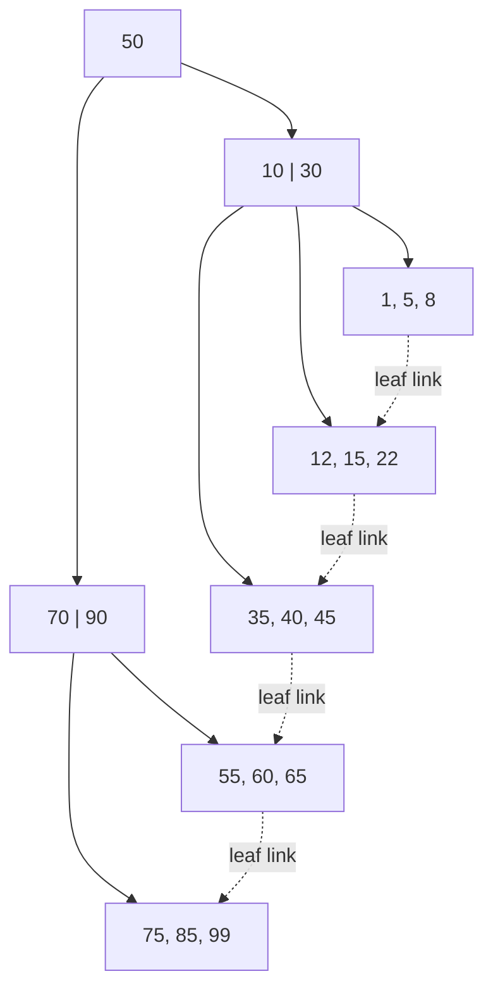

#### 79 — How do you read a query execution plan to diagnose a slow query?
`EXPLAIN ANALYZE` actually runs the query and shows the plan the optimizer chose plus real timings. Key things to check: the scan type per node (`Seq Scan` = full table scan, `Index Scan` = uses an index then fetches the row, `Index Only Scan` = answered entirely from the index, `Bitmap Heap Scan` = combines several index matches before hitting the table); the cost estimate (startup..total, in arbitrary planner units); and — most important — estimated rows vs. actual rows. A big divergence between them means the table's statistics are stale (the planner is guessing wrong), which itself can cause it to pick a bad plan; the fix is often just `ANALYZE table_name`.

```sql
-- No index on customer_id:
EXPLAIN ANALYZE SELECT * FROM orders WHERE customer_id = 42;

Seq Scan on orders  (cost=0.00..18334.00 rows=12 width=120) (actual time=0.02..142.30 rows=8 loops=1)
  Filter: (customer_id = 42)
  Rows Removed by Filter: 999992

-- After: CREATE INDEX idx_orders_customer_id ON orders(customer_id);
Index Scan using idx_orders_customer_id on orders  (cost=0.42..8.44 rows=12 width=120) (actual time=0.015..0.021 rows=8 loops=1)
  Index Cond: (customer_id = 42)
```

#### 81 — Explain the transaction isolation levels and the anomalies each one prevents.
Each stricter level prevents more of the "read" anomalies that come from concurrent transactions, at the cost of more locking/lower concurrency:

| Isolation level | Dirty read | Non-repeatable read | Phantom read |
|---|---|---|---|
| Read Uncommitted | possible | possible | possible |
| Read Committed | prevented | possible | possible |
| Repeatable Read | prevented | prevented | possible (Postgres's snapshot-based RR also prevents phantoms) |
| Serializable | prevented | prevented | prevented |

A **dirty read** sees another transaction's uncommitted write. A **non-repeatable read** re-reads the same row within one transaction and gets a different value because another transaction committed a change in between. A **phantom read** re-runs the same filtered query and sees a different *set* of rows because another transaction inserted/deleted matching rows in between. Most applications default to Read Committed; Serializable is reserved for invariants that absolutely cannot tolerate any anomaly, since it costs the most concurrency (often via retries on serialization failure).

#### 82 — Optimistic vs. pessimistic locking, and how does a deadlock happen?
Pessimistic locking acquires a lock before touching a row (`SELECT ... FOR UPDATE`) so nothing else can modify it until you're done — safe under contention, but reduces concurrency and can deadlock. Optimistic locking doesn't lock at all: read a version/timestamp column, do the work, then write conditionally on that version being unchanged (`WHERE version = read_version`), retrying on a mismatch — better throughput when contention is low, wasted work when it's high. A deadlock happens when two transactions each hold a lock the other is waiting for, in opposite order — a circular wait. The DB's deadlock detector picks a victim, rolls it back with an error, and the application must retry it. The fix is to always acquire locks on rows in a consistent, global order.

```sql
-- T1                                  -- T2
BEGIN;                                 BEGIN;
UPDATE accounts SET balance -= 10
  WHERE id = 1;                        UPDATE accounts SET balance -= 10
                                          WHERE id = 2;
UPDATE accounts SET balance += 10      UPDATE accounts SET balance += 10
  WHERE id = 2;  -- waits on T2's lock   WHERE id = 1;  -- waits on T1's lock
                                        -- circular wait -> DB kills one as deadlock victim
```

#### 84 — Explain leader-follower replication and replication lag.
Writes go to the leader (primary), which streams its change log (e.g. Postgres's WAL) to one or more followers (replicas), which apply the changes and can serve reads. This gives horizontal read scaling and a hot standby for failover. Because replication is usually asynchronous, followers apply changes with a delay — replication lag — so a read against a follower immediately after a write to the leader can return stale data. This bites hardest on "read your own write" right after an update: either route that specific read to the leader, or use synchronous replication for stronger consistency at a latency cost. See also sharding/partitioning (Q90), which splits data across nodes rather than copying all of it to each.

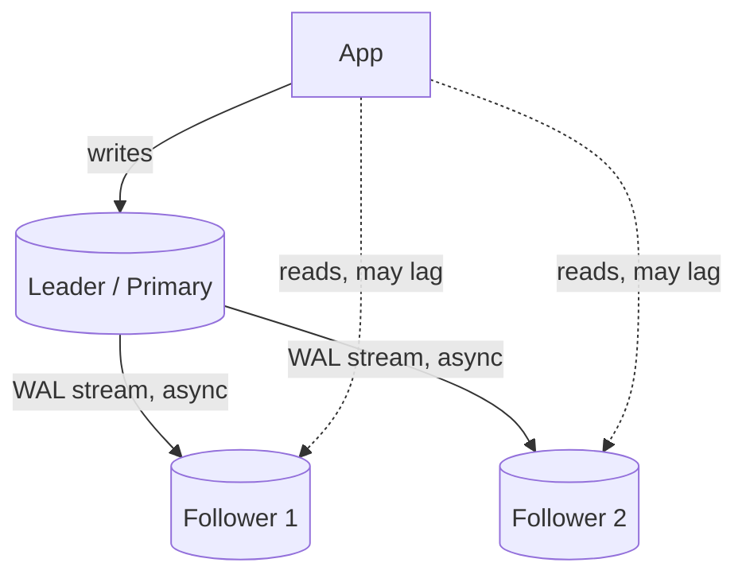

---

## X. System Design Fundamentals

| # | Question | Answer |
|---|----------|--------|
| 86 | Difference between vertical and horizontal scaling, and when does horizontal stop being trivial? | Vertical scaling means a bigger machine — simple, but has a hard ceiling. Horizontal scaling means more machines sharing load, but stops being trivial the moment state enters the picture: stateless request handling scales linearly, but a stateful component needs partitioning, replication, or coordination logic. |
| 88 | Explain eventual consistency with a good-fit and bad-fit example. | Eventual consistency means replicas will converge given enough time without new writes, but reads shortly after a write might see stale data. Good fit: a "like count." Bad fit: an account balance check right before authorizing a large withdrawal. |
| 90 | Difference between horizontal and vertical partitioning (sharding) of a database? | Vertical partitioning splits a table by columns — same rows, different tables. Horizontal partitioning (sharding) splits a table by rows across multiple database instances based on a shard key — each shard holds a subset of rows but the full schema. |
| 92 | When would you choose Kafka vs RabbitMQ vs NATS? | Kafka: high-throughput, durable, replayable event log — ideal for event sourcing and stream processing. RabbitMQ: flexible routing, strong work-queue semantics with per-message ack/retry. NATS: extremely low latency, lightweight pub/sub. |
| 93 | Explain idempotency and why it matters in distributed systems. | An idempotent operation produces the same end result no matter how many times it's applied — critical because network failures mean clients can't always tell if a request succeeded, so they must be able to safely retry. |
| 94 | Synchronous vs asynchronous communication between services — tradeoffs? | Synchronous: simpler, immediate feedback, but couples the caller's availability to the callee's. Asynchronous: decouples services in time, at the cost of eventual consistency and more complex failure/retry/ordering handling. |
| 95 | Explain backpressure and why a fast producer + slow consumer needs it. | Backpressure is a mechanism for a slow consumer to signal a fast producer to slow down, preventing unbounded buffering that leads to memory exhaustion or unbounded latency growth. |

#### 87 — Explain CAP theorem with a concrete example.
Under a network partition, a distributed system must choose between Consistency (every read sees the latest write) and Availability (every request gets a response, even if possibly stale). Example choosing AP: a shopping cart service that keeps accepting writes during a partition and reconciles later. Example choosing CP: a bank ledger balance check that would rather return an error than risk showing a stale balance.

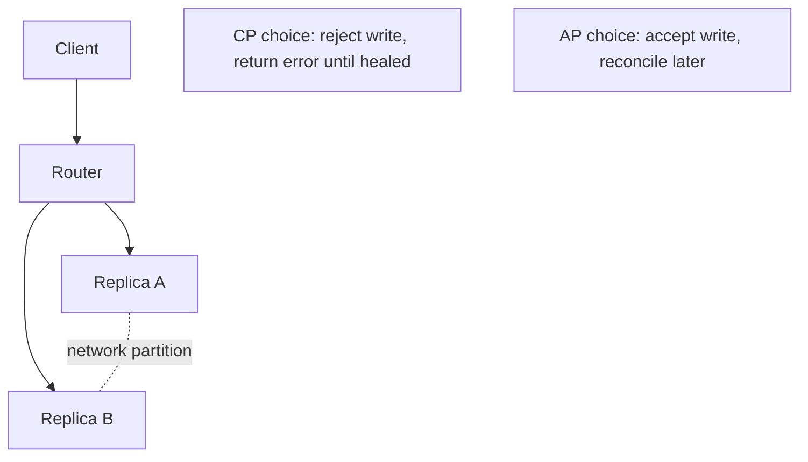

#### 89 — Explain L4 vs L7 load balancing.
L4 (transport layer) balances based on IP/port and TCP/UDP-level info without inspecting request content — fast, protocol-agnostic. L7 (application layer) understands HTTP and can route based on path, host header, or cookies — more flexible but adds processing overhead.

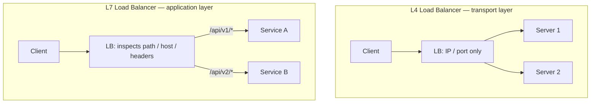

#### 91 — Explain caching strategies: cache-aside, write-through, write-behind.
Cache-aside: app checks cache first, on a miss reads from DB and populates the cache. Write-through: writes go to the cache and DB synchronously together — reads always fresh, writes slower. Write-behind: writes go to the cache immediately and are asynchronously flushed to the DB later — fastest writes, risks data loss if the cache fails before flushing.

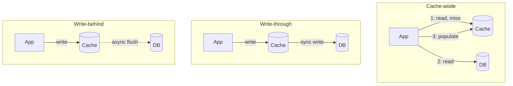

---

## XI. Distributed Systems Concepts

| # | Question | Answer |
|---|----------|--------|
| 96 | Explain a distributed lock, and why plain mutexes don't work across services. | A `sync.Mutex` only coordinates goroutines within a single process's memory space. A distributed lock uses a shared external system (Redis Redlock, or etcd/Zookeeper with consensus-backed leases) so multiple independent processes can agree on mutual exclusion, typically with a lease/TTL. |
| 97 | What's leader election, and how does it typically work? | A mechanism for a group of distributed nodes to agree on exactly one "leader." Typically implemented via a consensus protocol like Raft — nodes propose themselves, a majority quorum must agree, and if the leader fails to renew its lease, a new election triggers. |
| 99 | At-most-once vs at-least-once vs exactly-once delivery — why is exactly-once mostly a myth? | At-most-once: message might be lost. At-least-once: guaranteed delivered, but possibly more than once. Exactly-once is extremely hard end-to-end; in practice, systems achieve "effectively exactly-once" by combining at-least-once delivery with idempotent processing. |
| 103 | How do clock skew and distributed time affect ordering of events across services? | Wall-clock timestamps from different machines aren't reliably comparable due to clock drift. Solutions: logical clocks (Lamport/vector clocks) that capture causal ordering, or a centralized sequencer/monotonic ID source when a single global order is required. |
| 105 | What is the thundering herd problem, and how do jitter/coalescing prevent it? | Thundering herd is when a large number of clients wake up or retry simultaneously, overwhelming a resource that was just recovering. Jittered backoff randomizes retry timing; request coalescing (single-flight) ensures only one actual request goes to the backend when many callers request the same resource. |
| 107 | What's the difference between Byzantine and crash-fault tolerance, and why do Raft/Paxos only handle the latter? | Crash-fault tolerance assumes a failed node simply stops responding — it never lies. Byzantine fault tolerance assumes a node can behave arbitrarily: send conflicting messages to different peers, claim false state, or act maliciously. Raft and Paxos only tolerate crash faults, which is why they're safe for trusted infrastructure you control (your own replica set) but insufficient for adversarial settings like blockchain consensus, which need BFT protocols (PBFT, Tendermint) instead. |
| 108 | What is the Two Generals' Problem, and what does it actually prove about distributed consensus? | Two armies must attack a city simultaneously to win, but can only coordinate via messengers who might be captured (messages that might be lost). No matter how many acknowledgments are exchanged, neither general can ever be 100% certain the other received the final ACK, so perfect agreement over an unreliable channel is provably impossible. In practice, systems don't solve this — they work around it with retries, timeouts, and idempotency, accepting a vanishingly small but nonzero risk instead of a mathematical guarantee. |
| 110 | What is a CRDT, and when would you reach for one instead of a distributed lock? | A Conflict-free Replicated Data Type is a data structure (counter, set, map) designed so that concurrent updates from different replicas can always be merged deterministically into the same final state, without coordination or locking — e.g. a grow-only counter that merges by taking the max per-replica count. Reach for one when replicas need to accept writes independently (offline-first apps, multi-region writes) and eventual convergence is good enough; skip it when you need a strict invariant a CRDT can't express, like "balance never goes negative." |
| 111 | How does a gossip protocol detect node failure in a cluster, and how does that differ from a centralized health check? | Each node periodically pings a few random peers and forwards what it's heard about others' health, so failure information spreads epidemic-style across the cluster in O(log N) rounds without a central bottleneck or single point of failure. A centralized health-check registry is simpler to reason about but doesn't scale as well and becomes a single point of failure itself; gossip (e.g. SWIM) trades a small amount of detection latency for horizontal scalability and resilience. |
| 113 | What does PACELC add to CAP theorem? | CAP only describes the tradeoff during a network partition (P). PACELC extends it: if Partitioned, choose Availability or Consistency (as in CAP) — Else, even with no partition at all, choose Latency or Consistency, since synchronously confirming a write across replicas for strong consistency always costs latency versus acknowledging locally and replicating asynchronously. It's a more complete lens for classifying real systems — e.g. DynamoDB is PA/EL, while a synchronously-replicated SQL cluster is PC/EC. |

#### 98 — Explain quorum-based consistency (N/R/W).
N is the total number of replicas; W is how many replicas must acknowledge a write before it's considered successful; R is how many replicas a read must query and reconcile before returning a result. If `R + W > N`, every read is guaranteed to overlap with the most recent write's replica set.

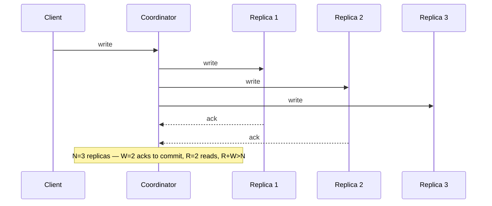

#### 100 — How would you design idempotency keys for a payment API?
Require the client to generate a unique idempotency key per logical operation and send it in the request header. The server checks a store keyed on that idempotency key — if seen before, return the previously stored result; if not, atomically claim the key before doing the actual charge.

```sql
INSERT INTO payment_requests (idempotency_key, status)
VALUES ($1, 'processing')
ON CONFLICT (idempotency_key) DO NOTHING;
-- 0 rows affected => a request with this key is already in
-- flight/done -- look up and return its stored result instead
-- of charging again.
```

#### 101 — Explain the outbox pattern for reliably publishing events after a DB write.
Instead of writing to the DB and then separately publishing to a message broker (which can fail independently), you write the business change and an "outbox" event row in the *same* database transaction. A separate poller/relay process reads unpublished outbox rows and publishes them, marking them sent.

```go
tx, _ := db.BeginTx(ctx, nil)
tx.Exec(`UPDATE accounts SET balance = balance - $1 WHERE id = $2`, amount, from)
tx.Exec(`INSERT INTO outbox (event_type, payload, published)
         VALUES ($1, $2, false)`, "FundsDebited", payload)
tx.Commit() // business change + outbox row commit atomically

// separate relay process:
// SELECT * FROM outbox WHERE published = false
// -> publish to broker -> mark published = true
```

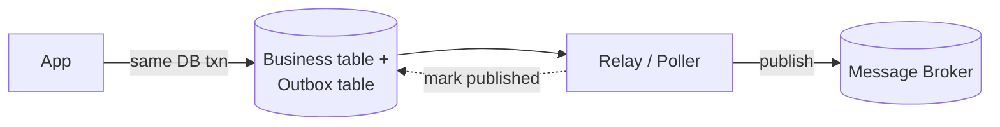

#### 102 — What is a saga pattern, and when would you use it instead of 2PC?
A saga breaks a distributed transaction into a sequence of local transactions, each with a compensating action to undo it if a later step fails — instead of holding locks across services as two-phase commit does.

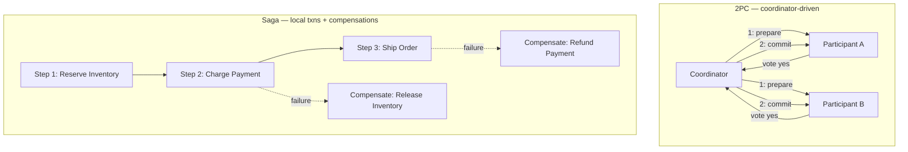

#### 104 — Explain consistent hashing and why it's used for sharding/caching.
Consistent hashing maps both nodes and keys onto a hash ring; a key is owned by the next node clockwise on the ring. When a node is added or removed, only the keys between it and its neighbor need to move — unlike naive `hash(key) % N` sharding, where changing N remaps almost every key.

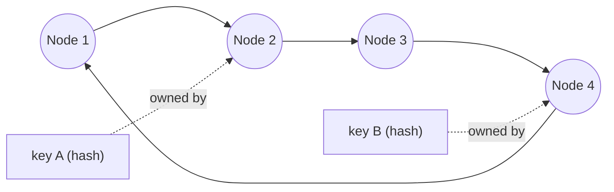

#### 106 — Walk through Raft leader election and log replication in more depth.
Every node is Follower, Candidate, or Leader, and time is divided into monotonically increasing terms. A Follower that hears no heartbeat before its election timeout becomes a Candidate, increments the term, and requests votes; it becomes Leader on receiving votes from a majority. The Leader then replicates every write as a log entry to followers; an entry is only committed (safe to apply) once a majority of nodes have persisted it, and the Leader tracks a commit index that only advances forward. If a Leader crashes mid-replication, the next elected Leader is guaranteed (by the election rule that a node only votes for candidates with an equally-or-more up-to-date log) to already have every committed entry, so no committed write is ever lost.

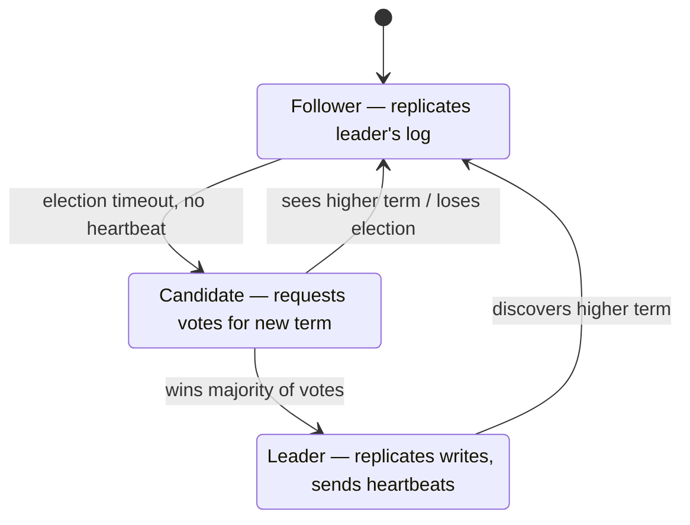

#### 109 — Where do strong, causal, and eventual consistency sit relative to each other, and what is "read-your-writes" consistency?
Strong consistency: every read sees the latest committed write, as if there were only one copy of the data — most expensive, since it needs coordination on every read or write. Eventual consistency: replicas converge given enough time with no new writes, but a read shortly after a write can return stale data — cheapest, no coordination needed. Causal consistency sits between them: operations that are causally related (a reply to a comment) are seen by everyone in that order, but unrelated operations can be seen in different orders on different replicas. Read-your-writes is a narrower, practical guarantee often layered on top of eventual consistency: a specific client is guaranteed to see its own writes on its next read (e.g. by routing that client's reads to the replica it wrote to, or a sticky session), even if other clients might still see stale data.

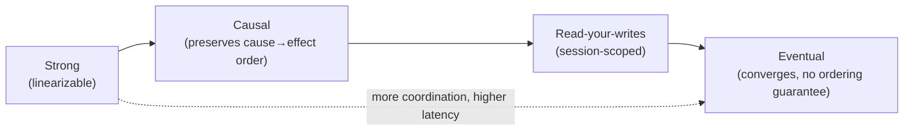

#### 112 — Explain the bulkhead pattern, and how it differs from a circuit breaker.
A circuit breaker protects a single dependency by stopping calls to it once it's clearly failing. A bulkhead protects everything else from that one dependency by isolating resources — e.g. a separate connection pool, goroutine pool, or thread pool per downstream — so a slow or exhausted dependency can only exhaust its own pool, not starve requests to unrelated services sharing the same process. The two compose: bulkheads limit blast radius, circuit breakers stop wasting the (limited) resources bulkheads gave that dependency on calls likely to fail anyway.

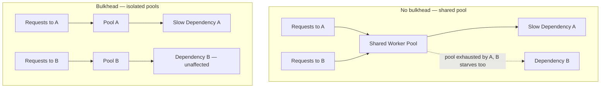

---

## XII. System Design Case Studies

#### 114 — Design a URL shortener.
Key components: a write path that generates a short code (base62-encode an auto-incrementing ID, or a hash with collision check) and stores `short_code → long_url`; a read path that's a simple key lookup and 301/302 redirect. Reads vastly outnumber writes, so put a cache in front of the DB for the read path.

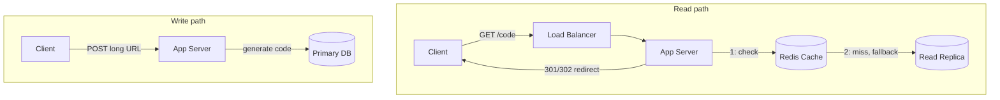

#### 115 — Design a distributed rate limiter shared across multiple API gateway instances.
Each gateway instance can't keep its own local counter, since that under-counts total traffic. Use a shared, fast store (Redis) holding per-client counters with a sliding-window or token-bucket algorithm implemented via an atomic Lua script.

```lua
-- executed atomically via EVAL, keyed per client
local tokens = tonumber(redis.call('GET', KEYS[1]) or ARGV[1])
if tokens > 0 then
  redis.call('DECRBY', KEYS[1], 1)
  return 1 -- allowed
end
return 0 -- rate limited
```

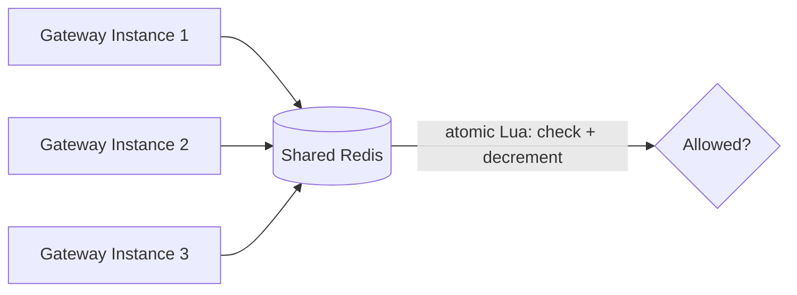

#### 116 — Design a real-time fraud/risk scoring system with a tight latency SLA (<100ms), adding more signals over time.
Run signals in parallel goroutines with a bounded per-request timeout, so total latency is close to the slowest single signal, not the sum. Precompute/cache expensive signals asynchronously ahead of the request, and set a hard deadline so a single slow signal degrades gracefully rather than blowing the SLA.

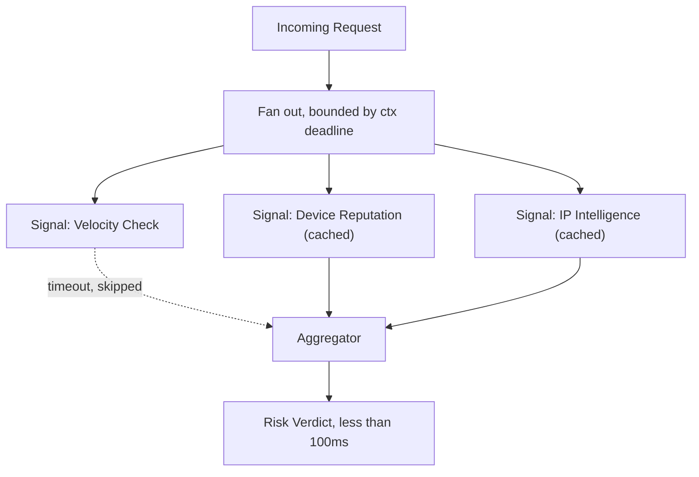

#### 117 — Design a notification system fanning a single event out to millions of users via push/email/SMS.
Ingest the triggering event into a message queue rather than processing synchronously. A fan-out worker resolves the target user list (paginated) and publishes one message per user per channel onto per-channel queues, each with dedicated worker pools respecting that channel's own rate limits.

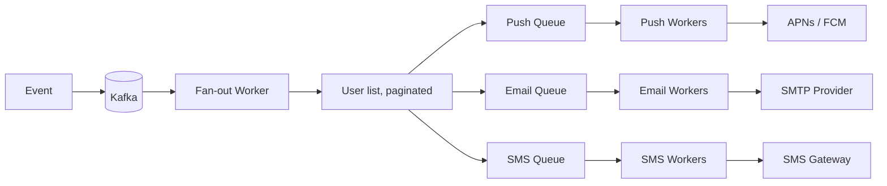

#### 118 — Design an idempotent payment processing pipeline that survives retries without double-charging.
Client sends a request with a client-generated idempotency key. Server, in a single DB transaction, tries to insert a row keyed on that idempotency key with status "processing" — a unique constraint means a concurrent duplicate insert fails immediately. Only after the row is claimed does the service call the payment processor.

```sql
INSERT INTO payment_requests (idempotency_key, status)
VALUES ($1, 'processing')
ON CONFLICT (idempotency_key) DO NOTHING;
```

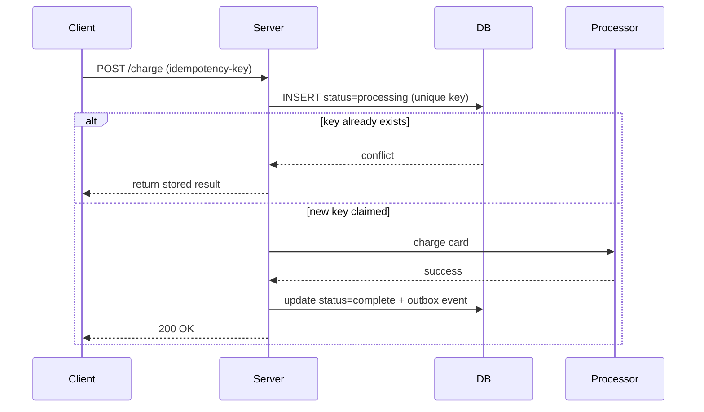

#### 119 — Design a distributed job scheduler where each job runs exactly once even if a node crashes.
Store jobs and their next-run-time in a shared DB. Workers poll for due jobs and atomically claim one via a conditional update, which acts as a lightweight distributed lock. Include a lease/heartbeat so if the worker crashes mid-execution, the lock expires and another worker can reclaim it.

```sql
UPDATE jobs
SET locked_by = $1, locked_at = now()
WHERE id = $2 AND locked_by IS NULL;
-- 1 row updated => this worker owns the job
-- 0 rows updated => another worker already claimed it
```

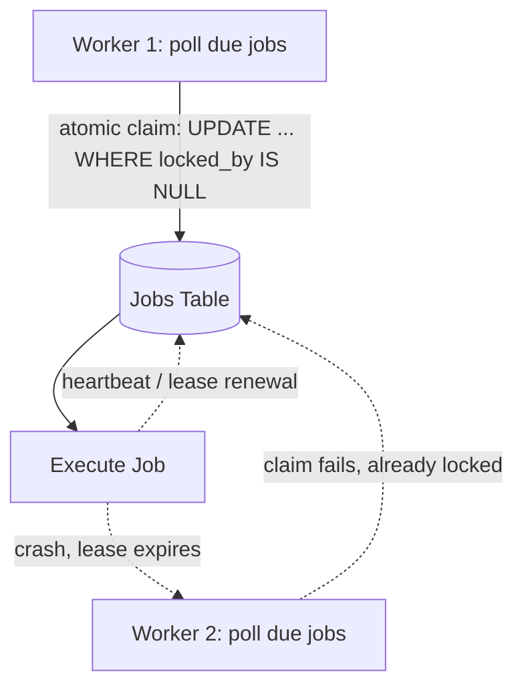

#### 120 — Design a sharded, horizontally-scalable chat/messaging backend.
Shard users/conversations across backend nodes using consistent hashing on a conversation or user ID. A connection-routing gateway looks up which shard owns a conversation and forwards accordingly; for offline delivery, persist messages and use a pub/sub layer so any node can catch up.

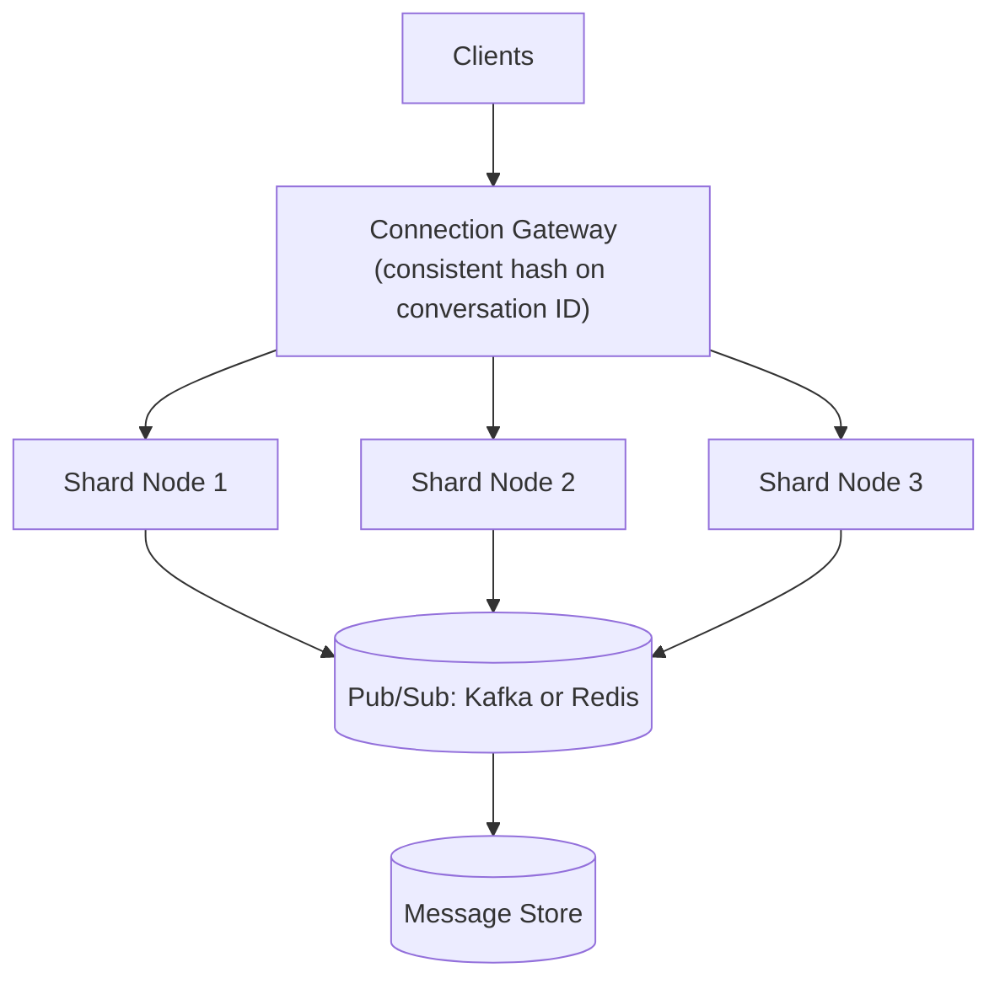

#### 121 — Design a system for ingesting and aggregating high-throughput event streams (e.g., sports data) with the right delivery semantics.
Producers publish events partitioned by a natural key (e.g., game ID) so ordering is preserved per entity. Consumers process with at-least-once semantics and make aggregation idempotent (upserts keyed on event ID) so reprocessing after a crash doesn't double-count.

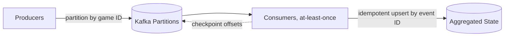

#### 122 — How would you evolve a monolith into microservices without a risky big-bang rewrite?
Use the strangler fig pattern: put a routing layer in front of the monolith, then incrementally extract one bounded-context feature at a time into a new service, routing that specific traffic there while everything else still goes to the monolith.

```mermaid
graph LR
    Client --> Proxy["Routing Proxy"]
    Proxy -->|legacy traffic| Monolith
    Proxy -->|extracted feature| NewService["New Service"]
    NewService -. via API, not direct DB .-> Monolith
```

#### 123 — Design an audit/compliance logging system for a fintech platform where logs must be tamper-evident and queryable.
Write audit events to an append-only store, and make tampering detectable by hash-chaining entries (each entry's hash includes the previous entry's hash). For queryability, stream/index the same events into a separate query-optimized store asynchronously, keeping the append-only log as the source of truth.

```go
type AuditEntry struct {
    Seq      int64
    Payload  []byte
    PrevHash [32]byte
    Hash     [32]byte
}

func appendEntry(prev AuditEntry, payload []byte) AuditEntry {
    h := sha256.Sum256(append(prev.Hash[:], payload...))
    return AuditEntry{
        Seq:      prev.Seq + 1,
        Payload:  payload,
        PrevHash: prev.Hash,
        Hash:     h,
    }
}
// altering any past entry changes its Hash, breaking every
// subsequent entry's PrevHash link -- tampering becomes detectable
```

```mermaid
graph LR
    Write["Write Event"] --> Log["Append-only hash-chained log<br/>(source of truth)"]
    Log -. async stream .-> Indexer
    Indexer --> Query[(Query store: Elasticsearch)]
```

---

## XIII. Kafka in Depth (Go)

| # | Question | Answer |
|---|----------|--------|
| 124 | What is a Kafka topic, partition, and offset, and how do they relate to ordering guarantees? | A topic is a named stream of events, split into one or more partitions for parallelism; each partition is an append-only, strictly ordered log with monotonically increasing offsets. Kafka only guarantees ordering *within a single partition*, not across the whole topic. |
| 125 | What is a consumer group, and how does partition assignment work across group members? | A consumer group is a set of consumer instances sharing a single logical subscription — Kafka guarantees each partition is consumed by exactly one member at a time. The group coordinator assigns partitions (round-robin, range, or sticky strategies) and reassigns on membership changes. |
| 126 | Which Go Kafka client libraries are commonly used, and what are the key differences? | `IBM/sarama` is pure Go, widely used, fine-grained control. `confluent-kafka-go` wraps librdkafka via cgo — most performant and feature-complete, at the cost of a cgo dependency. `segmentio/kafka-go` is pure Go, simpler API, historically lagged on some advanced features. |
| 128 | Difference between synchronous and asynchronous producers, and when to use each? | A synchronous producer blocks until the broker acknowledges each message — simpler error handling, throughput-limited. An asynchronous producer returns immediately and delivers results on separate channels, batching under the hood for much higher throughput. |
| 129 | Explain Kafka's `acks` setting and the tradeoffs for a Go producer. | `acks=0`: no wait, fastest, messages can be lost. `acks=1`: waits for the partition leader — reasonable durability. `acks=all`: waits for all in-sync replicas — strongest durability, higher latency; the setting for payments and audit events. |
| 130 | What happens during a consumer group rebalance, and how can it disrupt a Go service mid-processing? | The coordinator revokes and reassigns partitions; by default all consumers pause during this window, even ones whose partitions didn't change. If your processing loop doesn't handle the revoke/rebalance callback properly, you can double-process after reassignment if offsets weren't committed first. |
| 131 | How do you achieve at-least-once processing in a Go Kafka consumer? | Process the message fully *before* committing its offset, and only commit after successful processing — if the consumer crashes before committing, the message is redelivered on restart, so processing logic must be idempotent. |
| 132 | How would you implement exactly-once-ish semantics in Go without relying purely on Kafka transactions? | Combine at-least-once delivery with idempotent consumer-side writes — use the message's unique key or the `(topic, partition, offset)` tuple as an idempotency key with an upsert or unique constraint. |
| 133 | Explain Kafka's idempotent producer feature, and when you'd enable it. | With `enable.idempotence=true`, the producer assigns each message a sequence number per partition, and brokers deduplicate retried sends caused by producer-side retries after a transient failure — enable it whenever you care about not double-publishing due to network retries. |
| 134 | What is Kafka transactional messaging, and when would you use it in Go? | Transactions let a producer atomically write to multiple partitions/topics and commit its consumed offset together with a "read process write" pattern — use it for a stream-processing step that can't tolerate partial failure between reading and writing. |
| 135 | How do you handle a poison pill message in a Go consumer without blocking the partition forever? | After a bounded number of retries, route the message to a dead-letter topic instead of retrying indefinitely, then commit past it so the partition keeps moving. |
| 136 | Explain consumer lag and how you'd monitor it in a Go service. | Lag is the difference between the latest produced offset and the consumer group's last committed offset. Monitor via Kafka's own exposed metrics (Burrow, the Kafka exporter for Prometheus); a steadily growing lag signals consumers can't keep up. |
| 137 | How do you handle backpressure when a Go consumer processes slower than messages arrive? | Kafka naturally provides backpressure — a consumer that doesn't poll simply doesn't receive more messages. Avoid unbounded goroutines per message; use a bounded worker pool, and pause partition consumption if a downstream dependency is struggling. |
| 138 | What's the significance of partition count for parallelism, and what happens with more consumers than partitions? | Partition count is the hard ceiling on parallelism within a consumer group — extra consumer instances beyond partition count sit completely idle. |
| 140 | Manual vs automatic offset commits — pitfalls of auto-commit? | Auto-commit periodically commits the latest *fetched* offset on a timer, regardless of whether processing actually finished — if the consumer crashes between fetch and finishing, it can silently lose a message. Manual commit (only after success) is the safer default. |
| 141 | How do you handle schema evolution for Kafka messages in Go (Avro/Protobuf + schema registry)? | Register schemas in a schema registry and enforce compatibility rules (backward or full) so old consumers can still read new-schema messages — only add new fields with defaults, never remove/rename/retype existing fields. |
| 142 | What's a dead-letter queue (DLQ) pattern for Kafka consumers, and how would you implement it in Go? | After a message fails more than N times, produce it (with failure metadata) to a separate DLQ topic, then commit past it on the original topic — the DLQ message can be inspected or reprocessed manually later. |
| 143 | How would you test Kafka producer/consumer code in Go without a real Kafka cluster? | For unit tests, use sarama's mock broker/producer to simulate broker responses. For integration-level confidence, run a real Kafka broker in a container via `testcontainers-go`, or Redpanda as a lighter-weight alternative. |

#### 127 — How do you produce a message with a specific key in Go, and why does the key matter?
You set the `Key` field on the producer message. Kafka's default partitioner hashes the key to consistently route all messages with the same key to the same partition — this matters whenever you need ordering guarantees for a given entity.

```go
msg := &sarama.ProducerMessage{
    Topic: "orders",
    Key:   sarama.StringEncoder(userID),
    Value: sarama.ByteEncoder(payload),
}
partition, offset, err := producer.SendMessage(msg)
// same key -> same partition -> preserves per-user ordering
```

#### 139 — How would you design a Go consumer to gracefully shut down without losing in-flight messages or committing wrong offsets?
On a shutdown signal (SIGTERM), stop polling for new messages, let in-flight processing finish, commit offsets for everything successfully processed, then close the consumer/session cleanly so the group coordinator triggers a clean rebalance.

```go
func (h *Handler) ConsumeClaim(sess sarama.ConsumerGroupSession,
    claim sarama.ConsumerGroupClaim) error {
    for {
        select {
        case msg, ok := <-claim.Messages():
            if !ok {
                return nil
            }
            process(msg)
            sess.MarkMessage(msg, "")
        case <-sess.Context().Done():
            return nil // finish current message, then return promptly
        }
    }
}
```

---

## XIV. Microservices Architecture

#### 144 — What is service discovery in a microservices architecture, and what approaches are common?
Service discovery lets one service find the current network location of another, since instances scale up/down and get rescheduled constantly. Common approaches: a service registry (Consul, etcd, Zookeeper) with health checks, or DNS-based discovery (Kubernetes' built-in DNS) — the latter is simpler and what most teams default to on Kubernetes.

```mermaid
graph LR
    A[Service Instance] -->|register + heartbeat| R[(Service Registry)]
    C[Calling Service] -->|lookup healthy instances| R
    R -->|instance list| C
    C -->|call| A
```

#### 145 — What's the difference between client-side and server-side service discovery?
Client-side: the calling service queries the registry directly and picks an instance itself — no extra hop, but every client needs the discovery logic. Server-side: the caller calls a fixed address that queries the registry and routes the request — simpler clients, but adds a hop.

```mermaid
graph TD
    subgraph "Client-side discovery"
    C1[Client] -->|"1: query"| R1[(Registry)]
    C1 -->|"2: call directly"| S1[Chosen Instance]
    end
    subgraph "Server-side discovery"
    C2[Client] -->|"1: call fixed address"| LB[Load Balancer / Gateway]
    LB -->|"2: query"| R2[(Registry)]
    LB -->|"3: route"| S2[Chosen Instance]
    end
```

#### 146 — What is an API gateway, and what responsibilities does it typically centralize?
A single entry point that centralizes cross-cutting concerns so individual services don't each reimplement them: authentication, rate limiting, routing, TLS termination, logging, and sometimes response aggregation. The tradeoff is it becomes a critical-path component that needs to be highly available.

```mermaid
graph LR
    Client --> GW["API Gateway<br/>(auth, rate limit, routing, TLS)"]
    GW --> SvcA[Order Service]
    GW --> SvcB[User Service]
    GW --> SvcC[Payment Service]
```

#### 147 — Explain bounded contexts in Domain-Driven Design, and why they matter for deciding microservice boundaries.
A bounded context is an explicit boundary within which a particular domain model and terminology are consistent — the same word can mean something different in another context, and that's fine as long as each context owns its own model. A well-designed service should own one bounded context.

```mermaid
graph TD
    subgraph "Billing Context"
    C1["Customer = billing address,<br/>payment methods, invoices"]
    end
    subgraph "Support Context"
    C2["Customer = open tickets,<br/>satisfaction score, history"]
    end
    C1 -. "same word, different model — both valid" .- C2
```

#### 148 — What's the difference between an Entity and a Value Object in Domain-Driven Design?
An Entity has a persistent identity that outlives any single attribute value — two `Order` objects with identical fields are still different orders if their IDs differ, and an entity's attributes can change over time while it remains "the same" order. A Value Object has no identity of its own — it's defined entirely by its attributes, is typically immutable, and two value objects with the same attributes are interchangeable (a `Money{Amount: 100, Currency: "USD"}` doesn't need an ID; another `Money{100, "USD"}` is equal to it). Modeling something as a value object instead of an entity removes a whole class of identity-tracking and mutation bugs — reach for it whenever "what is this" matters more than "which one is this."

#### 149 — What is an Aggregate in DDD, and what role does the Aggregate Root play?
An Aggregate is a cluster of entities and value objects treated as a single consistency boundary — everything inside it is loaded, modified, and saved together, and invariants that span multiple objects (an Order's total must equal the sum of its line items) are enforced within that boundary. The Aggregate Root is the single entry point: external code only ever references and calls methods on the root (`Order`), never reaches directly into its internals (`OrderLine`) to mutate them — that's what lets the root actually enforce its invariants instead of them being bypassed. Aggregate boundaries should be kept small; a common mistake is modeling an entire object graph as one giant aggregate, which serializes writes across unrelated concerns and kills concurrency.

```mermaid
graph TD
    subgraph "Order Aggregate"
    Root["Order (Aggregate Root)"] --> L1[OrderLine 1]
    Root --> L2[OrderLine 2]
    Root --> Total["enforces: total == sum(lines)"]
    end
    External["External code"] -->|"only calls Order's methods"| Root
    External -.->|"never reaches in directly"| L1
```

#### 150 — What is a domain event, and how does it differ from an integration event?
A domain event captures something that happened inside the domain model that other parts of the same bounded context care about — `OrderPlaced`, `InventoryReserved` — raised by an aggregate as a side effect of a state change, typically handled in-process, often within the same transaction. An integration event is the cross-service version: a domain event (or a derived, more stable version of it) published externally over a broker so other bounded contexts can react — this is exactly what the outbox pattern (Q101) exists to publish reliably. Keeping the two separate matters because a domain event's shape is free to change with the internal model, while an integration event is a public contract other teams depend on and needs the same versioning discipline as an API.

#### 151 — What does the Repository pattern give you in a DDD-structured service?
A Repository provides a collection-like interface (`Get`, `Save`, `FindByX`) for retrieving and persisting aggregates, hiding the actual storage mechanism (SQL, a document store, an in-memory fake in tests) behind that interface. The domain layer depends only on the repository interface, not on a concrete database driver — so business logic can be unit-tested against an in-memory fake repository with no database at all, and the storage technology can change without touching domain code. It's the same dependency-inversion idea as Go's usual "define the interface where it's consumed, not where it's implemented" convention, applied specifically to persistence.

#### 152 — What is an Anti-Corruption Layer, and when do you need one?
An Anti-Corruption Layer (ACL) is a translation boundary placed between your bounded context and an external system (a legacy service, a third-party API, another team's model) so that the external system's model, quirks, and vocabulary never leak directly into your domain model — it translates their shapes into yours at the boundary instead. Needed whenever integrating with a system whose model doesn't match your own domain concepts, especially a legacy or third-party one you don't control — without an ACL, that external model's inconsistencies and future changes ripple straight into your code.

```mermaid
graph LR
    Legacy["Legacy / third-party system<br/>(their model, their vocabulary)"] --> ACL["Anti-Corruption Layer<br/>(translates)"]
    ACL --> Domain["Your domain model<br/>(your ubiquitous language)"]
```

#### 153 — What is "ubiquitous language" in DDD, and why does it matter for an architect?
Ubiquitous language is a shared vocabulary, defined by the domain and used consistently by both engineers and domain experts — in conversation, in code (class and method names), and in documentation — with no separate "business term" that gets silently translated into a different "technical term" in the codebase. It matters at the architecture level because bounded context boundaries are usually where the language actually changes — the moment two teams use the same word to mean different things (Q147's "Customer" example) is a signal you've crossed into a different bounded context, which is itself a strong hint for where a service boundary should be.

#### 154 — What is hexagonal (ports and adapters) architecture, and how does it relate to DDD?
Hexagonal architecture puts the domain model at the center, fully isolated from infrastructure, and defines "ports" (interfaces the domain needs, like a repository or a notifier) that "adapters" implement for a specific technology (a Postgres repository, an SMTP email adapter, an HTTP handler adapter driving the domain from the outside). The domain never imports infrastructure code — dependencies point inward, only adapters depend on the domain, never the reverse. It pairs naturally with DDD: the domain model built with entities, value objects, and aggregates lives at the hexagon's center, while repositories (Q151) are exactly the kind of port the pattern formalizes, and swapping a real Postgres adapter for an in-memory test adapter is the same benefit stated more architecturally.

```mermaid
graph TD
    HTTP["HTTP Handler<br/>(adapter)"] --> Port1["Port: UseCase interface"]
    Port1 --> Domain["Domain Core<br/>(entities, value objects, aggregates)"]
    Domain --> Port2["Port: Repository interface"]
    Port2 --> PG["Postgres Repository<br/>(adapter)"]
    Domain --> Port3["Port: Notifier interface"]
    Port3 --> SMTP["SMTP Adapter<br/>(adapter)"]
```

#### 155 — What is the "database per service" pattern, and why is a shared database across services usually an anti-pattern?
Each microservice owns its own database; no other service reads or writes it directly. A shared database silently recouples services at the schema level: any service can be broken by another team's migration, and there's no real ownership boundary.

```mermaid
graph TD
    subgraph "Database per service — good"
    S1[Order Service] --> D1[(Order DB)]
    S2[User Service] --> D2[(User DB)]
    S1 -. "API call, not direct DB access" .-> S2
    end
    subgraph "Shared database — anti-pattern"
    S3[Order Service] --> D3[(Shared DB)]
    S4[User Service] --> D3
    end
```

#### 156 — How do you handle a query that needs data owned by multiple services (e.g., an order summary needing user, inventory, and payment data)?
API composition: a gateway calls each owning service's API in parallel and stitches results together — simple, but adds latency and couples availability to every downstream service. CQRS with a materialized read model: services publish events on change, and a read-optimized store built from those events answers the composite query directly.

```mermaid
graph TD
    subgraph "API composition"
    AG[Aggregator] --> U1[User Service]
    AG --> I1[Inventory Service]
    AG --> P1[Payment Service]
    end
    subgraph "CQRS read model"
    U2[User Service] -->|event| Bus[(Event Bus)]
    I2[Inventory Service] -->|event| Bus
    P2[Payment Service] -->|event| Bus
    Bus --> RM[(Materialized Read Model)]
    Q[Order Summary Query] --> RM
    end
```

#### 157 — What is distributed tracing, and how does it help debug a slow request spanning multiple services?
Distributed tracing follows a single logical request as it fans out across many services, recording each service's processing time as a "span" linked into one trace via a shared trace ID. With a tool like Jaeger/OpenTelemetry, you get a single visual timeline showing exactly which service accounted for the latency.

```mermaid
sequenceDiagram
    participant Client
    participant Gateway
    participant OrderSvc as Order Service
    participant PaymentSvc as Payment Service
    Client->>Gateway: request (trace-id: abc123)
    Gateway->>OrderSvc: call (trace-id: abc123)
    OrderSvc->>PaymentSvc: call (trace-id: abc123)
    PaymentSvc-->>OrderSvc: response (120ms — the slow span)
    OrderSvc-->>Gateway: response
    Gateway-->>Client: response
    Note over Client,PaymentSvc: All spans linked by trace-id abc123 in one timeline
```

#### 158 — Explain correlation IDs and trace context propagation across service calls.
A correlation ID is generated once at the edge and passed along in every downstream call, usually as an HTTP header. Every service logs that ID alongside its own log lines, so you can reconstruct the full picture across services. In Go, `context.WithValue` is legitimately meant for exactly this.

```mermaid
sequenceDiagram
    participant Edge as API Gateway (generates ID)
    participant A as Service A
    participant B as Service B
    Edge->>A: X-Request-ID: req-789
    A->>B: X-Request-ID: req-789 (propagated)
    B-->>A: response
    A-->>Edge: response
    Note over Edge,B: Same ID in every service's logs — full request is reconstructable
```

#### 159 — What is a circuit breaker, and how does it differ from a retry/backoff strategy?
Retry/backoff assumes the downstream is fine but this request had a transient hiccup. A circuit breaker tracks the failure rate over time and, once it crosses a threshold, "opens" and stops sending requests entirely for a cooldown period, failing fast instead of piling on more requests.

```mermaid
stateDiagram-v2
    [*] --> Closed
    Closed --> Open: failure rate > threshold
    Open --> HalfOpen: cooldown expires
    HalfOpen --> Closed: probe succeeds
    HalfOpen --> Open: probe fails
    Closed: Closed — requests flow normally
    Open: Open — fail fast, no calls sent
    HalfOpen: Half-Open — small number of probe requests
```

#### 160 — How do you secure service-to-service communication in a microservices architecture?
mTLS: both sides present certificates so each service cryptographically verifies the other's identity. JWT propagation: the caller's identity/claims are forwarded as a signed token through the call chain. Service accounts/API keys for service-level (not user-level) identity.

```mermaid
graph LR
    A[Service A] -->|mTLS: mutual cert verification| B[Service B]
    A -->|JWT: forwarded user claims, layered on top| B
```

#### 161 — What is a service mesh, and what problems does it solve that you'd otherwise build into each service?
A service mesh (Istio, Linkerd) is a sidecar proxy deployed alongside every service instance that handles mTLS, retries/timeouts/circuit breaking, load balancing, and observability transparently, without application code needing to implement any of it.

```mermaid
graph TD
    subgraph "Pod A"
    SvcA[Service A] --- SidecarA[Sidecar Proxy]
    end
    subgraph "Pod B"
    SvcB[Service B] --- SidecarB[Sidecar Proxy]
    end
    SidecarA <-->|mTLS, retries, timeouts, metrics| SidecarB
```

#### 162 — How do you version and evolve APIs between microservices without breaking consumers during a rolling deployment?
During a rolling deploy, old and new versions run simultaneously, so the API must be backward compatible for the whole rollout window at minimum. For a genuinely breaking change, version the API explicitly (`/v1/`, `/v2/`) and run both in parallel until every consumer has migrated.

```mermaid
graph LR
    Client -->|"/v1/orders"| GW[Gateway]
    Client -->|"/v2/orders"| GW
    GW --> OldSvc["Service v1<br/>(old pods, still running)"]
    GW --> NewSvc["Service v2<br/>(new pods, rolling in)"]
```

---

## XV. Security

| # | Question | Answer |
|---|----------|--------|
| 163 | What's the difference between authentication and authorization, and RBAC vs ABAC? | Authentication (authN) verifies who you are; authorization (authZ) decides what you're allowed to do once verified. RBAC grants permissions based on a user's assigned role (admin, viewer) — simple, coarse-grained. ABAC evaluates policy against attributes of the user, resource, and context (department=finance AND resource.owner=user AND time<18:00) — more flexible and fine-grained, at the cost of policy complexity. |
| 164 | How should passwords be stored, and why is rolling your own hashing scheme a bad idea? | Never store plaintext or reversibly-encrypted passwords — hash with a slow, salted algorithm designed for it: bcrypt, scrypt, or argon2 (preferred). These are deliberately slow and tunable to keep pace with hardware, and a unique salt per password defeats precomputed rainbow-table attacks. A fast general-purpose hash like SHA-256 is the wrong tool — it's fast specifically so attackers can brute-force billions of guesses per second against a leaked hash dump. |
| 165 | How should a service manage secrets (DB passwords, API keys) in production? | Never commit them to source control or bake them into container images — pull them at runtime from a dedicated secrets manager (Vault, AWS Secrets Manager, GCP Secret Manager) that supports access-controlled retrieval, audit logging, and rotation. Environment variables are an acceptable delivery mechanism for the running process, but the source of truth should be the secrets manager, not a `.env` file checked in or copy-pasted between engineers. |
| 166 | Encryption at rest vs. in transit — what protects against what? | In transit (TLS) protects data moving across a network from being read or tampered with by anyone sitting on the path. At rest (disk/DB-level encryption, e.g. AES-256) protects data sitting on storage media from being read if the physical disk, backup, or snapshot is stolen or improperly accessed. They're independent controls — TLS alone doesn't protect a stolen database backup, and disk encryption alone doesn't protect a request sniffed off the wire. |
| 167 | What is SSRF, and what's a common CORS misconfiguration? | SSRF (Server-Side Request Forgery) happens when a service fetches a URL supplied by the caller and an attacker points it at an internal-only endpoint (a cloud metadata service, an internal admin API) the server can reach but the attacker can't directly — mitigate with an allowlist of permitted hosts/schemes and blocking requests to private IP ranges. A common CORS mistake is reflecting `Access-Control-Allow-Origin` back as whatever `Origin` header the request sent combined with `Access-Control-Allow-Credentials: true` — that lets any website make authenticated cross-origin requests on a logged-in user's behalf. |
| 168 | How do you protect against a compromised or malicious dependency in a Go module graph? | `go.sum` pins the exact cryptographic checksum of every dependency version, and the checksum database (`GOSUMDB`, `sum.golang.org` by default) verifies a module's checksum on first download against a public, tamper-evident log — so a dependency can't be silently swapped for a malicious version later. Beyond that: run a vulnerability scanner (`govulncheck`, or Snyk/Dependabot) in CI, pin versions rather than using loose ranges, and for a regulated environment, maintain an SBOM (Software Bill of Materials) so you can answer "are we affected" quickly when a CVE drops. |
| 169 | What is STRIDE, and when should an architect actually run a threat model? | STRIDE is a mnemonic for threat categories: Spoofing, Tampering, Repudiation, Information disclosure, Denial of service, Elevation of privilege — used to systematically walk a design (usually a data-flow diagram) and ask "how could this fail under each category" instead of relying on ad hoc worry. Run one whenever a new trust boundary is introduced — a new external-facing API, a new service handling sensitive data, a new integration with a third party — not for every minor internal change. |

#### 170 — Walk through the OAuth2 authorization code flow, and where the token actually ends up.
The user is redirected to the authorization server (e.g. Google) and logs in there, not on the client app — the client never sees the password. The authorization server redirects back to the client with a short-lived authorization code. The client's backend then exchanges that code (plus a client secret) directly with the authorization server for an access token — this token exchange happens server-to-server, so the token never transits through the browser's URL bar or history. OIDC layers an ID token (a JWT asserting identity) on top of OAuth2, which is fundamentally an authorization protocol, not an authentication one — that distinction is a common interview trip-up.

```mermaid
sequenceDiagram
    participant User
    participant Client as Client App
    participant Auth as Authorization Server
    User->>Client: 1: initiate login
    Client->>Auth: 2: redirect to Auth (with client_id)
    User->>Auth: 3: authenticate directly with Auth
    Auth->>Client: 4: redirect back with auth code
    Client->>Auth: 5: exchange code + client secret (server-to-server)
    Auth->>Client: 6: access token (+ ID token for OIDC)
```

#### 171 — What's inside a JWT, and what are the common pitfalls?
A JWT is three base64url segments — header (algorithm), payload (claims: user id, expiry, roles), signature — concatenated with dots. Anyone can decode and read the payload; the signature only proves it wasn't tampered with, so never put secrets in the payload. Pitfalls: accepting `alg: none` or letting the client dictate the algorithm (an attacker crafts an unsigned token and a naive verifier trusts it — always hardcode the expected algorithm server-side); not checking `exp` at all; using long-lived access tokens instead of a short-lived access token plus a separate, revocable refresh token; and no revocation path at all, since a valid-but-compromised JWT can't be invalidated before it expires unless you maintain a denylist.

```go
token, err := jwt.Parse(tokenString, func(t *jwt.Token) (interface{}, error) {
    if _, ok := t.Method.(*jwt.SigningMethodHMAC); !ok {
        return nil, fmt.Errorf("unexpected signing method: %v", t.Header["alg"])
    }
    return hmacSecret, nil
})
```

#### 172 — How does a TLS certificate chain get validated, and what does mTLS add on top of one-way TLS?
A leaf certificate is signed by an intermediate CA, which is signed by a root CA that's pre-trusted (shipped in the OS/browser trust store) — the client walks that chain up to a trusted root to validate the server's identity, plus checks the hostname (or SNI) matches and the cert hasn't expired or been revoked. Standard TLS only authenticates the server to the client. mTLS adds the reverse: the client also presents a certificate, and the server validates it the same way, so both sides cryptographically prove identity — the standard approach for service-to-service auth inside a trusted network (see Q160, service-to-service mTLS). Certificate rotation matters because a long-lived cert is a long-lived risk if its private key leaks — short-lived certs issued automatically (e.g. via a service mesh's built-in CA) shrink that window.

```mermaid
graph LR
    Root["Root CA<br/>(trusted store)"] --> Inter["Intermediate CA"]
    Inter --> Leaf["Leaf Cert<br/>(server identity)"]
    subgraph "mTLS adds"
    ClientLeaf["Client Cert"] -.->|"validated the same way, in reverse"| Inter
    end
```

#### 173 — What are the most common Go-specific security vulnerabilities, and how do you avoid them?
SQL injection: string-concatenating user input into a query — always use parameterized queries (`?`/`$1` placeholders) or a query builder like Bob, never `fmt.Sprintf` into SQL. Command injection: passing unsanitized input to `os/exec` with a shell (`sh -c`) — pass arguments as a slice to `exec.Command` directly instead of building a shell string, so there's no shell to inject into. Path traversal: joining user-supplied filenames onto a base directory without validation lets `../../etc/passwd` escape it — use `filepath.Clean` and verify the resolved path still has the expected base prefix. Insecure deserialization: `encoding/gob` or unpinned `interface{}` decoding of untrusted input can be abused to construct unexpected types — prefer a schema-constrained format (JSON into a concrete struct) for anything crossing a trust boundary.

```go
// vulnerable: string concatenation lets input break out of the query
query := fmt.Sprintf("SELECT * FROM users WHERE email = '%s'", email)
db.Query(query)

// safe: parameterized query — the driver escapes the value, never the query shape
db.Query("SELECT * FROM users WHERE email = $1", email)
```

#### 174 — What does "defense in depth" mean architecturally, and how does zero trust extend it?
Defense in depth means no single control is trusted to fully protect the system — network segmentation, authentication, authorization, input validation, and encryption each independently reduce risk, so one failure doesn't mean total compromise. The traditional model paired this with a hardened perimeter and an implicitly-trusted internal network. Zero trust removes that implicit trust: every request is authenticated and authorized regardless of whether it originates inside or outside the network perimeter, on the assumption that the perimeter will eventually be breached — which is why mTLS between internal services (Q160) and per-request authorization checks matter even for "internal-only" traffic.

```mermaid
graph TD
    L1["Network segmentation / firewall rules"] --> L2["mTLS between every service (Q160)"]
    L2 --> L3["AuthN + AuthZ on every request<br/>(no implicit internal trust)"]
    L3 --> L4["Input validation / parameterized queries"]
    L4 --> L5["Encryption at rest"]
    L5 --> L6["Audit logging (Q123)"]
```

---

## XVI. Cloud & Infrastructure

| # | Question | Answer |
|---|----------|--------|
| 175 | What's the practical difference between IaaS, PaaS, SaaS, and FaaS, and where does a typical Go service sit? | IaaS (EC2, Compute Engine) gives raw VMs — you manage the OS and everything above it. PaaS (Heroku, Cloud Run) abstracts the OS and deployment away — you hand it a container or artifact and it runs it. SaaS is a finished product you consume (Salesforce). FaaS (Lambda, Cloud Functions) runs a single function per invocation with no persistent process at all. A typical Go backend service usually sits on IaaS-via-orchestrator (a VM fleet running Kubernetes) or PaaS (Cloud Run/ECS Fargate) — full FaaS is a poor fit for a long-lived stateful service with persistent connections. |
| 176 | What are the 12-factor app principles, and why do they map cleanly onto Go services? | A set of practices for building portable, scalable cloud-native apps: config via environment variables (not files baked into the image), treat backing services (DB, cache, queue) as attached resources reachable by URL, stateless disposable processes that start/stop fast, logs treated as an event stream written to stdout rather than managed by the app. Go's static binaries and fast startup already fit most of this naturally — a compiled Go binary with env-based config is close to 12-factor by default. |
| 177 | HPA vs. VPA vs. cluster autoscaler — what does each one actually scale, and what breaks if you only configure one? | HPA (Horizontal Pod Autoscaler) adds/removes pod replicas based on a metric like CPU or a custom metric (queue depth). VPA (Vertical Pod Autoscaler) adjusts a pod's CPU/memory requests/limits over time. The cluster autoscaler adds/removes underlying nodes when pods can't be scheduled due to insufficient node capacity. Running HPA alone without a cluster autoscaler means new pod replicas can go Pending forever once existing nodes are full — HPA scaled the workload, but nothing scaled the cluster to fit it. |
| 178 | What does Infrastructure as Code actually buy you over provisioning resources by hand in a console? | Reproducibility — the exact same environment can be recreated (a new region, a disaster-recovery standby) from the same source instead of tribal knowledge of console clicks. Review — infrastructure changes go through the same plan/diff-then-apply, PR review, and version history as code, instead of an unaudited console click. Drift detection — running a plan against live infrastructure surfaces anything that changed out-of-band. The cost is a learning curve and a "clicking in the console to fix an incident right now" instinct that has to be resisted in favor of "fix it in code, then apply." |
| 179 | Managed (RDS/Cloud SQL-style) vs. self-hosted database in the cloud — what's the actual trade-off? | Managed: the provider handles patching, backups, failover, and often read replicas and point-in-time recovery, at the cost of less low-level tuning control, vendor-specific quirks, and a recurring premium over raw compute cost. Self-hosted on your own VMs: full control over configuration, extensions, and version, but your team now owns backup verification, patching, and failover — and failover in particular is easy to get wrong under pressure during an actual incident. For most teams below a certain scale, managed is the right default; self-hosting is a deliberate trade for control that should be justified, not a default. |
| 180 | When is serverless (Lambda/Cloud Functions style) a poor fit for a Go service? | Cold starts add latency to the first request after idle — a problem for latency-sensitive synchronous APIs, less so for async event processing. Execution time limits (typically minutes) rule out long-running jobs. No persistent in-memory state or connections between invocations means every invocation may re-establish DB connections unless you're careful with pooling patterns built for it. Serverless fits well for bursty, event-driven, short-lived work (an S3-upload trigger, a scheduled cleanup job) — a long-lived stateful API with steady traffic is usually cheaper and simpler as a normal deployed service. |
| 181 | What does a typical cloud observability stack look like, and why do traces matter more as the service count grows? | Metrics (Prometheus/CloudWatch-style, time-series aggregates like request rate and error rate) answer "is something wrong right now." Logs (structured, searchable) answer "what exactly happened." Traces (OpenTelemetry, spanning a request across every service it touched) answer "where in this chain of ten services did the slowdown actually happen" — a question metrics and logs alone can't answer once a request fans out across multiple services, since no single service's logs show the whole picture. |
| 182 | What's the difference between RTO and RPO, and how do they drive backup strategy? | RTO (Recovery Time Objective) is how long you can tolerate being down — drives how automated/fast your failover has to be. RPO (Recovery Point Objective) is how much data you can tolerate losing — drives how frequently you back up or replicate. A tight RPO (seconds) needs synchronous or near-real-time replication; a looser RPO (hours) tolerates nightly backups. An architect defines both explicitly per system before choosing a backup/replication strategy, since "back it up daily" is only correct if the business can actually tolerate losing up to a day of data. |

#### 183 — Why do containers start faster and pack denser than VMs?
A VM virtualizes hardware and runs a full guest OS kernel per instance — booting one means booting an entire operating system. A container shares the host's kernel and only packages the application plus its userspace dependencies, isolated via namespaces and cgroups rather than a hypervisor — so starting one is closer to starting a process than booting a machine, and many containers can share one host's kernel instead of each paying for a redundant OS. Image layering compounds the density win: a base image layer is cached and shared across every container built from it, so only the top application-specific layer needs to be pulled for a new deploy.

```mermaid
graph TD
    subgraph "VM — hypervisor"
    HW1[Physical Host] --> HV[Hypervisor]
    HV --> G1["Guest OS 1<br/>+ App"]
    HV --> G2["Guest OS 2<br/>+ App"]
    end
    subgraph "Containers — shared kernel"
    HW2[Physical Host] --> K[Host Kernel]
    K --> C1["Container 1<br/>(App + deps only)"]
    K --> C2["Container 2<br/>(App + deps only)"]
    end
```

#### 184 — What are the core Kubernetes objects, and how does a request actually reach a pod?
A Pod is the smallest deployable unit — one or more tightly-coupled containers sharing network/storage. A Deployment manages a set of pod replicas, handling rolling updates and self-healing (replacing crashed pods). A Service gives that shifting set of pods a stable virtual IP/DNS name and load-balances across whichever pods are currently healthy, since pod IPs change every time a pod is replaced. An Ingress sits in front of Services and routes external HTTP(S) traffic based on host/path, typically terminating TLS. So a request flows: Ingress → Service (stable, load-balanced) → one of the Deployment's current Pods.

```mermaid
graph LR
    Client --> Ingress
    Ingress --> Service
    Service --> Pod1[Pod]
    Service --> Pod2[Pod]
    Service --> Pod3[Pod]
    Deployment -.->|manages/replaces| Pod1
    Deployment -.->|manages/replaces| Pod2
    Deployment -.->|manages/replaces| Pod3
```

#### 185 — Active-active vs. active-passive multi-region — what's the trade-off, and why does data residency complicate it?
Active-passive: one region serves all traffic, a standby region stays warm (or cold) and takes over on failover — simpler, no cross-region write conflicts, but the standby capacity sits mostly idle and failover itself takes time and is a rarely-exercised code path (risky exactly when you need it most). Active-active: multiple regions serve traffic simultaneously — better latency (serve from the nearest region) and no idle capacity, but now needs a strategy for cross-region write conflicts (last-write-wins, CRDTs, or partitioning writes by region/tenant). Data residency requirements (a regulated fintech workload needing EU customer data to stay in the EU) add a hard constraint on top: which region is even allowed to hold which rows, independent of which architecture handles failover — this often forces a hybrid where write ownership is partitioned by region regardless of active-active vs. passive.

```mermaid
graph TD
    subgraph "Active-Passive"
    C1[Client] --> R1["Region A — active<br/>(serves all traffic)"]
    R1 -.->|replicate| R2["Region B — passive standby"]
    end
    subgraph "Active-Active"
    C2[Client] --> GLB[Geo Load Balancer]
    GLB --> RA["Region A — active"]
    GLB --> RB["Region B — active"]
    RA <-.->|reconcile conflicts| RB
    end
```

#### 186 — How should a service authenticate to other cloud resources, and why is workload identity preferred over static credentials?
A long-lived static credential (an access key baked into config or an env var) is a standing liability — if it leaks, it's valid until someone notices and manually rotates it, and rotation itself is often manual and risky. Workload identity (AWS IAM roles for service accounts, GCP Workload Identity) instead lets the cloud platform issue short-lived, automatically-rotated credentials to a workload based on its identity (which pod, which service account), with no long-lived secret to leak in the first place. Combined with least-privilege roles — granting only the specific actions on the specific resources a service actually needs, not a broad admin role for convenience — this is the cloud-native equivalent of the least-privilege principle from Q174.

```mermaid
graph LR
    subgraph "Static credential — avoid"
    App1[App] -->|"long-lived access key<br/>(env var / config)"| Cloud1[Cloud API]
    end
    subgraph "Workload identity — preferred"
    App2["App<br/>(service account: order-svc)"] -->|"1: request token"| Provider[Identity Provider]
    Provider -->|"2: short-lived, auto-rotated token"| App2
    App2 -->|"3: scoped, least-privilege call"| Cloud2[Cloud API]
    end
```

#### 187 — Blue-green vs. canary vs. rolling deployment — how does each affect rollback speed and blast radius?
Rolling: old pods are replaced by new ones gradually, a few at a time — no extra infrastructure cost, but both versions run simultaneously for the whole rollout (see Q162, API versioning during a rolling deploy), and rolling back means rolling forward again through the same gradual replacement. Blue-green: a full second environment (green) is deployed alongside the live one (blue), verified, then traffic is switched all at once — rollback is just switching traffic back, close to instant, at the cost of running two full environments during the switch. Canary: a small percentage of traffic is routed to the new version first, monitored, then gradually increased — smallest blast radius if something's wrong, since only a fraction of users are affected before you catch it and roll back, but needs traffic-splitting infrastructure and takes longer to fully roll out.

```mermaid
graph TD
    subgraph "Rolling"
    R1["v1 pods"] -->|gradually replaced| R2["v2 pods"]
    end
    subgraph "Blue-Green"
    BG1["Blue (live, v1)"] -.->|"traffic switch, instant"| BG2["Green (staged, v2)"]
    end
    subgraph "Canary"
    CY1["v1 — 95% traffic"] --- CY2["v2 canary — 5% traffic, monitored"]
    CY2 -->|"healthy, ramp up"| CY3["v2 — 100% traffic"]
    end
```

---

## Final notes

**[IX. Databases](#ix-databases--database-optimization):** worth its own drilling pass — indexing, isolation levels, and locking/deadlocks (78, 81, 82) come up constantly in architect-level interviews even outside a formal "system design" segment.

**[X–XII. System design](#x-system-design-fundamentals):** where the "Architect" part gets tested — practice actually drawing the diagrams for 87, 89, 91, 98, 100–105, and 114–123 from memory, not just describing them verbally.

**[XI. Distributed systems](#xi-distributed-systems-concepts):** 106 (Raft), 109 (consistency spectrum), and 112 (bulkhead) are the ones most likely to turn into a follow-up "ok, now what if the leader crashes mid-write" question, so have those diagrams reflexive, not just recitable.

**[XIV. Microservices](#xiv-microservices-architecture):** worth a full pass rather than a skim if distributed/microservice systems and DDD/event-driven architecture aren't part of your regular experience. 147 (bounded contexts) through 154 (hexagonal architecture) are the DDD core, and 155 (database per service) is the natural follow-up once bounded contexts come up. Rehearse the DDD block (148–154) as one connected story, not seven isolated facts: ubiquitous language (153) surfaces a bounded context (147), which owns aggregates (149) built from entities and value objects (148), which raise domain events (150) and persist through repositories (151) — with an anti-corruption layer (152) at the edges and hexagonal architecture (154) as the structural pattern tying repositories and ports together.

**[XV. Security](#xv-security):** worth over-preparing rather than under-preparing. 171 (JWT pitfalls) and 173 (Go-specific vulnerabilities) are the most likely to get a "show me the code" follow-up; have the vulnerable-vs-safe pattern in 173 ready to write on a whiteboard from memory.

**[XVI. Cloud & infrastructure](#xvi-cloud--infrastructure):** 184 (Kubernetes request path) and 185 (multi-region/data residency) are the highest-yield for a regulated-domain role; 187 (deploy strategies) ties directly back to 162 (API versioning during a rolling deploy), so rehearse them together.

**Sections IV, VI, VII, VIII:** kept as plain tables — conceptual/tooling questions that don't lend themselves to diagrams, so time is better spent drilling them out loud than looking for a picture that isn't there.

<script src="https://cdn.jsdelivr.net/npm/mermaid@11/dist/mermaid.min.js"></script>
<script>
document.querySelectorAll('pre code.language-mermaid').forEach(function (el) {
  var div = document.createElement('div');
  div.className = 'mermaid';
  div.textContent = el.textContent;
  el.parentElement.replaceWith(div);
});
mermaid.initialize({ startOnLoad: true, theme: 'neutral' });
</script>
