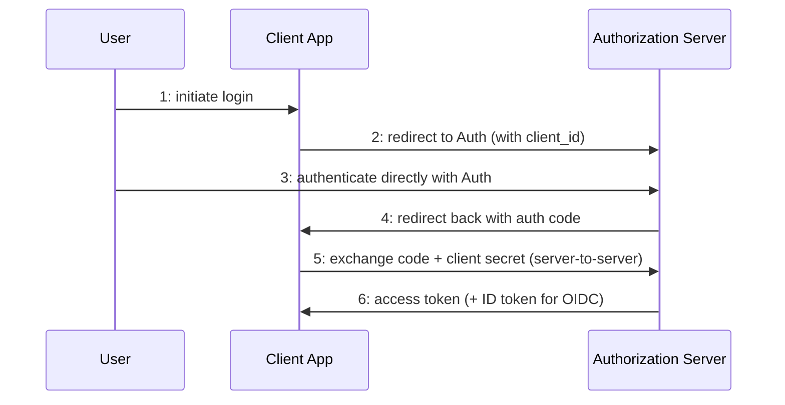
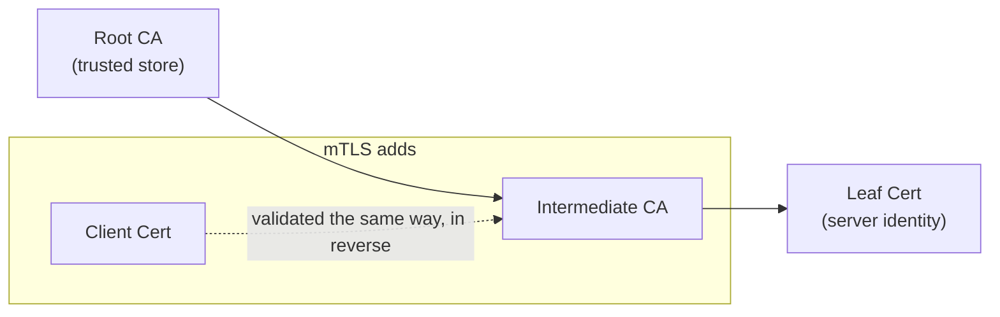
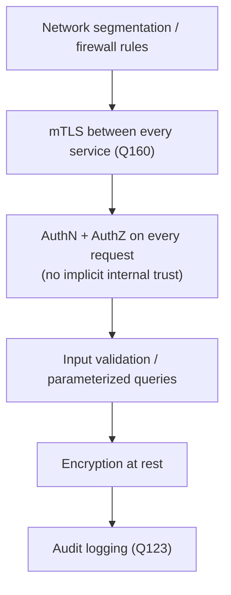
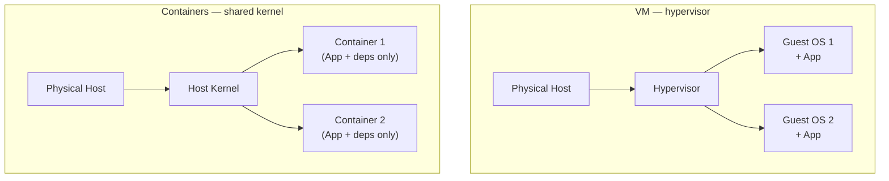
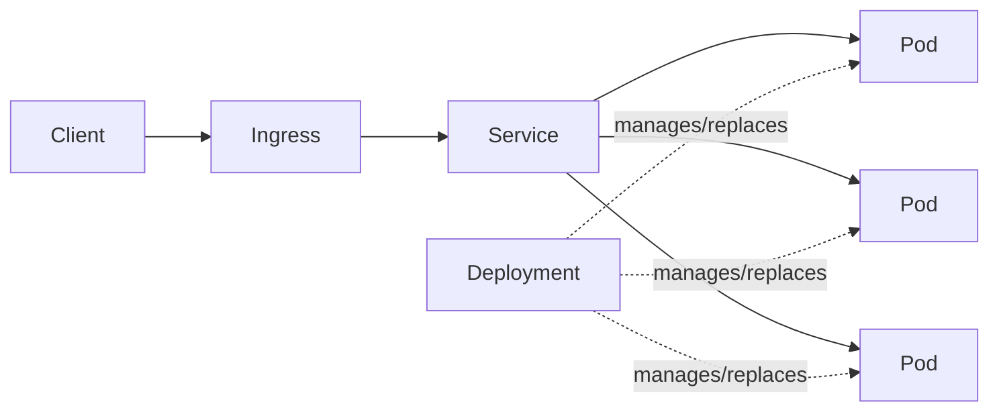
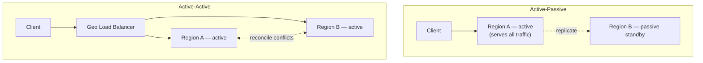
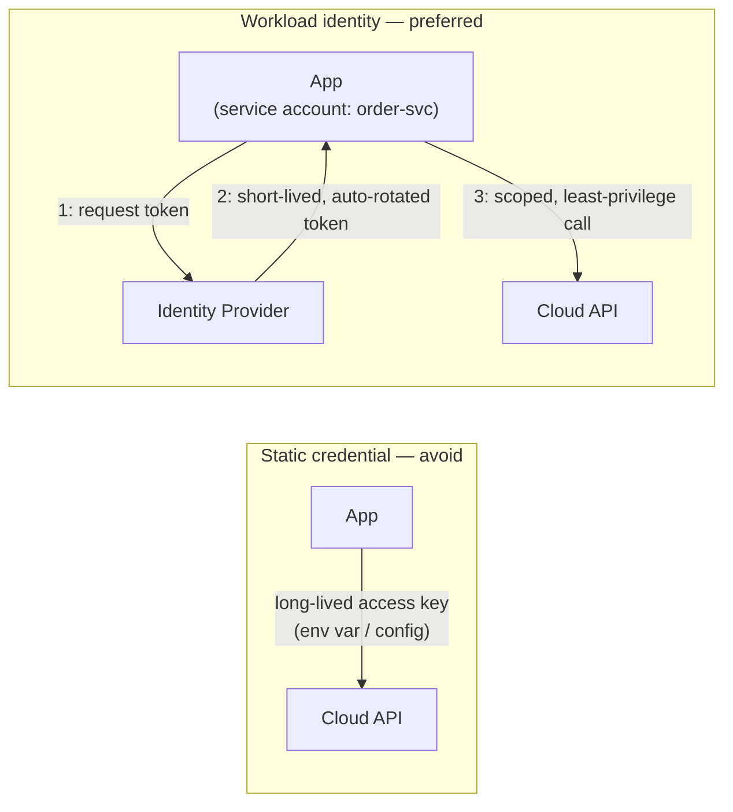
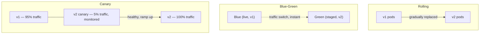

Part 4 of 4 · [Go Architect Interview Prep](/go-architect-interview-prep/) · ← Previous: [Part 3 — Kafka & Microservices](/go-interview-prep-kafka-microservices/)

## XV. Security

| # | Question | Answer |
|---|----------|--------|
| 163 | What's the difference between authentication and authorization, and RBAC vs ABAC? | Authentication (authN) verifies who you are; authorization (authZ) decides what you're allowed to do once verified. RBAC grants permissions based on a user's assigned role (admin, viewer) — simple, coarse-grained. ABAC evaluates policy against attributes of the user, resource, and context (department=finance AND resource.owner=user AND time<18:00) — more flexible and fine-grained, at the cost of policy complexity. |
| 164 | How should passwords be stored, and why is rolling your own hashing scheme a bad idea? | Never store plaintext or reversibly-encrypted passwords — hash with a slow, salted algorithm designed for it: bcrypt, scrypt, or argon2 (preferred). These are deliberately slow and tunable to keep pace with hardware, and a unique salt per password defeats precomputed rainbow-table attacks. A fast general-purpose hash like SHA-256 is the wrong tool — it's fast specifically so attackers can brute-force billions of guesses per second against a leaked hash dump. |
| 165 | How should a service manage secrets (DB passwords, API keys) in production? | Never commit them to source control or bake them into container images — pull them at runtime from a dedicated secrets manager (Vault, AWS Secrets Manager, GCP Secret Manager) that supports access-controlled retrieval, audit logging, and rotation. Environment variables are an acceptable delivery mechanism for the running process, but the source of truth should be the secrets manager, not a `.env` file checked in or copy-pasted between engineers. |
| 166 | Encryption at rest vs. in transit — what protects against what? | In transit (TLS) protects data moving across a network from being read or tampered with by anyone sitting on the path. At rest (disk/DB-level encryption, e.g. AES-256) protects data sitting on storage media from being read if the physical disk, backup, or snapshot is stolen or improperly accessed. They're independent controls — TLS alone doesn't protect a stolen database backup, and disk encryption alone doesn't protect a request sniffed off the wire. |
| 167 | What is SSRF, and what's a common CORS misconfiguration? | SSRF (Server-Side Request Forgery) happens when a service fetches a URL supplied by the caller and an attacker points it at an internal-only endpoint (a cloud metadata service, an internal admin API) the server can reach but the attacker can't directly — mitigate with an allowlist of permitted hosts/schemes and blocking requests to private IP ranges. A common CORS mistake is reflecting `Access-Control-Allow-Origin` back as whatever `Origin` header the request sent combined with `Access-Control-Allow-Credentials: true` — that lets any website make authenticated cross-origin requests on a logged-in user's behalf. |
| 168 | How do you protect against a compromised or malicious dependency in a Go module graph? | `go.sum` pins the exact cryptographic checksum of every dependency version, and the checksum database (`GOSUMDB`, `sum.golang.org` by default) verifies a module's checksum on first download against a public, tamper-evident log — so a dependency can't be silently swapped for a malicious version later. Beyond that: run a vulnerability scanner (`govulncheck`, or Snyk/Dependabot) in CI, pin versions rather than using loose ranges, and for a regulated environment, maintain an SBOM (Software Bill of Materials) so you can answer "are we affected" quickly when a CVE drops. |
| 169 | What is STRIDE, and when should an architect actually run a threat model? | STRIDE is a mnemonic for threat categories: Spoofing, Tampering, Repudiation, Information disclosure, Denial of service, Elevation of privilege — used to systematically walk a design (usually a data-flow diagram) and ask "how could this fail under each category" instead of relying on ad hoc worry. Run one whenever a new trust boundary is introduced — a new external-facing API, a new service handling sensitive data, a new integration with a third party — not for every minor internal change. |

#### 170 — Walk through the OAuth2 authorization code flow, and where the token actually ends up.
The user is redirected to the authorization server (e.g. Google) and logs in there, not on the client app — the client never sees the password. The authorization server redirects back to the client with a short-lived authorization code. The client's backend then exchanges that code (plus a client secret) directly with the authorization server for an access token — this token exchange happens server-to-server, so the token never transits through the browser's URL bar or history. OIDC layers an ID token (a JWT asserting identity) on top of OAuth2, which is fundamentally an authorization protocol, not an authentication one — that distinction is a common interview trip-up.



#### 171 — What's inside a JWT, and what are the common pitfalls?
A JWT is three base64url segments — header (algorithm), payload (claims: user id, expiry, roles), signature — concatenated with dots. Anyone can decode and read the payload; the signature only proves it wasn't tampered with, so never put secrets in the payload. Pitfalls: accepting `alg: none` or letting the client dictate the algorithm (an attacker crafts an unsigned token and a naive verifier trusts it — always hardcode the expected algorithm server-side); not checking `exp` at all; using long-lived access tokens instead of a short-lived access token plus a separate, revocable refresh token; and no revocation path at all, since a valid-but-compromised JWT can't be invalidated before it expires unless you maintain a denylist.

```go
token, err := jwt.Parse(tokenString, func(t *jwt.Token) (interface{}, error) {
    if _, ok := t.Method.(*jwt.SigningMethodHMAC); !ok {
        return nil, fmt.Errorf("unexpected signing method: %v", t.Header["alg"])
    }
    return hmacSecret, nil
})
```

#### 172 — How does a TLS certificate chain get validated, and what does mTLS add on top of one-way TLS?
A leaf certificate is signed by an intermediate CA, which is signed by a root CA that's pre-trusted (shipped in the OS/browser trust store) — the client walks that chain up to a trusted root to validate the server's identity, plus checks the hostname (or SNI) matches and the cert hasn't expired or been revoked. Standard TLS only authenticates the server to the client. mTLS adds the reverse: the client also presents a certificate, and the server validates it the same way, so both sides cryptographically prove identity — the standard approach for service-to-service auth inside a trusted network (see Q160, service-to-service mTLS). Certificate rotation matters because a long-lived cert is a long-lived risk if its private key leaks — short-lived certs issued automatically (e.g. via a service mesh's built-in CA) shrink that window.



#### 173 — What are the most common Go-specific security vulnerabilities, and how do you avoid them?
SQL injection: string-concatenating user input into a query — always use parameterized queries (`?`/`$1` placeholders) or a query builder like Bob, never `fmt.Sprintf` into SQL. Command injection: passing unsanitized input to `os/exec` with a shell (`sh -c`) — pass arguments as a slice to `exec.Command` directly instead of building a shell string, so there's no shell to inject into. Path traversal: joining user-supplied filenames onto a base directory without validation lets `../../etc/passwd` escape it — use `filepath.Clean` and verify the resolved path still has the expected base prefix. Insecure deserialization: `encoding/gob` or unpinned `interface{}` decoding of untrusted input can be abused to construct unexpected types — prefer a schema-constrained format (JSON into a concrete struct) for anything crossing a trust boundary.

```go
// vulnerable: string concatenation lets input break out of the query
query := fmt.Sprintf("SELECT * FROM users WHERE email = '%s'", email)
db.Query(query)

// safe: parameterized query — the driver escapes the value, never the query shape
db.Query("SELECT * FROM users WHERE email = $1", email)
```

#### 174 — What does "defense in depth" mean architecturally, and how does zero trust extend it?
Defense in depth means no single control is trusted to fully protect the system — network segmentation, authentication, authorization, input validation, and encryption each independently reduce risk, so one failure doesn't mean total compromise. The traditional model paired this with a hardened perimeter and an implicitly-trusted internal network. Zero trust removes that implicit trust: every request is authenticated and authorized regardless of whether it originates inside or outside the network perimeter, on the assumption that the perimeter will eventually be breached — which is why mTLS between internal services (Q160) and per-request authorization checks matter even for "internal-only" traffic.



---

## XVI. Cloud & Infrastructure

| # | Question | Answer |
|---|----------|--------|
| 175 | What's the practical difference between IaaS, PaaS, SaaS, and FaaS, and where does a typical Go service sit? | IaaS (EC2, Compute Engine) gives raw VMs — you manage the OS and everything above it. PaaS (Heroku, Cloud Run) abstracts the OS and deployment away — you hand it a container or artifact and it runs it. SaaS is a finished product you consume (Salesforce). FaaS (Lambda, Cloud Functions) runs a single function per invocation with no persistent process at all. A typical Go backend service usually sits on IaaS-via-orchestrator (a VM fleet running Kubernetes) or PaaS (Cloud Run/ECS Fargate) — full FaaS is a poor fit for a long-lived stateful service with persistent connections. |
| 176 | What are the 12-factor app principles, and why do they map cleanly onto Go services? | A set of practices for building portable, scalable cloud-native apps: config via environment variables (not files baked into the image), treat backing services (DB, cache, queue) as attached resources reachable by URL, stateless disposable processes that start/stop fast, logs treated as an event stream written to stdout rather than managed by the app. Go's static binaries and fast startup already fit most of this naturally — a compiled Go binary with env-based config is close to 12-factor by default. |
| 177 | HPA vs. VPA vs. cluster autoscaler — what does each one actually scale, and what breaks if you only configure one? | HPA (Horizontal Pod Autoscaler) adds/removes pod replicas based on a metric like CPU or a custom metric (queue depth). VPA (Vertical Pod Autoscaler) adjusts a pod's CPU/memory requests/limits over time. The cluster autoscaler adds/removes underlying nodes when pods can't be scheduled due to insufficient node capacity. Running HPA alone without a cluster autoscaler means new pod replicas can go Pending forever once existing nodes are full — HPA scaled the workload, but nothing scaled the cluster to fit it. |
| 178 | What does Infrastructure as Code actually buy you over provisioning resources by hand in a console? | Reproducibility — the exact same environment can be recreated (a new region, a disaster-recovery standby) from the same source instead of tribal knowledge of console clicks. Review — infrastructure changes go through the same plan/diff-then-apply, PR review, and version history as code, instead of an unaudited console click. Drift detection — running a plan against live infrastructure surfaces anything that changed out-of-band. The cost is a learning curve and a "clicking in the console to fix an incident right now" instinct that has to be resisted in favor of "fix it in code, then apply." |
| 179 | Managed (RDS/Cloud SQL-style) vs. self-hosted database in the cloud — what's the actual trade-off? | Managed: the provider handles patching, backups, failover, and often read replicas and point-in-time recovery, at the cost of less low-level tuning control, vendor-specific quirks, and a recurring premium over raw compute cost. Self-hosted on your own VMs: full control over configuration, extensions, and version, but your team now owns backup verification, patching, and failover — and failover in particular is easy to get wrong under pressure during an actual incident. For most teams below a certain scale, managed is the right default; self-hosting is a deliberate trade for control that should be justified, not a default. |
| 180 | When is serverless (Lambda/Cloud Functions style) a poor fit for a Go service? | Cold starts add latency to the first request after idle — a problem for latency-sensitive synchronous APIs, less so for async event processing. Execution time limits (typically minutes) rule out long-running jobs. No persistent in-memory state or connections between invocations means every invocation may re-establish DB connections unless you're careful with pooling patterns built for it. Serverless fits well for bursty, event-driven, short-lived work (an S3-upload trigger, a scheduled cleanup job) — a long-lived stateful API with steady traffic is usually cheaper and simpler as a normal deployed service. |
| 181 | What does a typical cloud observability stack look like, and why do traces matter more as the service count grows? | Metrics (Prometheus/CloudWatch-style, time-series aggregates like request rate and error rate) answer "is something wrong right now." Logs (structured, searchable) answer "what exactly happened." Traces (OpenTelemetry, spanning a request across every service it touched) answer "where in this chain of ten services did the slowdown actually happen" — a question metrics and logs alone can't answer once a request fans out across multiple services, since no single service's logs show the whole picture. |
| 182 | What's the difference between RTO and RPO, and how do they drive backup strategy? | RTO (Recovery Time Objective) is how long you can tolerate being down — drives how automated/fast your failover has to be. RPO (Recovery Point Objective) is how much data you can tolerate losing — drives how frequently you back up or replicate. A tight RPO (seconds) needs synchronous or near-real-time replication; a looser RPO (hours) tolerates nightly backups. An architect defines both explicitly per system before choosing a backup/replication strategy, since "back it up daily" is only correct if the business can actually tolerate losing up to a day of data. |

#### 183 — Why do containers start faster and pack denser than VMs?
A VM virtualizes hardware and runs a full guest OS kernel per instance — booting one means booting an entire operating system. A container shares the host's kernel and only packages the application plus its userspace dependencies, isolated via namespaces and cgroups rather than a hypervisor — so starting one is closer to starting a process than booting a machine, and many containers can share one host's kernel instead of each paying for a redundant OS. Image layering compounds the density win: a base image layer is cached and shared across every container built from it, so only the top application-specific layer needs to be pulled for a new deploy.



#### 184 — What are the core Kubernetes objects, and how does a request actually reach a pod?
A Pod is the smallest deployable unit — one or more tightly-coupled containers sharing network/storage. A Deployment manages a set of pod replicas, handling rolling updates and self-healing (replacing crashed pods). A Service gives that shifting set of pods a stable virtual IP/DNS name and load-balances across whichever pods are currently healthy, since pod IPs change every time a pod is replaced. An Ingress sits in front of Services and routes external HTTP(S) traffic based on host/path, typically terminating TLS. So a request flows: Ingress → Service (stable, load-balanced) → one of the Deployment's current Pods.



#### 185 — Active-active vs. active-passive multi-region — what's the trade-off, and why does data residency complicate it?
Active-passive: one region serves all traffic, a standby region stays warm (or cold) and takes over on failover — simpler, no cross-region write conflicts, but the standby capacity sits mostly idle and failover itself takes time and is a rarely-exercised code path (risky exactly when you need it most). Active-active: multiple regions serve traffic simultaneously — better latency (serve from the nearest region) and no idle capacity, but now needs a strategy for cross-region write conflicts (last-write-wins, CRDTs, or partitioning writes by region/tenant). Data residency requirements (a regulated fintech workload needing EU customer data to stay in the EU) add a hard constraint on top: which region is even allowed to hold which rows, independent of which architecture handles failover — this often forces a hybrid where write ownership is partitioned by region regardless of active-active vs. passive.



#### 186 — How should a service authenticate to other cloud resources, and why is workload identity preferred over static credentials?
A long-lived static credential (an access key baked into config or an env var) is a standing liability — if it leaks, it's valid until someone notices and manually rotates it, and rotation itself is often manual and risky. Workload identity (AWS IAM roles for service accounts, GCP Workload Identity) instead lets the cloud platform issue short-lived, automatically-rotated credentials to a workload based on its identity (which pod, which service account), with no long-lived secret to leak in the first place. Combined with least-privilege roles — granting only the specific actions on the specific resources a service actually needs, not a broad admin role for convenience — this is the cloud-native equivalent of the least-privilege principle from Q174.



#### 187 — Blue-green vs. canary vs. rolling deployment — how does each affect rollback speed and blast radius?
Rolling: old pods are replaced by new ones gradually, a few at a time — no extra infrastructure cost, but both versions run simultaneously for the whole rollout (see Q162, API versioning during a rolling deploy), and rolling back means rolling forward again through the same gradual replacement. Blue-green: a full second environment (green) is deployed alongside the live one (blue), verified, then traffic is switched all at once — rollback is just switching traffic back, close to instant, at the cost of running two full environments during the switch. Canary: a small percentage of traffic is routed to the new version first, monitored, then gradually increased — smallest blast radius if something's wrong, since only a fraction of users are affected before you catch it and roll back, but needs traffic-splitting infrastructure and takes longer to fully roll out.



---

## Notes

**[XV. Security](#xv-security):** worth over-preparing rather than under-preparing. 171 (JWT pitfalls) and 173 (Go-specific vulnerabilities) are the most likely to get a "show me the code" follow-up; have the vulnerable-vs-safe pattern in 173 ready to write on a whiteboard from memory.

**[XVI. Cloud & infrastructure](#xvi-cloud--infrastructure):** 184 (Kubernetes request path) and 185 (multi-region/data residency) are the highest-yield for a regulated-domain role; 187 (deploy strategies) ties directly back to 162 (API versioning during a rolling deploy), so rehearse them together.

---

Part 4 of 4 · [Go Architect Interview Prep](/go-architect-interview-prep/) · ← Previous: [Part 3 — Kafka & Microservices](/go-interview-prep-kafka-microservices/)

<script src="https://cdn.jsdelivr.net/npm/mermaid@11/dist/mermaid.min.js"></script>
<script>
document.querySelectorAll('pre code.language-mermaid').forEach(function (el) {
  var div = document.createElement('div');
  div.className = 'mermaid';
  div.textContent = el.textContent;
  el.parentElement.replaceWith(div);
});
mermaid.initialize({ startOnLoad: true, theme: 'neutral' });
</script>
