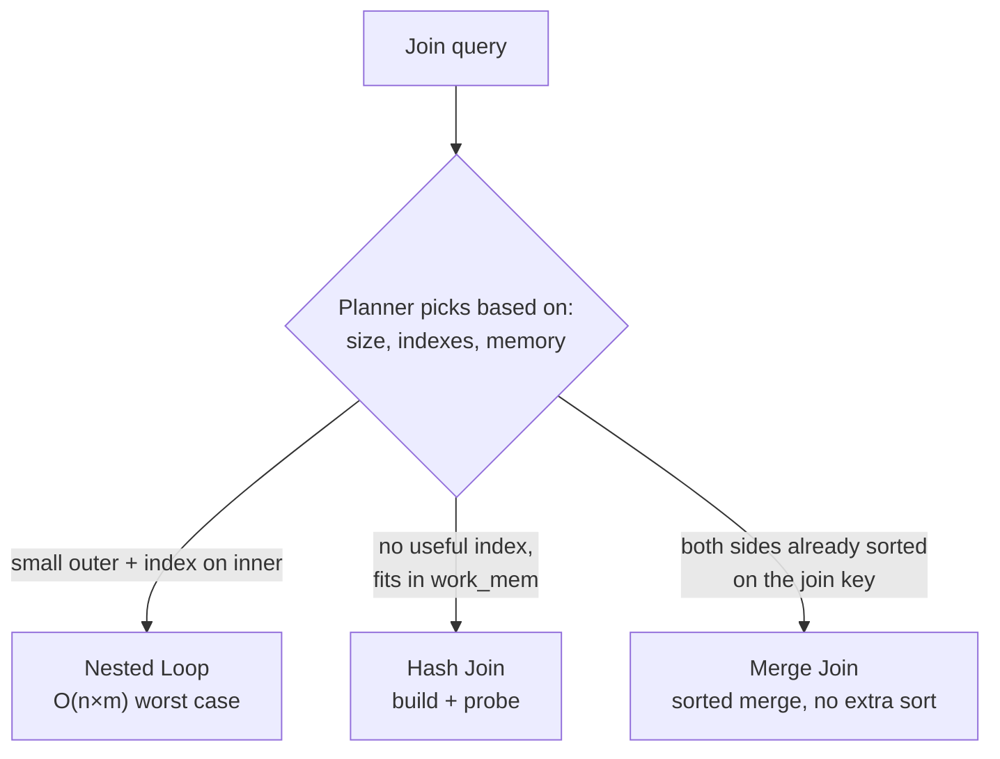
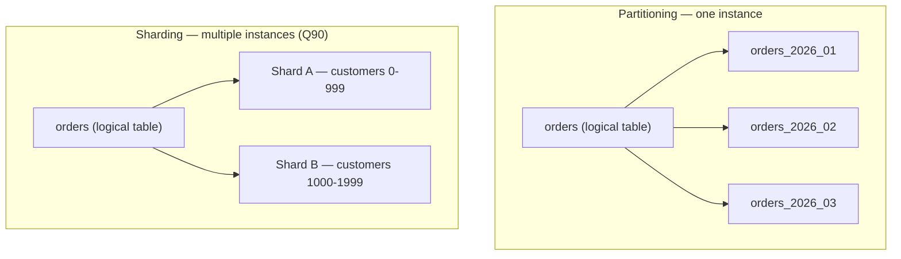
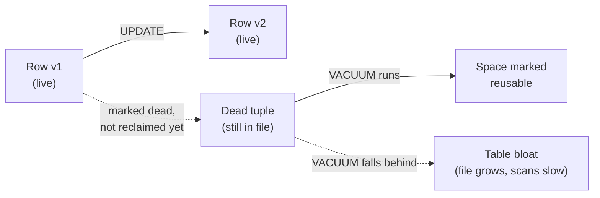

Part 5 of 6 · [Interview Prep](/interview-prep/) · ← Previous: [Part 4 — Security & Cloud](/interview-prep-security-cloud/) · Next: [Part 6 — Coding Patterns](/interview-prep-coding-patterns/) →

## XVII. Advanced Query Techniques

| # | Question | Answer |
|---|----------|--------|
| 188 | What's the difference between `UNION` and `UNION ALL`, and why does it matter for performance? | `UNION` deduplicates the combined result set, which means sorting or hashing every row to find duplicates; `UNION ALL` just concatenates the two result sets with no dedup pass. If the query already guarantees no overlap (two mutually exclusive `WHERE` branches), `UNION ALL` is strictly cheaper and should be the default — reach for `UNION` only when you actually need duplicates removed. |
| 189 | `EXISTS`, `IN`, or a `JOIN` for an existence check — does it matter which one you pick? | Modern query planners (Postgres included) usually rewrite all three into the same semi-join plan when the subquery is uncorrelated, so raw performance is often a wash. `EXISTS` short-circuits on the first match and handles `NULL`s in the subquery correctly, where `IN` against a subquery containing a `NULL` can silently produce zero rows for the whole query — a classic footgun. Prefer `EXISTS` for correlated existence checks and reserve `IN` for a short, known literal list. |
| 190 | What does `INSERT ... ON CONFLICT DO UPDATE` (upsert) buy you over a separate `SELECT` then `INSERT`/`UPDATE`? | A separate select-then-write is a race: two concurrent requests can both see "no row exists" and both attempt an insert, and one fails on the unique constraint (or worse, without one, you get a duplicate). `ON CONFLICT DO UPDATE` makes the whole check-then-act atomic at the database level. Pair it with `RETURNING` to get the final row back without a second query. |
| 191 | What's a `LATERAL` join, and when do you actually need one? | A normal join's right-hand side can't reference columns from the left-hand table; `LATERAL` lifts that restriction, letting a subquery on the right reuse a value from the current row on the left. The classic case is "top 3 orders per customer," where the subquery needs the current customer's id to filter and limit before the join happens — without `LATERAL` that needs a window function and an extra filtering layer instead of one readable join. |
| 192 | Full-text search with `tsvector`/`tsquery` vs. a `LIKE '%term%'` scan — what's the actual difference? | `LIKE '%term%'` with a leading wildcard can't use a standard B-tree index at all, so it's a sequential scan regardless of table size. `tsvector`/`tsquery` tokenizes and normalizes text (stemming, stop-word removal) into a document a GIN index can index directly, turning full-text search into an index lookup — and it ranks results by relevance, which `LIKE` has no concept of. |
| 193 | What does `pg_trgm` add on top of full-text search? | `tsvector` search is token-based — it won't match a typo or a substring that crosses a token boundary. `pg_trgm` indexes overlapping three-character sequences of a string, which makes fuzzy/similarity matching and substring `LIKE '%term%'` queries index-able through a GIN or GiST trigram index. Use full-text search for "find documents about this topic" and trigram for "find rows whose name is close to what the user typo'd." |
| 194 | Postgres changed how CTEs behave around version 12 — what changed, and why does it matter? | Before Postgres 12, every CTE was an optimization fence: the planner materialized it as a temporary result set and couldn't push filters from the outer query down into it, even when that would've been cheaper. From Postgres 12 on, a non-recursive CTE is inlined by default like a subquery unless it's referenced more than once or explicitly marked `MATERIALIZED`. That's why the same CTE-heavy query can be fast on one server and slow on another, depending purely on version. |

#### 195 — How do window functions differ from `GROUP BY`, and what does `ROW_NUMBER`/`RANK`/`LAG` give you that aggregation can't?
`GROUP BY` collapses a group of rows into one output row per group, so you lose access to individual rows outside the aggregate. A window function computes across a group (defined by `PARTITION BY`) without collapsing anything, so each input row still gets exactly one output row plus an extra computed column, e.g. the rank of a row within its partition. This makes "top N per group," running totals, and row-over-row comparisons possible without a self-join or a subquery per row.

```sql
SELECT
  customer_id,
  order_id,
  amount,
  RANK() OVER (PARTITION BY customer_id ORDER BY amount DESC) AS rank_in_customer,
  SUM(amount) OVER (PARTITION BY customer_id ORDER BY created_at) AS running_total
FROM orders;
```

`ROW_NUMBER` gives a strict 1,2,3... with no ties; `RANK` leaves gaps after a tie (1,1,3); `DENSE_RANK` doesn't. `LAG`/`LEAD` read a value from a preceding/following row in the same partition, which is what makes period-over-period comparisons a single query instead of a self-join.

#### 196 — When does a recursive CTE actually earn its complexity, and what's the failure mode if you get the recursion wrong?
Any hierarchy of unknown, variable depth — an org chart, a category tree, a bill-of-materials, a comment thread — needs a recursive CTE because a fixed number of joins can't express "however many levels deep this happens to go." The structure is always an anchor (base case) `UNION ALL`'d with a recursive term that joins back to the CTE's own name, terminating when the recursive term returns no rows.

```sql
WITH RECURSIVE org_chart AS (
  SELECT id, name, manager_id, 1 AS depth
  FROM employees
  WHERE manager_id IS NULL          -- anchor: the top of the org
  UNION ALL
  SELECT e.id, e.name, e.manager_id, oc.depth + 1
  FROM employees e
  JOIN org_chart oc ON e.manager_id = oc.id   -- recursive term
)
SELECT * FROM org_chart ORDER BY depth;
```

Get the recursive term wrong, most commonly a join condition that can revisit a row it already processed, and you get infinite recursion; Postgres will eventually blow past `work_mem` or hit a recursion limit and error out rather than hang forever, but it's still the first thing to check when a recursive CTE that used to be fast suddenly isn't: a cycle got introduced in the data.

#### 197 — When should a column be `JSONB` instead of a normalized set of tables, and how do you index it?
`JSONB` fits data that's genuinely schema-variable per row (a plugin's arbitrary settings object, a webhook payload you need to store but not query deeply) or where the write pattern is "store the whole document, read the whole document" and normalizing would just mean reassembling it on every read. It's the wrong choice once you're regularly filtering or joining on a handful of specific keys — at that point those keys are relational data wearing a JSON costume, and a normalized column with a real type and index is both faster and gets you constraints for free. A GIN index on a `JSONB` column supports the containment operator (`@>`) efficiently, but a single key queried constantly is often better served by extracting it into a real generated column with a plain B-tree index.

```sql
CREATE INDEX idx_metadata_gin ON accounts USING GIN (metadata);
SELECT * FROM accounts WHERE metadata @> '{"plan": "enterprise"}';
```

---

## XVIII. Query Planning, Storage & Concurrency Internals

| # | Question | Answer |
|---|----------|--------|
| 198 | Partial index vs. indexing the whole column — when does a partial index win? | A partial index (`CREATE INDEX ... WHERE condition`) only indexes the subset of rows matching the predicate, so it's smaller, faster to scan, and cheaper to maintain than a full-column index when queries consistently filter on that same condition — e.g. indexing only `WHERE status = 'pending'` on a table where 95% of rows are `'completed'`. It's a poor fit when queries filter on a wide variety of conditions, since a partial index only helps the specific predicate it was built with. |
| 199 | What's an advisory lock, and when do you reach for one instead of a row or table lock? | Row and table locks are tied to actual data and are taken/released automatically by the transaction touching that data. An advisory lock (`pg_advisory_lock`) is an arbitrary application-level lock keyed by a number you choose, with no connection to any row — used to coordinate application logic that isn't really a data lock, e.g. ensuring only one instance of a scheduled job runs at a time across a fleet. It's a cheap way to get distributed mutual exclusion out of a database you already have. |
| 200 | When do stored procedures or triggers earn their complexity, versus just hiding logic from the app layer? | They earn it when the logic must be true regardless of which client touches the data — an invariant enforced at the data layer that no application bug can bypass, e.g. maintaining an audit trail, or a constraint too complex for a `CHECK`. They become a liability when they encode business logic that changes often, since that logic is now split across the app codebase and the database, invisible to code review and hard to unit test. Default to keeping logic in the application; push it into the database only for invariants that must hold no matter what touches the table. |
| 201 | PgBouncer's transaction pooling mode vs. session mode — what actually breaks in transaction mode? | Session mode assigns one real database connection to a client connection for its entire session, so anything session-scoped (prepared statements, session-level `SET`, `LISTEN`/`NOTIFY`) works exactly like talking to Postgres directly. Transaction mode returns the real connection to the pool as soon as a transaction commits, letting far fewer real connections serve far more clients, but a prepared statement or session variable set on one transaction can silently vanish or land on a different underlying connection on the next. Transaction mode is the right default for a stateless web app's pool; session state needs a dedicated session-mode connection. |
| 202 | `VACUUM`, `VACUUM FULL`, and autovacuum — what does each actually do? | Plain `VACUUM` (which autovacuum runs automatically) reclaims dead tuple space for reuse by future writes and updates statistics, without an exclusive lock or shrinking the file on disk. `VACUUM FULL` rewrites the entire table into a new, compact file with no dead space, which does shrink it on disk but takes an exclusive lock for the duration — a rare, deliberate maintenance operation, not something to run routinely. Autovacuum is tuned (thresholds, worker count, cost delay), not disabled, since disabling it is what leads to the bloat it exists to prevent. |
| 203 | Why can a query slow down over time even though the query, schema, and data volume haven't meaningfully changed? | Stale planner statistics: the query planner picks a plan based on row-count and distribution estimates from the last `ANALYZE`, and if autovacuum's analyze threshold hasn't fired recently on a table with a changing data distribution, the planner works from an outdated picture and can pick a sequential scan or the wrong join order. Running `ANALYZE` manually, or checking `pg_stat_user_tables` for `last_analyze`, is a cheap first diagnostic before assuming a missing index is the problem — it slots into the slow-query checklist (Q85) as the "did anything actually change" step. |

#### 204 — Nested loop, hash join, and merge join — what does the planner actually choose between, and why?
A nested loop scans the outer table and, for every row, probes the inner table — cheap when the outer side is small or the inner side has a usable index, expensive as both sides grow since it's O(n×m) in the worst case. A hash join builds an in-memory hash table from the smaller side, then streams the larger side through it, good when there's no useful index but the smaller side fits comfortably in `work_mem`. A merge join sorts both sides by the join key (or uses an already-sorted index) and walks them in lockstep, which wins when both inputs are already sorted, since the expensive sort is avoided entirely.



`EXPLAIN ANALYZE` (Q79) shows which one actually ran; if a hash join spills to disk because the build side didn't fit in `work_mem`, that shows up as a much slower actual time than the estimate — a signal to raise `work_mem` for that query rather than assume the join type itself is wrong.

#### 205 — Table partitioning vs. sharding — where's the line, and why would you reach for one over the other?
Partitioning splits one logical table into physical sub-tables (by range, list, or hash on a key) that all still live on the same database instance, transparent to most queries — a query filtering on the partition key only scans the relevant partition, plus cheap bulk drops (drop a whole month's partition instead of a slow `DELETE`). Sharding (Q90) splits data across separate database instances entirely, which solves a write-throughput or storage-capacity ceiling a single machine can't hold, at the cost of cross-shard queries and joins becoming genuinely hard.



Reach for partitioning first — it's a single-instance, low-complexity win for a large, time-ordered or naturally-bucketed table. Reach for sharding only once a single instance genuinely can't hold the write load or data volume, since it multiplies operational complexity.

#### 206 — Materialized view vs. a regular view — what do you give up, and how do you keep a materialized view from serving stale data?
A regular view is just a stored query, re-executed in full against live data every time it's selected from — always current, but paying the full query cost on every read. A materialized view runs the query once and stores the result set physically, so reads are as cheap as reading a table, at the cost of the data being a snapshot from whenever it was last refreshed. `REFRESH MATERIALIZED VIEW` locks the view against reads for the duration; `REFRESH MATERIALIZED VIEW CONCURRENTLY` avoids that lock by building the new result set alongside the old one and swapping, at the cost of needing a unique index on the view and taking somewhat longer overall. The right fit is an expensive aggregate read far more often than the underlying data changes — a dashboard rollup refreshed every few minutes, not something needing per-write freshness.

#### 207 — What is MVCC, and why does it cause table bloat if autovacuum falls behind?
Postgres never overwrites a row in place on `UPDATE` or `DELETE`; instead it writes a new row version and marks the old one dead, which is what lets concurrent readers keep seeing a consistent snapshot without blocking on writers (multi-version concurrency control). Those dead row versions aren't reclaimed immediately — they sit in the table file until vacuumed — so a table with high update/delete churn and autovacuum falling behind (a long-running transaction holding back the oldest visible snapshot, or thresholds tuned too conservatively) accumulates dead tuples the table file never shrinks to remove. That's table bloat: the file on disk grows well past the size of the live data, sequential scans slow down scanning dead rows too, and indexes bloat right along with the table.



A long-running transaction is the classic silent cause: it holds back the oldest snapshot autovacuum has to respect, so even a healthy autovacuum schedule can't reclaim tuples newer than that snapshot until the long transaction finally commits or aborts.

---

## Notes

**[XVII. Advanced query techniques](#xvii-advanced-query-techniques):** 195 (window functions) and 196 (recursive CTEs) are the two most likely to get a "write this query" follow-up — have the `PARTITION BY`/`OVER` syntax and the anchor-plus-recursive-term shape ready to write from memory, not just recite.

**[XVIII. Query planning, storage & concurrency internals](#xviii-query-planning-storage--concurrency-internals):** 204 (join algorithms) and 207 (MVCC/bloat) are the highest-yield for a senior/architect round, since they test whether you understand what the database is doing under an `EXPLAIN ANALYZE` plan rather than just how to read one (Q79). 205 (partitioning vs. sharding) is worth rehearsing next to Q90, interviewers often ask both back to back to see if you conflate them.

---

Part 5 of 6 · [Interview Prep](/interview-prep/) · ← Previous: [Part 4 — Security & Cloud](/interview-prep-security-cloud/) · Next: [Part 6 — Coding Patterns](/interview-prep-coding-patterns/) →

<script src="https://cdn.jsdelivr.net/npm/mermaid@11/dist/mermaid.min.js"></script>
<script>
document.querySelectorAll('pre code.language-mermaid').forEach(function (el) {
  var div = document.createElement('div');
  div.className = 'mermaid';
  div.textContent = el.textContent;
  el.parentElement.replaceWith(div);
});
mermaid.initialize({ startOnLoad: true, theme: 'neutral' });
</script>
