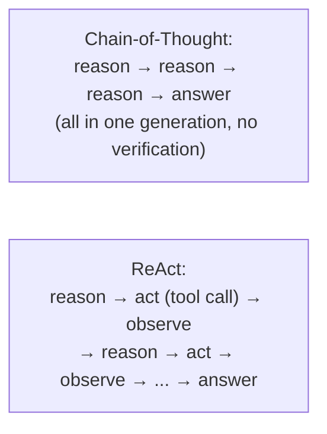
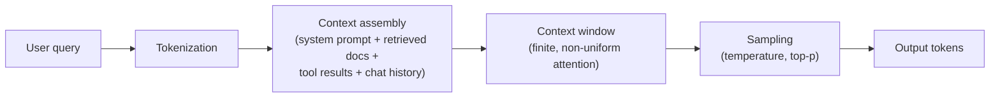
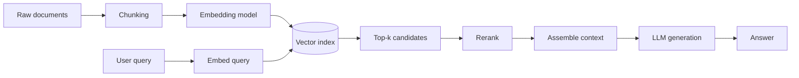
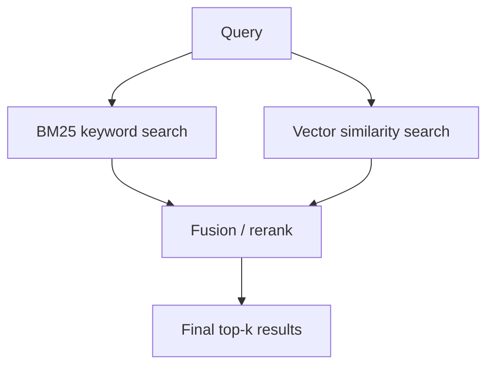
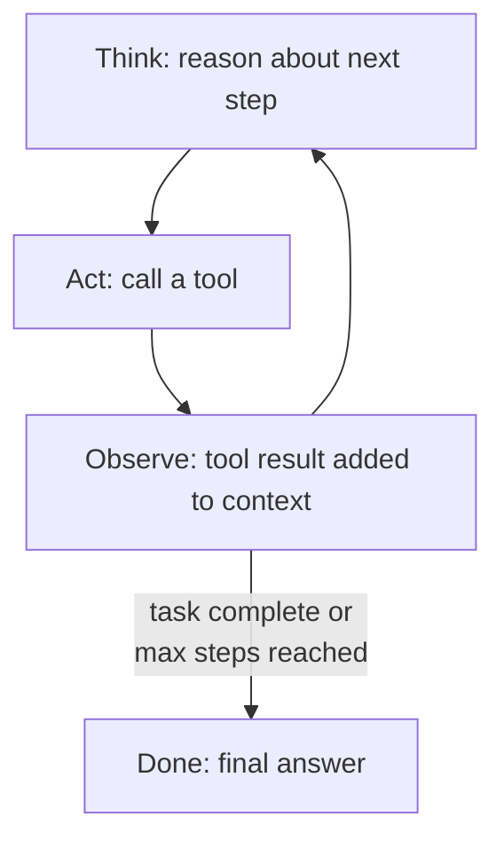
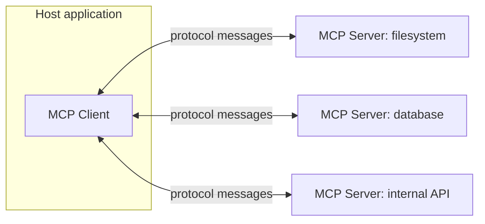
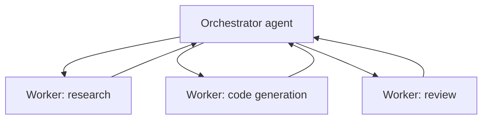

Part 7 of 7 · [Interview Prep](/interview-prep/) · ← Previous: [Part 6 — Security & Cloud](/interview-prep-security-cloud/)

## LLM Fundamentals, Prompting & Context Engineering

| # | Question | Answer |
|---|----------|--------|
| 1 | What is a token, and why does token count, not word count, drive LLM cost and latency? | A token is a chunk of text, often a sub-word piece rather than a whole word (`"tokenization"` might split into `token` + `ization`), produced by an algorithm like byte-pair encoding (BPE). Every API charges per token and every model has a fixed context-window budget in tokens, so a prompt padded with boilerplate or a verbose system message has a real dollar and latency cost before the model generates a single word back. English averages roughly 4 characters per token, but code, non-English text, and rare words tokenize less efficiently, which is why the same character count can cost noticeably different amounts depending on content. |
| 2 | What do temperature and top-p actually control, and when would you set temperature to 0? | Both reshape the probability distribution the model samples its next token from. Temperature scales the distribution before sampling: near 0 collapses it toward always picking the single most likely token (deterministic, repetitive), while higher values flatten it toward more varied, sometimes less coherent output. Top-p (nucleus sampling) instead keeps only the smallest set of top tokens whose cumulative probability exceeds `p`, cutting the low-probability tail regardless of how flat the distribution is. Set temperature to 0 for anything requiring reproducibility or strict correctness, data extraction, code generation, classification, and raise it for open-ended brainstorming or creative writing where variety is the point. |
| 3 | Zero-shot vs. few-shot prompting: what's the tradeoff of adding examples to a prompt? | Zero-shot asks the model to perform a task from an instruction alone; few-shot adds a handful of worked examples directly in the prompt so the model can pattern-match the expected format and reasoning style. Few-shot reliably improves accuracy and output-format consistency on tasks with a specific, non-obvious shape, at the direct cost of more tokens (cost and latency) per request and the ongoing maintenance burden of keeping example sets current as the task evolves. The rule of thumb: reach for few-shot when zero-shot output is inconsistent in format or quality, not by default. |
| 4 | What is structured output / JSON mode, and why is it better than asking the model to "return JSON" and parsing the response? | Structured output constrains the model's decoding process itself, via constrained/grammar-based decoding or a schema passed to the API, so every generated token is guaranteed to keep the output valid against a JSON schema (or similar). Asking nicely for JSON in a plain prompt just biases the model toward JSON-shaped text; it can still emit a trailing sentence, malformed syntax, or a field with the wrong type, all of which show up as parse failures in production at a rate that scales with traffic. Structured output turns that failure mode from "runtime parsing bug" into "compile-time schema," which is exactly the same reason a typed API beats stringly-typed JSON in application code. |
| 5 | Open-weight vs. closed/API-only models — what's the real tradeoff for a production system? | Closed models (accessed via API) usually lead on raw capability and require zero infrastructure, at the cost of per-token pricing that scales with usage, data leaving your infrastructure, and being fully dependent on a third party's uptime, rate limits, and pricing changes. Open-weight models (self-hosted or via a neutral inference provider) trade that convenience for control: data stays in your infrastructure, cost becomes fixed compute instead of per-token, and you can fine-tune freely, at the cost of owning GPU capacity planning, scaling, and model-serving infrastructure yourself. Most production systems land on a hybrid: closed models for the hardest reasoning tasks, open/smaller models for high-volume, latency-sensitive, or privacy-constrained ones. |
| 6 | What is the "lost in the middle" problem, and why doesn't a bigger context window fully solve it? | Retrieval accuracy from within a long context isn't uniform: models are measurably better at using information placed at the very start or very end of the context than information buried in the middle, even when nothing else in the prompt changes. A bigger context window raises the ceiling on how much you can stuff in, but it doesn't fix this positional bias, a fact buried in the middle of a 100k-token context can still get effectively ignored. The practical mitigation is putting the most important information (the actual question, the most relevant retrieved chunk) at the edges of the prompt, not assuming "it's in the context" is the same as "the model will use it." |

#### 7 — Why did transformers replace RNNs for language modeling, and what does "attention" actually buy you?
RNNs process a sequence one token at a time, carrying forward a fixed-size hidden state, which makes them inherently sequential (you can't compute step 10 before step 9) and prone to losing information from early in a long sequence by the time they reach the end. The transformer's attention mechanism lets every token look directly at every other token in the sequence in a single step, computing a weighted combination based on relevance rather than distance, which removes the sequential bottleneck (so training parallelizes across the whole sequence on a GPU) and removes the long-range information decay that plagued RNNs. The tradeoff is that a naive attention computation is O(n²) in sequence length, every token attends to every other token, which is exactly why long-context support, efficient attention variants, and context-window limits are still live engineering problems today.

#### 8 — What's the difference between chain-of-thought prompting and a ReAct-style agent loop?
Chain-of-thought (CoT) asks the model to "think step by step" and write out its reasoning before the final answer, all in a single generation with no ability to check anything against the real world mid-thought. ReAct (Reason + Act) interleaves that reasoning with actual tool calls: the model reasons about what it needs, calls a tool (a search, a database query, a calculator), observes the real result, and reasons again from that observation before deciding the next step or the final answer.

CoT improves reasoning quality on problems the model can solve from what it already knows; ReAct is what turns a language model into something that can actually check a fact, look something up, or take an action instead of guessing.

#### 9 — What is prompt injection, and how is a system prompt not actually a security boundary?
Prompt injection is an attacker crafting input, whether typed directly by a user or hidden in content the model reads (a webpage, a document, a tool's output), that gets the model to ignore its original instructions and follow the attacker's instead. The core problem: a system prompt is just text at the front of the same context window as everything else, the model has no cryptographic or architectural guarantee that instructions from the system prompt outrank instructions that show up later in a retrieved document or a user message. Mitigations are defense-in-depth, not a single fix: least-privilege tool access (an agent that can't send emails can't be tricked into spamming), output validation, and treating anything the model reads from an untrusted source the same way you'd treat unsanitized user input in a web app.

#### 10 — What is context engineering, and how is it different from prompt engineering?
Prompt engineering is about how you phrase the instruction text itself. Context engineering is the broader discipline of deciding *what* goes into the context window at all: which retrieved documents, which tool outputs, which prior turns of conversation history, which examples, in what order and how compressed, given that context windows and attention quality are both finite and non-uniform (Q6). A well-engineered prompt with the wrong documents retrieved, or too much irrelevant history left in, still fails, which is why production LLM systems spend more engineering effort on curating and compressing context than on wordsmithing the instructions.

Every stage in that path is a place cost, latency, or quality can be lost, which is why "just make the context window bigger" is rarely the fix it sounds like.

---

## RAG, Embeddings & Retrieval Systems

| # | Question | Answer |
|---|----------|--------|
| 11 | What is an embedding, and what does cosine similarity between two embeddings actually measure? | An embedding is a dense vector of a few hundred to a few thousand floating-point numbers produced by a model trained so that semantically similar inputs end up close together in that vector space, regardless of exact word overlap. Cosine similarity measures the angle between two vectors, not their magnitude, so it captures "these mean similar things" independent of how long or emphatic the original text was. It's the standard similarity metric for semantic search precisely because two paraphrased sentences with almost no shared words can still land at a small angle apart. |
| 12 | What's an ANN index (HNSW/IVF), and why can't you just brute-force compare against every vector at scale? | Brute-force nearest-neighbor search compares a query vector against every stored vector, exact but O(n), fine for thousands of vectors and unusable for tens of millions. Approximate Nearest Neighbor (ANN) indexes trade a small, tunable accuracy loss for massive speedups: HNSW builds a multi-layer navigable graph so search jumps toward the right neighborhood in roughly logarithmic steps, while IVF partitions the space into clusters and only searches the clusters closest to the query. Almost every production vector database is really "a datastore plus one of these ANN algorithms," and the accuracy/speed knob they expose is exactly this approximation tradeoff. |
| 13 | pgvector vs. a dedicated vector database (Pinecone, Weaviate, etc.), when is "just use Postgres" the right call? | `pgvector` adds a vector column type and ANN indexing directly to Postgres, which means embeddings live in the same database, same transactions, same backups, and same joins as the rest of your relational data, no second datastore to keep in sync or pay for separately. A dedicated vector database earns its cost at a scale or feature set Postgres doesn't match yet, tens to hundreds of millions of vectors with sub-50ms latency requirements, or built-in multi-tenant namespacing and hybrid-search features out of the box. For most applications under that scale, especially ones that already need to join retrieved chunks against relational metadata (permissions, timestamps, ownership), `pgvector` is the simpler, cheaper default; reach for a dedicated store once you've actually measured a limit it hits. |
| 14 | Fixed-size vs. recursive vs. semantic chunking, what's the tradeoff, and why does chunk overlap matter? | Fixed-size chunking (every N tokens) is simplest and fastest but happily slices a sentence or a table row in half. Recursive chunking splits on a hierarchy of separators (paragraph, then sentence, then word) to prefer breaking at natural boundaries while still respecting a size limit. Semantic chunking goes further, using embedding similarity between adjacent sentences to find actual topic-boundary breaks, most expensive to compute, most likely to keep a coherent idea in one chunk. Overlap between consecutive chunks (typically 10-20%) exists because a fact stated right at a chunk boundary can otherwise be split so that neither chunk alone contains the full context needed to answer a question about it. |
| 15 | What is reranking, and why run a cheap retrieval pass followed by an expensive cross-encoder pass instead of just retrieving more upfront? | Initial retrieval (vector or hybrid search) is fast because it compares independently-computed embeddings, but that independence is also its weakness, it can't model fine-grained interaction between the query and each candidate. A reranker, typically a cross-encoder, takes the query and each candidate document *together* as joint input and scores relevance far more accurately, but it's too slow to run against the whole corpus. The standard pattern is retrieve cheaply and broadly (top 50-100 candidates), then rerank expensively and precisely down to the top 3-5 that actually go into the prompt, getting both the speed of vector search and the accuracy of a much heavier model. |
| 16 | What is HyDE (Hypothetical Document Embeddings), and what retrieval problem does it solve? | A user's actual query is often short, informally phrased, and structurally nothing like the documents you're searching over, so embedding the raw query and comparing it to document embeddings can retrieve poorly even when a good answer exists in the corpus. HyDE has the LLM first generate a hypothetical answer to the query (which it may get factually wrong, that's fine), embeds *that* instead of the raw query, and searches with it, since a fabricated answer is structurally much closer to a real document than a short question is. It trades one extra LLM call for meaningfully better retrieval on queries where the query-document phrasing gap is the actual bottleneck. |
| 17 | GraphRAG — when does a knowledge graph beat pure vector similarity for retrieval? | Vector similarity retrieves chunks that are semantically close to a query, but it's structurally blind to multi-hop relationships, "who reports to the person who approved this project" isn't a similarity question, it's a graph traversal. GraphRAG extracts entities and relationships from source documents into a knowledge graph ahead of time, then answers a query by traversing that graph (directly, or using it to identify which document chunks to retrieve), which handles relationship- and aggregation-style questions that plain top-k similarity search systematically misses. The cost is real: building and maintaining an accurate knowledge graph from unstructured text is its own hard extraction problem, so it's worth reaching for once you've concretely hit multi-hop questions vector search fails on, not as a default starting architecture. |

#### 18 — RAG vs. fine-tuning vs. long-context stuffing, how do you actually decide?
These solve different problems and the confusion between them is one of the most common interview trip-ups. RAG teaches a model *what* to know right now, current, retrievable facts, without retraining, and it's the right default when the underlying knowledge changes often or must be traceable to a source. Fine-tuning teaches a model *how* to behave, a tone, a response format, a domain-specific reasoning style, it doesn't reliably inject new factual knowledge and is the wrong tool for "keep this up to date." Long-context stuffing (just pasting everything into the prompt) works for genuinely small, static knowledge bases where retrieval infrastructure isn't worth building yet, but it doesn't scale in cost or in retrieval quality (Q6) as the corpus grows. In practice, production systems often combine two of the three: RAG for facts, fine-tuning for format and behavior.

#### 19 — Walk through a full RAG pipeline end to end, from raw documents to a generated answer.
Ingestion pulls in source documents (PDFs, wikis, tickets) and normalizes them to text. Chunking splits that text into retrievable units (Q14). Embedding runs each chunk through an embedding model to produce a vector, stored alongside the chunk's text and metadata in an index (Q12). At query time, the user's question is embedded the same way, the index returns the nearest candidate chunks, an optional reranker (Q15) narrows those down, and the final set is assembled into the model's context (Q10) alongside the original question for generation.

Every arrow in that diagram is a place quality can leak: bad chunking loses context, a mismatched embedding model retrieves the wrong neighborhood, no reranking lets noisy candidates through, and a poorly assembled final context buries the right answer in the middle (Q6) even after retrieval got it right.

#### 20 — What is hybrid search, and why do BM25 and vector search fail in different, complementary ways?
BM25 (classic keyword/term-frequency search) is excellent at exact matches, product codes, acronyms, rare proper nouns, but blind to paraphrasing: it won't connect "car" and "automobile" without the literal term appearing. Vector search is excellent at semantic similarity, it connects paraphrases and related concepts, but can miss a query that hinges on one exact, rare token, since that token's presence barely moves a dense embedding. Hybrid search runs both in parallel and fuses the ranked results (commonly via reciprocal rank fusion), so a query benefits from exact-match precision and semantic recall at the same time instead of betting everything on one retrieval strategy.

#### 21 — What are RAG's most common failure modes in production, and how do you actually catch them?
Retrieval mismatch (the right chunk exists but isn't retrieved, usually a chunking or embedding-model problem) and a stale index (the source data changed but re-indexing hasn't caught up) are the two most common, plus the "confidently wrong" case where retrieval returns chunks that are topically similar but don't actually answer the question, and the model generates a fluent, plausible, incorrect answer anyway. None of these are visible from output quality alone without instrumentation: logging which chunks were retrieved per query, tracking retrieval-to-generation latency and index freshness, and periodically running a labeled eval set (Q22) through the pipeline are what actually surface these failures before users do, rather than waiting for a support ticket about a wrong answer.

#### 22 — How do you evaluate a RAG system, and why are retrieval quality and generation quality graded separately?
A RAG answer can be wrong for two structurally different reasons: retrieval found the wrong chunks (a retrieval problem, measured by precision/recall against a labeled set of "which chunks should this query return") or retrieval found the right chunks but the model still generated something ungrounded, unfaithful, or that contradicts them (a generation problem, measured by faithfulness/groundedness, does every claim in the answer trace back to a retrieved chunk). Grading them together with a single "was the final answer good" metric can't tell you which half of the pipeline to fix when it fails; a low overall score with high retrieval precision points squarely at the generation step, and vice versa, which is the entire reason production RAG evals report the two separately instead of collapsing them into one number.

---

## Agents, Tool Use, Evaluation & Production AI Systems

| # | Question | Answer |
|---|----------|--------|
| 23 | What actually makes something an "agent" instead of just an LLM call with a system prompt? | A single LLM call, however well-prompted, produces one response and stops. An agent adds a loop: the model can decide to call a tool, observe the real result, and decide again what to do next, continuing until it determines the task is done or it hits a stopping condition (Q31). The defining properties are autonomy over what steps to take (not a fixed, hardcoded sequence), tool use to affect or observe the world beyond its own text generation, and some form of state or memory carried across steps, a chatbot that only ever answers from its training data plus the current message is not an agent by this definition, no matter how good the prompt is. |
| 24 | How does function/tool calling work mechanically, what does the model actually emit, and who executes the tool? | The caller sends the model a list of available tools (name, description, and a JSON schema for its arguments) alongside the normal prompt. Instead of (or in addition to) a plain text reply, the model can emit a structured request naming a tool and the arguments to call it with, still just token generation constrained to that schema (Q4), the model itself never executes anything. The calling application is responsible for actually running that function, then feeding the result back into the conversation as a new message so the model can continue reasoning with the real output in hand. The model doesn't "call" the tool in any literal sense; it emits a request, and trusts the surrounding system to fulfill it. |
| 25 | What is MCP (Model Context Protocol), and what problem does it solve that bespoke function-calling integrations don't? | Before MCP, connecting a model to N different tools or data sources meant writing N different custom integrations, each with its own way of describing available functions and shuttling results back and forth, and every new client application had to reimplement that glue again. MCP standardizes this with a client-server protocol: an MCP server exposes a set of tools, resources, and prompts in a common schema, and any MCP-compatible client (an IDE, an agent framework, a chat app) can connect to it and use those capabilities without custom integration code per pair. It's the same shape of problem LSP solved for editor-language integrations, replacing an M×N integration matrix with M clients and N servers that all speak one protocol. |
| 26 | What is LLM-as-judge, and what's its biggest failure mode as an evaluation method? | LLM-as-judge uses a (usually stronger) LLM to score or compare outputs against a rubric, "is this response faithful to the source," "which of these two answers is more helpful", which scales far better than human review for large or continuously-running eval suites. Its biggest failure mode is systematic bias, not random noise: judge models measurably favor longer responses, favor responses formatted like their own writing style, and can be inconsistent on borderline cases in ways that don't average out. Treat an LLM judge the way you'd treat any other unverified measurement instrument: validate it against a smaller human-labeled sample before trusting its scores as ground truth, and re-validate when you change the judge model. |
| 27 | What's the difference between full fine-tuning and LoRA/PEFT, and why would you pick the cheaper option even with the budget for the expensive one? | Full fine-tuning updates every parameter in the model, requiring enough GPU memory to hold gradients and optimizer state for the entire parameter count, expensive, slow, and it produces a whole new full-size model copy per fine-tuned variant. LoRA (Low-Rank Adaptation), a form of PEFT (Parameter-Efficient Fine-Tuning), freezes the original weights and trains a much smaller set of low-rank update matrices injected into the model, reaching comparable task performance on most practical tasks at a small fraction of the memory and storage cost, and multiple LoRA adapters can share one base model in memory. Even with unlimited budget, LoRA's faster iteration cycle (train, evaluate, discard, retry in hours instead of days) usually wins out unless you're doing large-scale continued pretraining or teaching the model something LoRA's limited capacity genuinely can't capture. |
| 28 | What does "model cascading" or "model routing" mean, and why not send every request to your biggest model? | The biggest, most capable model is also the slowest and most expensive per request, and a large share of real traffic doesn't need that capability, a simple classification or extraction task doesn't need the same model as a complex multi-step reasoning task. Cascading routes each request to a small, cheap model first, and only escalates to a larger model when the small model's confidence is low or a validation check fails; routing instead classifies the request upfront (by complexity, by task type) and sends it directly to whichever model tier fits. Done well, this cuts average cost and latency substantially while reserving the expensive model for the requests that actually need it, the same instinct as caching or a fast-path/slow-path split in any other backend system. |
| 29 | What's different about prompt injection via retrieved documents or tool output, versus injection via direct user input? | Direct injection comes from something a user typed, which at least puts it in a place your application controls and can filter or scope. Indirect injection hides malicious instructions inside content the model reads as part of its normal operation, a webpage a browsing agent visits, a document retrieved by RAG, an email a summarization agent processes, content the end user never typed and often never even sees. This is more dangerous specifically because the attack surface is anything the model ever reads, not just the input box, and it defeats defenses that only sanitize the literal user-submitted text while trusting everything the model retrieves or fetches on its own. |
| 30 | What does it mean to sandbox an agent's tools, and why is "the model decided to do X" not an acceptable safety boundary on its own? | Sandboxing means constraining what a tool call can actually do at the system level, a file-write tool scoped to one directory, a database credential that's read-only, an HTTP tool restricted to an allowlist of domains, regardless of what the model asks for. Relying on the model to simply not misuse a powerful tool isn't a safety boundary because the model can be wrong, can be manipulated via prompt injection (Q29), or can simply make a reasonable-sounding mistake while pursuing a goal, and none of those failure modes are things a system prompt can reliably prevent. The actual safety boundary has to live in the tool's own permissions and the surrounding infrastructure, the same least-privilege principle as any other system that executes actions on a user's behalf. |

#### 31 — Walk through a full agentic reasoning loop (think → act → observe → repeat), and explain what actually terminates it.
The model receives the task and available tools, reasons about what it needs next (think), emits a tool call (act, Q24), receives the tool's real output back into its context (observe), and reasons again from that updated context, repeating until some stopping condition fires.

Termination isn't automatic: a real implementation needs an explicit stopping condition, the model deciding it has enough information to answer, a maximum step/iteration cap as a hard backstop, or a timeout, because without one, a model stuck reasoning in circles (or an ambiguous task with no clear "done" signal) will loop indefinitely, burning tokens and latency with no forcing function to stop.

#### 32 — What does a minimal MCP architecture look like (client, server, host), and what does standardizing this actually buy an engineering org?
A host (the application the user interacts with, an IDE, a chat app) embeds an MCP client, which opens a connection to one or more MCP servers, each exposing a specific set of tools, resources, or prompts (a database server, a filesystem server, a company-internal API server). The host's client discovers what each connected server offers and makes those capabilities available to the model, translating the model's tool-call requests into the protocol's messages and returning results the same way.

The payoff for an engineering org is the same as any other successful protocol standardization: a team building an internal tool writes one MCP server once, and every MCP-compatible client in the org (different IDEs, different internal agents) can use it immediately, instead of that tool needing a bespoke integration for every consumer that wants to use it.

#### 33 — Multi-agent orchestration: when do multiple specialized agents actually outperform one agent with more tools, and what's the coordination cost you're trading for it?
Splitting work across specialized agents (a researcher, a coder, a reviewer, each with a narrower toolset and prompt tuned to its one job) helps when a single agent's context gets overloaded juggling too many tools and personas at once, or when parts of the task can genuinely run in parallel. The two dominant coordination patterns are orchestrator-worker (one agent plans and delegates subtasks to specialized workers, then assembles their results) and planner-executor (an explicit upfront plan, executed step by step, optionally by different agents per step).

The cost is real: coordination overhead (passing state between agents, an orchestrator that itself becomes a bottleneck or single point of failure), more moving parts to debug when something goes wrong, and multiplied latency if agents run sequentially rather than in parallel. Reach for multi-agent once a single agent's tool count or context has demonstrably become the bottleneck, not as a default architecture because it sounds more sophisticated.

#### 34 — What causes hallucination, and what are the concrete mitigations beyond "tell it to only use provided context"?
An LLM generates the statistically most plausible next token given its training and context, it has no built-in mechanism to distinguish "I actually know this" from "this sounds right", so when the honest answer would be "I don't know," the model can instead generate a fluent, confident, fabricated one. Grounding (RAG, Q18) reduces this by giving the model retrievable facts to draw from instead of relying purely on parametric memory, but doesn't eliminate it, the model can still ignore or misread the provided context. Concrete mitigations beyond a "stick to the context" instruction: requiring inline citations tied to specific retrieved chunks (so a claim with no backing citation is a visible red flag), a verification pass that checks each claim in the output against the source context, and explicitly training or prompting the model to say "I don't know" as a valid, rewarded answer rather than always producing its best guess.

#### 35 — What does production observability for an LLM system actually look like, beyond normal request logging?
Standard request/response logging captures that a call happened; LLM observability needs to capture what actually went into and came out of the model at every step: the full assembled prompt (not just the user's original message, the retrieved chunks, injected history, and system prompt all matter), every tool call and its result in an agentic flow, the model and parameters used, and token counts and cost per request and per pipeline stage. Tracing ties all of this together across a multi-step agent or RAG pipeline the same way a distributed trace ties together a request crossing several microservices, so when an answer is wrong, you can see whether retrieval, a tool call, or the final generation step is where it actually went wrong instead of guessing from the outside.

#### 36 — Guardrails and human-in-the-loop: where do you put an approval gate in an agentic pipeline, and what's the cost of putting it in the wrong place?
An approval gate belongs immediately before any side-effecting or hard-to-reverse action, sending an email, executing a financial transaction, modifying a production record, not scattered as a generic "review everything" step and not deferred until after the action has already happened. Gate too early (e.g., requiring approval on every intermediate reasoning step) and you destroy the throughput advantage of automation, turning an agent into a slow, expensive rubber-stamping exercise nobody actually reads carefully after the first dozen approvals. Gate too late, or not at all, before an irreversible action and a hallucination or a successful prompt injection can cause real-world damage before any human sees it. The right placement is exactly at the boundary between "the agent can freely reason and gather information" and "the agent is about to do something that can't be easily undone."

## Notes

**[LLM Fundamentals, Prompting & Context Engineering](#llm-fundamentals-prompting--context-engineering):** 6 (lost in the middle) and 10 (context engineering) are the two concepts most likely to separate someone who's used an LLM API from someone who's actually shipped one to production, know why "just make the context bigger" is not a complete answer.

**[RAG, Embeddings & Retrieval Systems](#rag-embeddings--retrieval-systems):** 18 (RAG vs. fine-tuning vs. long-context) is the single most common system-design-style question in this category, have the decision framework ready without hedging. 21 and 22 (failure modes and evaluation) are the natural follow-up once you've described the happy-path pipeline (19): an interviewer who hears a clean pipeline description will almost always ask "and what happens when retrieval gets it wrong."

**[Agents, Tool Use, Evaluation & Production AI Systems](#agents-tool-use-evaluation--production-ai-systems):** 23 (what makes something an agent) and 31 (the reasoning loop) are foundational, everything else in this section assumes you can already explain those two cleanly. 29 and 30 (indirect prompt injection and sandboxing) are worth over-preparing: they're the questions that separate someone who's built a demo agent from someone who's thought about what happens when it's wrong or attacked.

---

Part 7 of 7 · [Interview Prep](/interview-prep/) · ← Previous: [Part 6 — Security & Cloud](/interview-prep-security-cloud/)

