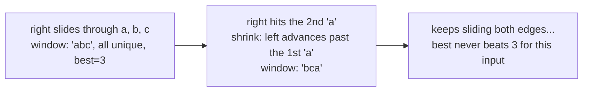
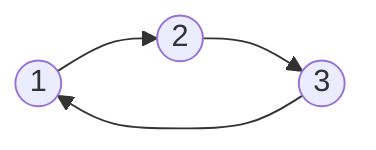
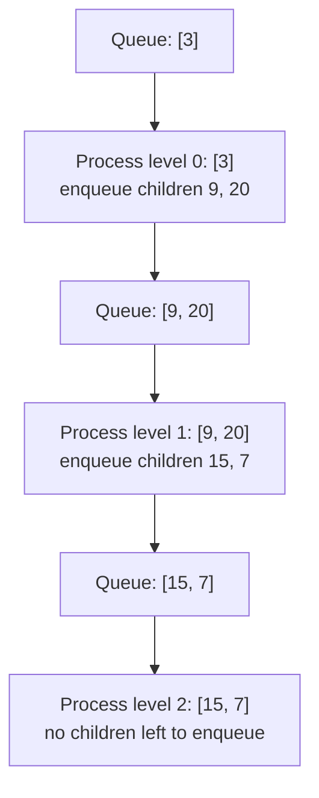
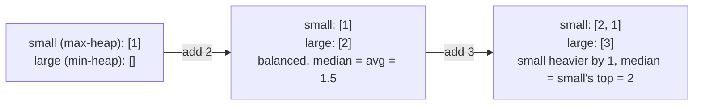
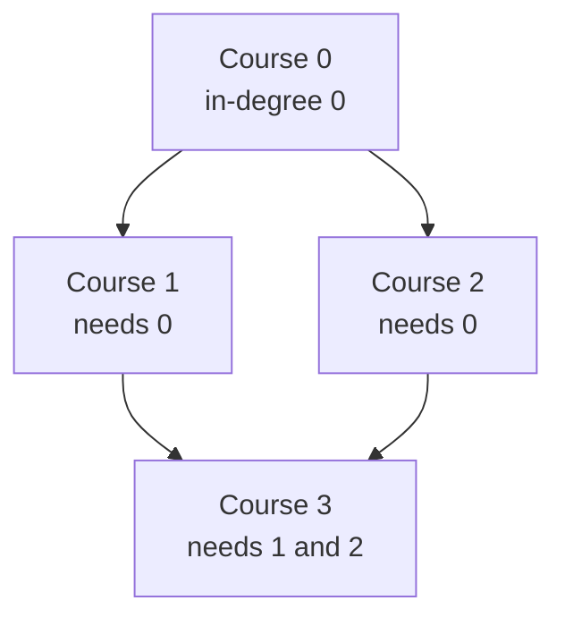
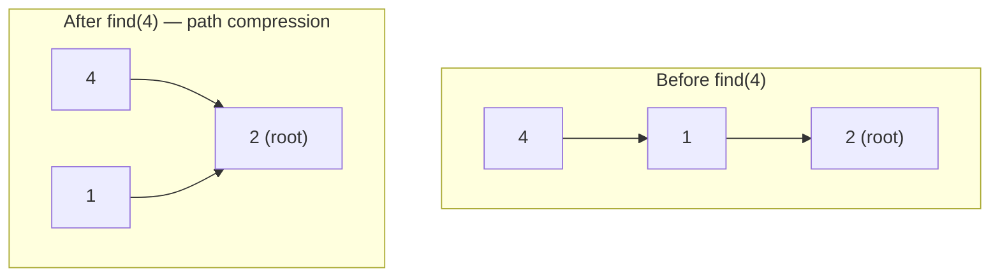

Part 2 of 7 · [Interview Prep](/interview-prep/) · ← Previous: [Part 1 — Go Language](/interview-prep-language/) · Next: [Part 3 — Databases & System Design](/interview-prep-databases-systems/) →

Most coding-interview questions aren't novel, they're a known pattern wearing a different story. Once you can name the pattern, the algorithm mostly writes itself. This part walks through the 23 patterns that cover the large majority of what shows up, each with how to recognize it, a clean, correct, test-verified reference implementation in Python, and a worked example so you can trace the code by hand instead of taking it on faith.

## Array, String & Pointer Patterns

#### 1 — Sliding Window: how do you recognize it, and what does the template look like? {#1}

**LeetCode:** [Longest Substring Without Repeating Characters](https://leetcode.com/problems/longest-substring-without-repeating-characters/)

The problem hands you a linear structure (array, string, linked list) and asks for the longest/shortest/best-value contiguous subarray or substring. Instead of recomputing a sum or count from scratch for every window, you slide a window's edges one step at a time and update the running result incrementally. A fixed-size window (like a max-sum-of-k-elements problem) just shifts both edges together; a variable-size window (like longest-substring-without-repeats) grows the right edge until a constraint breaks, then shrinks the left edge until it's satisfied again.

```python
def longest_substring_without_repeats(s: str) -> int:
    seen = set()
    left = best = 0
    for right, ch in enumerate(s):
        while ch in seen:
            seen.remove(s[left])
            left += 1
        seen.add(ch)
        best = max(best, right - left + 1)
    return best

longest_substring_without_repeats("abcabcbb")  # -> 3  ("abc")
```



The key cost you're avoiding: a naive approach re-scans the window from scratch every time it moves, O(n²) or worse. The sliding window touches each element a bounded number of times, O(n) total.

#### 2 — Two Pointers: how do you recognize it, and what does the template look like? {#2}

**LeetCode:** [Two Sum II - Input Array Is Sorted](https://leetcode.com/problems/two-sum-ii-input-array-is-sorted/), [3Sum](https://leetcode.com/problems/3sum/)

The input is sorted (or can cheaply be sorted), and you're looking for a pair, triplet, or subarray that satisfies some sum or comparison constraint. Two pointers start at opposite ends (or one behind the other) and move inward based on how the current pair compares to the target, so you never have to check every pair explicitly.

```python
def two_sum_sorted(nums: list[int], target: int) -> tuple[int, int] | None:
    left, right = 0, len(nums) - 1
    while left < right:
        total = nums[left] + nums[right]
        if total == target:
            return left, right
        if total < target:
            left += 1
        else:
            right -= 1
    return None

two_sum_sorted([1, 2, 3, 4, 6], 6)  # -> (1, 3)   (2 + 4 == 6)
```

This turns an O(n²) pairwise check into O(n), the sortedness is what lets each pointer move monotonically in one direction without missing a valid pair.

#### 3 — Fast & Slow Pointers: how do you recognize it, and what does the template look like? {#3}

**LeetCode:** [Linked List Cycle](https://leetcode.com/problems/linked-list-cycle/), [Middle of the Linked List](https://leetcode.com/problems/middle-of-the-linked-list/)

Also called the tortoise-and-hare technique. The problem involves a linked list or an implicitly cyclic sequence, and you need to detect a cycle, find a cycle's start, find the middle of a list in one pass, or check for a palindrome without extra memory. Two pointers move through the same structure at different speeds (typically 1x and 2x); if there's a cycle, the fast pointer is guaranteed to lap the slow one and they meet.

```python
def has_cycle(head) -> bool:
    slow = fast = head
    while fast and fast.next:
        slow = slow.next
        fast = fast.next.next
        if slow is fast:
            return True
    return False

# 1 -> 2 -> 3 -> back to 1
has_cycle(n1)  # -> True
```



On this 3-node loop, `slow` visits 1, 2, 3, 1, 2... one step at a time while `fast` visits 1, 3, 2, 1, 3... two steps at a time; within 3 ticks they land on the same node, which is the whole proof that a cycle forces a meeting.

The same fast/slow split (find the middle, then walk from there) is also how you solve "find the middle of a linked list" and "check if a linked list is a palindrome" in O(1) space instead of copying the list into an array first.

#### 4 — Merge Intervals: how do you recognize it, and what does the template look like? {#4}

**LeetCode:** [Merge Intervals](https://leetcode.com/problems/merge-intervals/), [Insert Interval](https://leetcode.com/problems/insert-interval/)

The problem talks about "overlapping intervals": merging a set of ranges, inserting a new one, or finding the intersection between two sorted lists of ranges. Two intervals `[a_start, a_end]` and `[b_start, b_end]` overlap exactly when `a_start <= b_end and b_start <= a_end`; once sorted by start time, you only ever need to compare each interval to the last one you've already placed.

```python
def merge_intervals(intervals: list[list[int]]) -> list[list[int]]:
    intervals.sort(key=lambda iv: iv[0])
    merged = [intervals[0]]
    for start, end in intervals[1:]:
        if start <= merged[-1][1]:
            merged[-1][1] = max(merged[-1][1], end)
        else:
            merged.append([start, end])
    return merged

merge_intervals([[1, 3], [2, 6], [8, 10], [15, 18]])  # -> [[1, 6], [8, 10], [15, 18]]
```

Sorting costs O(n log n) and dominates the total; the merge pass itself is a single O(n) sweep.

#### 5 — Cyclic Sort: how do you recognize it, and what does the template look like? {#5}

**LeetCode:** [Missing Number](https://leetcode.com/problems/missing-number/), [Find the Duplicate Number](https://leetcode.com/problems/find-the-duplicate-number/)

The array holds `n` (or close to `n`) numbers drawn from a known, bounded range, typically `1..n`, and you're asked to find a missing, duplicate, or out-of-place number. Instead of sorting generically, you place each number directly at its "correct" index (`value - 1`) by swapping, which sorts the array in one O(n) pass because every number has exactly one home.

```python
def find_missing_number(nums: list[int]) -> int:
    i, n = 0, len(nums)
    while i < n:
        correct = nums[i]
        if correct < n and nums[i] != nums[correct]:
            nums[i], nums[correct] = nums[correct], nums[i]
        else:
            i += 1
    for i in range(n):
        if nums[i] != i:
            return i
    return n

find_missing_number([3, 0, 1])  # -> 2
```

Once the cyclic sort pass finishes, any index whose value doesn't match the index itself points straight at the missing or duplicated number, no hash set required.

#### 6 — Modified Binary Search: how do you recognize it, and what does the template look like? {#6}

**LeetCode:** [Find Minimum in Rotated Sorted Array](https://leetcode.com/problems/find-minimum-in-rotated-sorted-array/), [Search in Rotated Sorted Array](https://leetcode.com/problems/search-in-rotated-sorted-array/)

Anything sorted, or sorted-then-rotated, is a candidate: finding a target, finding an insertion point, or finding the minimum in a rotated array. The core move beyond textbook binary search is figuring out, at each step, which half of the current range is still properly sorted, then checking whether the target could be in that half.

```python
def find_min_in_rotated(nums: list[int]) -> int:
    left, right = 0, len(nums) - 1
    while left < right:
        mid = left + (right - left) // 2
        if nums[mid] > nums[right]:
            left = mid + 1
        else:
            right = mid
    return nums[left]

find_min_in_rotated([4, 5, 6, 7, 0, 1, 2])  # -> 0
```

Computing `mid` as `left + (right - left) // 2` instead of `(left + right) // 2` avoids integer overflow in languages with fixed-width integers; it doesn't matter in Python, but it's the version worth having memorized since it's correct everywhere.

#### 7 — Top K Elements: how do you recognize it, and what does the template look like? {#7}

**LeetCode:** [Kth Largest Element in an Array](https://leetcode.com/problems/kth-largest-element-in-an-array/), [Top K Frequent Elements](https://leetcode.com/problems/top-k-frequent-elements/)

The problem asks for the top, smallest, or most frequent `k` elements of a set. A heap of size `k` tracks exactly the candidates that matter: for the k largest, keep a min-heap of size `k` so the smallest of your current top-k sits at the top, ready to be evicted the moment something bigger shows up.

```python
import heapq

def kth_largest(nums: list[int], k: int) -> int:
    heap = nums[:k]
    heapq.heapify(heap)
    for num in nums[k:]:
        if num > heap[0]:
            heapq.heapreplace(heap, num)
    return heap[0]

kth_largest([3, 2, 1, 5, 6, 4], 2)  # -> 5   (the 2nd largest value)
```

This runs in O(n log k) instead of the O(n log n) a full sort would cost, the win grows as `k` gets small relative to `n`.

#### 8 — K-way Merge: how do you recognize it, and what does the template look like? {#8}

**LeetCode:** [Merge k Sorted Lists](https://leetcode.com/problems/merge-k-sorted-lists/)

You're given `k` sorted lists (or a matrix with sorted rows) and need a single sorted traversal, merge, or the smallest element across all of them. Push the first element of each list into a min-heap, keyed by value; every time you pop the overall minimum, push the next element from that same list.

```python
import heapq

def merge_k_sorted_lists(lists: list[list[int]]) -> list[int]:
    heap = [(lst[0], i, 0) for i, lst in enumerate(lists) if lst]
    heapq.heapify(heap)
    merged = []
    while heap:
        val, list_idx, elem_idx = heapq.heappop(heap)
        merged.append(val)
        if elem_idx + 1 < len(lists[list_idx]):
            heapq.heappush(heap, (lists[list_idx][elem_idx + 1], list_idx, elem_idx + 1))
    return merged

merge_k_sorted_lists([[1, 4, 5], [1, 3, 4], [2, 6]])  # -> [1, 1, 2, 3, 4, 4, 5, 6]
```

Total work is O(n log k) where `n` is the total element count across all lists, the heap never holds more than `k` elements at once, one per list.

#### 9 — Monotonic Stack: how do you recognize it, and what does the template look like? {#9}

**LeetCode:** [Next Greater Element I](https://leetcode.com/problems/next-greater-element-i/), [Daily Temperatures](https://leetcode.com/problems/daily-temperatures/)

The problem is a "range query" over an array: next greater element, daily temperatures, largest rectangle in a histogram. A monotonic stack keeps its elements in strictly increasing (or decreasing) order by popping anything that violates that order before pushing the new element, so once something is popped, you know exactly what popped it, that's usually the answer for it.

```python
def next_greater_elements(nums: list[int]) -> list[int]:
    result = [-1] * len(nums)
    stack = []  # indices, values kept decreasing
    for i, num in enumerate(nums):
        while stack and nums[stack[-1]] < num:
            result[stack.pop()] = num
        stack.append(i)
    return result

next_greater_elements([2, 1, 2, 4, 3])  # -> [4, 2, 4, -1, -1]
```

Trace it on `[2, 1, 2, 4, 3]`: push index 0 (value 2). Index 1 (value 1) doesn't beat the top, so it's pushed too: stack holds indices `[0, 1]`. Index 2 (value 2) beats index 1's value (1), so index 1 pops with answer 2; it doesn't beat index 0's value (2), so it stops there and pushes itself: stack is `[0, 2]`. Index 3 (value 4) beats both remaining stack values in a row, popping index 2 (answer 4) then index 0 (answer 4), leaving stack `[3]`. Index 4 (value 3) doesn't beat index 3's value (4), so it just gets pushed, and indices 3 and 4 are left with no next greater element, hence the trailing `-1, -1`.

Each element is pushed once and popped at most once, so the whole pass is O(n) even though there's a `while` loop nested inside the `for`.

#### 10 — Prefix Sum: how do you recognize it, and what does the template look like? {#10}

**LeetCode:** [Subarray Sum Equals K](https://leetcode.com/problems/subarray-sum-equals-k/), [Range Sum Query - Immutable](https://leetcode.com/problems/range-sum-query-immutable/)

The problem asks for the sum (or count, or XOR) of many different subarrays, often phrased as "how many subarrays sum to k." Precompute a running prefix sum once, and the sum of any subarray `[i, j]` becomes a single subtraction, `prefix[j+1] - prefix[i]`, instead of re-summing that range every time.

```python
def subarray_sum_equals_k(nums: list[int], k: int) -> int:
    count = 0
    running_sum = 0
    seen = {0: 1}  # prefix sum -> how many times it's occurred
    for num in nums:
        running_sum += num
        count += seen.get(running_sum - k, 0)
        seen[running_sum] = seen.get(running_sum, 0) + 1
    return count

subarray_sum_equals_k([1, 1, 1], 2)  # -> 2   (the two overlapping [1, 1] windows)
```

The hash-map variant above turns "how many subarrays sum to k" into O(n): for every prefix sum you've seen, you're really asking "has `running_sum - k` shown up before," which is an O(1) lookup instead of an O(n) inner loop.

## Tree, Graph, Backtracking & DP Patterns

#### 11 — In-place Reversal of a Linked List: how do you recognize it, and what does the template look like? {#11}

**LeetCode:** [Reverse Linked List](https://leetcode.com/problems/reverse-linked-list/), [Reverse Linked List II](https://leetcode.com/problems/reverse-linked-list-ii/)

You need to reverse a linked list, or a sub-range of one, without allocating a second list. Walk the list once, and at each node, flip its `next` pointer to point backward at the node you just came from, tracking the previous node as you go.

```python
def reverse_list(head):
    prev = None
    node = head
    while node:
        next_node = node.next
        node.next = prev
        prev = node
        node = next_node
    return prev

# 1 -> 2 -> 3  becomes  3 -> 2 -> 1
reverse_list(head)
```

Reversing a sub-range `[left, right]` is the same loop, just started after walking to position `left` first, then splicing the reversed segment back into the untouched parts on either side.

#### 12 — Tree BFS: how do you recognize it, and what does the template look like? {#12}

**LeetCode:** [Binary Tree Level Order Traversal](https://leetcode.com/problems/binary-tree-level-order-traversal/), [Binary Tree Zigzag Level Order Traversal](https://leetcode.com/problems/binary-tree-zigzag-level-order-traversal/)

The problem needs a level-by-level view of a tree: level-order traversal, zigzag traversal, or "the minimum depth to reach a leaf." A queue holds exactly one level's worth of nodes at a time; draining the queue by its current length (captured before the loop starts) is what separates one level's processing from the next.

```python
from collections import deque

def level_order(root) -> list[list[int]]:
    if not root:
        return []
    result = []
    queue = deque([root])
    while queue:
        level = []
        for _ in range(len(queue)):
            node = queue.popleft()
            level.append(node.val)
            if node.left:
                queue.append(node.left)
            if node.right:
                queue.append(node.right)
        result.append(level)
    return result

#      3
#     / \
#    9  20
#       / \
#      15  7
level_order(root)  # -> [[3], [9, 20], [15, 7]]
```



That `for _ in range(len(queue))` is the whole trick: it freezes "how many nodes are in this level" before the loop starts appending next-level nodes into the same queue.

#### 13 — Tree DFS: how do you recognize it, and what does the template look like? {#13}

**LeetCode:** [Path Sum](https://leetcode.com/problems/path-sum/), [Binary Tree Maximum Path Sum](https://leetcode.com/problems/binary-tree-maximum-path-sum/)

The problem needs a root-to-leaf path, a path sum, or an ordered (pre/in/post-order) traversal, anything where you want to go deep before you go wide. Recursion tracks the path implicitly through the call stack; the choice of pre-order, in-order, or post-order is just where you place the "process this node" step relative to the two recursive calls.

```python
def has_path_sum(root, target: int) -> bool:
    if not root:
        return False
    if not root.left and not root.right:
        return root.val == target
    remaining = target - root.val
    return (has_path_sum(root.left, remaining)
            or has_path_sum(root.right, remaining))

# root-to-leaf sums: 5+4+11+7=27, 5+4+11+2=22, 5+8+13=26, 5+8+4+1=18
has_path_sum(root, 22)  # -> True
```

Every DFS variant, this one included, is O(n) time since it visits each node once, and O(h) space for the call stack, where `h` is the tree's height: O(log n) for a balanced tree, O(n) in the worst case of a completely skewed one.

#### 14 — Two Heaps: how do you recognize it, and what does the template look like? {#14}

**LeetCode:** [Find Median from Data Stream](https://leetcode.com/problems/find-median-from-data-stream/)

The problem needs the median (or some smallest/largest split point) of a stream of numbers as they arrive, not just once at the end. Keep a max-heap for the lower half of the numbers seen so far and a min-heap for the upper half, and rebalance after every insert so the two heaps never differ in size by more than one; the median is then always at the top of one heap, or the average of both tops.

```python
import heapq

class MedianFinder:
    def __init__(self):
        self.small = []  # max-heap, stored as negatives
        self.large = []  # min-heap

    def add_number(self, num: int) -> None:
        heapq.heappush(self.small, -num)
        heapq.heappush(self.large, -heapq.heappop(self.small))
        if len(self.large) > len(self.small):
            heapq.heappush(self.small, -heapq.heappop(self.large))

    def find_median(self) -> float:
        if len(self.small) > len(self.large):
            return -self.small[0]
        return (-self.small[0] + self.large[0]) / 2

mf = MedianFinder()
mf.add_number(1)
mf.add_number(2)
mf.find_median()  # -> 1.5
mf.add_number(3)
mf.find_median()  # -> 2
```



Trace adding 1, 2, 3 one at a time: after 1, `small=[-1]`. Adding 2 pushes it into `small` then immediately moves `small`'s top into `large`, leaving `small=[-1]`, `large=[2]`, an even split, so the median is the average, `1.5`. Adding 3 pushes it into `small` (`small=[-3, -1]`), moves its top (3) into `large` (`large=[2, 3]`), and now `large` has one more element than `small`, so the rebalance step moves `large`'s top (2) back into `small`: final state `small=[-2, -1]`, `large=[3]`, `small` is heavier by one, so the median is `small`'s top, `2`.

Pushing into one heap and immediately moving its top into the other is what keeps both heaps balanced without a separate comparison step, each insert is O(log n), and the median is always an O(1) read.

#### 15 — Subsets (Backtracking): how do you recognize it, and what does the template look like? {#15}

**LeetCode:** [Subsets](https://leetcode.com/problems/subsets/), [Permutations](https://leetcode.com/problems/permutations/), [Combination Sum](https://leetcode.com/problems/combination-sum/)

The problem wants every subset, permutation, or combination satisfying some constraint, and the phrase "find all" is the giveaway. Backtracking builds a partial solution one choice at a time, recurses, then undoes ("un-chooses") that step before trying the next option, so the same mutable list can represent every path down the decision tree.

The shape every backtracking solution shares (pseudocode below, not runnable as-is, `is_complete` and `remaining_choices` stand in for whatever the specific problem needs):

```python
def backtrack(path: list, choices: list, result: list) -> None:
    if is_complete(path, choices):
        result.append(path.copy())
        return
    for choice in remaining_choices(path, choices):
        path.append(choice)
        backtrack(path, choices, result)
        path.pop()  # undo, so the next choice starts clean
```

```python
def subsets(nums: list[int]) -> list[list[int]]:
    result = []
    def backtrack(start: int, path: list[int]) -> None:
        result.append(path.copy())
        for i in range(start, len(nums)):
            path.append(nums[i])
            backtrack(i + 1, path)
            path.pop()
    backtrack(0, [])
    return result

subsets([1, 2, 3])
# -> [[], [1], [1, 2], [1, 2, 3], [1, 3], [2], [2, 3], [3]]
```

Trace it on `[1, 2, 3]`: the very first call records `[]` before the loop even starts. Choosing index 0 appends 1, records `[1]`, then recurses to build `[1, 2]` and `[1, 2, 3]` before popping back down to `[1]`, then all the way back to `[]`. Back at the top level, index 1 builds `[2]` and `[2, 3]`, and index 2 builds `[3]`. Every append-recurse-pop triple is one branch of the decision tree, and popping right after the recursive call returns is what lets the same `path` list stand in for every branch instead of allocating a new list per branch.

The runtime is inherently exponential, O(2^n) for subsets, since that's how many subsets exist; backtracking's job is to generate exactly that many, not fewer, but without wasted work re-deriving each one from scratch.

#### 16 — Topological Sort: how do you recognize it, and what does the template look like? {#16}

**LeetCode:** [Course Schedule](https://leetcode.com/problems/course-schedule/), [Course Schedule II](https://leetcode.com/problems/course-schedule-ii/)

The problem describes dependencies between items, course prerequisites, build steps, task scheduling, and asks for a valid order, or whether one exists at all. Track each node's in-degree (how many things must happen before it); repeatedly peel off nodes with zero remaining in-degree, and decrement their neighbors' in-degrees as you go.

```python
from collections import deque, defaultdict

def can_finish(num_courses: int, prerequisites: list[list[int]]) -> bool:
    graph = defaultdict(list)
    in_degree = [0] * num_courses
    for course, pre in prerequisites:
        graph[pre].append(course)
        in_degree[course] += 1

    queue = deque(c for c in range(num_courses) if in_degree[c] == 0)
    visited = 0
    while queue:
        node = queue.popleft()
        visited += 1
        for neighbor in graph[node]:
            in_degree[neighbor] -= 1
            if in_degree[neighbor] == 0:
                queue.append(neighbor)
    return visited == num_courses

can_finish(4, [[1, 0], [2, 0], [3, 1], [3, 2]])  # -> True
can_finish(2, [[1, 0], [0, 1]])                  # -> False  (0 needs 1, 1 needs 0)
```



Trace it on that graph: in-degrees start at `[0, 1, 1, 2]`, so only course 0 begins in the queue. Popping 0 marks it visited and decrements 1 and 2 down to in-degree 0, so both join the queue. Popping 1 decrements 3 to in-degree 1 (not zero yet); popping 2 decrements 3 the rest of the way to 0, so 3 finally joins the queue and gets popped last. All 4 courses got visited, so it's finishable; in the 2-course cyclic example, both courses stay stuck at in-degree 1 forever, the queue empties after 0 pops, and `visited` never reaches 2.

If `visited` never reaches every node, some subset of nodes has a circular dependency on each other and can never reach in-degree zero, that's how this same code doubles as cycle detection.

#### 17 — Union-Find (Disjoint Set Union): how do you recognize it, and what does the template look like? {#17}

**LeetCode:** [Redundant Connection](https://leetcode.com/problems/redundant-connection/), [Number of Provinces](https://leetcode.com/problems/number-of-provinces/)

The problem asks whether two elements are connected, directly or through a chain of other connections, or wants you to count connected components, or detect a cycle in an undirected graph. Each element starts as its own parent; `union` merges two components by pointing one's root at the other's, and `find` walks up to a component's root, compressing the path along the way so future lookups are faster.

```python
class DSU:
    def __init__(self, n: int):
        self.parent = list(range(n))
        self.rank = [0] * n

    def find(self, x: int) -> int:
        if self.parent[x] != x:
            self.parent[x] = self.find(self.parent[x])  # path compression
        return self.parent[x]

    def union(self, x: int, y: int) -> bool:
        root_x, root_y = self.find(x), self.find(y)
        if root_x == root_y:
            return False  # already connected: this edge closes a cycle
        if self.rank[root_x] < self.rank[root_y]:
            root_x, root_y = root_y, root_x
        self.parent[root_y] = root_x
        if self.rank[root_x] == self.rank[root_y]:
            self.rank[root_x] += 1
        return True

dsu = DSU(5)
dsu.union(1, 2)  # -> True   (1 and 2 join a component)
dsu.union(4, 1)  # -> True   (component is now {1, 2, 4})
dsu.union(2, 4)  # -> False  (already connected: this edge closes a cycle)
```



Path compression only fires when `find` actually runs, so a chain can still be several hops deep between unions. Suppose enough prior unions left 4's parent pointer chain as `4 → 1 → 2` (2 hops to the root) before anything called `find(4)` directly. The first `find(4)` walks that whole chain, then, on the way back out of the recursion, rewrites 4's (and 1's) parent to point straight at the root, 2. Every `find(4)` after that is a single hop instead of two, path compression pays for itself on the very next lookup, which is what keeps `find` effectively constant-time even after thousands of unions.

Path compression plus union-by-rank together give near-O(1) amortized operations, formally O(α(n)), the inverse Ackermann function, which is under 5 for any `n` you'd ever encounter in practice.

#### 18 — Dijkstra's Algorithm: how do you recognize it, and what does the template look like? {#18}

**LeetCode:** [Network Delay Time](https://leetcode.com/problems/network-delay-time/), [Path with Maximum Probability](https://leetcode.com/problems/path-with-maximum-probability/)

The problem wants the shortest path (or cost) from a source to every other node in a graph with non-negative edge weights. Think of it as a greedy BFS: always expand the unvisited node with the smallest known distance so far, since once you've settled on the shortest path to a node, no longer path through a still-unvisited node could ever beat it.

```python
import heapq
from collections import defaultdict

def dijkstra(n: int, edges: list[tuple[int, int, int]], src: int) -> list[float]:
    graph = defaultdict(list)
    for u, v, w in edges:
        graph[u].append((v, w))

    dist = [float("inf")] * n
    dist[src] = 0
    heap = [(0, src)]
    while heap:
        d, node = heapq.heappop(heap)
        if d > dist[node]:
            continue  # a shorter path to `node` was already found
        for neighbor, weight in graph[node]:
            new_dist = d + weight
            if new_dist < dist[neighbor]:
                dist[neighbor] = new_dist
                heapq.heappush(heap, (new_dist, neighbor))
    return dist

dijkstra(5, [(0, 1, 4), (0, 2, 1), (2, 1, 2), (1, 3, 1), (2, 3, 5)], 0)
# -> [0, 3, 1, 4, inf]   (node 4 is unreachable from 0)
```

Trace it from source 0: the heap starts with `(0, 0)`. Popping node 0 relaxes its edges, pushing `(4, 1)` and `(1, 2)`. The heap always pops the smallest distance next, so `(1, 2)` comes before `(4, 1)`: node 2 settles at distance 1, which relaxes node 1 down to `1 + 2 = 3` (beating the earlier 4) and node 3 to `1 + 5 = 6`. Next the heap pops `(3, 1)`, settling node 1 at 3 and relaxing node 3 further down to `3 + 1 = 4`. Node 3 finishes at 4, and node 4 is never reached at all, so it's left at infinity.

Runs in O(E log V) with a binary heap. It breaks the moment an edge weight goes negative, a shorter path could then appear through a node you'd already "settled," which is exactly the case Bellman-Ford handles instead.

#### 19 — Subsequence DP: how do you recognize it, and what does the template look like? {#19}

**LeetCode:** [Longest Increasing Subsequence](https://leetcode.com/problems/longest-increasing-subsequence/), [Longest Common Subsequence](https://leetcode.com/problems/longest-common-subsequence/)

The problem asks for a longest or shortest subsequence (not necessarily contiguous, unlike a subarray), across one string or two. The number of possible subsequences is exponential, so the fact that you need one at all is the signal to reach for dynamic programming: define what a subproblem's answer means precisely, then find how it's built from smaller subproblems. For one sequence (Longest Increasing Subsequence), `dp[i]` is the LIS ending exactly at index `i`:

```python
def length_of_lis(nums: list[int]) -> int:
    dp = [1] * len(nums)
    for i in range(len(nums)):
        for j in range(i):
            if nums[j] < nums[i]:
                dp[i] = max(dp[i], dp[j] + 1)
    return max(dp) if dp else 0

length_of_lis([10, 9, 2, 5, 3, 7, 101, 18])  # -> 4   ([2, 3, 7, 18] or [2, 3, 7, 101])
```

Trace the tail end, `[2, 5, 3, 7]`: `dp[0]=1` (just `[2]`). `dp[1]=2` (`5 > 2`, extend to `[2, 5]`). `dp[2]=2` (`3 > 2` extends to `[2, 3]`, but `3` isn't bigger than `5` so it can't extend that one). `dp[3]=3` (`7` is bigger than `2`, `5`, and `3`, so it extends the best of those, `dp[2]=2`, giving `[2, 3, 7]`). `max(dp)=3` for this slice, and stitching in the `10, 9` prefix (which nothing here is small enough to extend) and the trailing `101` or `18` (either extends `[2, 3, 7]` to length 4) gives the full answer.

For two sequences (Longest Common Subsequence), `dp[i][j]` is the LCS length between `text1[i:]` and `text2[j:]`, built from the bottom right corner up:

```python
def longest_common_subsequence(text1: str, text2: str) -> int:
    dp = [[0] * (len(text2) + 1) for _ in range(len(text1) + 1)]
    for i in range(len(text1) - 1, -1, -1):
        for j in range(len(text2) - 1, -1, -1):
            if text1[i] == text2[j]:
                dp[i][j] = 1 + dp[i + 1][j + 1]
            else:
                dp[i][j] = max(dp[i][j + 1], dp[i + 1][j])
    return dp[0][0]

longest_common_subsequence("abcde", "ace")  # -> 3   ("ace")
```

Both run in O(n²) (or O(n·m) for the two-string case): every cell in the DP table is filled once, in O(1), from cells already computed.

## Grid, Greedy, Knapsack & Trie Patterns

#### 20 — Matrix/Grid Traversal (Multi-source BFS / Flood Fill): how do you recognize it, and what does the template look like? {#20}

**LeetCode:** [Number of Islands](https://leetcode.com/problems/number-of-islands/), [Rotting Oranges](https://leetcode.com/problems/rotting-oranges/)

The problem hands you a 2D grid and talks about "islands," connected regions, or "how long until X reaches every cell" (rot spreading, fire, infection). Treat each cell as a graph node connected to its up-to-4 neighbors. A single connected region is a flood fill, DFS or BFS from one starting cell, marking everything reachable. "How long until every cell is reached" is multi-source BFS: seed the queue with *every* starting cell at once (not just one), so the BFS naturally computes the minimum time from whichever source is closest to each cell, simultaneously.

```python
def num_islands(grid: list[list[str]]) -> int:
    rows, cols = len(grid), len(grid[0])
    seen = set()

    def flood_fill(r: int, c: int) -> None:
        if not (0 <= r < rows and 0 <= c < cols):
            return
        if (r, c) in seen or grid[r][c] == "0":
            return
        seen.add((r, c))
        for dr, dc in ((1, 0), (-1, 0), (0, 1), (0, -1)):
            flood_fill(r + dr, c + dc)

    islands = 0
    for r in range(rows):
        for c in range(cols):
            if grid[r][c] == "1" and (r, c) not in seen:
                flood_fill(r, c)
                islands += 1
    return islands
```

```python
from collections import deque

def rotting_oranges(grid: list[list[int]]) -> int:
    rows, cols = len(grid), len(grid[0])
    queue = deque()
    fresh = 0
    for r in range(rows):
        for c in range(cols):
            if grid[r][c] == 2:
                queue.append((r, c, 0))
            elif grid[r][c] == 1:
                fresh += 1

    minutes = 0
    while queue:
        r, c, t = queue.popleft()
        minutes = max(minutes, t)
        for dr, dc in ((1, 0), (-1, 0), (0, 1), (0, -1)):
            nr, nc = r + dr, c + dc
            if 0 <= nr < rows and 0 <= nc < cols and grid[nr][nc] == 1:
                grid[nr][nc] = 2
                fresh -= 1
                queue.append((nr, nc, t + 1))
    return minutes if fresh == 0 else -1

rotting_oranges([[2, 1, 1], [1, 1, 0], [0, 1, 1]])  # -> 4
```

The reason multi-source BFS gives the *minimum* time is the same reason plain BFS gives shortest paths: it explores in strictly increasing distance order, so the first time a fresh cell is reached is guaranteed to be the earliest any rotten orange could reach it. Both patterns are O(rows × cols): every cell is visited a constant number of times regardless of grid size.

#### 21 — Greedy / Interval Scheduling: how do you recognize it, and what does the template look like? {#21}

**LeetCode:** [Non-overlapping Intervals](https://leetcode.com/problems/non-overlapping-intervals/), [Meeting Rooms II](https://leetcode.com/problems/meeting-rooms-ii/)

The problem asks for the maximum number of non-overlapping intervals you can keep (or, equivalently, the minimum number to remove), the minimum number of meeting rooms needed, or the maximum number of activities you can attend without any two overlapping. The greedy trick is sorting by **end time**, not start time: greedily keep any interval whose start is at or after the last kept interval's end. Sorting by end time is what makes that local, myopic choice provably optimal, whichever interval ends soonest always leaves the most room for everything that comes after, so there's never a reason to prefer a later-ending option over an earlier-ending one that's equally available.

```python
def max_non_overlapping(intervals: list[list[int]]) -> int:
    intervals.sort(key=lambda iv: iv[1])
    count = 0
    last_end = float("-inf")
    for start, end in intervals:
        if start >= last_end:
            count += 1
            last_end = end
    return count

max_non_overlapping([[1, 2], [2, 3], [3, 4], [1, 3]])  # -> 3
```

Sorted by end time, that input becomes `[1,2], [2,3], [1,3], [3,4]`. Keep `[1,2]` (nothing kept yet), keep `[2,3]` (`2 >= 2`), skip `[1,3]` (`1 < 3`, it would overlap the interval just kept), keep `[3,4]` (`3 >= 3`), for 3 kept out of 4, so 1 removal is the minimum needed to eliminate all overlaps. The sort dominates the cost at O(n log n); the scan itself is a single O(n) pass.

#### 22 — 0/1 Knapsack (Subset-Sum DP): how do you recognize it, and what does the template look like? {#22}

**LeetCode:** [Partition Equal Subset Sum](https://leetcode.com/problems/partition-equal-subset-sum/), [Coin Change](https://leetcode.com/problems/coin-change/)

The problem asks whether some subset of items can hit an exact target sum or capacity (partition into two equal-sum halves, minimum coins to make an amount), and each item can be used once (or a fixed number of times). That's a different DP shape than Subsequence DP (226): there, `dp[i]` tracks a subsequence ending at *position i*; here, `dp[i][capacity]` tracks whether the first `i` items can reach a specific *running sum*. Confusing the two is the single most common mix-up in this category, if your DP's second dimension is a position index, you're doing subsequence DP; if it's a sum or capacity, you're doing knapsack.

```python
def can_partition(nums: list[int]) -> bool:
    total = sum(nums)
    if total % 2:
        return False
    target = total // 2
    n = len(nums)
    dp = [[False] * (target + 1) for _ in range(n + 1)]
    for i in range(n + 1):
        dp[i][0] = True  # sum 0 is always reachable: take nothing

    for i in range(1, n + 1):
        num = nums[i - 1]
        for capacity in range(target + 1):
            dp[i][capacity] = dp[i - 1][capacity]  # option 1: skip this item
            if capacity >= num:
                # option 2: take this item, if it fits
                dp[i][capacity] = dp[i][capacity] or dp[i - 1][capacity - num]
    return dp[n][target]

can_partition([1, 5, 11, 5])  # -> True   (11 alone, or 5 + 5 + 1, both hit 11)
can_partition([1, 2, 3, 5])   # -> False  (total is 11, odd, can't split evenly)
```

Each cell `dp[i][capacity]` answers "can the first `i` items reach exactly this capacity," built from two options already computed one row up: skip item `i` (carry down `dp[i-1][capacity]`) or take it (check `dp[i-1][capacity - num]`, whether the *remaining* items could already reach what's left over). Runs in O(n × target) time and space; a rolling 1D array cuts the space to O(target) once you notice each row only ever reads the row directly above it.

#### 23 — Trie (Prefix Tree): how do you recognize it, and what does the template look like? {#23}

**LeetCode:** [Implement Trie (Prefix Tree)](https://leetcode.com/problems/implement-trie-prefix-tree/), [Word Search II](https://leetcode.com/problems/word-search-ii/)

The problem is about prefixes: autocomplete, "does any stored word start with this," longest common prefix, or a word search across many candidate words at once. A trie is a tree where each edge is labeled with one character and each node marks whether a complete word ends there; both "does this exact word exist" and "does anything start with this prefix" become a simple walk down the tree, one step per character, independent of how many words are stored overall.

```python
class TrieNode:
    def __init__(self):
        self.children: dict[str, "TrieNode"] = {}
        self.is_word = False

class Trie:
    def __init__(self):
        self.root = TrieNode()

    def insert(self, word: str) -> None:
        node = self.root
        for ch in word:
            node = node.children.setdefault(ch, TrieNode())
        node.is_word = True

    def search(self, word: str) -> bool:
        node = self._walk(word)
        return node is not None and node.is_word

    def starts_with(self, prefix: str) -> bool:
        return self._walk(prefix) is not None

    def _walk(self, s: str) -> "TrieNode | None":
        node = self.root
        for ch in s:
            if ch not in node.children:
                return None
            node = node.children[ch]
        return node

trie = Trie()
trie.insert("apple")
trie.search("apple")     # -> True
trie.search("app")       # -> False  (never inserted as a complete word)
trie.starts_with("app")  # -> True   (a prefix of "apple")
```

`insert`, `search`, and `starts_with` are all O(L) where `L` is the word or prefix length, regardless of how many other words share the trie. The cost you're paying for that speed is space: in the worst case, with no shared prefixes at all, a trie holding `n` words of length `L` stores O(n × L) nodes, one full chain per word.

## Notes

**[Array, String & Pointer Patterns](#array-string--pointer-patterns):** these are the patterns most likely to show up in a phone screen. Sliding window ([1](#1)) and two pointers ([2](#2)) alone cover a huge fraction of "easy" and "medium" problems, get the template reflexive enough that recognizing the pattern and writing the code happen in the same breath.

**[Tree, Graph, Backtracking & DP Patterns](#tree-graph-backtracking--dp-patterns):** this is where onsite rounds live. Tree BFS/DFS ([12](#12), [13](#13)) and backtracking ([15](#15)) are foundational, everything else in this section is closer to a variation on one of those three. Dijkstra ([18](#18)) and topological sort ([16](#16)) are the two most likely to get a "now what if the graph has a cycle" or "what if a weight is negative" follow-up, know the failure mode, not just the happy path.

**[Grid, Greedy, Knapsack & Trie Patterns](#grid-greedy-knapsack--trie-patterns):** newer categories on this list, but no less common in practice. Grid BFS/DFS ([20](#20)) shows up constantly in easy/medium rounds, it's really just Tree BFS ([12](#12)) with up to 4 neighbors instead of 2 children. Knapsack ([22](#22)) is the one people confuse with Subsequence DP ([19](#19)): if your DP's second dimension is a running sum or capacity rather than a position in the sequence, you're in knapsack territory, not subsequence territory.

---

Part 2 of 7 · [Interview Prep](/interview-prep/) · ← Previous: [Part 1 — Go Language](/interview-prep-language/) · Next: [Part 3 — Databases & System Design](/interview-prep-databases-systems/) →

<script src="https://cdn.jsdelivr.net/npm/mermaid@11/dist/mermaid.min.js"></script>
<script>
document.querySelectorAll('pre code.language-mermaid').forEach(function (el) {
  var div = document.createElement('div');
  div.className = 'mermaid';
  div.textContent = el.textContent;
  el.parentElement.replaceWith(div);
});
mermaid.initialize({ startOnLoad: true, theme: 'neutral' });
</script>
