Part 3 of 7 · [Interview Prep](/interview-prep/) · ← Previous: [Part 2 — Coding Patterns](/interview-prep-coding-patterns/) · Next: [Part 4 — Advanced SQL](/interview-prep-sql-advanced/) →

System design is the round people dread, and mostly for the wrong reason. It isn't a memory test. It's a test of whether you can say what breaks first and what you'd do about it. These 48 questions build that up from the database out.

**What this assumes:** you've written an API that talks to a database, and you know what a query, an index, and an HTTP request are. Sharding, quorums, and Raft all get explained here.

**What you should be able to do after:** sketch a system on a whiteboard and defend the three decisions the interviewer will actually push on.

Every answer opens with **The gist**, one or two plain sentences. If the gist is all you have time for, that's still worth more than a half-remembered detail. The full answer underneath is what you say when they ask you to go deeper.





## Databases & Database Optimization

*Questions 1 to 5 are table stakes for any backend role. 6 to 10 come up in senior rounds even when the job description never mentions databases.*

### 1. What do the four ACID properties guarantee, with a concrete example of a violation? {#1}

{}
**The gist:** four promises a database makes about transactions. The one interviewers actually probe is atomicity: a transfer that debits one account then crashes can't leave the money nowhere.

**Atomicity:** a transaction is all-or-nothing, so no partial writes are ever visible. **Consistency:** a transaction moves the database from one valid state to another, respecting constraints and invariants. **Isolation:** concurrent transactions don't see each other's uncommitted intermediate state. **Durability:** once committed, a write survives a crash, typically via a write-ahead log flushed to disk before the commit is acknowledged.

Violation example: without atomicity, a funds transfer that debits one account but crashes before crediting the other leaves money vanished.

**What they're testing:** whether you can give a violation example. Reciting the four words is the easy half, and they'll ask for the example either way.
{}

### 2. Normalization vs. denormalization: what's the trade-off, and when would you denormalize? {#2}

{}
**The gist:** normalize to store each fact once, denormalize to skip joins at read time. You're trading write-time safety for read-time speed.

Normalization (3NF and beyond) splits data into related tables joined by foreign keys so each fact is stored once. That saves storage and avoids update anomalies, at the cost of needing joins to read.

Denormalization intentionally duplicates or pre-joins data to avoid those joins at read time: cheaper reads, but it risks write-time inconsistency and costs extra storage.

Denormalize for read-heavy, write-light workloads, for example a precomputed "order summary" table instead of joining orders, items, and users on every page load.
{}

### 3. Why does column order matter in a composite index, and what makes an index "covering"? {#3}

{}
**The gist:** an index on `(a, b, c)` only helps when your `WHERE` starts at `a`. It's a phone book sorted by last name then first name: useless if all you know is the first name.

A composite index on `(a, b, c)` is only useful for queries filtering on a left prefix of those columns. It serves `WHERE a = ?` and `WHERE a = ? AND b = ?`, but not `WHERE b = ?` alone. Put the most selective or most commonly-filtered-alone column first.

```sql
CREATE INDEX idx_events ON events (tenant_id, created_at, kind);

-- Uses the index: filters start at the leading column.
SELECT * FROM events WHERE tenant_id = 7;
SELECT * FROM events WHERE tenant_id = 7 AND created_at > now() - '1d';

-- Does not use it: skips the leading column entirely.
SELECT * FROM events WHERE created_at > now() - '1d';
```

A covering index additionally includes every column a query needs, via `INCLUDE` or as a composite over all selected and filtered columns, so the database answers the query entirely from the index without touching the table. That's an index-only scan.
{}

### 4. What is the N+1 query problem, and how do you fix it? {#4}

{}
**The gist:** you fetch 100 rows, then loop and fire one more query per row. That's 101 queries where 2 would do. It's almost always an ORM lazy-load sitting inside a loop.

It happens when code fetches N parent records with one query, then loops over them issuing one more query per record for related data.

```go
// N+1: one query for orders, then one per order.
orders := db.Query(`SELECT id FROM orders WHERE user_id = $1`, uid)
for _, o := range orders {
    o.Items = db.Query(`SELECT * FROM items WHERE order_id = $1`, o.ID)
}

// Fixed: one follow-up query for every order at once.
items := db.Query(`SELECT * FROM items WHERE order_id = ANY($1)`, ids)
// then group items by order_id in memory
```

The fix is either to eager-load the association up front with a `JOIN`, or to batch the follow-up lookups into a single `WHERE parent_id IN (...)` query and group the results in memory.

**What they're testing:** whether you'd spot it in a code review. The query itself is fast, which is exactly why it hides: nothing shows up in a slow-query log.
{}

### 5. You're handed a slow production query: what do you check, in order? {#5}

{}
**The gist:** work outside in. First ask whether it's really one slow query or a hundred fast ones. Then check the plan, the index, the statistics, and the connection pool before you blame the database.

1. `EXPLAIN ANALYZE` it. Is it doing a sequential scan on a large table it shouldn't be?
2. Confirm an index exists on the filtered and joined columns, and that its leading columns match the query.
3. Check whether it's actually N+1 queries in disguise from the calling code, not one slow query.
4. Check that table statistics are fresh and the table isn't bloated (`ANALYZE` and `VACUUM` in Postgres).
5. Check the connection pool isn't saturated. Queries queueing for a connection look slow even when the query itself is fine (see [connection pooling](#75) in Part 1).
6. For a genuinely hot read path, reach for caching ([Q20](#20)) or a read replica ([Q10](#10)) before reaching for a bigger box.

**What they're testing:** whether you have a method or you guess. Saying "I'd add an index" first is the answer they're hoping you don't give.
{}

### 6. How does a B-tree index make lookups fast, and when does an index *not* help? {#6}

{}
**The gist:** it's a sorted, balanced tree, so a lookup takes a handful of hops instead of reading every row. It stops helping the moment the column barely narrows anything down.

A B-tree keeps keys sorted in a balanced tree, so a lookup walks from root to leaf in O(log n) comparisons instead of scanning every row. Leaf nodes are linked in sorted order, which makes range scans (`BETWEEN`, `ORDER BY`) cheap too. Each leaf entry points back to the actual row.

An index does *not* help when:

- The column has low selectivity. A boolean flag on a huge table matches half the rows anyway, so the planner rightly prefers a sequential scan.
- The query wraps the column in a function (`WHERE LOWER(email) = ...`) without a matching expression index.
- The pattern has a leading wildcard. `LIKE '%foo'` can't use a plain B-tree, it needs a trigram or full-text index.
- The table is small enough that a full scan is simply cheaper than random index lookups.

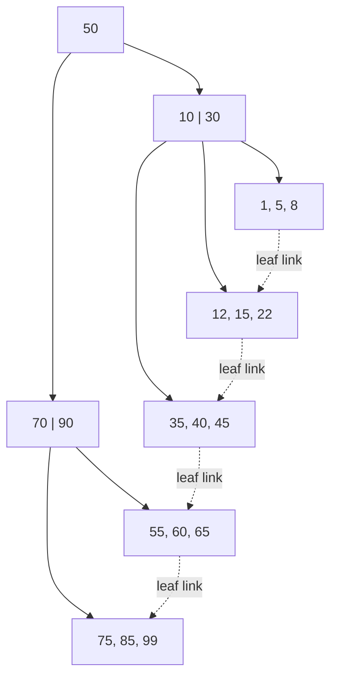
{}

### 7. How do you read a query execution plan to diagnose a slow query? {#7}

{}
**The gist:** `EXPLAIN ANALYZE` runs the query and shows what the planner chose plus real timings. The single most useful thing on the page is estimated rows versus actual rows.

Key things to check:

- **Scan type per node.** `Seq Scan` is a full table scan, `Index Scan` uses an index then fetches the row, `Index Only Scan` is answered entirely from the index, `Bitmap Heap Scan` combines several index matches before hitting the table.
- **Cost estimate**, shown as startup..total in arbitrary planner units.
- **Estimated rows vs. actual rows**, which matters most. A big divergence means the table's statistics are stale, so the planner is guessing wrong, and a wrong guess is what makes it pick a bad plan. The fix is often just `ANALYZE table_name`.

```sql
-- No index on customer_id:
EXPLAIN ANALYZE SELECT * FROM orders WHERE customer_id = 42;

Seq Scan on orders
  (cost=0.00..18334.00 rows=12 width=120)
  (actual time=0.02..142.30 rows=8 loops=1)
  Filter: (customer_id = 42)
  Rows Removed by Filter: 999992

-- After: CREATE INDEX idx_orders_customer ON orders(customer_id);
Index Scan using idx_orders_customer on orders
  (cost=0.42..8.44 rows=12 width=120)
  (actual time=0.015..0.021 rows=8 loops=1)
  Index Cond: (customer_id = 42)
```

**What they're testing:** whether you read plans or just run them. "Rows Removed by Filter: 999992" is the line that tells the whole story, and they want to see you find it.
{}

### 8. Explain the transaction isolation levels and the anomalies each one prevents. {#8}

{}
**The gist:** four levels, each preventing more of the odd things concurrent transactions can see. Most apps sit on Read Committed and never think about it again.

Each stricter level prevents more of the read anomalies that come from concurrent transactions, at the cost of more locking and lower concurrency:

| Isolation level | Dirty read | Non-repeatable read | Phantom read |
|---|---|---|---|
| Read Uncommitted | possible | possible | possible |
| Read Committed | prevented | possible | possible |
| Repeatable Read | prevented | prevented | possible (Postgres's snapshot-based RR also prevents phantoms) |
| Serializable | prevented | prevented | prevented |

A **dirty read** sees another transaction's uncommitted write. A **non-repeatable read** re-reads the same row within one transaction and gets a different value, because another transaction committed a change in between. A **phantom read** re-runs the same filtered query and sees a different *set* of rows, because another transaction inserted or deleted matching rows in between.

Most applications default to Read Committed. Serializable is reserved for invariants that absolutely cannot tolerate any anomaly, since it costs the most concurrency, often via retries on serialization failure.
{}

### 9. Optimistic vs. pessimistic locking, and how does a deadlock happen? {#9}

{}
**The gist:** pessimistic locks the row up front. Optimistic doesn't lock at all, it just checks at write time that nobody else changed it. A deadlock is two transactions each holding what the other is waiting for.

Pessimistic locking acquires a lock before touching a row (`SELECT ... FOR UPDATE`) so nothing else can modify it until you're done. Safe under contention, but it reduces concurrency and can deadlock.

Optimistic locking reads a version or timestamp column, does the work, then writes conditionally on that version being unchanged (`WHERE version = read_version`), retrying on a mismatch. Better throughput when contention is low, wasted work when it's high.

A deadlock happens when two transactions each hold a lock the other is waiting for, in opposite order: a circular wait.

```sql
-- T1                          -- T2
BEGIN;                         BEGIN;
UPDATE accounts                UPDATE accounts
  SET balance = balance - 10     SET balance = balance - 10
  WHERE id = 1;                  WHERE id = 2;

UPDATE accounts                UPDATE accounts
  SET balance = balance + 10     SET balance = balance + 10
  WHERE id = 2;                  WHERE id = 1;
-- T1 waits on T2's lock, T2 waits on T1's. Circular wait.
-- The database kills one of them as the deadlock victim.
```

The database's deadlock detector picks a victim, rolls it back with an error, and the application must retry it.

**What they're testing:** the fix, which is always to acquire locks on rows in a consistent global order. Sort the IDs before you lock them and the cycle can't form.
{}

### 10. Explain leader-follower replication and replication lag. {#10}

{}
**The gist:** writes go to one leader, followers copy the changes and serve reads. Copying takes time, so a read right after your own write can still show the old value.

Writes go to the leader (primary), which streams its change log (for example Postgres's WAL) to one or more followers (replicas), which apply the changes and can serve reads. This gives horizontal read scaling and a hot standby for failover.

Because replication is usually asynchronous, followers apply changes with a delay, called replication lag, so a read against a follower immediately after a write to the leader can return stale data.

This bites hardest on "read your own write" right after an update. Either route that specific read to the leader, or use synchronous replication for stronger consistency at a latency cost. See also sharding and partitioning ([Q13](#13)), which splits data across nodes rather than copying all of it to each.

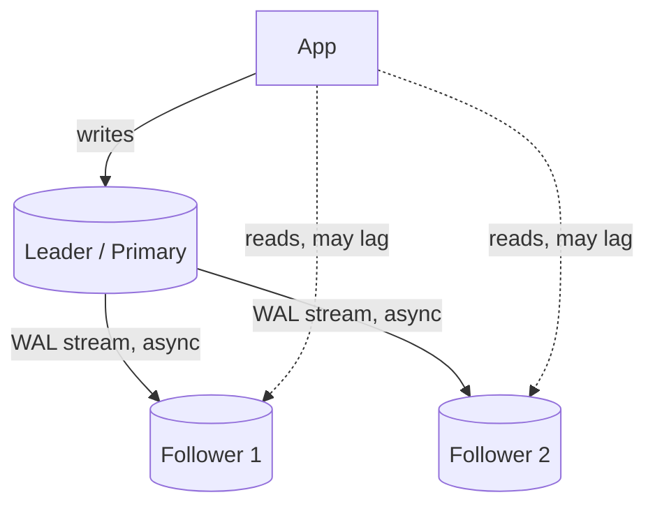
{}

---

## Key Concepts: What to Reach For

*Not questions, a map. Skim it to see how the pieces relate, then come back to it later to find the question you need.*

Each row is a concept and the situation that should make you reach for it, so you can orient before drilling into the "why" in the questions. The numbers point to where each one is covered in depth.

**Scaling & data distribution**

| Concept | When to reach for it |
|---|---|
| Horizontal scaling | You've hit a ceiling on one box and the workload is stateless enough to split across many ([Q11](#11)). |
| Sharding / horizontal partitioning | A single database's write throughput or storage has become the bottleneck ([Q13](#13)). |
| Consistent hashing | Nodes get added and removed, and you need only a fraction of keys to remap rather than almost all of them ([Q35](#35)). |
| Caching: cache-aside / write-through / write-behind | Reads vastly outnumber writes and some staleness is tolerable. Pick the variant by how fresh reads need to be versus how fast writes need to be ([Q20](#20)). |
| L4 vs. L7 load balancing | L4 when you just need fast, protocol-agnostic distribution; L7 when routing needs to look at path, host, or cookies ([Q19](#19)). |

**Consistency & coordination**

| Concept | When to reach for it |
|---|---|
| CAP theorem | Framing any "what happens during a network partition" design decision ([Q18](#18)). |
| PACELC | Same question, but you also need to reason about the latency/consistency trade-off when there's *no* partition ([Q30](#30)). |
| Consistency spectrum (strong / causal / read-your-writes / eventual) | Picking the cheapest guarantee that's still correct for the feature: a like count needs less than a balance check ([Q12](#12), [Q37](#37)). |
| Quorum reads/writes (N/R/W) | You're replicating across N nodes and want a tunable guarantee that reads see the latest write ([Q31](#31)). |
| Distributed locks | Coordinating mutual exclusion across processes, not just goroutines in one process ([Q21](#21)). |
| Leader election / Raft | A cluster of nodes needs to agree on exactly one coordinator, and that agreement must survive crashes ([Q22](#22), [Q36](#36)). |
| Clock skew / logical clocks | You need to order events across machines and wall-clock timestamps aren't reliable enough ([Q24](#24)). |

**Messaging & delivery**

| Concept | When to reach for it |
|---|---|
| Sync vs. async communication | Sync when you need an immediate answer and can accept coupling to the callee's availability; async when you can decouple in time ([Q16](#16)). |
| Backpressure | A fast producer would otherwise overwhelm a slow consumer's buffer ([Q17](#17)). |
| Idempotency & idempotency keys | A client might retry a request and you need retries to be safe ([Q15](#15), [Q32](#32)). |
| Delivery semantics (at-most / at-least / exactly-once) | Deciding what a message queue actually guarantees you, and what your own code still has to guarantee on top ([Q23](#23)). |
| Outbox pattern | You need a DB write and a message publish to succeed or fail together ([Q33](#33)). |
| Saga vs. two-phase commit | A transaction spans multiple services and holding locks across all of them (2PC) is too heavyweight ([Q34](#34)). |
| Kafka vs. RabbitMQ vs. NATS | Kafka for a durable, replayable event log; RabbitMQ for flexible routing and per-message ack/retry; NATS for low-latency, lightweight pub/sub ([Q14](#14)). |
| Gossip protocols | Detecting node failure across a large cluster without a central bottleneck ([Q29](#29)). |

**Resilience & failure handling**

| Concept | When to reach for it |
|---|---|
| Thundering herd mitigation (jitter, coalescing) | Many clients would otherwise retry or wake up at the same instant against a recovering resource ([Q25](#25)). |
| Bulkhead vs. circuit breaker | Bulkhead to stop one dependency's failure from starving resources shared with everything else; circuit breaker to stop calling a dependency that's clearly already failing ([Q38](#38)). |
| Byzantine vs. crash fault tolerance | Byzantine only matters in adversarial or untrusted settings; infrastructure you control just needs crash-fault tolerance (Raft/Paxos) ([Q26](#26)). |
| Two Generals' Problem | Reasoning about why perfect agreement over an unreliable channel is impossible, and why we settle for retries plus idempotency instead ([Q27](#27)). |
| CRDTs | Replicas need to accept writes independently (offline-first, multi-region) and eventual convergence is good enough ([Q28](#28)). |

**Applied patterns (case studies)**

| Pattern | Use case it solves |
|---|---|
| Read-heavy key lookup + cache in front of DB | URL shortener ([Q39](#39)). |
| Shared atomic counter (Redis + Lua) | Rate limiting across multiple gateway instances ([Q40](#40)). |
| Bounded parallel fan-out with a deadline | Aggregating many signals under a tight latency SLA ([Q41](#41)). |
| Queue-based fan-out per channel | Notifying millions of users across push/email/SMS ([Q42](#42)). |
| Idempotency key + unique constraint | Payment processing that survives retries without double-charging ([Q43](#43)). |
| Atomic claim + lease/heartbeat | A job scheduler where each job runs exactly once, even across crashes ([Q44](#44)). |
| Consistent hashing + pub/sub | A sharded, horizontally-scalable chat backend ([Q45](#45)). |
| Partition by natural key + idempotent upsert | High-throughput event ingestion without double-counting on reprocess ([Q46](#46)). |
| Strangler fig | Migrating a monolith to microservices incrementally, without a big-bang rewrite ([Q47](#47)). |
| Hash-chained append-only log | Tamper-evident, queryable audit logging ([Q48](#48)). |

---

## System Design Fundamentals

*11 to 17 are vocabulary you'll use in every design conversation. 18 to 20 are the ones you should be able to draw from memory.*

### 11. Difference between vertical and horizontal scaling, and when does horizontal stop being trivial? {#11}

{}
**The gist:** vertical is a bigger machine, horizontal is more machines. Horizontal is easy right up until state enters the picture, and then state is the whole problem.

Vertical scaling means a bigger machine: simple, but it has a hard ceiling. Horizontal scaling means more machines sharing load, and it stops being trivial the moment state enters the picture. Stateless request handling scales linearly, but a stateful component needs partitioning, replication, or coordination logic.
{}

### 12. Explain eventual consistency with a good-fit and bad-fit example. {#12}

{}
**The gist:** replicas agree eventually, not instantly. Fine for a like count, dangerous for a balance check right before a withdrawal.

Eventual consistency means replicas will converge given enough time without new writes, but reads shortly after a write might see stale data.

Good fit: a like count. Bad fit: an account balance check right before authorizing a large withdrawal.
{}

### 13. Difference between horizontal and vertical partitioning (sharding) of a database? {#13}

{}
**The gist:** vertical splits a table by columns, horizontal (sharding) splits it by rows across machines. Same word, two completely different problems.

Vertical partitioning splits a table by columns: same rows, different tables. Horizontal partitioning (sharding) splits a table by rows across multiple database instances based on a shard key, so each shard holds a subset of rows but the full schema.

**What they're testing:** whether you keep the two straight under pressure. Part 4 covers [partitioning versus sharding](#18) from the single-instance side, and interviewers like asking both.
{}

### 14. When would you choose Kafka vs RabbitMQ vs NATS? {#14}

{}
**The gist:** Kafka is a replayable log, RabbitMQ is a smart work queue, NATS is fast and light. Pick by whether you need history, routing, or raw speed.

**Kafka:** high-throughput, durable, replayable event log, ideal for event sourcing and stream processing. **RabbitMQ:** flexible routing, strong work-queue semantics with per-message ack and retry. **NATS:** extremely low latency, lightweight pub/sub.
{}

### 15. Explain idempotency and why it matters in distributed systems. {#15}

{}
**The gist:** doing it twice gives the same result as doing it once. You need it because a client whose request times out genuinely can't tell whether it worked.

An idempotent operation produces the same end result no matter how many times it's applied. That's critical because network failures mean clients can't always tell if a request succeeded, so they have to be able to retry safely.

**What they're testing:** whether you connect it to retries. Idempotency isn't a nice property in the abstract, it's what makes a retry safe, and retries are unavoidable.
{}

### 16. Synchronous vs asynchronous communication between services: what are the tradeoffs? {#16}

{}
**The gist:** sync gives you an answer now and ties your uptime to theirs. Async decouples you, and hands you retries, ordering, and eventual consistency to deal with instead.

Synchronous is simpler and gives immediate feedback, but it couples the caller's availability to the callee's. Asynchronous decouples services in time, at the cost of eventual consistency and more complex failure, retry, and ordering handling.
{}

### 17. Explain backpressure and why a fast producer plus a slow consumer needs it. {#17}

{}
**The gist:** a way for a slow consumer to say "slow down" instead of silently buffering until something runs out of memory.

Backpressure is a mechanism for a slow consumer to signal a fast producer to slow down, preventing unbounded buffering that leads to memory exhaustion or unbounded latency growth.

```go
// A bounded channel is backpressure. Once 100 items are queued,
// the producer blocks on send until the consumer catches up.
jobs := make(chan Job, 100)

// Unbounded would be make(chan Job) fed by an ever-growing slice:
// the producer never blocks, and memory grows until the process dies.
```
{}

### 18. Explain CAP theorem with a concrete example. {#18}

{}
**The gist:** when the network splits, you pick one: keep answering with possibly-stale data, or refuse to answer rather than risk being wrong. You don't get both.

Under a network partition, a distributed system must choose between Consistency (every read sees the latest write) and Availability (every request gets a response, even if possibly stale).

Choosing AP: a shopping cart service that keeps accepting writes during a partition and reconciles later. Choosing CP: a bank ledger balance check that would rather return an error than risk showing a stale balance.

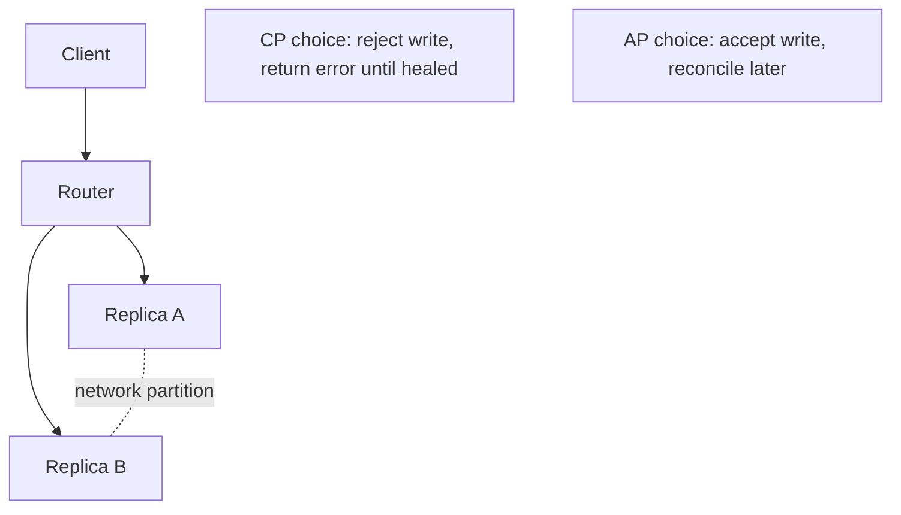

**What they're testing:** that you know "CA" isn't a real option. Partitions aren't a design choice, they're weather, so the only question is what you do when one happens.
{}

### 19. Explain L4 vs L7 load balancing. {#19}

{}
**The gist:** L4 forwards packets by IP and port without opening them. L7 reads the HTTP request and can route on path or host. Speed versus smarts.

L4 (transport layer) balances based on IP, port, and TCP/UDP-level info without inspecting request content, which makes it fast and protocol-agnostic. L7 (application layer) understands HTTP and can route based on path, host header, or cookies: more flexible, but it adds processing overhead.

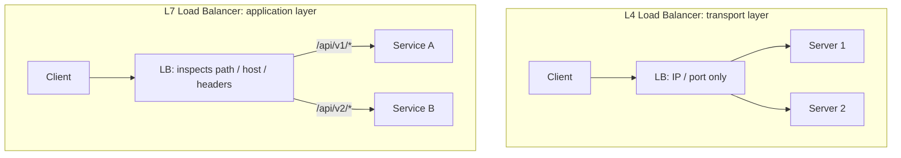
{}

### 20. Explain caching strategies: cache-aside, write-through, write-behind. {#20}

{}
**The gist:** three answers to "when does the database get the write?" Cache-aside fills on a miss, write-through writes both at once, write-behind writes later and hopes nothing crashes.

**Cache-aside:** the app checks the cache first, and on a miss reads from the database and populates the cache. **Write-through:** writes go to the cache and database synchronously together, so reads are always fresh but writes are slower. **Write-behind:** writes go to the cache immediately and are asynchronously flushed to the database later, which is fastest for writes but risks data loss if the cache fails before flushing.

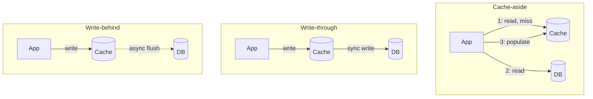
{}

---

## Distributed Systems Concepts

*The deep end, and nobody expects a junior to have all eighteen. But 23, 25 and 32 show up in ordinary backend work long before anyone calls it distributed systems, so start there.*

### 21. Explain a distributed lock, and why plain mutexes don't work across services. {#21}

{}
**The gist:** a mutex only coordinates goroutines inside one process. Once two servers need to agree, the lock has to live somewhere they can both see, with a TTL so a crash doesn't wedge it forever.

A `sync.Mutex` only coordinates goroutines within a single process's memory space. A distributed lock uses a shared external system (Redis Redlock, or etcd and Zookeeper with consensus-backed leases) so multiple independent processes can agree on mutual exclusion, typically with a lease or TTL.
{}

### 22. What's leader election, and how does it typically work? {#22}

{}
**The gist:** getting a group of nodes to agree on exactly one boss, and to pick a new one quickly when that boss dies.

It's a mechanism for a group of distributed nodes to agree on exactly one leader. Typically it's implemented via a consensus protocol like Raft: nodes propose themselves, a majority quorum must agree, and if the leader fails to renew its lease, a new election triggers.
{}

### 23. At-most-once vs at-least-once vs exactly-once delivery, and why is exactly-once mostly a myth? {#23}

{}
**The gist:** at-most-once can lose messages, at-least-once can repeat them, exactly-once is mostly marketing. You get the effect of exactly-once by making repeats harmless.

At-most-once means a message might be lost. At-least-once means it's guaranteed delivered, but possibly more than once. Exactly-once is extremely hard end to end. In practice, systems achieve "effectively exactly-once" by combining at-least-once delivery with idempotent processing.

**What they're testing:** whether you push back on the phrase. A broker that advertises exactly-once is describing its own hop, not your handler, and your handler still has to be idempotent.
{}

### 24. How do clock skew and distributed time affect ordering of events across services? {#24}

{}
**The gist:** two machines' clocks disagree, so you can't order events by comparing timestamps. Use logical clocks, or one thing that hands out the order.

Wall-clock timestamps from different machines aren't reliably comparable, because of clock drift. The solutions are logical clocks (Lamport or vector clocks) that capture causal ordering, or a centralized sequencer or monotonic ID source when a single global order is genuinely required.
{}

### 25. What is the thundering herd problem, and how do jitter and coalescing prevent it? {#25}

{}
**The gist:** everyone retries at the same instant and re-kills the thing that just came back up. Jitter spreads them out, coalescing makes many callers share a single request.

Thundering herd is when a large number of clients wake up or retry simultaneously, overwhelming a resource that was just recovering.

Jittered backoff randomizes retry timing. Request coalescing (single-flight) makes sure only one actual request goes to the backend when many callers want the same resource.

**What they're testing:** whether you'd catch it in your own retry code. Plain exponential backoff without jitter still synchronizes every client on the same schedule, which is the trap.
{}

### 26. What's the difference between Byzantine and crash-fault tolerance, and why do Raft and Paxos only handle the latter? {#26}

{}
**The gist:** crash faults mean a node goes silent. Byzantine means it lies. Raft handles silence, and silence is all you need for servers you own.

Crash-fault tolerance assumes a failed node simply stops responding, so it never lies. Byzantine fault tolerance assumes a node can behave arbitrarily: send conflicting messages to different peers, claim false state, or act maliciously.

Raft and Paxos only tolerate crash faults, which is why they're safe for trusted infrastructure you control (your own replica set) but insufficient for adversarial settings like blockchain consensus, which need BFT protocols such as PBFT or Tendermint instead.
{}

### 27. What is the Two Generals' Problem, and what does it actually prove about distributed consensus? {#27}

{}
**The gist:** you can never be certain your last message arrived, no matter how many acknowledgements you trade. So real systems stop chasing certainty and use retries plus idempotency.

Two armies must attack a city simultaneously to win, but can only coordinate via messengers who might be captured, which stands in for messages that might be lost. No matter how many acknowledgments are exchanged, neither general can ever be 100% certain the other received the final ACK, so perfect agreement over an unreliable channel is provably impossible.

In practice, systems don't solve this. They work around it with retries, timeouts, and idempotency, accepting a vanishingly small but nonzero risk instead of a mathematical guarantee.
{}

### 28. What is a CRDT, and when would you reach for one instead of a distributed lock? {#28}

{}
**The gist:** a data structure built so concurrent edits always merge to the same answer, with no coordination. Great for offline-first apps, useless for "balance never goes negative."

A Conflict-free Replicated Data Type is a data structure (counter, set, map) designed so that concurrent updates from different replicas can always be merged deterministically into the same final state, without coordination or locking. A grow-only counter that merges by taking the max per-replica count is the standard example.

Reach for one when replicas need to accept writes independently (offline-first apps, multi-region writes) and eventual convergence is good enough. Skip it when you need a strict invariant a CRDT can't express, like "balance never goes negative."
{}

### 29. How does a gossip protocol detect node failure, and how does that differ from a centralized health check? {#29}

{}
**The gist:** each node pings a few random peers and passes on what it heard. Failure news spreads like a rumour, with no central health checker to fall over.

Each node periodically pings a few random peers and forwards what it's heard about others' health, so failure information spreads epidemic-style across the cluster in O(log N) rounds, without a central bottleneck or single point of failure.

A centralized health-check registry is simpler to reason about, but it doesn't scale as well and becomes a single point of failure itself. Gossip (for example SWIM) trades a small amount of detection latency for horizontal scalability and resilience.
{}

### 30. What does PACELC add to CAP theorem? {#30}

{}
**The gist:** CAP only covers what happens during a partition. PACELC adds the other 99.9% of the time, when you're still trading latency against consistency.

CAP only describes the tradeoff during a network partition (P). PACELC extends it: if Partitioned, choose Availability or Consistency, as in CAP. Else, even with no partition at all, choose Latency or Consistency, since synchronously confirming a write across replicas for strong consistency always costs latency versus acknowledging locally and replicating asynchronously.

It's a more complete lens for classifying real systems. DynamoDB is PA/EL, while a synchronously-replicated SQL cluster is PC/EC.

**What they're testing:** whether you notice that CAP describes a rare event. Most of your latency budget is spent in the "else" branch, which is the half CAP says nothing about.
{}

### 31. Explain quorum-based consistency (N/R/W). {#31}

{}
**The gist:** write to W replicas, read from R, and if R + W is greater than N your read is guaranteed to touch at least one replica holding the newest write.

N is the total number of replicas. W is how many replicas must acknowledge a write before it's considered successful. R is how many replicas a read must query and reconcile before returning a result. If `R + W > N`, every read is guaranteed to overlap with the most recent write's replica set.

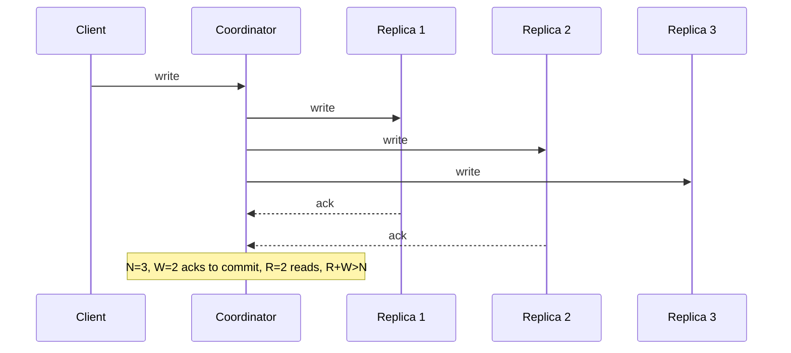
{}

### 32. How would you design idempotency keys for a payment API? {#32}

{}
**The gist:** the client sends a unique key with the request. The server claims that key atomically before charging anything, so a retry finds the existing claim and replays the old answer instead of charging twice.

Require the client to generate a unique idempotency key per logical operation and send it in the request header. The server checks a store keyed on that idempotency key: if it's been seen before, return the previously stored result; if not, atomically claim the key before doing the actual charge.

```sql
INSERT INTO payment_requests (idempotency_key, status)
VALUES ($1, 'processing')
ON CONFLICT (idempotency_key) DO NOTHING;

-- 0 rows affected means a request with this key is already in
-- flight or finished. Look up and return its stored result
-- instead of charging again.
```

The unique constraint is doing the real work here. Two concurrent retries both run this statement, and exactly one of them gets a row back.

**What they're testing:** that the claim happens *before* the charge. Claiming afterwards leaves a window where a retry lands mid-charge, which is the bug this whole design exists to prevent. [Q43](#43) walks the same idea through a full pipeline.
{}

### 33. Explain the outbox pattern for reliably publishing events after a DB write. {#33}

{}
**The gist:** you can't write to the database and publish to a broker atomically. So write the event into the same database in the same transaction, and let a separate relay publish it afterwards.

Instead of writing to the database and then separately publishing to a message broker (which can fail independently), you write the business change and an outbox event row in the *same* database transaction. A separate poller or relay process reads unpublished outbox rows, publishes them, and marks them sent.

```go
tx, _ := db.BeginTx(ctx, nil)
tx.Exec(`UPDATE accounts SET balance = balance - $1 WHERE id = $2`,
    amount, from)
tx.Exec(`INSERT INTO outbox (event_type, payload, published)
         VALUES ($1, $2, false)`, "FundsDebited", payload)
tx.Commit() // business change + outbox row commit atomically

// separate relay process:
// SELECT * FROM outbox WHERE published = false
// -> publish to broker -> mark published = true
```

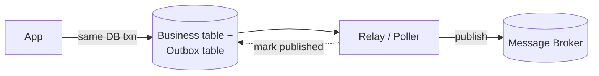

**What they're testing:** whether you can name the dual-write problem. Two writes to two systems can't both be guaranteed, so the trick is to make it one write and move the second one downstream.
{}

### 34. What is a saga pattern, and when would you use it instead of 2PC? {#34}

{}
**The gist:** split the distributed transaction into local steps, each with an undo step. Harder to reason about than 2PC, but nobody holds locks across services while a human approves something.

A saga breaks a distributed transaction into a sequence of local transactions, each with a compensating action to undo it if a later step fails, instead of holding locks across services the way two-phase commit does.

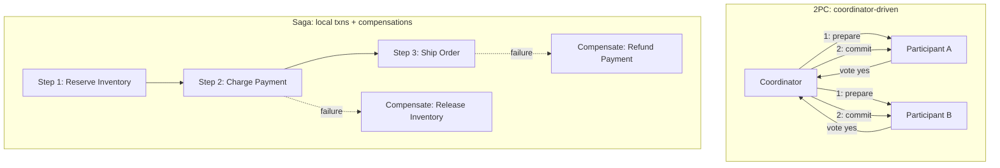
{}

### 35. Explain consistent hashing and why it's used for sharding and caching. {#35}

{}
**The gist:** put nodes and keys on a ring, so adding a node only moves the keys sitting next to it. Plain `hash % N` moves almost every key the moment N changes.

Consistent hashing maps both nodes and keys onto a hash ring, and a key is owned by the next node clockwise on the ring. When a node is added or removed, only the keys between it and its neighbor need to move. With naive `hash(key) % N` sharding, changing N remaps almost every key, which means a cache that's suddenly all misses.

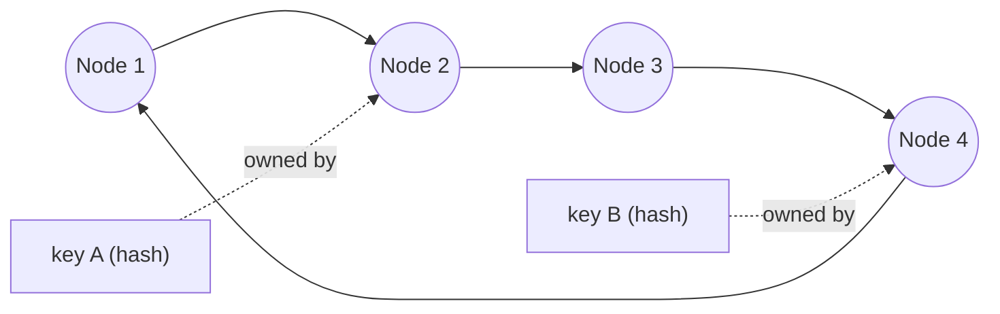
{}

### 36. Walk through Raft leader election and log replication in more depth. {#36}

{}
**The gist:** nodes vote for a leader each term, the leader replicates writes, and an entry only counts as committed once a majority has stored it. That majority rule is what makes committed writes survive any single crash.

Every node is a Follower, Candidate, or Leader, and time is divided into monotonically increasing terms. A Follower that hears no heartbeat before its election timeout becomes a Candidate, increments the term, and requests votes. It becomes Leader on receiving votes from a majority.

The Leader then replicates every write as a log entry to followers. An entry is only committed (safe to apply) once a majority of nodes have persisted it, and the Leader tracks a commit index that only advances forward.

If a Leader crashes mid-replication, the next elected Leader is guaranteed to already have every committed entry, because of the election rule that a node only votes for candidates with an equally or more up-to-date log. So no committed write is ever lost.


**What they're testing:** the follow-up, which is always "what happens if the leader crashes mid-write." The answer is the election restriction: a candidate missing committed entries can't win a majority.
{}

### 37. Where do strong, causal, and eventual consistency sit relative to each other, and what is "read-your-writes"? {#37}

{}
**The gist:** strong means every read sees the newest write and costs the most. Eventual costs the least and may hand you stale data. Causal and read-your-writes are the useful middle ground.

**Strong consistency:** every read sees the latest committed write, as if there were only one copy of the data. Most expensive, since it needs coordination on every read or write.

**Eventual consistency:** replicas converge given enough time with no new writes, but a read shortly after a write can return stale data. Cheapest, no coordination needed.

**Causal consistency** sits between them: operations that are causally related (a reply to a comment) are seen by everyone in that order, but unrelated operations can be seen in different orders on different replicas.

**Read-your-writes** is a narrower, practical guarantee often layered on top of eventual consistency. A specific client is guaranteed to see its own writes on its next read, for example by routing that client's reads to the replica it wrote to, or via a sticky session, even if other clients might still see stale data.

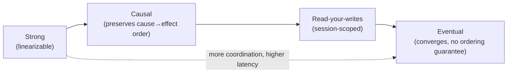
{}

### 38. Explain the bulkhead pattern, and how it differs from a circuit breaker. {#38}

{}
**The gist:** a circuit breaker stops you calling something that's already broken. A bulkhead stops that broken thing from eating the resources everything else needs.

A [circuit breaker](#36) protects a single dependency by stopping calls to it once it's clearly failing. A bulkhead protects everything else from that one dependency by isolating resources: a separate connection pool, goroutine pool, or thread pool per downstream, so a slow or exhausted dependency can only exhaust its own pool rather than starving requests to unrelated services in the same process.

The two compose. Bulkheads limit blast radius, and circuit breakers stop wasting the limited resources bulkheads gave that dependency on calls likely to fail anyway.

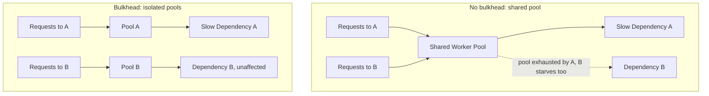

**What they're testing:** whether you see them as complementary rather than alternatives. Answering "a bulkhead instead of a circuit breaker" is the wrong shape, you want both.
{}

---

## System Design Case Studies

*Ten designs you should be able to sketch in five minutes. Try drawing each one before you read the answer, because the drawing is what the interview actually asks for.*

**How to run the 45 minutes.** Every answer below follows the same five steps, and the steps matter more than any single design. Someone asking you to design a URL shortener isn't checking whether you've memorized one. They're watching whether you scope before you build, put numbers on it, and can find the part that's actually hard.

1. **Scope it.** Say what you're building and, just as much, what you're not. Five minutes of "so we don't need analytics or custom domains, right?" saves you from designing the wrong system for the other forty.
2. **Put numbers on it.** Writes per second, reads per second, storage per year. You don't need to be right, you need the right order of magnitude, because that's what decides whether this is one Postgres box or a sharded fleet.
3. **Draw the boxes.** Client, load balancer, service, cache, database, queue. Small enough to fit on the board.
4. **Go deep on the hard part.** There's always one. Find it and spend your time there, because that's what they're grading.
5. **Say what you gave up.** Every design trades something away. Naming the tradeoff yourself is most of the difference between a senior answer and a confident junior one.

**The numbers worth memorizing.** Back-of-envelope maths is a skill you can practice, and it rests on about eight facts:

| Fact | Value |
|---|---|
| Seconds in a day | 86,400, round to 100k |
| 1M per day | about 12/sec |
| 100M per day | about 1,200/sec |
| 1B per day | about 12,000/sec |
| 1KB × 1M rows | 1GB |
| 1KB × 1B rows | 1TB |
| Peak vs average traffic | 2x to 3x |
| Read:write ratio, typical web app | 10:1 to 1000:1 |

And roughly what things cost in time, which is what tells you where a latency budget goes:

| Operation | Time |
|---|---|
| Memory read | 100ns |
| SSD random read | 100µs |
| Network round trip, same datacenter | 0.5ms |
| Network round trip, cross-continent | 150ms |

The point of the second table is that one cross-region hop costs more than a thousand SSD reads. Latency problems are almost always about how many network hops you made, not how fast your code is.

### 39. Design a URL shortener. {#39}

{}
**The gist:** a key-value lookup with a redirect on top. Reads outnumber writes by orders of magnitude, so the cache *is* the design.

**Scope it:** shorten a long URL, redirect a short code, expire a link. Not in scope unless they ask for it: vanity domains, click analytics, user accounts. Say those out loud so they can pull one back in if they want it.

**The numbers:** call it 10M new links a day, which is about 116 writes a second. At a 100:1 read ratio that's 1B redirects a day, near 11,600 reads a second. At roughly 500 bytes a row you write about 4.7GB a day, so 1.7TB a year. Seven base62 characters gives 3.5 trillion codes, which at this rate lasts 965 years. Six gives 56 billion and runs out in 16. So seven, and you can say why.

Key components: a write path that generates a short code (base62-encode an auto-incrementing ID, or a hash with a collision check) and stores `short_code → long_url`, plus a read path that's a simple key lookup and a 301/302 redirect. Reads vastly outnumber writes, so put a cache in front of the database for the read path.

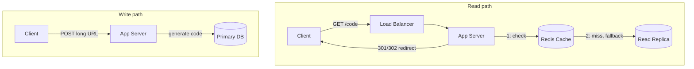

**The part they'll push on:** generating codes without checking for a collision on every write. An auto-incrementing ID that you base62-encode is unique for free, but it leaks how many links exist and makes the next code guessable. A random code needs a uniqueness check, which is a read before every write. The usual answer is to hand each app server a pre-allocated block of IDs from a counter service, so it mints codes locally with no coordination and no collisions.

**What you gave up:** the cache is the entire read path. A cold cache after a restart sends 11,600 requests a second straight at the database, so you warm it from the top-N links before taking traffic.
{}

### 40. Design a distributed rate limiter shared across multiple API gateway instances. {#40}

{}
**The gist:** per-instance counters undercount, because each instance only sees its own share of traffic. The counter has to be shared, and Redis plus one atomic Lua script is the whole answer.

**Scope it:** limit each API client to N requests per window across the whole fleet, and return a 429 with a retry hint. Not in scope: per-endpoint quotas, billing, or fairness between one client's own users.

**The numbers:** 50k requests a second across the fleet means 50k counter operations a second, because every request checks. 10M active clients at about 100 bytes of state each is under 1GB, so the working set fits in memory on a single Redis node. That node is now both your bottleneck and your single point of failure, which is the interesting half of this question.

Each gateway instance can't keep its own local counter, since that under-counts total traffic. Use a shared, fast store (Redis) holding per-client counters with a sliding-window or token-bucket algorithm, implemented via an atomic Lua script.

```lua
-- executed atomically via EVAL, keyed per client
local tokens = tonumber(redis.call('GET', KEYS[1]) or ARGV[1])
if tokens > 0 then
  redis.call('DECRBY', KEYS[1], 1)
  return 1 -- allowed
end
return 0 -- rate limited
```

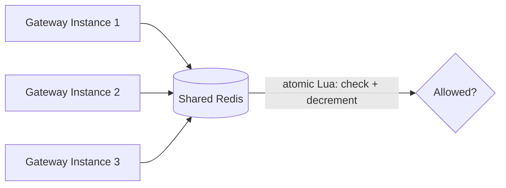

**The part they'll push on:** what happens when Redis is unreachable. Fail open and you've removed the limiter during exactly the incident where you need it most. Fail closed and a Redis blip takes down your entire API. The usual answer is fail open with a local per-instance fallback limit, so you degrade to approximate limiting rather than none at all.

**What you gave up:** every request now pays a network round trip, about 0.5ms in the same AZ. At the p99 that's real money. Teams that can't afford it keep a local token bucket synced periodically, trading exactness for latency.
{}

### 41. Design a real-time fraud scoring system with a tight latency SLA, adding more signals over time. {#41}

{}
**The gist:** run every signal at once with a hard deadline, so you pay for the slowest signal rather than the sum of all of them. Anything too slow gets dropped, not waited for.

**Scope it:** score a transaction as approve, review, or decline inside a fixed latency budget, and let new signals be added later without a rewrite. Not in scope: training the model, or the human review queue behind it.

**The numbers:** say 5k transactions a second and a p99 budget of 100ms end to end. With 8 signals where the slowest takes 80ms, running them in series is 640ms and you've already blown it. In parallel it's 80ms and you fit. That one comparison is the entire design, which is why the fan-out is the first thing you draw.

Run signals in parallel goroutines with a bounded per-request timeout, so total latency is close to the slowest single signal, not the sum. Precompute and cache expensive signals asynchronously ahead of the request, and set a hard deadline so a single slow signal degrades gracefully instead of blowing the SLA.

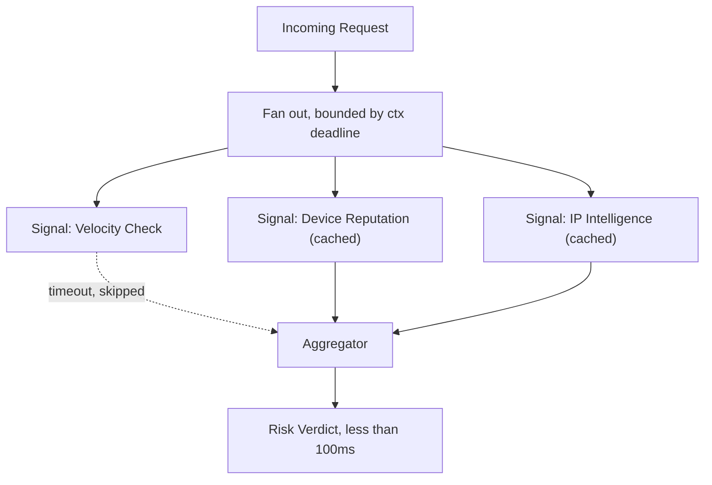

**The part they'll push on:** what a dropped signal does to the score. Silently skipping it means the model sees a different feature set than it was trained on, and the score quietly changes meaning. The honest answer is to pass an explicit "missing" value the model was trained to handle, and to alert on the drop rate, because a signal timing out 30% of the time is a broken signal wearing a working one's name.

**What you gave up:** caching signals ahead of the request means scoring on slightly stale data. For device reputation that's fine. For a velocity check, "how many times has this card been used in the last minute," staleness is the whole signal, so that one has to stay live and inside the budget.
{}

### 42. Design a notification system fanning one event out to millions of users via push, email, and SMS. {#42}

{}
**The gist:** accept the event into a queue immediately, then fan out per user per channel onto separate queues, so a slow SMS provider can't back up your push notifications.

**Scope it:** one event reaches millions of users across push, email and SMS, respecting each channel's rate limits, without duplicate sends. Not in scope: preference management, template rendering, unsubscribe handling.

**The numbers:** one event reaching 10M users across 3 channels is 30M individual messages. Push at 10k/sec clears in about 17 minutes. The same 10M over SMS through a provider capped at 100/sec takes 27.8 hours. That number is the design: the channels cannot share a queue, because the slowest one would hold the others hostage for over a day.

Ingest the triggering event into a message queue rather than processing synchronously. A fan-out worker resolves the target user list (paginated) and publishes one message per user per channel onto per-channel queues, each with dedicated worker pools respecting that channel's own rate limits.

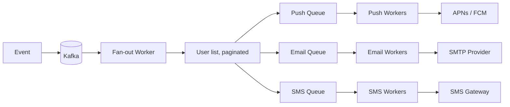

**The part they'll push on:** "fan out to 10M users" is not one job. If a single worker walks the user list, it's a single point of failure that starts over from the beginning when it crashes 8M users in. You split the user list into ranges, hand each range to a worker, and checkpoint progress per range, so a crash resumes instead of restarting.

**What you gave up:** at-least-once delivery means some users get a duplicate. Deduping on (user, event, channel) at the worker catches most of it, but a crash after the provider call and before the dedupe write will still double-send. The real fix is an idempotency key on the provider API, and not every provider offers one.
{}

### 43. Design an idempotent payment processing pipeline that survives retries without double-charging. {#43}

{}
**The gist:** the same idempotency key from [Q32](#32), but now wired through the whole pipeline: claim the key, call the processor, store the outcome, and make sure every retry branch has somewhere sensible to land.

**Scope it:** charge a card exactly once even when the client retries, the network drops, or a worker dies mid-call. Not in scope: refunds, multi-currency, or storing card details.

**The numbers:** 1000 charges a second at peak, against a processor that takes 500ms to 2s. At 2s that's 2000 charges in flight simultaneously, which rules out holding a database transaction open around the processor call. Your connection pool gets sized for the claim and the write, each a few milliseconds, not for the seconds you spend waiting on someone else's API.

[Q32](#32) covers the key itself and the `ON CONFLICT DO NOTHING` claim. This question is about what happens around it once a real payment processor is in the loop.

The client sends a request with a client-generated idempotency key. In a single database transaction, the server claims that key with status `processing`, and the unique constraint means a concurrent duplicate fails immediately. Only after the row is claimed does the service call the payment processor.

The part worth rehearsing is the branches:

- **Key already claimed and finished.** Return the stored result. No second charge.
- **Key already claimed, still processing.** The first attempt is in flight. Return a 409 or poll, don't start a second charge.
- **Claimed, then the process crashes mid-charge.** The row is stuck in `processing`, so you need reconciliation against the processor rather than a blind retry. This is the case people forget.

On success, update the status and write an outbox event ([Q33](#33)) in the same transaction, so downstream systems hear about the charge exactly as reliably as the charge itself was recorded.

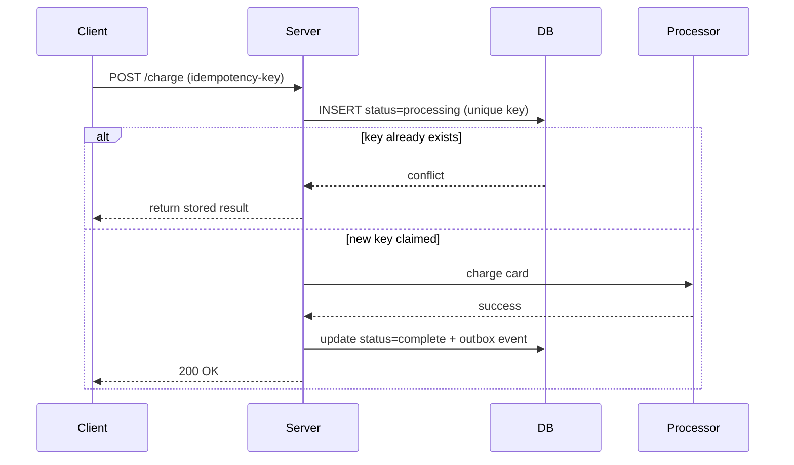

**The part they'll push on:** the crash-mid-charge branch. Everyone gets the happy path and the duplicate path. The stuck `processing` row is where the real conversation starts, because you genuinely cannot tell from your own database whether the card was charged. Only the processor knows, so you need a reconciliation job that queries them by idempotency key and settles the row, plus a timeout after which a `processing` row is considered suspect.

**What you gave up:** a charge is never synchronously certain. The client gets a definite answer on the happy path, and on the crash path it gets "ask again shortly," which the client's own UI has to handle. Systems that promise a synchronous yes or no are lying about the crash case.
{}

### 44. Design a distributed job scheduler where each job runs exactly once even if a node crashes. {#44}

{}
**The gist:** a conditional `UPDATE` is your lock. The one worker whose update actually affects a row owns the job, and a lease makes sure a crashed worker's job comes back.

**Scope it:** run each scheduled job on time, once, surviving worker crashes. Not in scope: job dependencies and DAGs, backfills, or per-job resource isolation.

**The numbers:** 1M jobs a day averages about 12 a second, which sounds trivial and isn't, because scheduled work clusters. Everything set for midnight fires at midnight, so you size for the spike rather than the mean. With 100 workers polling once a second you're also running 100 mostly-empty queries a second against the jobs table, which is why `FOR UPDATE SKIP LOCKED` or a notify channel beats naive polling well before you think it matters.

Store jobs and their next-run-time in a shared database. Workers poll for due jobs and atomically claim one via a conditional update, which acts as a lightweight distributed lock. Include a lease and heartbeat so that if the worker crashes mid-execution, the lock expires and another worker can reclaim it.

```sql
UPDATE jobs
SET locked_by = $1, locked_at = now()
WHERE id = $2 AND locked_by IS NULL;

-- 1 row updated means this worker owns the job.
-- 0 rows updated means another worker already claimed it.
```

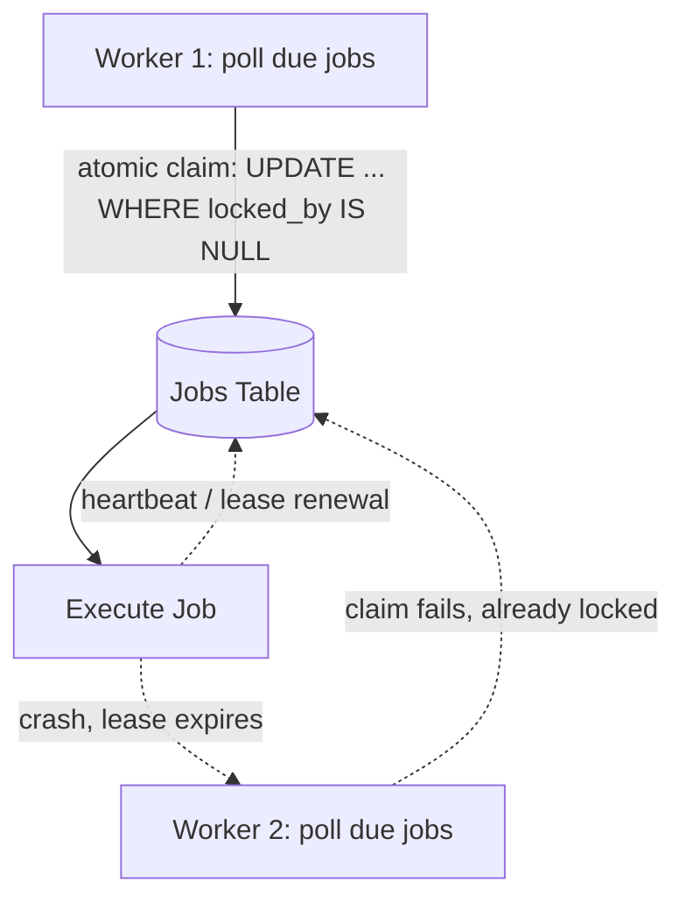

**The part they'll push on:** "exactly once" isn't actually achievable, and they want to see whether you know that. A worker can finish a job, then die before marking it done, and the next worker will run it again. There's no way to make the side effect and the bookkeeping atomic when the side effect is outside your database. The real answer is at-least-once execution plus idempotent jobs, and saying so plainly is the point of the question.

**What you gave up:** you've made your database a queue. That's a genuinely good choice early, because it's one less system and you get transactions for free, but the polling load and lock contention grow with worker count. Past a few hundred workers you're rebuilding a message broker badly, and should switch to one.
{}

### 45. Design a sharded, horizontally-scalable chat backend. {#45}

{}
**The gist:** consistent-hash conversations onto nodes, and put a gateway in front that knows which node owns which conversation. Pub/sub covers anyone who isn't connected to that node.

**Scope it:** 1:1 and group messages, ordered within a conversation, with offline users catching up on reconnect. Not in scope: voice and video, end-to-end encryption, read receipts, or typing indicators.

**The numbers:** 10M daily users and 50M messages a day is 580 a second on average, about 1,700 at a 3x peak. Message throughput is not your problem. Connections are: 1M concurrent WebSockets at roughly 10KB of kernel and application state each is about 500MB per 50k connections, so you need around 20 nodes purely to hold sockets open. Storage at 1KB a message is 47GB a day and 17TB a year.

Shard users and conversations across backend nodes using consistent hashing on a conversation or user ID. A connection-routing gateway looks up which shard owns a conversation and forwards accordingly. For offline delivery, persist messages and use a pub/sub layer so any node can catch up.

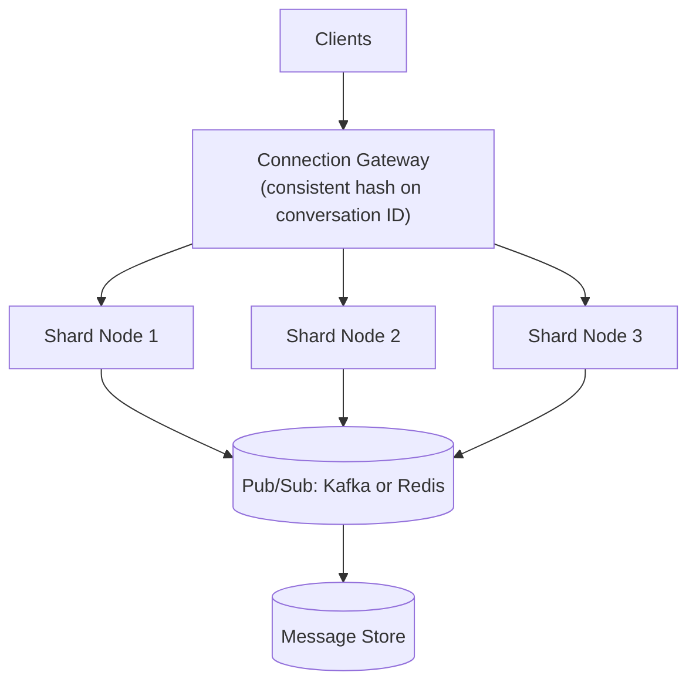

**The part they'll push on:** what happens when a node holding 50k connections dies. All 50k clients reconnect at once, the gateway rehashes them onto the surviving nodes, and those nodes are now carrying extra load while handling a reconnect storm. Without jittered backoff on the client you turn one node failure into a rolling cascade, and this is the failure mode that actually takes chat systems down.

**What you gave up:** hashing on conversation ID keeps ordering trivial, since one node owns the conversation. It also means a single very large group chat is a hotspot that can't be split, so at some size you need a different strategy for those specific conversations.
{}

### 46. Design a system for ingesting and aggregating high-throughput event streams with the right delivery semantics. {#46}

{}
**The gist:** partition by a natural key so ordering holds per entity, accept at-least-once delivery, and make the aggregation an upsert so a replay can't double-count.

**Scope it:** ingest a high-volume event stream and maintain running aggregates that survive consumer restarts. Not in scope: ad-hoc historical queries over raw events, or exactly-once delivery into external systems.

**The numbers:** 500k events a second at 200 bytes each is about 95MB a second, so 7.9TB a day. A Kafka partition handles roughly 10MB/s comfortably, so that's 10 partitions minimum and you'd provision 50 for headroom and consumer parallelism. Seven days of retention is around 55TB, which is a hardware conversation rather than a config line.

Producers publish events partitioned by a natural key (a game ID, say) so ordering is preserved per entity. Consumers process with at-least-once semantics and make aggregation idempotent, using upserts keyed on event ID, so reprocessing after a crash doesn't double-count.

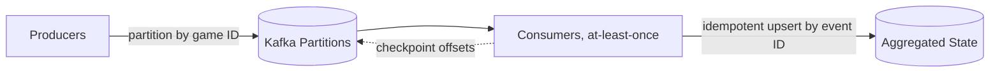

**The part they'll push on:** the partition key, twice over. First, whether you picked it deliberately, since ordering only holds within a partition and the key decides what "in order" even means here. Then the hot key: partitioning by game ID is fine until one game has 100x the traffic of the rest, and that partition's consumer falls behind while the others sit idle. You either split the hot key with a composite key and give up strict per-game ordering, or you accept the lag on that one partition.

**What you gave up:** ordering holds inside a partition and nowhere else, so any aggregate spanning multiple keys has no ordering guarantee at all. If the business asks for a globally ordered view later, that's a redesign, not a config change.
{}

### 47. How would you evolve a monolith into microservices without a risky big-bang rewrite? {#47}

{}
**The gist:** put a proxy in front of the monolith and move one feature at a time behind it. The monolith shrinks instead of getting replaced.

**Scope it:** go from one deployable to several without a rewrite and without a feature freeze. Explicitly not in scope: changing database technology at the same time, which is how these migrations turn into the rewrite you were avoiding.

**The numbers:** the number that matters here isn't QPS, it's how long the first extraction takes. Pick a first service you can ship to production within a quarter. If your best candidate needs six months before anything runs for real, it's the wrong candidate, because you'll spend half a year maintaining two systems with nothing to show for it and the appetite will be gone.

Use the strangler fig pattern: put a routing layer in front of the monolith, then incrementally extract one bounded-context feature at a time into a new service, routing that specific traffic there while everything else still goes to the monolith.

```mermaid
graph LR
    Client --> Proxy["Routing Proxy"]
    Proxy -->|legacy traffic| Monolith
    Proxy -->|extracted feature| NewService["New Service"]
    NewService -. via API, not direct DB .-> Monolith
```

**The part they'll push on:** the database. A service that's been "extracted" but still reads the monolith's tables gives you all the coupling of a distributed monolith and none of the benefits, because you still can't deploy or scale the two independently. The extraction isn't finished until the new service owns its data, and that data migration is usually the expensive part people quietly skip.

**What you gave up:** for the length of the migration you run both systems, with a routing layer and, in places, dual writes. That's more operational surface than you started with, not less, and it stays that way until the last feature moves. Teams that don't finish end up permanently worse off than when they began.
{}

### 48. Design a tamper-evident, queryable audit logging system for a fintech platform. {#48}

{}
**The gist:** append-only, and each entry's hash includes the previous entry's hash. Change anything in the past and every link after it breaks, which is what makes tampering visible.

**Scope it:** append-only, tamper-evident, queryable by actor, resource and time range, retained for the regulatory period. Not in scope: making it tamper-proof, which needs an anchor outside your own infrastructure.

**The numbers:** 50M events a day at 1KB each is 47GB a day and 17TB a year. Fintech retention is commonly seven years, so roughly 119TB. That number is why "put it all in Elasticsearch" is the wrong answer: the append-only log belongs in cheap object storage, and only a recent window needs to sit in the query index.

Write audit events to an append-only store, and make tampering detectable by hash-chaining entries, so each entry's hash includes the previous entry's hash. For queryability, stream and index the same events into a separate query-optimized store asynchronously, keeping the append-only log as the source of truth.

```go
type AuditEntry struct {
    Seq      int64
    Payload  []byte
    PrevHash [32]byte
    Hash     [32]byte
}

func appendEntry(prev AuditEntry, payload []byte) AuditEntry {
    h := sha256.Sum256(append(prev.Hash[:], payload...))
    return AuditEntry{
        Seq:      prev.Seq + 1,
        Payload:  payload,
        PrevHash: prev.Hash,
        Hash:     h,
    }
}

// Altering any past entry changes its Hash, which breaks every
// later entry's PrevHash link. Tampering becomes detectable.
```

```mermaid
graph LR
    Write["Write Event"] --> Log["Append-only hash-chained log<br/>(source of truth)"]
    Log -. async stream .-> Indexer
    Indexer --> Query[(Query store: Elasticsearch)]
```

**The part they'll push on:** a hash chain needs a strict sequence, and a strict sequence means a single writer. At 580 events a second one writer keeps up fine, but it's a single point of failure and it doesn't scale past a point. You partition the chain per tenant, so each tenant gets its own sequence and its own writer, and tampering stays detectable within the boundary that actually matters to an auditor.

**What you gave up:** hash chaining proves the log is internally consistent. It does not stop someone with write access rebuilding the entire chain from a chosen point forward. To close that, you periodically publish the head hash somewhere you don't control, and that gap is exactly the difference between tamper-evident and tamper-proof. Say it before they ask.
{}

---

## What to drill first

If you're earlier in your career and short on time, start with [4](#4) (N+1), [5](#5) (the slow-query checklist), and [15](#15) (idempotency). Those three turn up in ordinary backend work every week, long before anyone asks you to design a distributed system.

**[Databases & Database Optimization](#databases--database-optimization):** worth its own drilling pass. Indexing, isolation levels, and locking and deadlocks ([6](#6), [8](#8), [9](#9)) come up constantly in architect-level interviews, even outside a formal system design segment.

**[System Design Fundamentals](#system-design-fundamentals):** practice actually drawing [18](#18) through [20](#20) from memory, not just describing them out loud. CAP and the three caching strategies are the two most likely to become a whiteboard request.

**[Distributed Systems Concepts](#distributed-systems-concepts):** [36](#36) (Raft), [37](#37) (the consistency spectrum), and [38](#38) (bulkhead) are the ones most likely to turn into a follow-up "ok, now what if the leader crashes mid-write" question, so have those diagrams reflexive, not just recitable. [24](#24), [25](#25), and [31](#31) through [35](#35) are worth sketching too.

**[System Design Case Studies](#system-design-case-studies):** [39](#39) through [48](#48) are the whole point of the round. Draw each one on paper before reading the answer, because describing a diagram you can't draw falls apart the moment someone asks a follow-up.

---

Part 3 of 7 · [Interview Prep](/interview-prep/) · ← Previous: [Part 2 — Coding Patterns](/interview-prep-coding-patterns/) · Next: [Part 4 — Advanced SQL](/interview-prep-sql-advanced/) →
