Part 3 of 7 · [Interview Prep](/interview-prep/) · ← Previous: [Part 2 — Coding Patterns](/interview-prep-coding-patterns/) · Next: [Part 4 — Advanced SQL](/interview-prep-sql-advanced/) →

## Databases & Database Optimization

| # | Question | Answer |
|---|----------|--------|
| <span id="1"></span>1 | What do the four ACID properties guarantee, with a concrete example of a violation? | Atomicity: a transaction is all-or-nothing — no partial writes are ever visible. Consistency: a transaction moves the DB from one valid state to another, respecting constraints/invariants. Isolation: concurrent transactions don't see each other's uncommitted intermediate state. Durability: once committed, a write survives a crash (typically via a write-ahead log flushed to disk before the commit is acknowledged). Violation example: without atomicity, a funds transfer that debits one account but crashes before crediting the other leaves money vanished. |
| <span id="2"></span>2 | Normalization vs. denormalization — what's the trade-off, and when would you denormalize? | Normalization (3NF and beyond) splits data into related tables joined by foreign keys so each fact is stored once — saves storage and avoids update anomalies, at the cost of needing joins to read. Denormalization intentionally duplicates or pre-joins data to avoid those joins at read time — cheaper reads, but risks write-time inconsistency and extra storage. Denormalize for read-heavy, write-light workloads, e.g. a precomputed "order summary" table instead of joining orders+items+users on every page load. |
| <span id="3"></span>3 | Why does column order matter in a composite (multi-column) index, and what makes an index "covering"? | A composite index on `(a, b, c)` is only useful for queries filtering on a left prefix of those columns — it serves `WHERE a = ?` and `WHERE a = ? AND b = ?`, but not `WHERE b = ?` alone. Put the most selective or most commonly-filtered-alone column first. A covering index additionally includes every column a query needs (via `INCLUDE`, or as a composite over all selected + filtered columns), so the DB can answer the query entirely from the index without touching the table — an "index-only scan." |
| <span id="4"></span>4 | What is the N+1 query problem, and how do you fix it? | It happens when code fetches N parent records with one query, then loops over them issuing one more query per record for related data — 1 + N queries where 2 would do. Classic ORM footgun: accessing a lazy-loaded association inside a loop. Fix: eager-load the association up front with a `JOIN`, or batch the follow-up lookups into a single `WHERE parent_id IN (...)` query and group the results in memory. |
| <span id="5"></span>5 | You're handed a slow production query — what do you check, in order? | (1) `EXPLAIN ANALYZE` it — is it doing a sequential scan on a large table it shouldn't be? (2) Confirm an index exists on the filtered/joined columns and its leading columns match the query. (3) Check whether it's actually N+1 queries in disguise from the calling code, not one slow query. (4) Check table statistics are fresh and the table isn't bloated (`ANALYZE`/`VACUUM` in Postgres). (5) Check the connection pool isn't saturated — queries queueing for a connection look slow even when the query itself is fine (see [connection pooling](#75) in Part 1). (6) For a genuinely hot read path, reach for caching ([Q20](#20)) or a read replica ([Q10](#10)) before reaching for a bigger box. |

#### 6 — How does a B-tree index make lookups fast, and when does an index *not* help? {#6}
A B-tree keeps keys sorted in a balanced tree, so a lookup walks from root to leaf in O(log n) comparisons instead of scanning every row, and leaf nodes are linked in sorted order, which makes range scans (`BETWEEN`, `ORDER BY`) cheap too. Each leaf entry points back to the actual row. An index does *not* help when: the column has low cardinality/selectivity (a boolean flag on a huge table — half the table matches anyway, so the planner rightly prefers a sequential scan); the query wraps the column in a function (`WHERE LOWER(email) = ...`) without a matching expression index; the pattern has a leading wildcard (`LIKE '%foo'` can't use a plain B-tree — needs a trigram or full-text index); or the table is small enough that a full scan is simply cheaper than random index lookups.

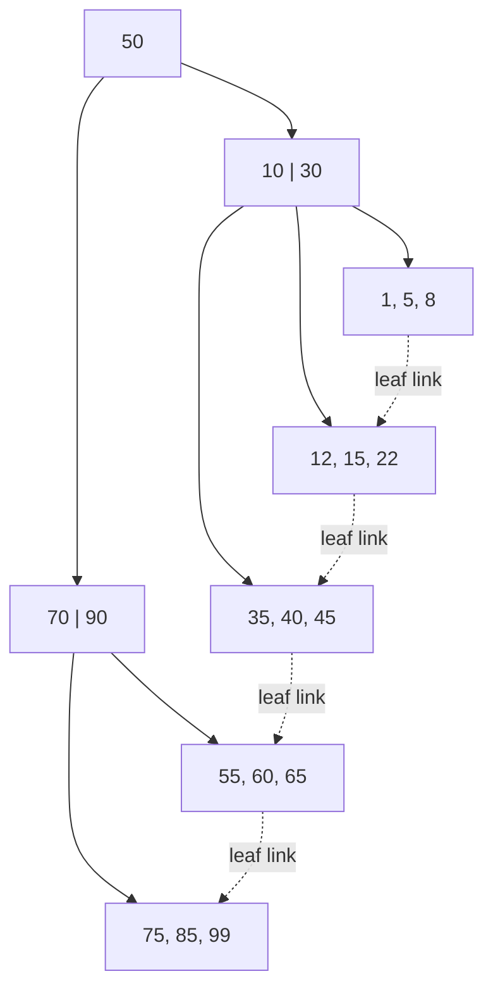

#### 7 — How do you read a query execution plan to diagnose a slow query? {#7}
`EXPLAIN ANALYZE` actually runs the query and shows the plan the optimizer chose plus real timings. Key things to check: the scan type per node (`Seq Scan` = full table scan, `Index Scan` = uses an index then fetches the row, `Index Only Scan` = answered entirely from the index, `Bitmap Heap Scan` = combines several index matches before hitting the table); the cost estimate (startup..total, in arbitrary planner units); and — most important — estimated rows vs. actual rows. A big divergence between them means the table's statistics are stale (the planner is guessing wrong), which itself can cause it to pick a bad plan; the fix is often just `ANALYZE table_name`.

```sql
-- No index on customer_id:
EXPLAIN ANALYZE SELECT * FROM orders WHERE customer_id = 42;

Seq Scan on orders  (cost=0.00..18334.00 rows=12 width=120) (actual time=0.02..142.30 rows=8 loops=1)
  Filter: (customer_id = 42)
  Rows Removed by Filter: 999992

-- After: CREATE INDEX idx_orders_customer_id ON orders(customer_id);
Index Scan using idx_orders_customer_id on orders  (cost=0.42..8.44 rows=12 width=120) (actual time=0.015..0.021 rows=8 loops=1)
  Index Cond: (customer_id = 42)
```

#### 8 — Explain the transaction isolation levels and the anomalies each one prevents. {#8}
Each stricter level prevents more of the "read" anomalies that come from concurrent transactions, at the cost of more locking/lower concurrency:

| Isolation level | Dirty read | Non-repeatable read | Phantom read |
|---|---|---|---|
| Read Uncommitted | possible | possible | possible |
| Read Committed | prevented | possible | possible |
| Repeatable Read | prevented | prevented | possible (Postgres's snapshot-based RR also prevents phantoms) |
| Serializable | prevented | prevented | prevented |

A **dirty read** sees another transaction's uncommitted write. A **non-repeatable read** re-reads the same row within one transaction and gets a different value because another transaction committed a change in between. A **phantom read** re-runs the same filtered query and sees a different *set* of rows because another transaction inserted/deleted matching rows in between. Most applications default to Read Committed; Serializable is reserved for invariants that absolutely cannot tolerate any anomaly, since it costs the most concurrency (often via retries on serialization failure).

#### 9 — Optimistic vs. pessimistic locking, and how does a deadlock happen? {#9}
Pessimistic locking acquires a lock before touching a row (`SELECT ... FOR UPDATE`) so nothing else can modify it until you're done — safe under contention, but reduces concurrency and can deadlock. Optimistic locking doesn't lock at all: read a version/timestamp column, do the work, then write conditionally on that version being unchanged (`WHERE version = read_version`), retrying on a mismatch — better throughput when contention is low, wasted work when it's high. A deadlock happens when two transactions each hold a lock the other is waiting for, in opposite order — a circular wait. The DB's deadlock detector picks a victim, rolls it back with an error, and the application must retry it. The fix is to always acquire locks on rows in a consistent, global order.

```sql
-- T1                                  -- T2
BEGIN;                                 BEGIN;
UPDATE accounts SET balance -= 10
  WHERE id = 1;                        UPDATE accounts SET balance -= 10
                                          WHERE id = 2;
UPDATE accounts SET balance += 10      UPDATE accounts SET balance += 10
  WHERE id = 2;  -- waits on T2's lock   WHERE id = 1;  -- waits on T1's lock
                                        -- circular wait -> DB kills one as deadlock victim
```

#### 10 — Explain leader-follower replication and replication lag. {#10}
Writes go to the leader (primary), which streams its change log (e.g. Postgres's WAL) to one or more followers (replicas), which apply the changes and can serve reads. This gives horizontal read scaling and a hot standby for failover. Because replication is usually asynchronous, followers apply changes with a delay — replication lag — so a read against a follower immediately after a write to the leader can return stale data. This bites hardest on "read your own write" right after an update: either route that specific read to the leader, or use synchronous replication for stronger consistency at a latency cost. See also sharding/partitioning ([Q13](#13)), which splits data across nodes rather than copying all of it to each.

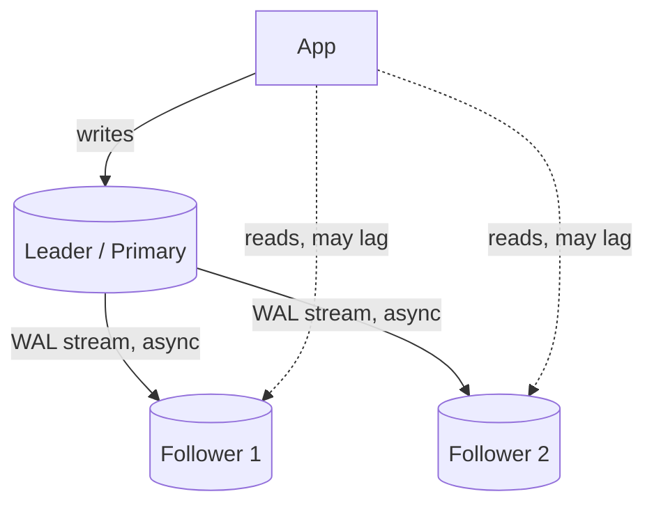

---

## Key Concepts: What to Reach For

Before the Q&A: here's the same material as a map. Each row is a concept and the situation that should make you reach for it, so you can orient before drilling into the "why" in the questions below (numbers point to where each one is covered in depth).

**Scaling & data distribution**

| Concept | When to reach for it |
|---|---|
| Horizontal scaling | You've hit a ceiling on one box and the workload is stateless enough to split across many ([Q11](#11)). |
| Sharding / horizontal partitioning | A single database's write throughput or storage has become the bottleneck ([Q13](#13)). |
| Consistent hashing | Nodes get added/removed and you need only a fraction of keys to remap, not almost all of them ([Q35](#35)). |
| Caching: cache-aside / write-through / write-behind | Reads vastly outnumber writes and some staleness is tolerable — pick the variant by how fresh reads need to be vs. how fast writes need to be ([Q20](#20)). |
| L4 vs. L7 load balancing | L4 when you just need fast, protocol-agnostic distribution; L7 when routing needs to look at path, host, or cookies ([Q19](#19)). |

**Consistency & coordination**

| Concept | When to reach for it |
|---|---|
| CAP theorem | Framing any "what happens during a network partition" design decision ([Q18](#18)). |
| PACELC | Same question, but you also need to reason about the latency/consistency trade-off when there's *no* partition ([Q30](#30)). |
| Consistency spectrum (strong / causal / read-your-writes / eventual) | Picking the cheapest guarantee that's still correct for the feature — a like count needs less than a balance check ([Q12](#12), [Q37](#37)). |
| Quorum reads/writes (N/R/W) | You're replicating across N nodes and want a tunable guarantee that reads see the latest write ([Q31](#31)). |
| Distributed locks | Coordinating mutual exclusion across processes, not just goroutines in one process ([Q21](#21)). |
| Leader election / Raft | A cluster of nodes needs to agree on exactly one coordinator, and that agreement must survive crashes ([Q22](#22), [Q36](#36)). |
| Clock skew / logical clocks | You need to order events across machines and wall-clock timestamps aren't reliable enough ([Q24](#24)). |

**Messaging & delivery**

| Concept | When to reach for it |
|---|---|
| Sync vs. async communication | Sync when you need an immediate answer and can accept coupling to the callee's availability; async when you can decouple in time ([Q16](#16)). |
| Backpressure | A fast producer would otherwise overwhelm a slow consumer's buffer ([Q17](#17)). |
| Idempotency & idempotency keys | A client might retry a request and you need retries to be safe ([Q15](#15), [Q32](#32)). |
| Delivery semantics (at-most / at-least / exactly-once) | Deciding what a message queue actually guarantees you, and what your own code still has to guarantee on top ([Q23](#23)). |
| Outbox pattern | You need a DB write and a message publish to succeed or fail together ([Q33](#33)). |
| Saga vs. two-phase commit | A transaction spans multiple services and holding locks across all of them (2PC) is too heavyweight ([Q34](#34)). |
| Kafka vs. RabbitMQ vs. NATS | Kafka for a durable, replayable event log; RabbitMQ for flexible routing and per-message ack/retry; NATS for low-latency, lightweight pub/sub ([Q14](#14)). |
| Gossip protocols | Detecting node failure across a large cluster without a central bottleneck ([Q29](#29)). |

**Resilience & failure handling**

| Concept | When to reach for it |
|---|---|
| Thundering herd mitigation (jitter, coalescing) | Many clients would otherwise retry or wake up at the same instant against a recovering resource ([Q25](#25)). |
| Bulkhead vs. circuit breaker | Bulkhead to stop one dependency's failure from starving resources shared with everything else; circuit breaker to stop calling a dependency that's clearly already failing ([Q38](#38)). |
| Byzantine vs. crash fault tolerance | Byzantine only matters in adversarial/untrusted settings; infrastructure you control just needs crash-fault tolerance (Raft/Paxos) ([Q26](#26)). |
| Two Generals' Problem | Reasoning about why perfect agreement over an unreliable channel is impossible, and why we settle for retries + idempotency instead ([Q27](#27)). |
| CRDTs | Replicas need to accept writes independently (offline-first, multi-region) and eventual convergence is good enough ([Q28](#28)). |

**Applied patterns (case studies)**

| Pattern | Use case it solves |
|---|---|
| Read-heavy key lookup + cache in front of DB | URL shortener ([Q39](#39)). |
| Shared atomic counter (Redis + Lua) | Rate limiting across multiple gateway instances ([Q40](#40)). |
| Bounded parallel fan-out with a deadline | Aggregating many signals under a tight latency SLA ([Q41](#41)). |
| Queue-based fan-out per channel | Notifying millions of users across push/email/SMS ([Q42](#42)). |
| Idempotency key + unique constraint | Payment processing that survives retries without double-charging ([Q43](#43)). |
| Atomic claim + lease/heartbeat | A job scheduler where each job runs exactly once, even across crashes ([Q44](#44)). |
| Consistent hashing + pub/sub | A sharded, horizontally-scalable chat backend ([Q45](#45)). |
| Partition by natural key + idempotent upsert | High-throughput event ingestion without double-counting on reprocess ([Q46](#46)). |
| Strangler fig | Migrating a monolith to microservices incrementally, without a big-bang rewrite ([Q47](#47)). |
| Hash-chained append-only log | Tamper-evident, queryable audit logging ([Q48](#48)). |

---

## System Design Fundamentals

| # | Question | Answer |
|---|----------|--------|
| <span id="11"></span>11 | Difference between vertical and horizontal scaling, and when does horizontal stop being trivial? | Vertical scaling means a bigger machine — simple, but has a hard ceiling. Horizontal scaling means more machines sharing load, but stops being trivial the moment state enters the picture: stateless request handling scales linearly, but a stateful component needs partitioning, replication, or coordination logic. |
| <span id="12"></span>12 | Explain eventual consistency with a good-fit and bad-fit example. | Eventual consistency means replicas will converge given enough time without new writes, but reads shortly after a write might see stale data. Good fit: a "like count." Bad fit: an account balance check right before authorizing a large withdrawal. |
| <span id="13"></span>13 | Difference between horizontal and vertical partitioning (sharding) of a database? | Vertical partitioning splits a table by columns — same rows, different tables. Horizontal partitioning (sharding) splits a table by rows across multiple database instances based on a shard key — each shard holds a subset of rows but the full schema. |
| <span id="14"></span>14 | When would you choose Kafka vs RabbitMQ vs NATS? | Kafka: high-throughput, durable, replayable event log — ideal for event sourcing and stream processing. RabbitMQ: flexible routing, strong work-queue semantics with per-message ack/retry. NATS: extremely low latency, lightweight pub/sub. |
| <span id="15"></span>15 | Explain idempotency and why it matters in distributed systems. | An idempotent operation produces the same end result no matter how many times it's applied — critical because network failures mean clients can't always tell if a request succeeded, so they must be able to safely retry. |
| <span id="16"></span>16 | Synchronous vs asynchronous communication between services — tradeoffs? | Synchronous: simpler, immediate feedback, but couples the caller's availability to the callee's. Asynchronous: decouples services in time, at the cost of eventual consistency and more complex failure/retry/ordering handling. |
| <span id="17"></span>17 | Explain backpressure and why a fast producer + slow consumer needs it. | Backpressure is a mechanism for a slow consumer to signal a fast producer to slow down, preventing unbounded buffering that leads to memory exhaustion or unbounded latency growth. |

#### 18 — Explain CAP theorem with a concrete example. {#18}
Under a network partition, a distributed system must choose between Consistency (every read sees the latest write) and Availability (every request gets a response, even if possibly stale). Example choosing AP: a shopping cart service that keeps accepting writes during a partition and reconciles later. Example choosing CP: a bank ledger balance check that would rather return an error than risk showing a stale balance.

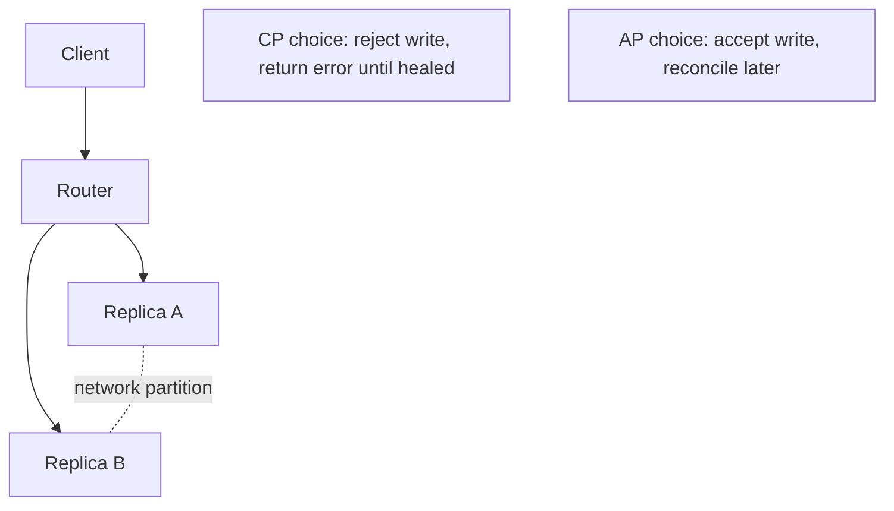

#### 19 — Explain L4 vs L7 load balancing. {#19}
L4 (transport layer) balances based on IP/port and TCP/UDP-level info without inspecting request content — fast, protocol-agnostic. L7 (application layer) understands HTTP and can route based on path, host header, or cookies — more flexible but adds processing overhead.


#### 20 — Explain caching strategies: cache-aside, write-through, write-behind. {#20}
Cache-aside: app checks cache first, on a miss reads from DB and populates the cache. Write-through: writes go to the cache and DB synchronously together — reads always fresh, writes slower. Write-behind: writes go to the cache immediately and are asynchronously flushed to the DB later — fastest writes, risks data loss if the cache fails before flushing.

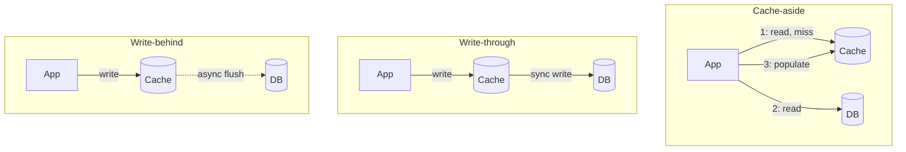

---

## Distributed Systems Concepts

| # | Question | Answer |
|---|----------|--------|
| <span id="21"></span>21 | Explain a distributed lock, and why plain mutexes don't work across services. | A `sync.Mutex` only coordinates goroutines within a single process's memory space. A distributed lock uses a shared external system (Redis Redlock, or etcd/Zookeeper with consensus-backed leases) so multiple independent processes can agree on mutual exclusion, typically with a lease/TTL. |
| <span id="22"></span>22 | What's leader election, and how does it typically work? | A mechanism for a group of distributed nodes to agree on exactly one "leader." Typically implemented via a consensus protocol like Raft — nodes propose themselves, a majority quorum must agree, and if the leader fails to renew its lease, a new election triggers. |
| <span id="23"></span>23 | At-most-once vs at-least-once vs exactly-once delivery — why is exactly-once mostly a myth? | At-most-once: message might be lost. At-least-once: guaranteed delivered, but possibly more than once. Exactly-once is extremely hard end-to-end; in practice, systems achieve "effectively exactly-once" by combining at-least-once delivery with idempotent processing. |
| <span id="24"></span>24 | How do clock skew and distributed time affect ordering of events across services? | Wall-clock timestamps from different machines aren't reliably comparable due to clock drift. Solutions: logical clocks (Lamport/vector clocks) that capture causal ordering, or a centralized sequencer/monotonic ID source when a single global order is required. |
| <span id="25"></span>25 | What is the thundering herd problem, and how do jitter/coalescing prevent it? | Thundering herd is when a large number of clients wake up or retry simultaneously, overwhelming a resource that was just recovering. Jittered backoff randomizes retry timing; request coalescing (single-flight) ensures only one actual request goes to the backend when many callers request the same resource. |
| <span id="26"></span>26 | What's the difference between Byzantine and crash-fault tolerance, and why do Raft/Paxos only handle the latter? | Crash-fault tolerance assumes a failed node simply stops responding — it never lies. Byzantine fault tolerance assumes a node can behave arbitrarily: send conflicting messages to different peers, claim false state, or act maliciously. Raft and Paxos only tolerate crash faults, which is why they're safe for trusted infrastructure you control (your own replica set) but insufficient for adversarial settings like blockchain consensus, which need BFT protocols (PBFT, Tendermint) instead. |
| <span id="27"></span>27 | What is the Two Generals' Problem, and what does it actually prove about distributed consensus? | Two armies must attack a city simultaneously to win, but can only coordinate via messengers who might be captured (messages that might be lost). No matter how many acknowledgments are exchanged, neither general can ever be 100% certain the other received the final ACK, so perfect agreement over an unreliable channel is provably impossible. In practice, systems don't solve this — they work around it with retries, timeouts, and idempotency, accepting a vanishingly small but nonzero risk instead of a mathematical guarantee. |
| <span id="28"></span>28 | What is a CRDT, and when would you reach for one instead of a distributed lock? | A Conflict-free Replicated Data Type is a data structure (counter, set, map) designed so that concurrent updates from different replicas can always be merged deterministically into the same final state, without coordination or locking — e.g. a grow-only counter that merges by taking the max per-replica count. Reach for one when replicas need to accept writes independently (offline-first apps, multi-region writes) and eventual convergence is good enough; skip it when you need a strict invariant a CRDT can't express, like "balance never goes negative." |
| <span id="29"></span>29 | How does a gossip protocol detect node failure in a cluster, and how does that differ from a centralized health check? | Each node periodically pings a few random peers and forwards what it's heard about others' health, so failure information spreads epidemic-style across the cluster in O(log N) rounds without a central bottleneck or single point of failure. A centralized health-check registry is simpler to reason about but doesn't scale as well and becomes a single point of failure itself; gossip (e.g. SWIM) trades a small amount of detection latency for horizontal scalability and resilience. |
| <span id="30"></span>30 | What does PACELC add to CAP theorem? | CAP only describes the tradeoff during a network partition (P). PACELC extends it: if Partitioned, choose Availability or Consistency (as in CAP) — Else, even with no partition at all, choose Latency or Consistency, since synchronously confirming a write across replicas for strong consistency always costs latency versus acknowledging locally and replicating asynchronously. It's a more complete lens for classifying real systems — e.g. DynamoDB is PA/EL, while a synchronously-replicated SQL cluster is PC/EC. |

#### 31 — Explain quorum-based consistency (N/R/W). {#31}
N is the total number of replicas; W is how many replicas must acknowledge a write before it's considered successful; R is how many replicas a read must query and reconcile before returning a result. If `R + W > N`, every read is guaranteed to overlap with the most recent write's replica set.

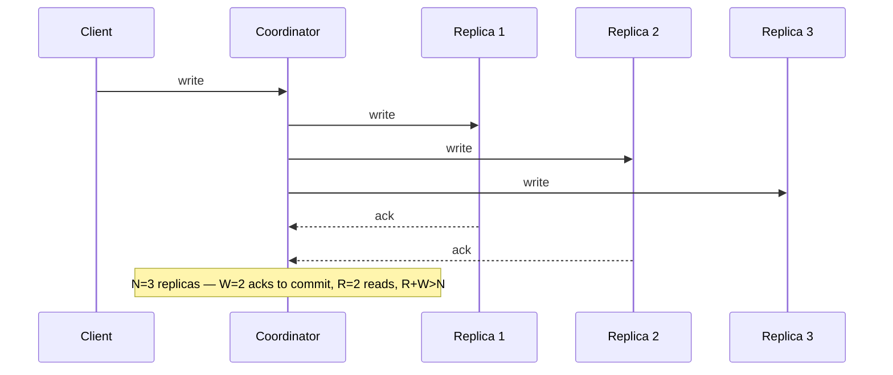

#### 32 — How would you design idempotency keys for a payment API? {#32}
Require the client to generate a unique idempotency key per logical operation and send it in the request header. The server checks a store keyed on that idempotency key — if seen before, return the previously stored result; if not, atomically claim the key before doing the actual charge.

```sql
INSERT INTO payment_requests (idempotency_key, status)
VALUES ($1, 'processing')
ON CONFLICT (idempotency_key) DO NOTHING;
-- 0 rows affected => a request with this key is already in
-- flight/done -- look up and return its stored result instead
-- of charging again.
```

#### 33 — Explain the outbox pattern for reliably publishing events after a DB write. {#33}
Instead of writing to the DB and then separately publishing to a message broker (which can fail independently), you write the business change and an "outbox" event row in the *same* database transaction. A separate poller/relay process reads unpublished outbox rows and publishes them, marking them sent.

```go
tx, _ := db.BeginTx(ctx, nil)
tx.Exec(`UPDATE accounts SET balance = balance - $1 WHERE id = $2`, amount, from)
tx.Exec(`INSERT INTO outbox (event_type, payload, published)
         VALUES ($1, $2, false)`, "FundsDebited", payload)
tx.Commit() // business change + outbox row commit atomically

// separate relay process:
// SELECT * FROM outbox WHERE published = false
// -> publish to broker -> mark published = true
```

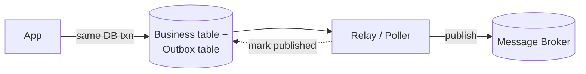

#### 34 — What is a saga pattern, and when would you use it instead of 2PC? {#34}
A saga breaks a distributed transaction into a sequence of local transactions, each with a compensating action to undo it if a later step fails — instead of holding locks across services as two-phase commit does.


#### 35 — Explain consistent hashing and why it's used for sharding/caching. {#35}
Consistent hashing maps both nodes and keys onto a hash ring; a key is owned by the next node clockwise on the ring. When a node is added or removed, only the keys between it and its neighbor need to move — unlike naive `hash(key) % N` sharding, where changing N remaps almost every key.

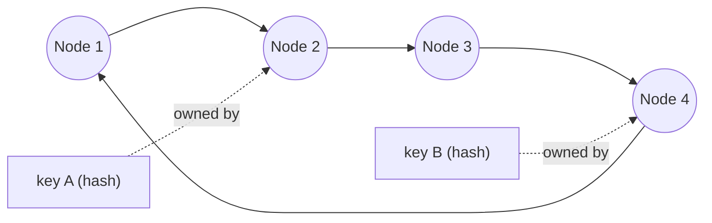

#### 36 — Walk through Raft leader election and log replication in more depth. {#36}
Every node is Follower, Candidate, or Leader, and time is divided into monotonically increasing terms. A Follower that hears no heartbeat before its election timeout becomes a Candidate, increments the term, and requests votes; it becomes Leader on receiving votes from a majority. The Leader then replicates every write as a log entry to followers; an entry is only committed (safe to apply) once a majority of nodes have persisted it, and the Leader tracks a commit index that only advances forward. If a Leader crashes mid-replication, the next elected Leader is guaranteed (by the election rule that a node only votes for candidates with an equally-or-more up-to-date log) to already have every committed entry, so no committed write is ever lost.

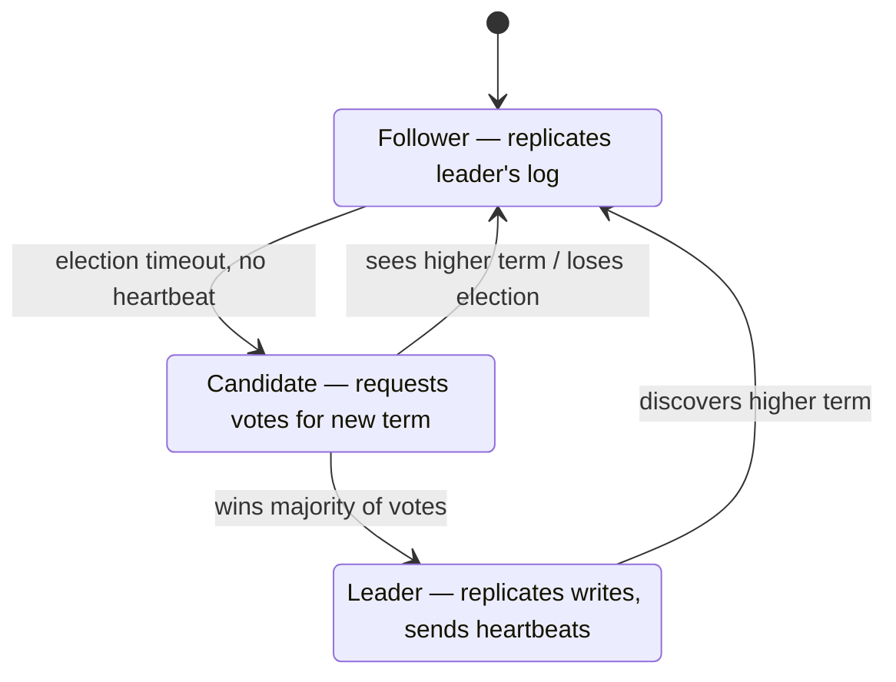

#### 37 — Where do strong, causal, and eventual consistency sit relative to each other, and what is "read-your-writes" consistency? {#37}
Strong consistency: every read sees the latest committed write, as if there were only one copy of the data — most expensive, since it needs coordination on every read or write. Eventual consistency: replicas converge given enough time with no new writes, but a read shortly after a write can return stale data — cheapest, no coordination needed. Causal consistency sits between them: operations that are causally related (a reply to a comment) are seen by everyone in that order, but unrelated operations can be seen in different orders on different replicas. Read-your-writes is a narrower, practical guarantee often layered on top of eventual consistency: a specific client is guaranteed to see its own writes on its next read (e.g. by routing that client's reads to the replica it wrote to, or a sticky session), even if other clients might still see stale data.

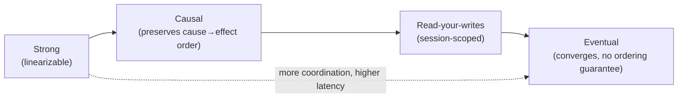

#### 38 — Explain the bulkhead pattern, and how it differs from a circuit breaker. {#38}
A circuit breaker protects a single dependency by stopping calls to it once it's clearly failing. A bulkhead protects everything else from that one dependency by isolating resources — e.g. a separate connection pool, goroutine pool, or thread pool per downstream — so a slow or exhausted dependency can only exhaust its own pool, not starve requests to unrelated services sharing the same process. The two compose: bulkheads limit blast radius, circuit breakers stop wasting the (limited) resources bulkheads gave that dependency on calls likely to fail anyway.

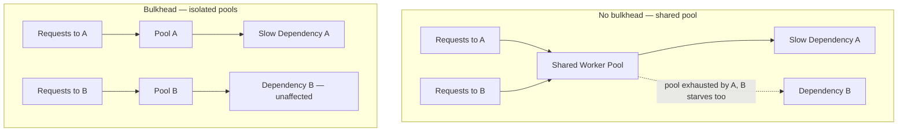

---

## System Design Case Studies

#### 39 — Design a URL shortener. {#39}
Key components: a write path that generates a short code (base62-encode an auto-incrementing ID, or a hash with collision check) and stores `short_code → long_url`; a read path that's a simple key lookup and 301/302 redirect. Reads vastly outnumber writes, so put a cache in front of the DB for the read path.

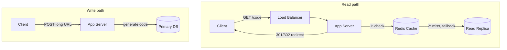

#### 40 — Design a distributed rate limiter shared across multiple API gateway instances. {#40}
Each gateway instance can't keep its own local counter, since that under-counts total traffic. Use a shared, fast store (Redis) holding per-client counters with a sliding-window or token-bucket algorithm implemented via an atomic Lua script.

```lua
-- executed atomically via EVAL, keyed per client
local tokens = tonumber(redis.call('GET', KEYS[1]) or ARGV[1])
if tokens > 0 then
  redis.call('DECRBY', KEYS[1], 1)
  return 1 -- allowed
end
return 0 -- rate limited
```

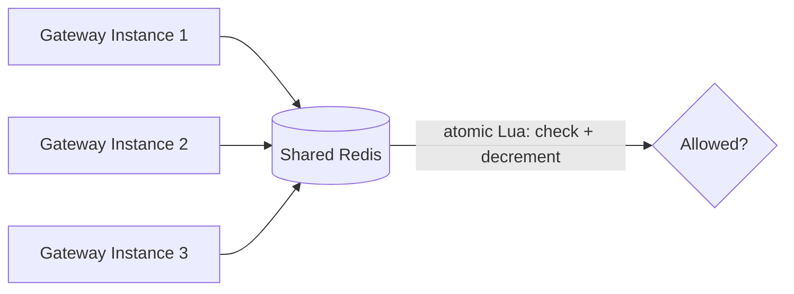

#### 41 — Design a real-time fraud/risk scoring system with a tight latency SLA (<100ms), adding more signals over time. {#41}
Run signals in parallel goroutines with a bounded per-request timeout, so total latency is close to the slowest single signal, not the sum. Precompute/cache expensive signals asynchronously ahead of the request, and set a hard deadline so a single slow signal degrades gracefully rather than blowing the SLA.

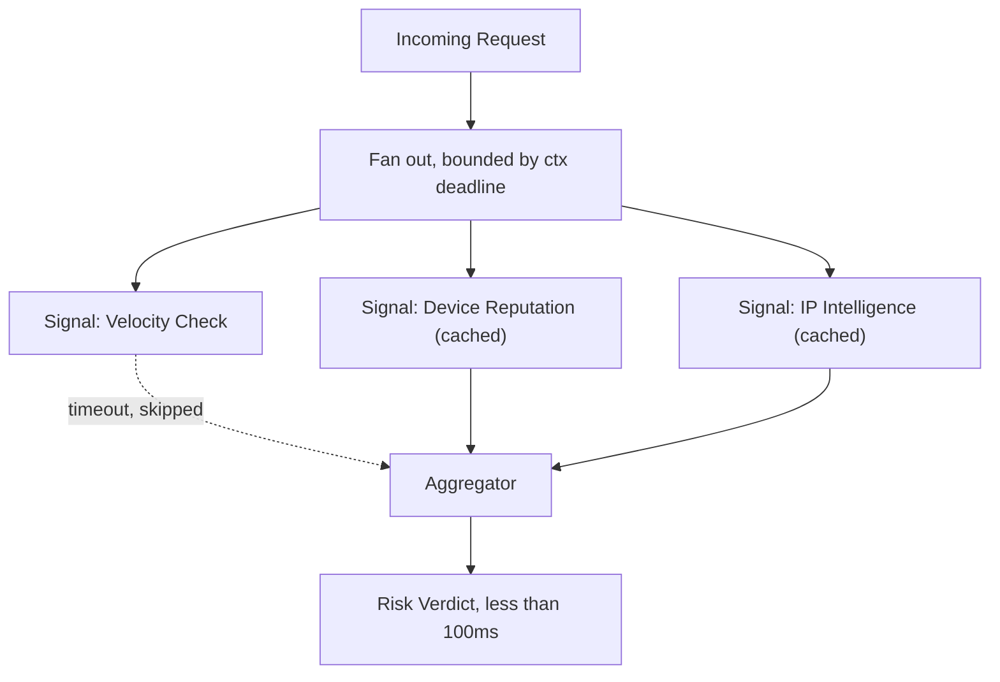

#### 42 — Design a notification system fanning a single event out to millions of users via push/email/SMS. {#42}
Ingest the triggering event into a message queue rather than processing synchronously. A fan-out worker resolves the target user list (paginated) and publishes one message per user per channel onto per-channel queues, each with dedicated worker pools respecting that channel's own rate limits.

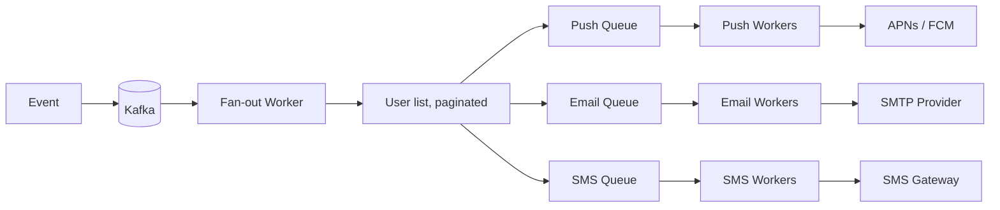

#### 43 — Design an idempotent payment processing pipeline that survives retries without double-charging. {#43}
Client sends a request with a client-generated idempotency key. Server, in a single DB transaction, tries to insert a row keyed on that idempotency key with status "processing" — a unique constraint means a concurrent duplicate insert fails immediately. Only after the row is claimed does the service call the payment processor.

```sql
INSERT INTO payment_requests (idempotency_key, status)
VALUES ($1, 'processing')
ON CONFLICT (idempotency_key) DO NOTHING;
```

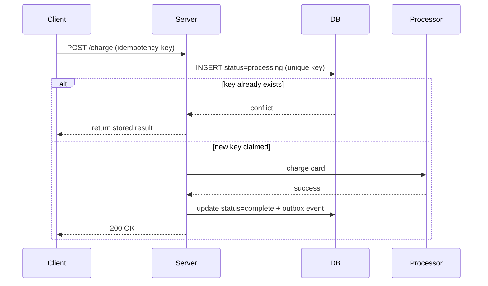

#### 44 — Design a distributed job scheduler where each job runs exactly once even if a node crashes. {#44}
Store jobs and their next-run-time in a shared DB. Workers poll for due jobs and atomically claim one via a conditional update, which acts as a lightweight distributed lock. Include a lease/heartbeat so if the worker crashes mid-execution, the lock expires and another worker can reclaim it.

```sql
UPDATE jobs
SET locked_by = $1, locked_at = now()
WHERE id = $2 AND locked_by IS NULL;
-- 1 row updated => this worker owns the job
-- 0 rows updated => another worker already claimed it
```

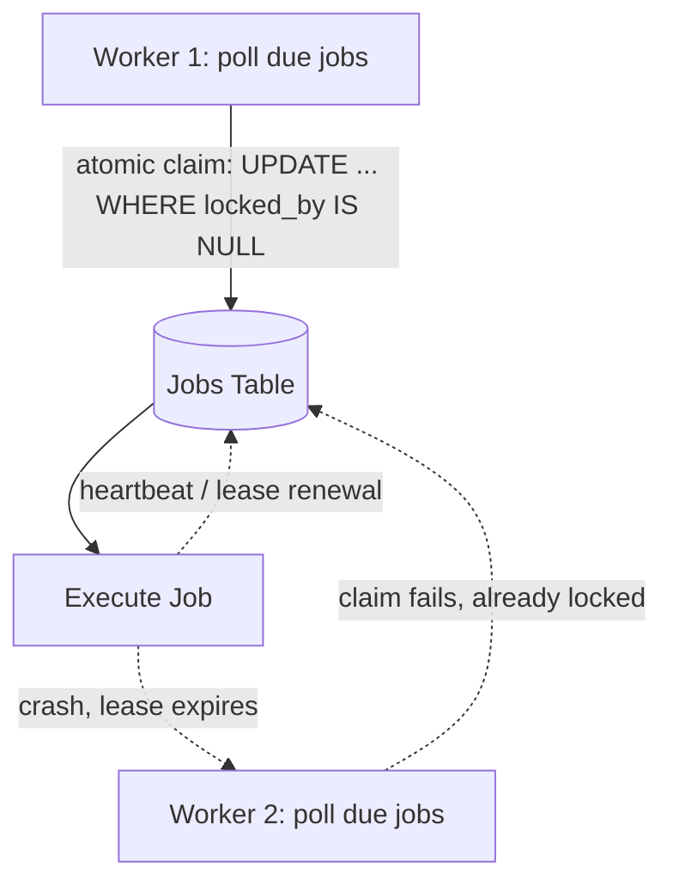

#### 45 — Design a sharded, horizontally-scalable chat/messaging backend. {#45}
Shard users/conversations across backend nodes using consistent hashing on a conversation or user ID. A connection-routing gateway looks up which shard owns a conversation and forwards accordingly; for offline delivery, persist messages and use a pub/sub layer so any node can catch up.

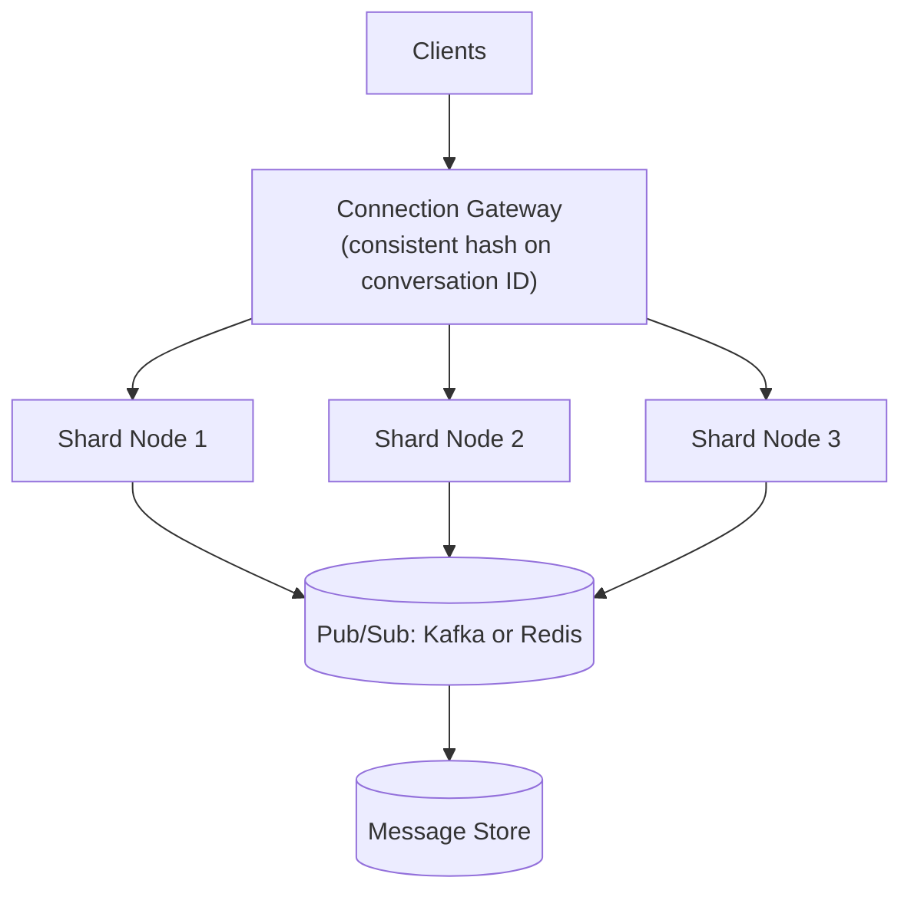

#### 46 — Design a system for ingesting and aggregating high-throughput event streams (e.g., sports data) with the right delivery semantics. {#46}
Producers publish events partitioned by a natural key (e.g., game ID) so ordering is preserved per entity. Consumers process with at-least-once semantics and make aggregation idempotent (upserts keyed on event ID) so reprocessing after a crash doesn't double-count.

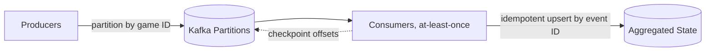

#### 47 — How would you evolve a monolith into microservices without a risky big-bang rewrite? {#47}
Use the strangler fig pattern: put a routing layer in front of the monolith, then incrementally extract one bounded-context feature at a time into a new service, routing that specific traffic there while everything else still goes to the monolith.

```mermaid
graph LR
    Client --> Proxy["Routing Proxy"]
    Proxy -->|legacy traffic| Monolith
    Proxy -->|extracted feature| NewService["New Service"]
    NewService -. via API, not direct DB .-> Monolith
```

#### 48 — Design an audit/compliance logging system for a fintech platform where logs must be tamper-evident and queryable. {#48}
Write audit events to an append-only store, and make tampering detectable by hash-chaining entries (each entry's hash includes the previous entry's hash). For queryability, stream/index the same events into a separate query-optimized store asynchronously, keeping the append-only log as the source of truth.

```go
type AuditEntry struct {
    Seq      int64
    Payload  []byte
    PrevHash [32]byte
    Hash     [32]byte
}

func appendEntry(prev AuditEntry, payload []byte) AuditEntry {
    h := sha256.Sum256(append(prev.Hash[:], payload...))
    return AuditEntry{
        Seq:      prev.Seq + 1,
        Payload:  payload,
        PrevHash: prev.Hash,
        Hash:     h,
    }
}
// altering any past entry changes its Hash, breaking every
// subsequent entry's PrevHash link -- tampering becomes detectable
```

```mermaid
graph LR
    Write["Write Event"] --> Log["Append-only hash-chained log<br/>(source of truth)"]
    Log -. async stream .-> Indexer
    Indexer --> Query[(Query store: Elasticsearch)]
```

---

## Notes

**[Databases & Database Optimization](#databases--database-optimization):** worth its own drilling pass — indexing, isolation levels, and locking/deadlocks ([6](#6), [8](#8), [9](#9)) come up constantly in architect-level interviews even outside a formal "system design" segment.

**[System Design Fundamentals, Distributed Systems Concepts & Case Studies](#system-design-fundamentals):** where the "Architect" part gets tested — practice actually drawing the diagrams for [18](#18)–[20](#20), [24](#24), [25](#25), [31](#31)–[35](#35), and [39](#39)–[48](#48) from memory, not just describing them verbally.

**[Distributed Systems Concepts](#distributed-systems-concepts):** [36](#36) (Raft), [37](#37) (consistency spectrum), and [38](#38) (bulkhead) are the ones most likely to turn into a follow-up "ok, now what if the leader crashes mid-write" question, so have those diagrams reflexive, not just recitable.

---

Part 3 of 7 · [Interview Prep](/interview-prep/) · ← Previous: [Part 2 — Coding Patterns](/interview-prep-coding-patterns/) · Next: [Part 4 — Advanced SQL](/interview-prep-sql-advanced/) →

<script src="https://cdn.jsdelivr.net/npm/mermaid@11/dist/mermaid.min.js"></script>
<script>
document.querySelectorAll('pre code.language-mermaid').forEach(function (el) {
  var div = document.createElement('div');
  div.className = 'mermaid';
  div.textContent = el.textContent;
  el.parentElement.replaceWith(div);
});
mermaid.initialize({ startOnLoad: true, theme: 'neutral' });
</script>
