Part 5 of 7 · [Interview Prep](/interview-prep/) · ← Previous: [Part 4 — System Design & Distributed Systems](/interview-prep-system-design/) · Next: [Part 6 — Security & Cloud](/interview-prep-security-cloud/) →

Kafka looks simple from the outside. Producers write, consumers read, done. Every hard question in this part is about what happens when that tidy picture breaks: a consumer dies halfway through a message, a rebalance fires mid-batch, or two teams discover they've been using the word "customer" to mean two different things.

**What this assumes:** you've called one service from another over HTTP, and you know what a queue is for. You don't need to have run Kafka in production. The vocabulary gets explained as it comes up.

**What you should be able to do after:** point at the places a message can get lost or processed twice, and say what you'd do about each one.

Every answer opens with **The gist**, one or two plain sentences. If the gist is all you have time for, that's still worth more than a half-remembered detail. The full answer underneath is what you say when they ask you to go deeper.





## Kafka in Depth (Go)

*Questions 1 to 5 are the vocabulary, and you want those solid before you walk in. 6 to 18 are the operational reality, which is where most people actually get caught. 19 and 20 are code you might be asked to write on the spot.*

### 1. What is a Kafka topic, partition, and offset, and how do they relate to ordering guarantees? {#1}

{}
**The gist:** a topic is a stream of events cut into partitions. Kafka keeps things in order inside one partition, and makes no promise at all across the whole topic.

A topic is a named stream of events, split into one or more partitions for parallelism. Each partition is an append-only, strictly ordered log with monotonically increasing offsets.

Kafka only guarantees ordering *within a single partition*, not across the whole topic.

**What they're testing:** whether you'll claim Kafka gives you global ordering. It doesn't. The follow-up is always "so how do I keep one customer's events in order?" and the answer is the partition key, [question 19](#19).

**Try it:** produce a few messages with `kafka-console-producer.sh --property parse.key=true --property key.separator=:`, using different keys, then consume with `kafka-console-consumer.sh --property print.partition=true` and watch which partition each key lands on.
{}

### 2. What is a consumer group, and how does partition assignment work across group members? {#2}

{}
**The gist:** a consumer group is several instances sharing one subscription. Kafka hands each partition to exactly one member, which is how you scale reading without processing everything twice.

A consumer group is a set of consumer instances sharing a single logical subscription. Kafka guarantees each partition is consumed by exactly one member at a time.

The group coordinator assigns partitions (round-robin, range, or sticky strategies) and reassigns them whenever group membership changes.

**Try it:** start two consumers in the same group against a topic with at least 2 partitions, then kill one and watch `kafka-consumer-groups.sh --describe` show its partitions reassigned to the survivor.
{}

### 3. Which Go Kafka client libraries are commonly used, and what are the key differences? {#3}

{}
**The gist:** three clients, one tradeoff. `confluent-kafka-go` is the fastest but drags in cgo. The other two are pure Go and much easier to build and cross-compile.

`IBM/sarama` is pure Go, widely used, with fine-grained control over almost everything.

`confluent-kafka-go` wraps librdkafka via cgo, which makes it the most performant and feature-complete option, at the cost of a cgo dependency in your build.

`segmentio/kafka-go` is pure Go with a simpler API, and has historically lagged on some advanced features.
{}

### 4. Difference between synchronous and asynchronous producers, and when to use each? {#4}

{}
**The gist:** synchronous waits for the broker to say yes, so errors are easy to handle and throughput is capped. Asynchronous fires and moves on, batching behind your back.

A synchronous producer blocks until the broker acknowledges each message. That makes error handling simple, but it limits throughput to one round trip per message.

An asynchronous producer returns immediately and delivers results on separate channels, batching under the hood for much higher throughput. The cost is that you now have to actually read those result channels, or failures disappear silently.

**Try it:** send 1,000 messages with a synchronous producer and time it, then send the same 1,000 with an async producer reading the result channel, and compare.
{}

### 5. Explain Kafka's `acks` setting and the tradeoffs for a Go producer. {#5}

{}
**The gist:** `acks` is how many brokers have to confirm a write before you call it done. It's a dial between speed and not losing data.

`acks=0` doesn't wait at all. Fastest, and messages can vanish without you knowing.

`acks=1` waits for the partition leader only. Reasonable durability, and you can still lose a message if the leader dies before a replica catches up.

`acks=all` waits for every in-sync replica. Strongest durability, highest latency, and the right setting for payments and audit events.

```go
config := sarama.NewConfig()
config.Producer.RequiredAcks = sarama.WaitForAll // acks=all
config.Producer.Retry.Max = 5
```

**What they're testing:** whether you pick a setting and justify it for the data in question. "`acks=all` for payments, `acks=1` for click events" is the answer they want, not "always use all."

**Try it:** set `acks=0` on a local producer, kill the broker mid-send, and confirm the client reports success anyway.
{}

### 6. What happens during a consumer group rebalance, and how can it disrupt a Go service mid-processing? {#6}

{}
**The gist:** a rebalance is Kafka reshuffling partitions between consumers. While it runs, everyone stops, and if you haven't committed your offsets you'll redo work.

The coordinator revokes and reassigns partitions. By default all consumers in the group pause during that window, even the ones whose partitions didn't change at all.

If your processing loop doesn't handle the revoke callback properly, you can double-process after reassignment, because the offsets for work you'd already finished were never committed.

**What they're testing:** whether you know a rebalance stops the whole group, not just the consumers whose partitions moved. That's the detail that surprises people the first time they see it in production.

**Try it:** run two consumers in one group, start a third, and watch the group's log lines for the rebalance: revoke, reassign, resume.
{}

### 7. How do you achieve at-least-once processing in a Go Kafka consumer? {#7}

{}
**The gist:** do the work first, commit the offset second. If you crash in between, the message comes back, which is fine as long as doing it twice is harmless.

Process the message fully *before* committing its offset, and only commit after processing succeeded. If the consumer crashes before committing, the message is redelivered on restart.

```go
for msg := range claim.Messages() {
    if err := process(msg); err != nil {
        return err // don't commit, let it redeliver
    }
    sess.MarkMessage(msg, "") // commit only after success
}
```

**What they're testing:** whether "at-least-once" makes you say "so the handler has to be idempotent" without being prompted. That's the whole point of the question.

**Try it:** in the loop above, kill the process right after `process(msg)` returns but before `MarkMessage` runs, then restart it and confirm the same message gets redelivered.
{}

### 8. How would you implement exactly-once-ish semantics in Go without relying purely on Kafka transactions? {#8}

{}
**The gist:** you don't really get exactly-once. You get at-least-once plus a consumer that ignores repeats, usually by letting the database reject the second one.

Combine at-least-once delivery with idempotent consumer-side writes. Use the message's unique key, or the `(topic, partition, offset)` tuple, as an idempotency key backed by an upsert or a unique constraint.

```sql
INSERT INTO processed_events (event_key, result)
VALUES ($1, $2)
ON CONFLICT (event_key) DO NOTHING;
```

**What they're testing:** whether you treat "exactly-once" as a property of your consumer rather than something the broker hands you. Pushing the guarantee down to a unique constraint is the answer.

**Try it:** run the same event through the `ON CONFLICT DO NOTHING` insert twice with the same key and confirm the row count doesn't change on the second run.
{}

### 9. Explain Kafka's idempotent producer feature, and when you'd enable it. {#9}

{}
**The gist:** turn it on and the broker throws away duplicate sends caused by your own retries. It costs almost nothing.

With `enable.idempotence=true`, the producer assigns each message a sequence number per partition, and brokers deduplicate retried sends caused by producer-side retries after a transient failure.

Enable it whenever you care about not double-publishing because of a network hiccup, which is nearly always.

```go
config.Producer.Idempotent = true
config.Producer.RequiredAcks = sarama.WaitForAll // required
config.Net.MaxOpenRequests = 1                   // required
```

**Try it:** turn `enable.idempotence` off, force the producer to retry a send (a brief broker restart works), and count how many copies land in the topic; turn it on and repeat.
{}

### 10. What is Kafka transactional messaging, and when would you use it in Go? {#10}

{}
**The gist:** transactions let one producer write to several topics and commit its read position as a single atomic unit. It's for read-process-write stream steps.

Transactions let a producer atomically write to multiple partitions and topics, and commit its consumed offset together with those writes, in one "read process write" cycle.

Use it for a stream-processing step that genuinely can't tolerate a partial failure between reading and writing. For most services, [question 8](#8)'s idempotency-key approach is simpler and good enough.
{}

### 11. How do you handle a poison pill message in a Go consumer without blocking the partition forever? {#11}

{}
**The gist:** one bad message can block a partition forever if you retry it in a loop. Give up after a few tries, park it somewhere else, and keep moving.

After a bounded number of retries, route the message to a dead-letter topic instead of retrying indefinitely. Then commit past it so the partition keeps moving.

```go
if attempts > maxRetries {
    produceToDLQ(msg, err)
    sess.MarkMessage(msg, "") // commit past it, keep moving
    continue
}
```

**Try it:** publish a message your handler always errors on, and watch it retry `maxRetries` times before landing on the DLQ topic instead of stalling the partition.
{}

### 12. Explain consumer lag and how you'd monitor it in a Go service. {#12}

{}
**The gist:** lag is how far behind your consumer is, counted in messages. Growing lag means you're losing the race.

Lag is the difference between the latest produced offset and the consumer group's last committed offset.

Monitor it through Kafka's own exposed metrics, using Burrow or the Kafka exporter for Prometheus. A lag number that's high but flat is fine. A lag number that climbs steadily means consumers can't keep up and something has to change.

**Try it:** run `kafka-consumer-groups.sh --bootstrap-server localhost:9092 --describe --group <name>` while your consumer is running behind, and watch the `LAG` column move.
{}

### 13. How do you handle backpressure when a Go consumer processes slower than messages arrive? {#13}

{}
**The gist:** Kafka won't flood you, because it only sends what you ask for. The real danger is your own code spawning a goroutine per message until memory runs out.

Kafka provides backpressure naturally: a consumer that doesn't poll simply doesn't receive more messages. So the problem is almost never Kafka pushing too hard, it's your consumer fanning out without a limit.

Use a bounded worker pool rather than an unbounded goroutine per message, and pause partition consumption if a downstream dependency is struggling.

```go
// Bounded: at most 32 messages in flight, no unbounded goroutines.
sem := make(chan struct{}, 32)
for msg := range claim.Messages() {
    sem <- struct{}{}
    go func(m *sarama.ConsumerMessage) {
        defer func() { <-sem }()
        process(m)
    }(msg)
}
```

Worth saying out loud: this gives up per-partition ordering and makes offset commits trickier, so only reach for it when messages within a partition are genuinely independent.

**Try it:** drop the semaphore from the snippet above, send a burst of messages, and watch goroutine count climb with no ceiling.
{}

### 14. What's the significance of partition count for parallelism, and what happens with more consumers than partitions? {#14}

{}
**The gist:** partitions are your parallelism budget. Ten partitions means at most ten useful consumers, and the eleventh sits there doing nothing.

Partition count is the hard ceiling on parallelism within a consumer group. Extra consumer instances beyond the partition count stay completely idle.

**What they're testing:** whether you know you can't scale a consumer group past the partition count. The follow-up is "so add partitions," and the good answer notes that changing partition count changes key-to-partition mapping, which breaks the ordering guarantee from [question 1](#1).

**Try it:** run 4 consumer instances against a 2-partition topic in the same group, then check `kafka-consumer-groups.sh --describe` and see two of them assigned zero partitions.
{}

### 15. Manual vs automatic offset commits, and the pitfalls of auto-commit {#15}

{}
**The gist:** auto-commit commits on a timer based on what you fetched, not what you finished. Crash at the wrong moment and the message is silently gone.

Auto-commit periodically commits the latest *fetched* offset on a timer, regardless of whether processing actually finished. If the consumer crashes between fetching and finishing, that message is never redelivered, and nothing anywhere logs a problem.

Manual commit, only after success, is the safer default.

```go
config.Consumer.Offsets.AutoCommit.Enable = false // commit manually
```

**What they're testing:** whether you can name the exact window where a message gets lost. "Between fetch and finish" is the phrase.

**Try it:** turn auto-commit back on, kill the consumer right after a message is fetched but before your handler finishes, restart it, and confirm that message is gone for good.
{}

### 16. How do you handle schema evolution for Kafka messages in Go (Avro/Protobuf and a schema registry)? {#16}

{}
**The gist:** register schemas centrally and let the registry reject incompatible changes before they ship. Add fields with defaults, never remove or retype one.

Register schemas in a schema registry and enforce compatibility rules (backward or full) so old consumers can still read new-schema messages.

In practice that means one rule: only add new fields, and give them defaults. Removing, renaming, or retyping an existing field breaks every consumer that hasn't been redeployed yet, and in a rolling deploy that's most of them.
{}

### 17. What's a dead-letter queue (DLQ) pattern for Kafka consumers, and how would you implement it in Go? {#17}

{}
**The gist:** a DLQ is a parking lot for messages you can't process. It keeps one bad message from stopping the whole partition.

After a message fails more than N times, produce it to a separate DLQ topic along with the failure metadata, then commit past it on the original topic.

The DLQ message can then be inspected, fixed, or replayed manually later, while the main consumer keeps up with live traffic. See [question 11](#11) for the commit-past-it mechanics.
{}

### 18. How would you test Kafka producer/consumer code in Go without a real Kafka cluster? {#18}

{}
**The gist:** mock the broker for unit tests. Run a real one in a container when you need to actually trust the result.

For unit tests, sarama's mock broker and mock producer simulate broker responses without a network.

```go
broker := sarama.NewMockBroker(t, 1)
defer broker.Close()
```

For integration-level confidence, run a real Kafka broker in a container via `testcontainers-go`, or use Redpanda as a lighter-weight, Kafka-compatible alternative.

**Try it:** write a test using `sarama.NewMockBroker`, then swap it for a real broker via `testcontainers-go` and see which bugs only show up against the real thing.
{}

### 19. How do you produce a message with a specific key in Go, and why does the key matter? {#19}

{}
**The gist:** the key picks the partition, and the partition decides the order. Same key means same partition, which is how you keep one user's events in sequence.

You set the `Key` field on the producer message. Kafka's default partitioner hashes the key to consistently route all messages with the same key to the same partition, which matters whenever you need ordering guarantees for a given entity.

```go
msg := &sarama.ProducerMessage{
    Topic: "orders",
    Key:   sarama.StringEncoder(userID),
    Value: sarama.ByteEncoder(payload),
}
partition, offset, err := producer.SendMessage(msg)
// same key -> same partition -> preserves per-user ordering
```

**Try it:** send several messages with the same key and `print.partition=true` on the consumer side, and confirm they all land on the same partition.
{}

### 20. How would you design a Go consumer to gracefully shut down without losing in-flight messages or committing wrong offsets? {#20}

{}
**The gist:** stop taking new work, finish what's in your hands, commit, then leave. Leaving cleanly also makes the rebalance faster for everyone else in the group.

On a shutdown signal (SIGTERM), stop polling for new messages, let in-flight processing finish, commit offsets for everything successfully processed, then close the consumer and session cleanly so the group coordinator triggers a clean rebalance.

```go
func (h *Handler) ConsumeClaim(sess sarama.ConsumerGroupSession,
    claim sarama.ConsumerGroupClaim) error {
    for {
        select {
        case msg, ok := <-claim.Messages():
            if !ok {
                return nil
            }
            process(msg)
            sess.MarkMessage(msg, "")
        case <-sess.Context().Done():
            return nil // finish current message, then return promptly
        }
    }
}
```

**Try it:** send `SIGTERM` to a running consumer mid-batch and check the logs show it finishing the in-flight message and committing before it exits.
{}

---

## Microservices Architecture

*Questions 21 to 23 are fair game at any level. The DDD block, 24 to 31, is where senior interviews live, and nobody expects you to have all of it two years in. 32 to 39 is day-to-day operational reality. 40 and 41 name two patterns [33](#33) already leans on without spelling out.*

### 21. What is service discovery in a microservices architecture, and what approaches are common? {#21}

{}
**The gist:** instances come and go constantly, so a hardcoded address is a bug waiting to happen. Service discovery is how a caller finds a live one right now.

Service discovery lets one service find the current network location of another, since instances scale up and down and get rescheduled constantly.

Two common approaches: a service registry (Consul, etcd, Zookeeper) with health checks, or DNS-based discovery such as Kubernetes' built-in DNS. The DNS route is simpler and what most teams default to on Kubernetes.

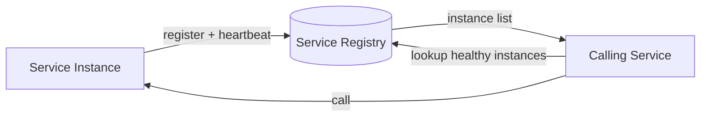
{}

### 22. What's the difference between client-side and server-side service discovery? {#22}

{}
**The gist:** client-side, the caller asks the registry and picks an instance itself. Server-side, the caller talks to one fixed address that picks for it.

Client-side discovery means the calling service queries the registry directly and chooses an instance. No extra network hop, but every client needs the discovery logic baked in.

Server-side discovery means the caller hits a fixed address that queries the registry and routes the request. Clients stay simple, at the cost of one more hop.

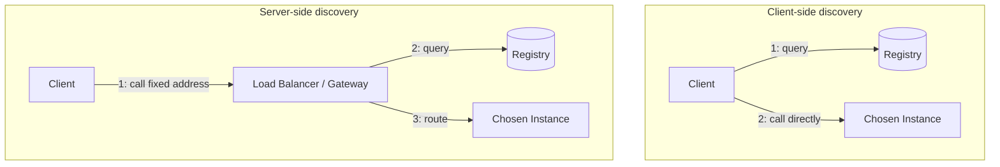
{}

### 23. What is an API gateway, and what responsibilities does it typically centralize? {#23}

{}
**The gist:** one front door that handles auth, rate limiting, and routing, so that every service behind it doesn't have to.

A single entry point that centralizes cross-cutting concerns so individual services don't each reimplement them: authentication, rate limiting, routing, TLS termination, logging, and sometimes response aggregation.

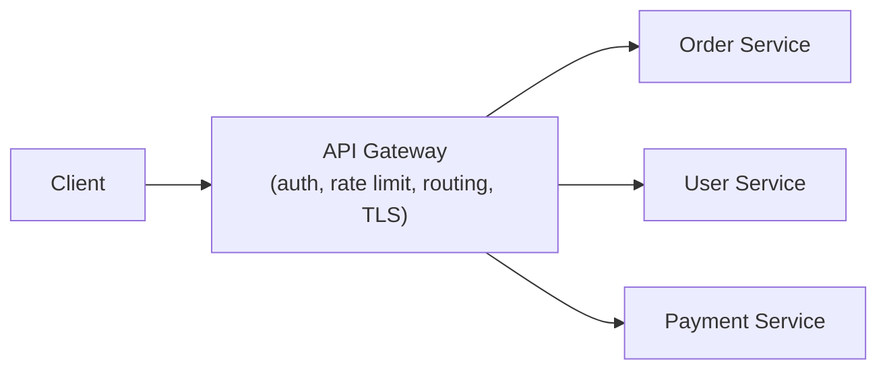

The tradeoff is that it becomes a critical-path component. Everything goes through it, so it needs to be highly available or it takes the whole system down with it.
{}

### 24. Explain bounded contexts in Domain-Driven Design, and why they matter for deciding microservice boundaries. {#24}

{}
**The gist:** a bounded context is a fence around one meaning of a word. "Customer" in billing isn't "Customer" in support, and pretending otherwise is how a model rots.

A bounded context is an explicit boundary within which a particular domain model and its terminology stay consistent. The same word can mean something different in another context, and that's fine, as long as each context owns its own model.

A well-designed service should own exactly one bounded context.

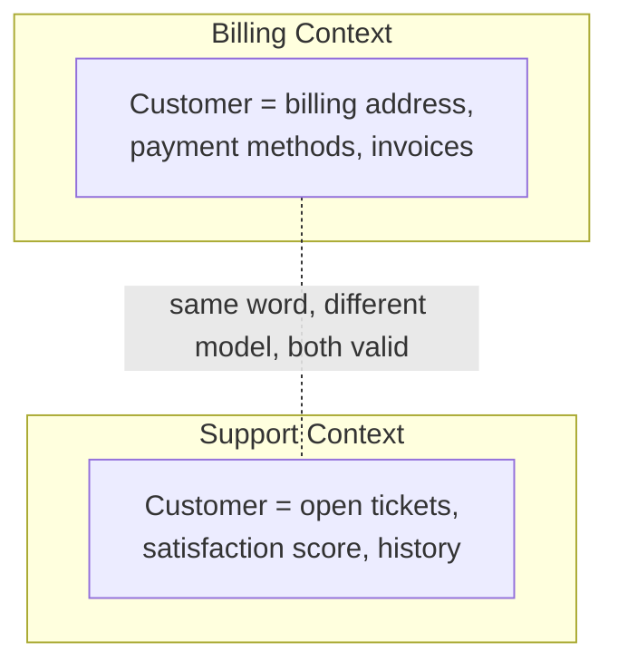

**What they're testing:** whether you can name a boundary from a real system instead of reciting the definition. Have an example ready where one word quietly meant two things.
{}

### 25. What's the difference between an Entity and a Value Object in Domain-Driven Design? {#25}

{}
**The gist:** an Entity is "which one." A Value Object is "what." Two amounts of £100 are interchangeable, two orders with identical fields are not.

An Entity has a persistent identity that outlives any single attribute value. Two `Order` objects with identical fields are still different orders if their IDs differ, and an entity's attributes can change over time while it stays "the same" order.

A Value Object has no identity of its own. It's defined entirely by its attributes, is typically immutable, and two value objects with the same attributes are interchangeable. A `Money{Amount: 100, Currency: "USD"}` doesn't need an ID, because another `Money{100, "USD"}` is simply equal to it.

Modeling something as a value object instead of an entity removes a whole class of identity-tracking and mutation bugs. Reach for it whenever "what is this" matters more than "which one is this."
{}

### 26. What is an Aggregate in DDD, and what role does the Aggregate Root play? {#26}

{}
**The gist:** an Aggregate is a group of objects saved and validated together. The Root is the only door in, which is exactly what lets it enforce its own rules.

An Aggregate is a cluster of entities and value objects treated as a single consistency boundary. Everything inside it is loaded, modified, and saved together, and invariants spanning several objects (an Order's total must equal the sum of its line items) are enforced inside that boundary.

The Aggregate Root is the single entry point. External code only ever references and calls methods on the root (`Order`), and never reaches directly into its internals (`OrderLine`) to mutate them. That restriction is what lets the root actually enforce its invariants instead of having them quietly bypassed.

Keep aggregate boundaries small. A common mistake is modeling an entire object graph as one giant aggregate, which serializes writes across unrelated concerns and kills concurrency.

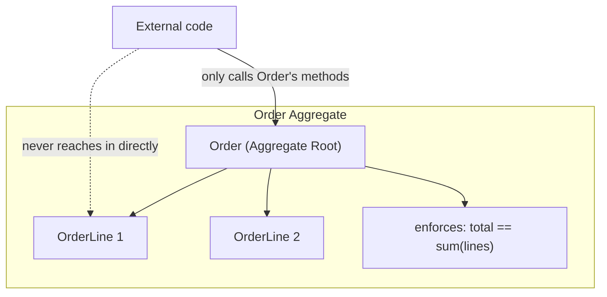

**What they're testing:** whether you keep aggregates small. "One giant aggregate for the whole object graph" is the mistake they're listening for you to avoid.
{}

### 27. What is a domain event, and how does it differ from an integration event? {#27}

{}
**The gist:** a domain event is internal news your own context reacts to. An integration event is the published version other teams depend on, which makes it a contract.

A domain event captures something that happened inside the domain model that other parts of the same bounded context care about, like `OrderPlaced` or `InventoryReserved`. It's raised by an aggregate as a side effect of a state change, usually handled in-process, often within the same transaction.

An integration event is the cross-service version: a domain event, or a more stable version derived from it, published externally over a broker so other bounded contexts can react. That's exactly what the [outbox pattern](#25) (Part 4) exists to publish reliably.

Keeping the two separate matters because a domain event's shape is free to change with the internal model, while an integration event is a public contract other teams depend on and needs the same versioning discipline as an API.
{}

### 28. What does the Repository pattern give you in a DDD-structured service? {#28}

{}
**The gist:** a Repository makes storage look like a collection. Domain code asks for aggregates and never learns whether they came from Postgres or a map in a test.

A Repository provides a collection-like interface (`Get`, `Save`, `FindByX`) for retrieving and persisting aggregates, hiding the actual storage mechanism behind that interface: SQL, a document store, or an in-memory fake in tests.

The domain layer depends only on the repository interface, never on a concrete database driver. So business logic can be unit-tested against an in-memory fake with no database at all, and the storage technology can change without touching domain code.

It's the same dependency-inversion idea as Go's usual "define the interface where it's consumed, not where it's implemented" convention, applied specifically to persistence.
{}

### 29. What is an Anti-Corruption Layer, and when do you need one? {#29}

{}
**The gist:** an Anti-Corruption Layer translates someone else's model into yours at the border, so their weirdness never leaks into your domain.

An Anti-Corruption Layer (ACL) is a translation boundary placed between your bounded context and an external system: a legacy service, a third-party API, another team's model. It stops the external system's model, quirks, and vocabulary from leaking into your domain model, translating their shapes into yours at the boundary instead.

You need one whenever you integrate with a system whose model doesn't match your own domain concepts, especially a legacy or third-party one you don't control. Without an ACL, that external model's inconsistencies and future changes ripple straight into your code.

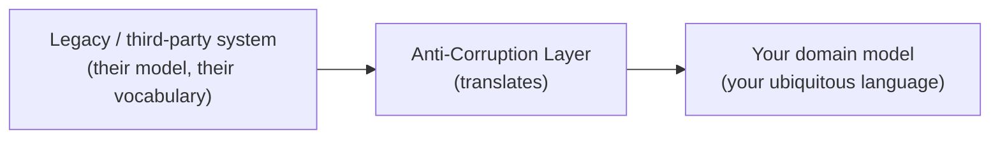
{}

### 30. What is "ubiquitous language" in DDD, and why does it matter for an architect? {#30}

{}
**The gist:** one vocabulary, used by engineers and domain experts alike, in conversation and in code. No silent translation between the business word and the class name.

Ubiquitous language is a shared vocabulary, defined by the domain and used consistently by both engineers and domain experts: in conversation, in code (class and method names), and in documentation. There's no separate "business term" that gets quietly translated into a different "technical term" in the codebase.

It matters at the architecture level because bounded context boundaries are usually exactly where the language changes. The moment two teams use the same word to mean different things ([question 24](#24)'s "Customer" example) is a signal you've crossed into a different bounded context, which is itself a strong hint for where a service boundary belongs.
{}

### 31. What is hexagonal (ports and adapters) architecture, and how does it relate to DDD? {#31}

{}
**The gist:** domain in the middle, infrastructure at the edges, dependencies pointing inward. Ports are interfaces the domain needs, adapters are the things that implement them.

Hexagonal architecture puts the domain model at the center, fully isolated from infrastructure, and defines "ports" (interfaces the domain needs, like a repository or a notifier) that "adapters" implement for a specific technology: a Postgres repository, an SMTP email adapter, an HTTP handler driving the domain from outside.

The domain never imports infrastructure code. Dependencies point inward, so only adapters depend on the domain, never the reverse.

It pairs naturally with DDD. The domain model built from entities, value objects, and aggregates lives at the hexagon's center, repositories ([question 28](#28)) are exactly the kind of port the pattern formalizes, and swapping a real Postgres adapter for an in-memory test adapter is the same benefit stated more architecturally.

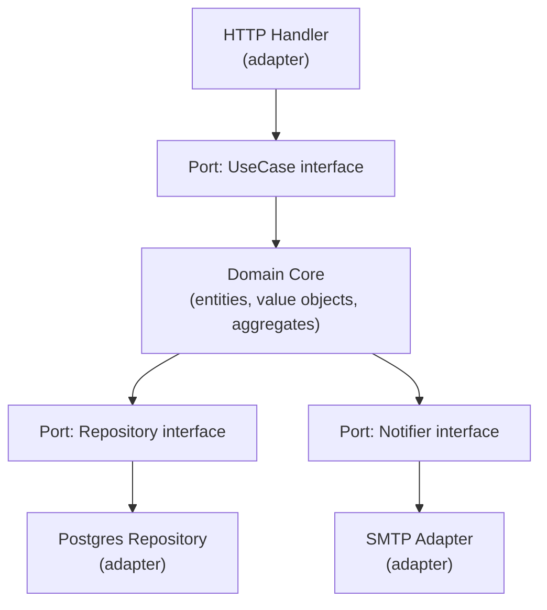
{}

### 32. What is the "database per service" pattern, and why is a shared database across services usually an anti-pattern? {#32}

{}
**The gist:** each service owns its own database and nobody else touches it. Share one and another team's migration can break you at 3am.

Each microservice owns its own database, and no other service reads or writes it directly.

A shared database silently recouples services at the schema level. Any service can be broken by another team's migration, and there's no real ownership boundary left, just a convention everyone is one deadline away from ignoring.

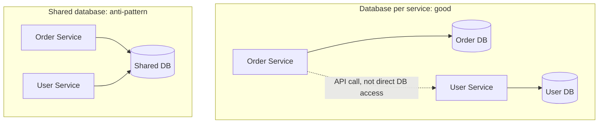

**What they're testing:** whether you can say what specifically goes wrong. "Coupling" is vague. "Their migration drops a column my service still selects" is the answer.
{}

### 33. How do you handle a query that needs data owned by multiple services, for example an order summary needing user, inventory, and payment data? {#33}

{}
**The gist:** either call every owner and stitch the answers together, or keep a pre-built read model fed by events. You're trading latency against staleness.

API composition: a gateway calls each owning service's API in parallel and stitches the results together. Simple, but it adds latency and couples your availability to every downstream service at once.

CQRS with a materialized read model: services publish events when they change, and a read-optimized store built from those events answers the composite query directly. Fast reads, at the cost of the read model being slightly behind.

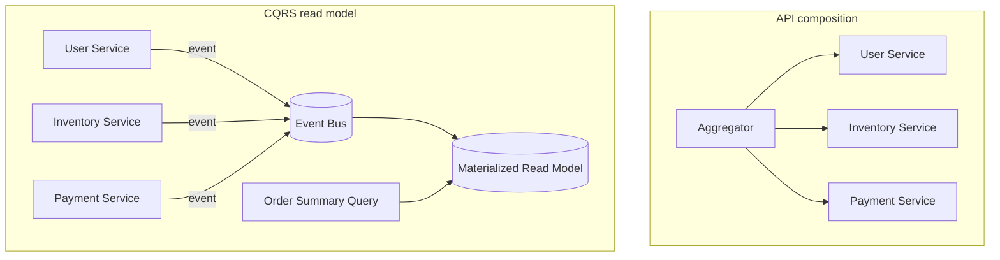
{}

### 34. What is distributed tracing, and how does it help debug a slow request spanning multiple services? {#34}

{}
**The gist:** one request, many services, one shared trace ID. The result is a timeline that shows you exactly which hop was slow.

Distributed tracing follows a single logical request as it fans out across many services, recording each service's processing time as a "span" linked into one trace by a shared trace ID.

With Jaeger or OpenTelemetry you get a single visual timeline showing exactly which service accounted for the latency, instead of four teams each insisting it wasn't them.

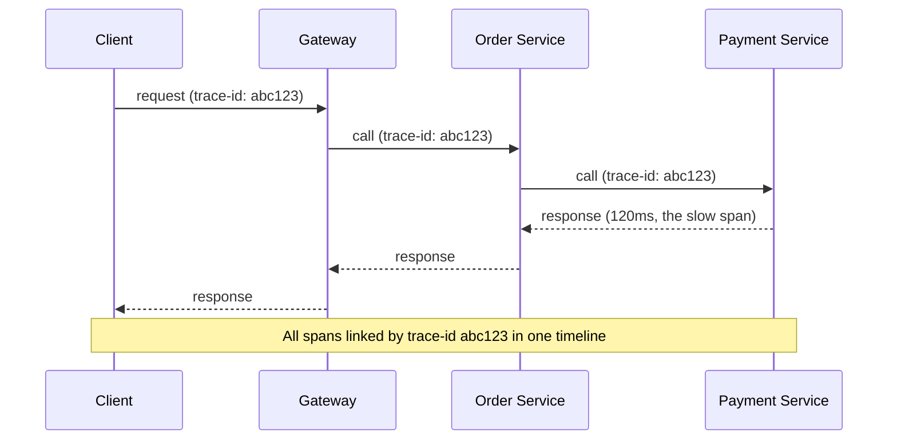

**Try it:** run a two-service call chain with OpenTelemetry instrumentation and a local Jaeger container, then open the Jaeger UI and find the slow span.
{}

### 35. Explain correlation IDs and trace context propagation across service calls. {#35}

{}
**The gist:** generate an ID at the edge, pass it everywhere, log it everywhere. Now one grep reconstructs the whole request across every service.

A correlation ID is generated once at the edge and passed along in every downstream call, usually as an HTTP header. Every service logs that ID alongside its own log lines, so you can reconstruct the full picture across services after the fact.

In Go, `context.WithValue` is legitimately meant for exactly this kind of request-scoped value.

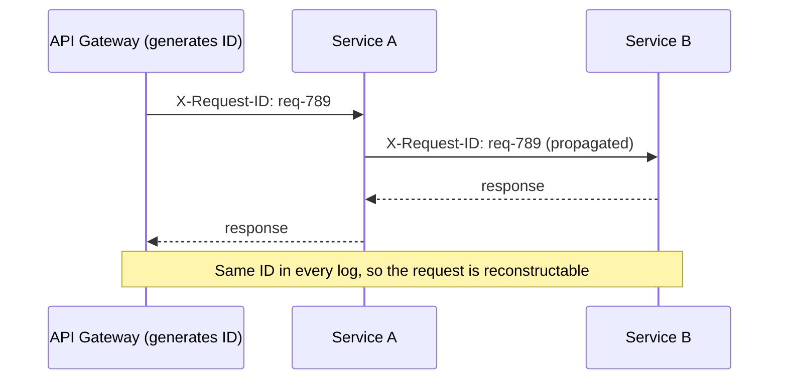
{}

### 36. What is a circuit breaker, and how does it differ from a retry/backoff strategy? {#36}

{}
**The gist:** retry assumes the problem is this one request. A circuit breaker assumes the service is down, and stops calling it entirely for a while.

Retry with backoff assumes the downstream is basically fine and this particular request hit a transient hiccup.

A circuit breaker tracks the failure rate over time and, once it crosses a threshold, "opens" and stops sending requests entirely for a cooldown period. It fails fast instead of piling more load onto something that's already struggling.

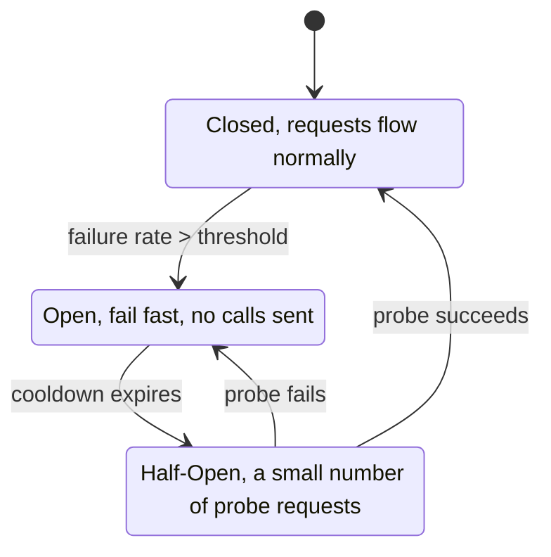

**What they're testing:** whether you can explain why retrying harder makes an outage worse. The phrase they're waiting for is retry storm.

**Try it:** wrap a call that always fails in a circuit breaker (`sony/gobreaker` is a common Go one), watch it flip to open after enough failures, and confirm calls fail fast without touching the network while it's open.
{}

### 37. How do you secure service-to-service communication in a microservices architecture? {#37}

{}
**The gist:** mTLS proves which service is calling. A forwarded JWT proves which user it's calling for. You usually want both, because they answer different questions.

mTLS means both sides present certificates, so each service cryptographically verifies the other's identity rather than trusting the network.

JWT propagation forwards the caller's identity and claims as a signed token through the call chain, so a downstream service knows which user is ultimately behind the request.

Service accounts and API keys cover service-level identity where full mTLS isn't practical.

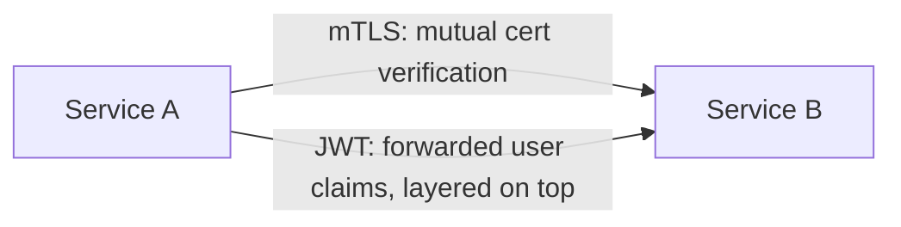

**What they're testing:** whether you separate "which service" from "which user." People often answer with only one and miss that both need answering.
{}

### 38. What is a service mesh, and what problems does it solve that you'd otherwise build into each service? {#38}

{}
**The gist:** a sidecar proxy next to every service that does mTLS, retries, and metrics, so your application code doesn't have to.

A service mesh (Istio, Linkerd) is a sidecar proxy deployed alongside every service instance. It handles mTLS, retries, timeouts, circuit breaking, load balancing, and observability transparently, without application code implementing any of it.

The catch is that you've moved that complexity rather than removed it, and now it lives in infrastructure your application team may not operate.

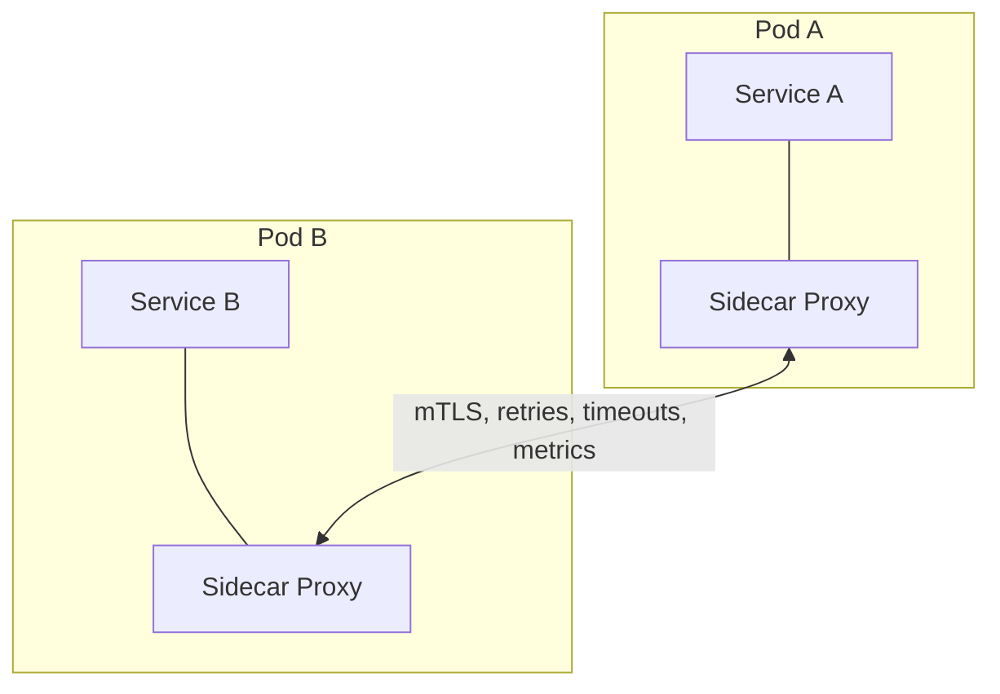
{}

### 39. How do you version and evolve APIs between microservices without breaking consumers during a rolling deployment? {#39}

{}
**The gist:** during a rolling deploy both versions run at the same time, so the new one has to stay readable by the old one. Genuinely breaking changes need a separate version path.

During a rolling deploy, old and new versions run simultaneously, so the API has to be backward compatible for the whole rollout window at minimum.

For a genuinely breaking change, version the API explicitly (`/v1/`, `/v2/`) and run both in parallel until every consumer has migrated. This is the same discipline as schema evolution in [question 16](#16), applied to HTTP instead of message payloads.

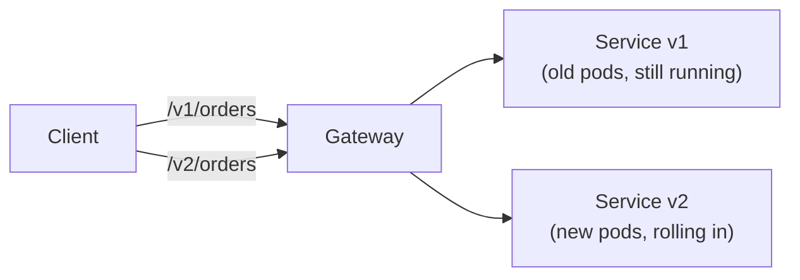

**What they're testing:** whether "rolling deploy" makes you realize both versions are live at once. That's the constraint the whole answer hangs on.
{}

### 40. What is CQRS, and why split the write model from the read model? {#40}

{}
**The gist:** the shape of data that's efficient to write is rarely the shape that's efficient to read. CQRS just admits that out loud and gives each side its own model instead of forcing one schema to serve both.

Command Query Responsibility Segregation splits a service's write path (commands, which change state) from its read path (queries, which only observe it), letting each use a data model, and even a data store, optimized for its own job. Writes go through a normalized, invariant-enforcing model. Reads are served from one or more denormalized, purpose-built projections kept up to date by the events the write side emits.

[Q33](#33) already showed the applied version of this: a materialized read model built from other services' events, so a composite query answers directly instead of fanning out to every owner at request time. CQRS is the name for that shape in general, not only across service boundaries. A single service can run CQRS internally too: one write model, several read-optimized projections for different query needs.

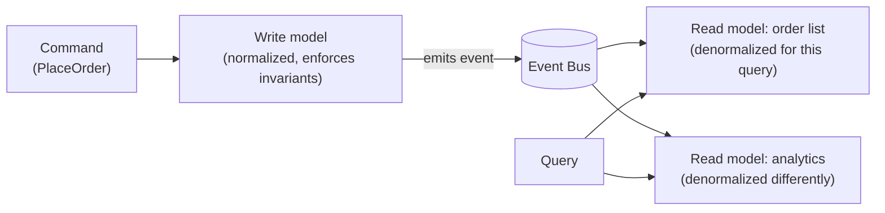

**What they're testing:** whether you'd reach for it as a default or only when a specific read pattern earns it. CQRS is real complexity, a second model, a sync path, eventual consistency between the two, and most services never need it. The tell that you do: a query that's slow or awkward specifically because it doesn't match the write model's shape, not "reads and writes feel different in principle."

**Try it:** take an endpoint you've built that joins across several tables to answer one read, and sketch what a purpose-built read model for that exact query would look like: one row per thing the query actually returns, no joins required.
{}

### 41. What is Event Sourcing, and how is it different from just publishing events? {#41}

{}
**The gist:** most services store current state and publish events as a side effect of changing it. Event sourcing flips that: the event log *is* the state, and "current state" is just what you get from replaying it.

In a normal, state-first design, a row holds the current value and an event is an afterthought emitted alongside the update, easy to lose or get out of sync with the row it described. Event sourcing makes the append-only log of events the single source of truth: every state change is stored as an event, forever, and current state is derived by replaying every event for that entity from the start, or from the last saved snapshot forward.

```go
type AccountOpened struct{ ID string }
type FundsDeposited struct{ ID string; Amount int }
type FundsWithdrawn struct{ ID string; Amount int }

// Current state is a fold over history, not a stored row.
func Rebuild(events []Event) Account {
    var acc Account
    for _, e := range events {
        acc = acc.Apply(e) // each event type knows how to fold itself in
    }
    return acc
}
```

That gives you a genuine audit trail for free, every past state is reconstructable, not just the current one, and it makes [the outbox pattern](#25) (Part 4) almost unnecessary for this entity's own changes, since the event log already *is* the durable, ordered record. The costs: replaying a long history gets slow without periodic snapshots, and the event schema itself now has to stay readable forever, since you can never just migrate old rows in place, only ever add new event types.

**What they're testing:** whether you'd reach for it by default or only for entities where the history itself has value: an audit trail, a "how did we get here" replay, or true temporal queries ("what was the balance at close of business last Tuesday"). Most entities don't need their own past; a bank ledger and an order's status history usually do.

**Try it:** take an entity you track today as a single row with an `updated_at`, and write out the sequence of events that would have produced its current value. If that sequence is genuinely useful on its own, meaning someone would actually want to see it and not just the current row, that's the entity worth event-sourcing.
{}

---

## What to drill first

**[Kafka in Depth (Go)](#kafka-in-depth-go):** [6](#6) (rebalances), [7](#7) (at-least-once), and [15](#15) (auto-commit) are the three that separate people who've run a consumer in production from people who've read about it. They're also a connected story: auto-commit loses messages, manual commit means at-least-once, and at-least-once means your handler has to be idempotent. Rehearse them as one answer that flows, not three facts.

**[Microservices Architecture](#microservices-architecture):** worth a full pass rather than a skim if distributed systems and DDD aren't part of your regular work. [24](#24) (bounded contexts) through [31](#31) (hexagonal architecture) are the DDD core, and [32](#32) (database per service) is the natural follow-up once bounded contexts come up.

Rehearse the DDD block, [25](#25) to [31](#31), as one connected story rather than seven isolated facts: ubiquitous language ([30](#30)) surfaces a bounded context ([24](#24)), which owns aggregates ([26](#26)) built from entities and value objects ([25](#25)), which raise domain events ([27](#27)) and persist through repositories ([28](#28)). An anti-corruption layer ([29](#29)) sits at the edges, and hexagonal architecture ([31](#31)) is the structural pattern tying repositories and ports together.

[40](#40) (CQRS) and [41](#41) (event sourcing) are worth pairing with that same story: a domain event ([27](#27)) is what a CQRS read model is built from, and event sourcing is what happens when you stop treating that event as a side effect and make it the source of truth instead.

If you're earlier in your career and short on time, start with [1](#1), [2](#2), and [7](#7). Those three give you enough Kafka vocabulary to follow any follow-up question, and [36](#36) (circuit breakers) is the microservices answer that comes up most often outside a dedicated architecture round.

---

Part 5 of 7 · [Interview Prep](/interview-prep/) · ← Previous: [Part 4 — System Design & Distributed Systems](/interview-prep-system-design/) · Next: [Part 6 — Security & Cloud](/interview-prep-security-cloud/) →
