Part 5 of 7 · [Interview Prep](/interview-prep/) · ← Previous: [Part 4 — Advanced SQL](/interview-prep-sql-advanced/) · Next: [Part 6 — Security & Cloud](/interview-prep-security-cloud/) →

## Kafka in Depth (Go)

| # | Question | Answer |
|---|----------|--------|
| <span id="1"></span>1 | What is a Kafka topic, partition, and offset, and how do they relate to ordering guarantees? | A topic is a named stream of events, split into one or more partitions for parallelism; each partition is an append-only, strictly ordered log with monotonically increasing offsets. Kafka only guarantees ordering *within a single partition*, not across the whole topic. |
| <span id="2"></span>2 | What is a consumer group, and how does partition assignment work across group members? | A consumer group is a set of consumer instances sharing a single logical subscription — Kafka guarantees each partition is consumed by exactly one member at a time. The group coordinator assigns partitions (round-robin, range, or sticky strategies) and reassigns on membership changes. |
| <span id="3"></span>3 | Which Go Kafka client libraries are commonly used, and what are the key differences? | `IBM/sarama` is pure Go, widely used, fine-grained control. `confluent-kafka-go` wraps librdkafka via cgo — most performant and feature-complete, at the cost of a cgo dependency. `segmentio/kafka-go` is pure Go, simpler API, historically lagged on some advanced features. |
| <span id="4"></span>4 | Difference between synchronous and asynchronous producers, and when to use each? | A synchronous producer blocks until the broker acknowledges each message — simpler error handling, throughput-limited. An asynchronous producer returns immediately and delivers results on separate channels, batching under the hood for much higher throughput. |
| <span id="5"></span>5 | Explain Kafka's `acks` setting and the tradeoffs for a Go producer. | `acks=0`: no wait, fastest, messages can be lost. `acks=1`: waits for the partition leader — reasonable durability. `acks=all`: waits for all in-sync replicas — strongest durability, higher latency; the setting for payments and audit events. |
| <span id="6"></span>6 | What happens during a consumer group rebalance, and how can it disrupt a Go service mid-processing? | The coordinator revokes and reassigns partitions; by default all consumers pause during this window, even ones whose partitions didn't change. If your processing loop doesn't handle the revoke/rebalance callback properly, you can double-process after reassignment if offsets weren't committed first. |
| <span id="7"></span>7 | How do you achieve at-least-once processing in a Go Kafka consumer? | Process the message fully *before* committing its offset, and only commit after successful processing — if the consumer crashes before committing, the message is redelivered on restart, so processing logic must be idempotent. |
| <span id="8"></span>8 | How would you implement exactly-once-ish semantics in Go without relying purely on Kafka transactions? | Combine at-least-once delivery with idempotent consumer-side writes — use the message's unique key or the `(topic, partition, offset)` tuple as an idempotency key with an upsert or unique constraint. |
| <span id="9"></span>9 | Explain Kafka's idempotent producer feature, and when you'd enable it. | With `enable.idempotence=true`, the producer assigns each message a sequence number per partition, and brokers deduplicate retried sends caused by producer-side retries after a transient failure — enable it whenever you care about not double-publishing due to network retries. |
| <span id="10"></span>10 | What is Kafka transactional messaging, and when would you use it in Go? | Transactions let a producer atomically write to multiple partitions/topics and commit its consumed offset together with a "read process write" pattern — use it for a stream-processing step that can't tolerate partial failure between reading and writing. |
| <span id="11"></span>11 | How do you handle a poison pill message in a Go consumer without blocking the partition forever? | After a bounded number of retries, route the message to a dead-letter topic instead of retrying indefinitely, then commit past it so the partition keeps moving. |
| <span id="12"></span>12 | Explain consumer lag and how you'd monitor it in a Go service. | Lag is the difference between the latest produced offset and the consumer group's last committed offset. Monitor via Kafka's own exposed metrics (Burrow, the Kafka exporter for Prometheus); a steadily growing lag signals consumers can't keep up. |
| <span id="13"></span>13 | How do you handle backpressure when a Go consumer processes slower than messages arrive? | Kafka naturally provides backpressure — a consumer that doesn't poll simply doesn't receive more messages. Avoid unbounded goroutines per message; use a bounded worker pool, and pause partition consumption if a downstream dependency is struggling. |
| <span id="14"></span>14 | What's the significance of partition count for parallelism, and what happens with more consumers than partitions? | Partition count is the hard ceiling on parallelism within a consumer group — extra consumer instances beyond partition count sit completely idle. |
| <span id="15"></span>15 | Manual vs automatic offset commits — pitfalls of auto-commit? | Auto-commit periodically commits the latest *fetched* offset on a timer, regardless of whether processing actually finished — if the consumer crashes between fetch and finishing, it can silently lose a message. Manual commit (only after success) is the safer default. |
| <span id="16"></span>16 | How do you handle schema evolution for Kafka messages in Go (Avro/Protobuf + schema registry)? | Register schemas in a schema registry and enforce compatibility rules (backward or full) so old consumers can still read new-schema messages — only add new fields with defaults, never remove/rename/retype existing fields. |
| <span id="17"></span>17 | What's a dead-letter queue (DLQ) pattern for Kafka consumers, and how would you implement it in Go? | After a message fails more than N times, produce it (with failure metadata) to a separate DLQ topic, then commit past it on the original topic — the DLQ message can be inspected or reprocessed manually later. |
| <span id="18"></span>18 | How would you test Kafka producer/consumer code in Go without a real Kafka cluster? | For unit tests, use sarama's mock broker/producer to simulate broker responses. For integration-level confidence, run a real Kafka broker in a container via `testcontainers-go`, or Redpanda as a lighter-weight alternative. |

#### 19 — How do you produce a message with a specific key in Go, and why does the key matter? {#19}
You set the `Key` field on the producer message. Kafka's default partitioner hashes the key to consistently route all messages with the same key to the same partition — this matters whenever you need ordering guarantees for a given entity.

```go
msg := &sarama.ProducerMessage{
    Topic: "orders",
    Key:   sarama.StringEncoder(userID),
    Value: sarama.ByteEncoder(payload),
}
partition, offset, err := producer.SendMessage(msg)
// same key -> same partition -> preserves per-user ordering
```

#### 20 — How would you design a Go consumer to gracefully shut down without losing in-flight messages or committing wrong offsets? {#20}
On a shutdown signal (SIGTERM), stop polling for new messages, let in-flight processing finish, commit offsets for everything successfully processed, then close the consumer/session cleanly so the group coordinator triggers a clean rebalance.

```go
func (h *Handler) ConsumeClaim(sess sarama.ConsumerGroupSession,
    claim sarama.ConsumerGroupClaim) error {
    for {
        select {
        case msg, ok := <-claim.Messages():
            if !ok {
                return nil
            }
            process(msg)
            sess.MarkMessage(msg, "")
        case <-sess.Context().Done():
            return nil // finish current message, then return promptly
        }
    }
}
```

---

## Microservices Architecture

#### 21 — What is service discovery in a microservices architecture, and what approaches are common? {#21}
Service discovery lets one service find the current network location of another, since instances scale up/down and get rescheduled constantly. Common approaches: a service registry (Consul, etcd, Zookeeper) with health checks, or DNS-based discovery (Kubernetes' built-in DNS) — the latter is simpler and what most teams default to on Kubernetes.

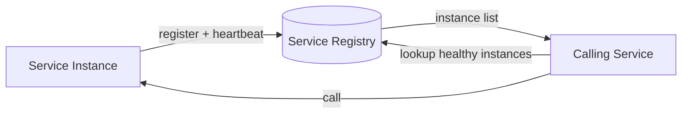

#### 22 — What's the difference between client-side and server-side service discovery? {#22}
Client-side: the calling service queries the registry directly and picks an instance itself — no extra hop, but every client needs the discovery logic. Server-side: the caller calls a fixed address that queries the registry and routes the request — simpler clients, but adds a hop.

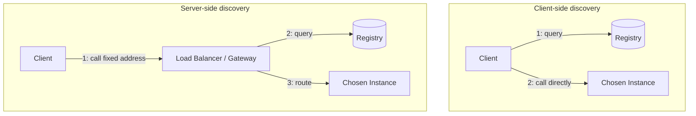

#### 23 — What is an API gateway, and what responsibilities does it typically centralize? {#23}
A single entry point that centralizes cross-cutting concerns so individual services don't each reimplement them: authentication, rate limiting, routing, TLS termination, logging, and sometimes response aggregation. The tradeoff is it becomes a critical-path component that needs to be highly available.

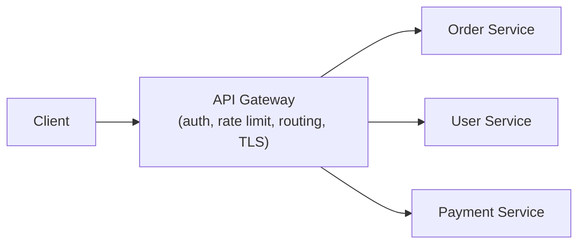

#### 24 — Explain bounded contexts in Domain-Driven Design, and why they matter for deciding microservice boundaries. {#24}
A bounded context is an explicit boundary within which a particular domain model and terminology are consistent — the same word can mean something different in another context, and that's fine as long as each context owns its own model. A well-designed service should own one bounded context.

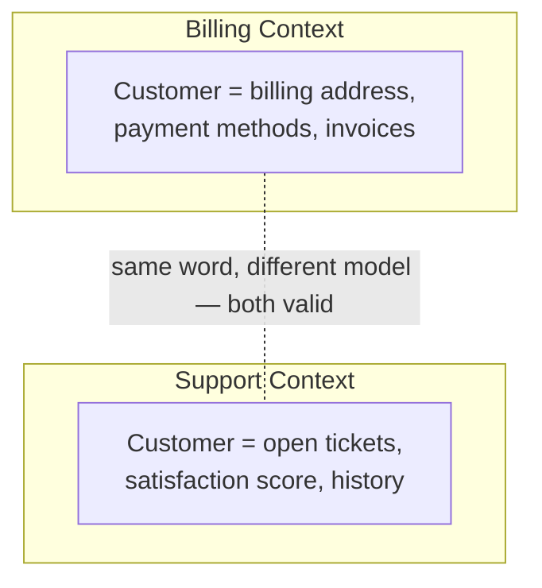

#### 25 — What's the difference between an Entity and a Value Object in Domain-Driven Design? {#25}
An Entity has a persistent identity that outlives any single attribute value — two `Order` objects with identical fields are still different orders if their IDs differ, and an entity's attributes can change over time while it remains "the same" order. A Value Object has no identity of its own — it's defined entirely by its attributes, is typically immutable, and two value objects with the same attributes are interchangeable (a `Money{Amount: 100, Currency: "USD"}` doesn't need an ID; another `Money{100, "USD"}` is equal to it). Modeling something as a value object instead of an entity removes a whole class of identity-tracking and mutation bugs — reach for it whenever "what is this" matters more than "which one is this."

#### 26 — What is an Aggregate in DDD, and what role does the Aggregate Root play? {#26}
An Aggregate is a cluster of entities and value objects treated as a single consistency boundary — everything inside it is loaded, modified, and saved together, and invariants that span multiple objects (an Order's total must equal the sum of its line items) are enforced within that boundary. The Aggregate Root is the single entry point: external code only ever references and calls methods on the root (`Order`), never reaches directly into its internals (`OrderLine`) to mutate them — that's what lets the root actually enforce its invariants instead of them being bypassed. Aggregate boundaries should be kept small; a common mistake is modeling an entire object graph as one giant aggregate, which serializes writes across unrelated concerns and kills concurrency.

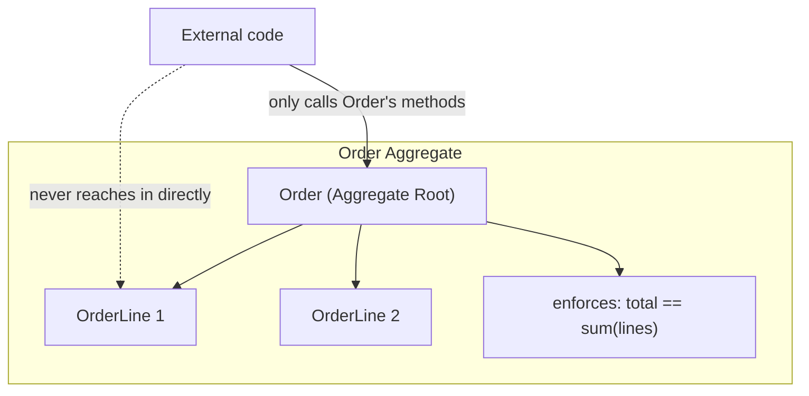

#### 27 — What is a domain event, and how does it differ from an integration event? {#27}
A domain event captures something that happened inside the domain model that other parts of the same bounded context care about — `OrderPlaced`, `InventoryReserved` — raised by an aggregate as a side effect of a state change, typically handled in-process, often within the same transaction. An integration event is the cross-service version: a domain event (or a derived, more stable version of it) published externally over a broker so other bounded contexts can react — this is exactly what the [outbox pattern](#33) (Part 3) exists to publish reliably. Keeping the two separate matters because a domain event's shape is free to change with the internal model, while an integration event is a public contract other teams depend on and needs the same versioning discipline as an API.

#### 28 — What does the Repository pattern give you in a DDD-structured service? {#28}
A Repository provides a collection-like interface (`Get`, `Save`, `FindByX`) for retrieving and persisting aggregates, hiding the actual storage mechanism (SQL, a document store, an in-memory fake in tests) behind that interface. The domain layer depends only on the repository interface, not on a concrete database driver — so business logic can be unit-tested against an in-memory fake repository with no database at all, and the storage technology can change without touching domain code. It's the same dependency-inversion idea as Go's usual "define the interface where it's consumed, not where it's implemented" convention, applied specifically to persistence.

#### 29 — What is an Anti-Corruption Layer, and when do you need one? {#29}
An Anti-Corruption Layer (ACL) is a translation boundary placed between your bounded context and an external system (a legacy service, a third-party API, another team's model) so that the external system's model, quirks, and vocabulary never leak directly into your domain model — it translates their shapes into yours at the boundary instead. Needed whenever integrating with a system whose model doesn't match your own domain concepts, especially a legacy or third-party one you don't control — without an ACL, that external model's inconsistencies and future changes ripple straight into your code.

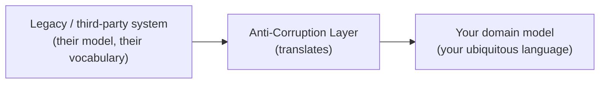

#### 30 — What is "ubiquitous language" in DDD, and why does it matter for an architect? {#30}
Ubiquitous language is a shared vocabulary, defined by the domain and used consistently by both engineers and domain experts — in conversation, in code (class and method names), and in documentation — with no separate "business term" that gets silently translated into a different "technical term" in the codebase. It matters at the architecture level because bounded context boundaries are usually where the language actually changes — the moment two teams use the same word to mean different things ([Q24](#24)'s "Customer" example) is a signal you've crossed into a different bounded context, which is itself a strong hint for where a service boundary should be.

#### 31 — What is hexagonal (ports and adapters) architecture, and how does it relate to DDD? {#31}
Hexagonal architecture puts the domain model at the center, fully isolated from infrastructure, and defines "ports" (interfaces the domain needs, like a repository or a notifier) that "adapters" implement for a specific technology (a Postgres repository, an SMTP email adapter, an HTTP handler adapter driving the domain from the outside). The domain never imports infrastructure code — dependencies point inward, only adapters depend on the domain, never the reverse. It pairs naturally with DDD: the domain model built with entities, value objects, and aggregates lives at the hexagon's center, while repositories ([Q28](#28)) are exactly the kind of port the pattern formalizes, and swapping a real Postgres adapter for an in-memory test adapter is the same benefit stated more architecturally.

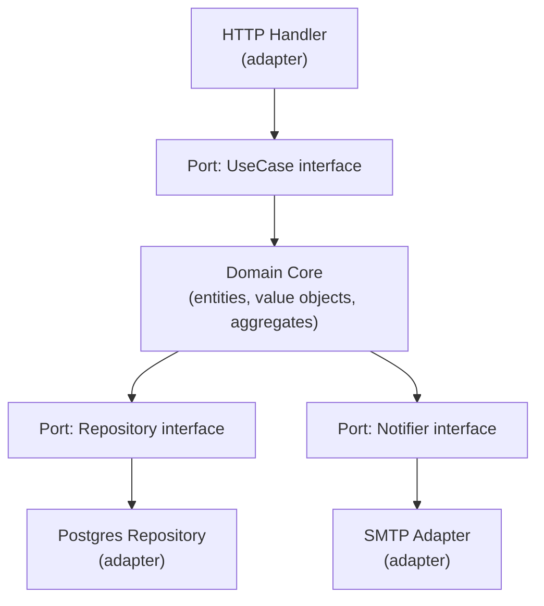

#### 32 — What is the "database per service" pattern, and why is a shared database across services usually an anti-pattern? {#32}
Each microservice owns its own database; no other service reads or writes it directly. A shared database silently recouples services at the schema level: any service can be broken by another team's migration, and there's no real ownership boundary.

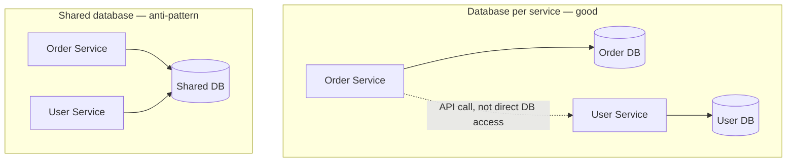

#### 33 — How do you handle a query that needs data owned by multiple services (e.g., an order summary needing user, inventory, and payment data)? {#33}
API composition: a gateway calls each owning service's API in parallel and stitches results together — simple, but adds latency and couples availability to every downstream service. CQRS with a materialized read model: services publish events on change, and a read-optimized store built from those events answers the composite query directly.

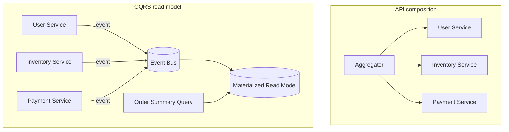

#### 34 — What is distributed tracing, and how does it help debug a slow request spanning multiple services? {#34}
Distributed tracing follows a single logical request as it fans out across many services, recording each service's processing time as a "span" linked into one trace via a shared trace ID. With a tool like Jaeger/OpenTelemetry, you get a single visual timeline showing exactly which service accounted for the latency.

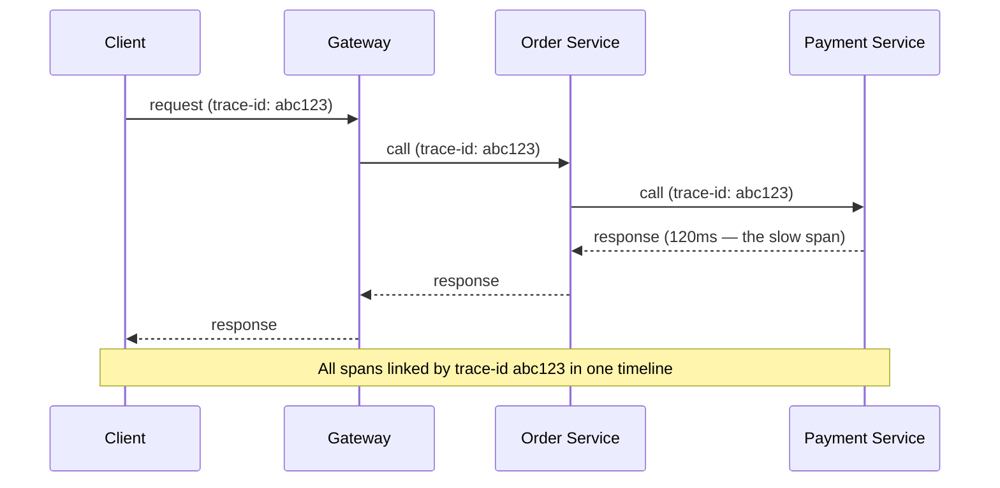

#### 35 — Explain correlation IDs and trace context propagation across service calls. {#35}
A correlation ID is generated once at the edge and passed along in every downstream call, usually as an HTTP header. Every service logs that ID alongside its own log lines, so you can reconstruct the full picture across services. In Go, `context.WithValue` is legitimately meant for exactly this.

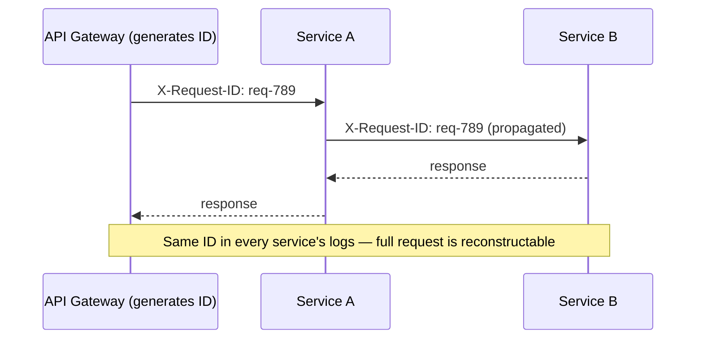

#### 36 — What is a circuit breaker, and how does it differ from a retry/backoff strategy? {#36}
Retry/backoff assumes the downstream is fine but this request had a transient hiccup. A circuit breaker tracks the failure rate over time and, once it crosses a threshold, "opens" and stops sending requests entirely for a cooldown period, failing fast instead of piling on more requests.

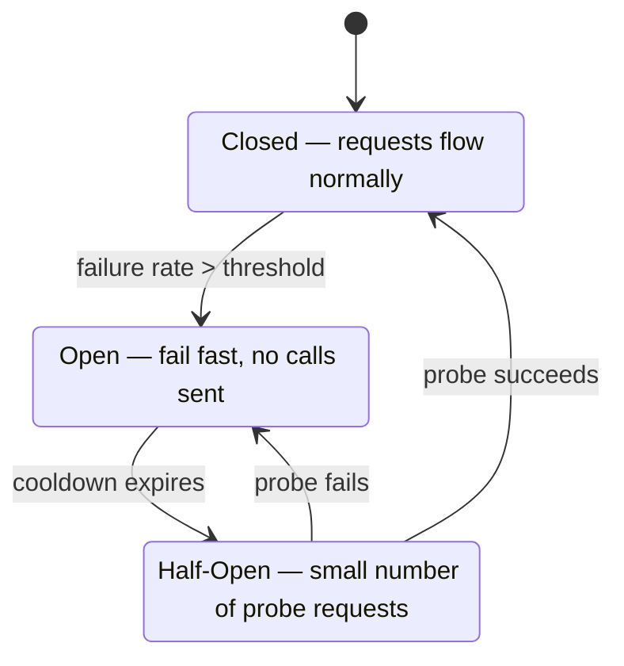

#### 37 — How do you secure service-to-service communication in a microservices architecture? {#37}
mTLS: both sides present certificates so each service cryptographically verifies the other's identity. JWT propagation: the caller's identity/claims are forwarded as a signed token through the call chain. Service accounts/API keys for service-level (not user-level) identity.

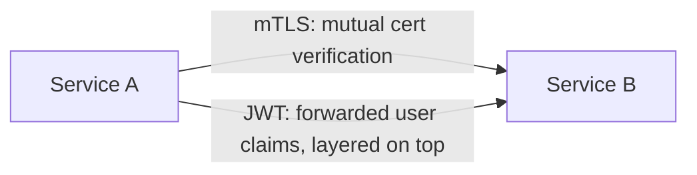

#### 38 — What is a service mesh, and what problems does it solve that you'd otherwise build into each service? {#38}
A service mesh (Istio, Linkerd) is a sidecar proxy deployed alongside every service instance that handles mTLS, retries/timeouts/circuit breaking, load balancing, and observability transparently, without application code needing to implement any of it.

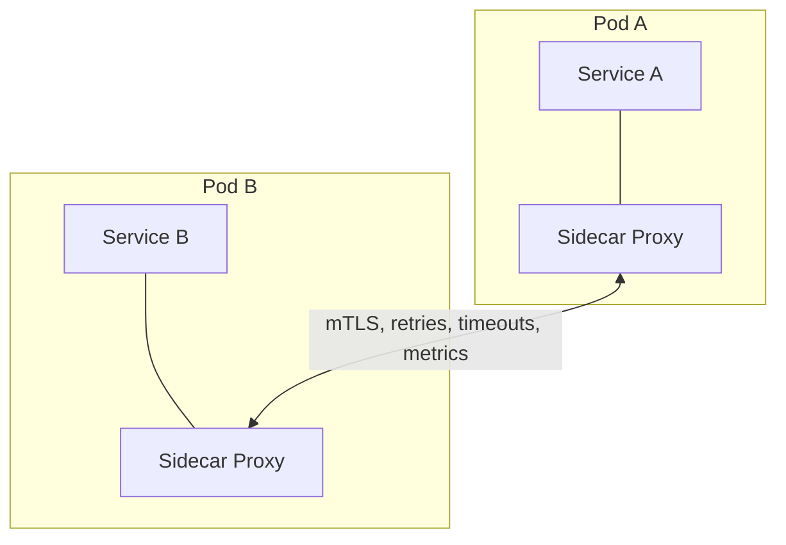

#### 39 — How do you version and evolve APIs between microservices without breaking consumers during a rolling deployment? {#39}
During a rolling deploy, old and new versions run simultaneously, so the API must be backward compatible for the whole rollout window at minimum. For a genuinely breaking change, version the API explicitly (`/v1/`, `/v2/`) and run both in parallel until every consumer has migrated.

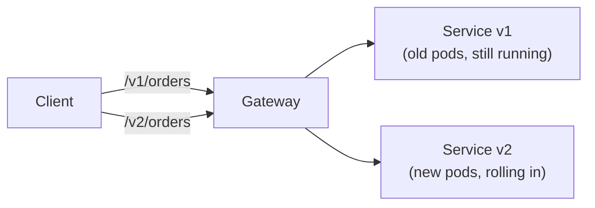

---

## Notes

**[Microservices Architecture](#microservices-architecture):** worth a full pass rather than a skim if distributed/microservice systems and DDD/event-driven architecture aren't part of your regular experience. [24](#24) (bounded contexts) through [31](#31) (hexagonal architecture) are the DDD core, and [32](#32) (database per service) is the natural follow-up once bounded contexts come up. Rehearse the DDD block ([25](#25)–[31](#31)) as one connected story, not seven isolated facts: ubiquitous language ([30](#30)) surfaces a bounded context ([24](#24)), which owns aggregates ([26](#26)) built from entities and value objects ([25](#25)), which raise domain events ([27](#27)) and persist through repositories ([28](#28)) — with an anti-corruption layer ([29](#29)) at the edges and hexagonal architecture ([31](#31)) as the structural pattern tying repositories and ports together.

---

Part 5 of 7 · [Interview Prep](/interview-prep/) · ← Previous: [Part 4 — Advanced SQL](/interview-prep-sql-advanced/) · Next: [Part 6 — Security & Cloud](/interview-prep-security-cloud/) →

<script src="https://cdn.jsdelivr.net/npm/mermaid@11/dist/mermaid.min.js"></script>
<script>
document.querySelectorAll('pre code.language-mermaid').forEach(function (el) {
  var div = document.createElement('div');
  div.className = 'mermaid';
  div.textContent = el.textContent;
  el.parentElement.replaceWith(div);
});
mermaid.initialize({ startOnLoad: true, theme: 'neutral' });
</script>
