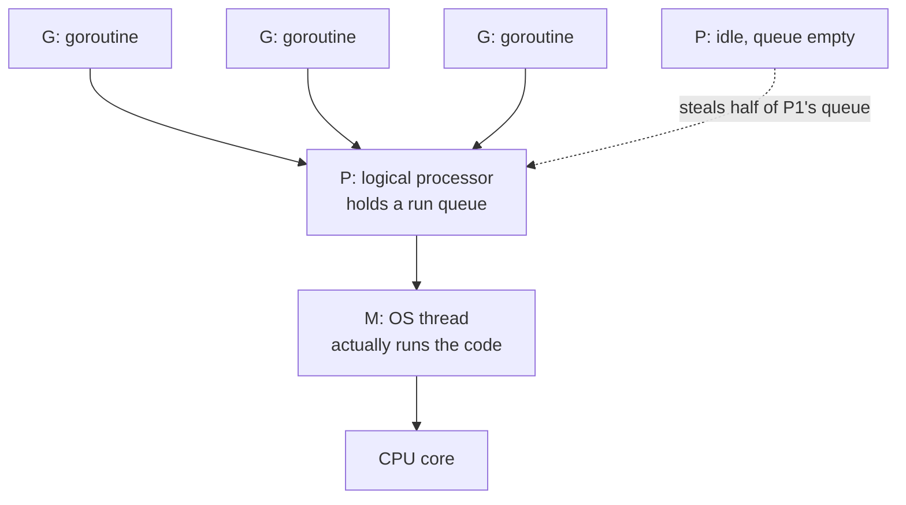
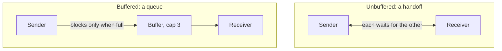
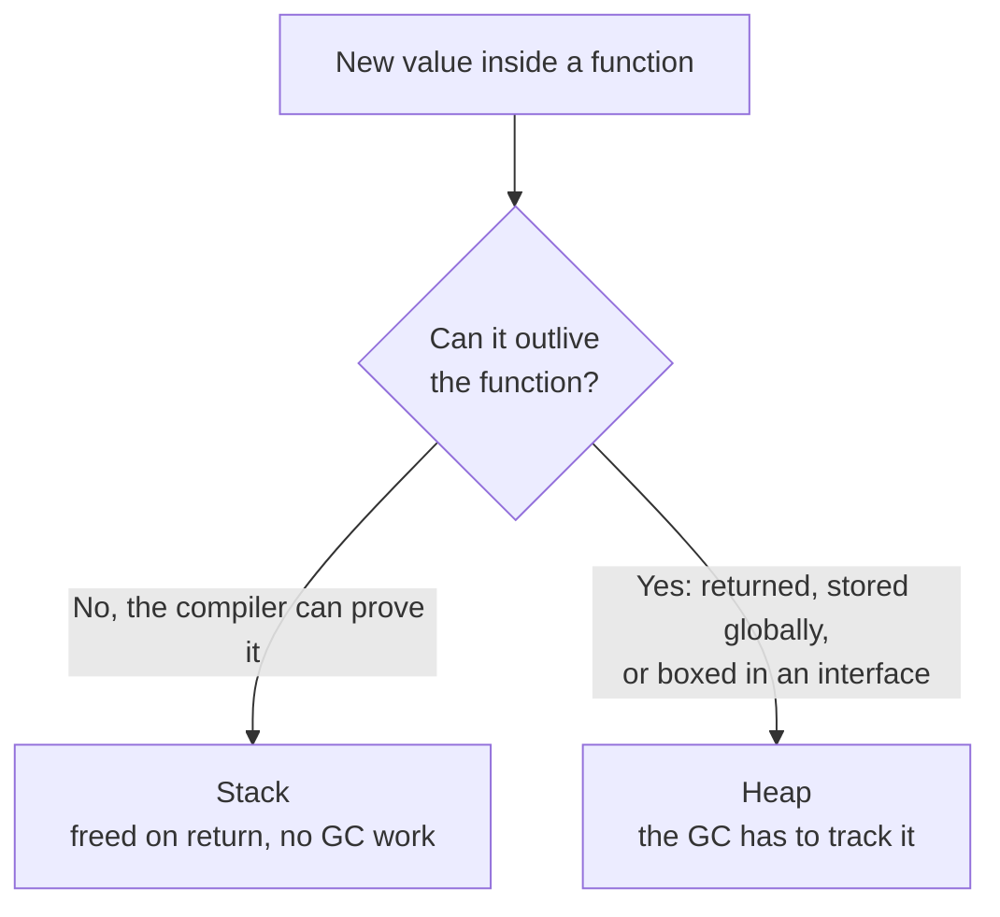
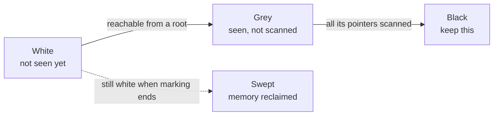

Part 1 of 7 · [Interview Prep](/interview-prep/) · Next: [Part 2 — Coding Patterns](/interview-prep-coding-patterns/) →

Go is a small language, and interviewers know it. So Go interviews go deep instead of wide. They take something you use every day, a slice, a channel, an error, and keep asking why until they find the edge of what you actually understand.

**What this assumes:** you've written Go. You know what a struct, a slice, a goroutine and an `if err != nil` are. Everything past that gets explained here.

**What you should be able to do after:** answer the follow-up question, not just the first one. That's the whole difference between "I've used this" and "I know this."

Every answer opens with **The gist**, one or two plain sentences. If the gist is all you have time for, that's still worth more than a half-remembered detail. The full answer underneath is what you say when they ask you to go deeper.





## Go Fundamentals

*All ten are fair game at any level, and they're the most likely way a screen opens. [8](#8), [9](#9) and [10](#10) are the three that show up as real bugs rather than trivia.*

### 1. What is the zero value of a struct in Go, and why does Go have zero values at all? {#1}

{}
**The gist:** declare a variable in Go and it's already usable. No garbage memory, no uninitialized surprise: an `int` is 0, a `string` is `""`, a pointer is `nil`.

Every field gets its type's zero value (`0`, `""`, `nil`, `false`), so a struct's zero value is all fields zeroed. Go does this so every variable is always in a valid, usable state immediately after declaration, with no uninitialized-memory bugs like in C.

```go
type Config struct {
    Port    int
    Host    string
    Debug   bool
    Timeout *time.Duration
}

var c Config // {Port: 0, Host: "", Debug: false, Timeout: nil}
```

This is why `sync.Mutex` and `bytes.Buffer` are usable straight out of a `var` declaration: their zero values were designed to be the ready-to-use state.

**Try it:** print `c` with `fmt.Printf("%+v\n", c)` right after `var c Config` and confirm every field shows its zero value, including the `nil` pointer.
{}

### 2. What's the difference between an array and a slice in Go? {#2}

{}
**The gist:** an array's size is part of its type and it copies whole. A slice is a small header pointing at an array, so passing one around is cheap.

An array has a fixed size baked into its type (`[5]int` and `[10]int` are genuinely different types) and is copied by value on every assignment and function call.

A slice is a three-word header: a pointer to an underlying array, a length, and a capacity. Copying a slice copies that header, not the data, which is why slices feel reference-like and why `append` can grow them.

```go
var a [5]int          // an array, size is part of the type
b := []int{1, 2, 3}   // a slice: ptr + len + cap

func mutate(arr [5]int)  { arr[0] = 99 } // no effect on the caller
func mutateS(s []int)    { s[0] = 99 }   // caller sees the change
```
{}

### 3. How does `append` work under the hood, and when does it reallocate? {#3}

{}
**The gist:** if there's spare capacity, `append` writes into it and bumps the length. If there isn't, Go allocates a bigger array, copies everything across, and hands you a slice pointing at the new one.

If the slice has enough capacity, `append` writes into the existing backing array and just bumps length. If not, Go allocates a new, larger backing array (roughly doubling for small slices, with a smaller growth factor for large ones), copies the old data over, and returns a slice pointing at the new array.

```go
s := make([]int, 0, 2)
fmt.Println(len(s), cap(s)) // 0 2

s = append(s, 1, 2)         // fits, same array
s = append(s, 3)            // full, so Go allocates a new one
fmt.Println(len(s), cap(s)) // 3 4
```

**What they're testing:** whether you know the return value matters. `append(s, x)` without reassigning to `s` is a bug precisely because the result can point at a different array than the input did.

**Try it:** print `&s[0]` right before and right after the `append` that forces a reallocation. The address changes, which is proof you're now looking at a different backing array.
{}

### 4. What is the difference between a value receiver and a pointer receiver on a method? {#4}

{}
**The gist:** a value receiver works on a copy, so changes vanish when the method returns. A pointer receiver works on the real thing.

A value receiver gets a copy of the struct, so mutations inside the method don't affect the original. A pointer receiver operates on the original via its address, so mutations persist.

Pointer receivers are also required if the method needs to mutate state, or if the struct is large enough that copying it on every call is wasteful.

```go
type Counter struct{ n int }

func (c Counter) IncByValue()   { c.n++ } // changes a copy, does nothing
func (c *Counter) IncByPointer() { c.n++ } // changes the real counter
```

**What they're testing:** whether you keep receivers consistent across a type. Mixing value and pointer receivers on the same type is where the method set rules start biting, because only `*T` satisfies an interface that includes pointer-receiver methods.
{}

### 5. When would passing a struct by value vs pointer matter for performance and correctness? {#5}

{}
**The gist:** small structs are usually cheaper to copy. Big ones, or ones you need to mutate, should go by pointer.

For correctness, use a pointer if the callee needs to mutate the caller's data, or if you want to avoid copying a large struct on each call.

For performance, small structs (a few words) are often cheaper by value: they stay on the stack, don't escape to the heap, and need no indirection. Large structs, or ones passed into interfaces, are cheaper by pointer to avoid the copy cost, at the tradeoff of a likely heap escape and more GC pressure.
{}

### 6. What does `defer` do, and when do deferred calls run exactly? {#6}

{}
**The gist:** `defer` runs a call when the function exits, however it exits. The catch: the arguments are frozen at the moment you write `defer`, not when it actually runs.

`defer` schedules a function call to run when the surrounding function returns, regardless of how it returns (normal return or panic). Multiple defers run in LIFO order, last registered runs first.

Critically, the deferred call's *arguments* are evaluated immediately at the `defer` statement, not later when it runs.

```go
func surprise() {
    i := 0
    defer fmt.Println("deferred:", i) // prints 0, not 1
    i++
    fmt.Println("direct:", i)         // prints 1
}

// Wrap it in a closure if you want the value at run time.
defer func() { fmt.Println("closure:", i) }() // prints 1
```

**What they're testing:** that argument evaluation trap, usually followed by "so how do you log the final error from a defer?" The answer is a closure over a named return value.

**Try it:** run `surprise()` yourself and check the print order. `deferred: 0` prints after `direct: 1`, even though the `defer` line runs first in the source.
{}

### 7. What's the difference between `make` and `new`? {#7}

{}
**The gist:** `new` gives you a pointer to zeroed memory. `make` is only for slices, maps and channels, and gives you one that's actually ready to use.

`new(T)` allocates zeroed memory for a `T` and returns a `*T` pointing at it. It works for any type.

`make` is only for slices, maps and channels, and returns an initialized value of that type rather than a pointer. A map from `make` has its internal hash table built; a map from `new` is a pointer to a nil map you still can't write to.

```go
p := new(int)              // *int, points at 0
m := make(map[string]int)  // ready to write to

bad := new(map[string]int) // *map[string]int, still nil inside
(*bad)["k"] = 1            // panic: assignment to entry in nil map
```

**Try it:** run the `bad` example and read the panic message. Then swap it for `make(map[string]int)` and confirm the same assignment works.
{}

### 8. What's the difference between `var x []int` and `x := []int{}`? {#8}

{}
**The gist:** both are empty and both behave the same for `len`, `append` and `range`. They differ in exactly two places: `== nil`, and the JSON they produce.

`var x []int` is a nil slice (len 0, cap 0, backing pointer nil). `x := []int{}` is a non-nil, empty slice.

```go
var x []int    // nil slice: len=0, cap=0, ptr=nil
y := []int{}   // non-nil, empty slice

x == nil       // true
y == nil       // false

json.Marshal(x) // -> null
json.Marshal(y) // -> []
```

**What they're testing:** the JSON difference, because it's a real API bug. A client expecting an array and receiving `null` will break, which is why handlers that return lists usually initialize with `[]T{}` rather than a `var` declaration.

**Try it:** run `json.Marshal` on both `x` and `y` yourself and check the raw output bytes: `null` vs `[]`.
{}

### 9. Explain how a slice's length and capacity work, and a footgun with slicing a slice. {#9}

{}
**The gist:** slicing doesn't copy. The new slice points at the same array, so writing through one can change the other.

Length is the number of elements you can see. Capacity is how much room exists in the backing array from the slice's start point onward.

The footgun: `s2 := s1[:3]` still shares `s1`'s backing array, so writes through `s2` mutate `s1`. Appending to `s2` can silently overwrite elements `s1` hasn't "seen" yet, if capacity allows it.

```go
s1 := []int{1, 2, 3, 4, 5}
s2 := s1[:3]           // shares s1's backing array
s2[0] = 99             // mutates s1[0] too
s2 = append(s2, 100)   // overwrites s1[3] if cap allows it
```

Use a full slice expression, `s1[:3:3]`, to cap the capacity and force the next `append` to allocate a fresh array instead.

**What they're testing:** whether you'd spot this in review. It's the most common way Go code corrupts data without anything looking wrong.

**Try it:** run the `s1`/`s2` example and print `s1` right after the `append(s2, 100)` line. Then rewrite `s2 := s1[:3]` as `s2 := s1[:3:3]` and confirm `s1` no longer changes.
{}

### 10. What happens when a `nil` map is read from vs written to? {#10}

{}
**The gist:** reading a nil map is fine and gives you the zero value. Writing to one panics. That asymmetry catches everyone once.

Reading from a nil map is safe and returns the zero value for the value type, exactly as if the key weren't present. Writing to a nil map panics with "assignment to entry in nil map." Always `make()` a map before writing to it.

```go
var m map[string]int
v := m["missing"]   // ok, returns 0 (zero value)
m["key"] = 1        // panic: assignment to entry in nil map

m = make(map[string]int)
m["key"] = 1        // ok now
```

This is why a struct with a map field needs an explicit constructor. The zero value of a map, unlike a mutex or a buffer, is not ready to use.

**Try it:** run the snippet as written, then comment out the `make` line and confirm the panic message reads exactly "assignment to entry in nil map."
{}

---

## Types, Interfaces & Generics

*11 to 14 are everyday Go. 15, 17 and 20 are where interviewers start probing, and [17](#17) is the one that reaches production as a real bug.*

### 11. How does Go implement interfaces (structural typing) vs Java/C# explicit `implements`? {#11}

{}
**The gist:** you never write `implements` in Go. If your type has the methods, it satisfies the interface, and the compiler checks that for you.

Go interfaces are satisfied implicitly. Any type with the required methods satisfies the interface, with no declaration needed. It's structural typing checked at compile time, unlike Java or C# where a class must explicitly declare `implements InterfaceName`.

```go
type Stringer interface{ String() string }

type Point struct{ X, Y int }

// Point now satisfies Stringer. Nothing was declared.
func (p Point) String() string {
    return fmt.Sprintf("(%d, %d)", p.X, p.Y)
}
```

The practical consequence is that interfaces belong to the consumer, not the producer. You define the small interface you need where you need it, instead of the library author guessing for you.
{}

### 12. What is the empty interface `interface{}` (`any`) and what are its costs? {#12}

{}
**The gist:** `any` accepts anything, which means the compiler stops helping you. You get runtime type checks and often an extra heap allocation.

It's satisfied by every type, so it's used for "accept anything" APIs like `fmt.Println`'s arguments.

The costs are real. You lose compile-time type safety, you need runtime type assertions or switches to do anything meaningful with the value, and there's a boxing cost: storing a concrete value in an interface can force a heap allocation if it escapes.
{}

### 13. What is method embedding / struct embedding, and how does it differ from inheritance? {#13}

{}
**The gist:** embedding promotes the inner type's methods to the outer one. It looks like inheritance, but there's no polymorphism. It's composition with the delegation written for you.

Embedding a struct or interface inside another promotes its fields and methods to the outer type, so `outer.Method()` calls the embedded type's method unless the outer type defines its own.

Unlike inheritance, there's no polymorphism through the base type. It's not an is-a relationship and there's no virtual dispatch.

```go
type Logger struct{ prefix string }

func (l Logger) Log(msg string) { fmt.Println(l.prefix, msg) }

type Server struct {
    Logger // embedded
    addr string
}

s := Server{Logger{"[srv]"}, ":8080"}
s.Log("started") // promoted from Logger
```

**What they're testing:** whether you call it inheritance. The giveaway follow-up is "can I pass a `Server` where a `Logger` is expected?" You can't, because there's no subtyping here.
{}

### 14. What's the difference between an interface satisfied implicitly at compile time vs reflection-based duck typing? {#14}

{}
**The gist:** interface satisfaction costs nothing at runtime, it's all settled at compile time. Reflection is the opposite: it works when you don't know the type, and you pay for it on every call.

Go's interface satisfaction is checked entirely at compile time. If a type lacks the methods, it's a compile error, and there's zero runtime cost to the check.

Reflection (the `reflect` package) is a runtime mechanism for inspecting and calling methods dynamically when you don't know the type at compile time. It's much slower and loses static safety, so it belongs in generic libraries like `encoding/json`, not in everyday application code.
{}

### 15. Explain how the Go compiler represents an interface value internally. {#15}

{}
**The gist:** an interface value is two pointers. One points at a table describing the concrete type and its methods, the other points at the data itself.

An interface value is a two-word structure: a pointer to an "itab" (interface table, holding the concrete type info and a pointer to its method set matching this interface), and a pointer to the actual data.

That's why interface method calls carry one extra indirection versus a direct concrete-type call, and why even a very small concrete value assigned to an interface can escape to the heap.

**What they're testing:** whether you can connect this to [17](#17). Once you see the interface as a (type, value) pair, the nil-interface gotcha stops being magic and becomes obvious.
{}

### 16. When would you use generics vs `interface{}` plus a type switch? {#16}

{}
**The gist:** use generics when the logic is identical and only the type changes. Use an interface when you actually need different behaviour per type.

Reach for generics when the operation is structurally identical across types (sorting, filtering, a cache). You get compile-time type checking, no runtime type assertions, and no boxing or allocation overhead for the parameterized type.

Reach for `interface{}` plus a type switch when you genuinely need different runtime behaviour per type, or you're building something like a serialization layer that must handle arbitrary types at runtime.
{}

### 17. Explain the "nil interface vs interface holding a nil pointer" gotcha. {#17}

{}
**The gist:** an interface holds a type and a value. Put a nil pointer in it and the type is still set, so the interface itself isn't nil. That's how `err != nil` fires on an error that's nil.

An interface value is really a (type, value) pair. If you assign a nil `*MyError` to an `error` interface variable, the interface's type becomes `*MyError` and its value is nil. The interface itself is *not* nil, because it has a concrete type.

So `err != nil` can be true even though the underlying pointer is nil.

```go
func doWork() *MyError { return nil }

func run() error {
    var err *MyError = doWork()
    return err // returns a NON-nil error interface!
}

if run() != nil {
    // always true, even though the *MyError itself is nil
}
```

The fix is to never declare a concrete error type as the return variable. Return `error` and assign `nil` to it directly.

**What they're testing:** this one separates people who've read about Go from people who've debugged Go. It's a genuinely confusing bug the first time you hit it.

**Try it:** run `run()` and print `run() == nil`. It prints `false`, which is the whole gotcha in one line.
{}

### 18. What is a type assertion vs a type switch, and how do you do an assertion safely? {#18}

{}
**The gist:** use the two-value form, `v, ok := x.(T)`, and you get a bool instead of a panic. The one-value form panics on a mismatch.

A type assertion (`v, ok := x.(T)`) extracts the concrete value if `x` holds type `T`. The two-value form avoids a panic on mismatch by setting `ok` to false instead. A type switch (`switch v := x.(type)`) branches over several possible concrete types in one construct.

Always prefer the two-value form unless you're certain of the type.

```go
// two-value assertion: safe, no panic
v, ok := x.(string)
if !ok {
    // x is not a string
}

// type switch: branch over multiple concrete types
switch t := x.(type) {
case string:
    fmt.Println("string:", t)
case int:
    fmt.Println("int:", t)
default:
    fmt.Println("unknown type")
}
```

**Try it:** change the two-value assertion to a bare `v := x.(string)` where `x` actually holds an `int`, and watch it panic instead of just setting `ok` to false.
{}

### 19. What are Go generics (type parameters), and when would you use them over interfaces? {#19}

{}
**The gist:** generics let you write the logic once and have the compiler stamp out a version per type, with no runtime type checks and no boxing.

Generics (`func Map[T, U any](s []T, f func(T) U) []U`) let you parameterize a function or type over a type, checked at compile time, without runtime assertions or reflection.

Use them when you need the *same logic* across different concrete types with type safety and no boxing cost. Interfaces are the better fit when you need runtime polymorphism, meaning different behaviour per type rather than just different data types.

```go
func Map[T, U any](s []T, f func(T) U) []U {
    out := make([]U, len(s))
    for i, v := range s {
        out[i] = f(v)
    }
    return out
}

squares := Map([]int{1, 2, 3}, func(n int) int { return n * n })
```

**Try it:** call `Map` with `T` and `U` as different types, like turning `[]int` into `[]string`, and confirm it compiles with no extra code needed for the new type pair.
{}

### 20. Explain type constraints and the `comparable` constraint. {#20}

{}
**The gist:** a constraint is the list of types a generic parameter is allowed to be. `comparable` means "supports `==`", which you need to use the type as a map key.

A constraint restricts which types can satisfy a generic type parameter. `[T constraints.Ordered]` restricts `T` to types supporting `<` and `>`. `comparable` restricts `T` to types supporting `==` and `!=`, which is what you need to use the type as a map key inside a generic function.

```go
type Ordered interface {
    ~int | ~int64 | ~float64 | ~string
}

func Max[T Ordered](a, b T) T {
    if a > b {
        return a
    }
    return b
}

func Keys[K comparable, V any](m map[K]V) []K {
    keys := make([]K, 0, len(m))
    for k := range m {
        keys = append(keys, k)
    }
    return keys
}
```

The `~` means "any type whose underlying type is this," so a `type Celsius float64` still satisfies the constraint.

**Try it:** try instantiating `Keys` with a slice type as the type parameter, like `Keys[[]int, bool]`, and read the compiler's constraint error. Slices aren't comparable in Go, so `comparable` rejects them at compile time.
{}

---

## Concurrency Deep Dive

*This is where Go interviews actually live, so expect all of it. [22](#22), [26](#26) and [35](#35) come up most often, and [26](#26) is the one that bites in production.*

### 21. What is a goroutine, and how is it different from an OS thread? {#21}

{}
**The gist:** a goroutine is a function the Go runtime schedules for you. It starts with about 2KB of stack instead of an OS thread's megabytes, which is why you can have a hundred thousand of them.

A goroutine is a lightweight, user-space unit of concurrent execution managed by the Go runtime. It starts with a tiny growable stack (~2KB), versus an OS thread's fixed and much larger stack, often measured in megabytes, plus kernel-level scheduling overhead.

Go can run hundreds of thousands of goroutines cheaply because the runtime multiplexes them onto a much smaller number of OS threads.

**Try it:** print `runtime.NumGoroutine()` before and after starting 100,000 goroutines that each block on an empty channel. Watch the count climb with no crash.
{}

### 22. What is the GMP scheduler model? {#22}

{}
**The gist:** G is your goroutine, M is a real OS thread, P is a slot that grants permission to run Go code. The runtime keeps shuffling Gs onto Ms through Ps so no thread sits idle.

G is a goroutine. M is an OS thread (machine). P is a logical processor, which holds a run queue of goroutines plus the resources needed to execute Go code.

The runtime schedules Gs onto Ms via Ps. The number of Ps is normally `GOMAXPROCS`, and this design lets goroutines migrate between OS threads efficiently, including work-stealing when one P's queue runs dry.



The payoff is that a goroutine blocking on a syscall doesn't block the others. The runtime detaches that M and hands its P to another thread.

**What they're testing:** whether you understand why `GOMAXPROCS` matters, and why blocking syscalls don't wreck throughput the way they would with a naive thread pool.
{}

### 23. What is a data race, and how does the Go race detector find them? {#23}

{}
**The gist:** two goroutines touch the same memory, at least one of them writes, and nothing orders them. The result isn't slightly wrong, it's undefined.

A data race is two goroutines accessing the same memory location concurrently, with at least one access being a write, and no synchronization ordering them.

`go run -race` and `go test -race` instrument memory accesses at compile time and track happens-before relationships at runtime, flagging races when they actually occur during execution.

```go
counter := 0
for i := 0; i < 1000; i++ {
    go func() { counter++ }() // race: read, add, write, unsynchronized
}
```

```bash
go test -race ./...
```

**What they're testing:** whether you know the race detector only catches races on code paths that actually execute. A clean `-race` run is evidence, not proof, which is why it belongs in CI rather than in a one-off check.

**Try it:** run this loop without `-race` a few times first. It'll often "work" every time by luck, which is exactly why you can't trust an untested program just because it hasn't crashed yet.
{}

### 24. What happens if you close a channel twice, or send on a closed channel? {#24}

{}
**The gist:** closing twice panics. Sending on a closed channel panics. Receiving from one never panics, it just hands back the zero value immediately.

Closing an already-closed channel panics. Sending on a closed channel panics. Receiving from a closed channel is always safe and returns the zero value immediately, with `ok == false` in the two-value form.

```go
ch := make(chan int)
close(ch)

v, ok := <-ch // 0, false. Safe.
close(ch)     // panic: close of closed channel
ch <- 1       // panic: send on closed channel
```

That asymmetry is exactly why the standard rules are "only the sender closes" and "close, don't send." A receiver can never know whether more sends are coming, so it's never the receiver's job to close.

**What they're testing:** what happens with multiple senders. The answer is that no single sender can safely close, so you need a separate coordinator, a `sync.Once`, or a done channel instead.

**Try it:** run each of the three operations in the snippet one at a time and confirm which two panic and which one just returns quietly.
{}

### 25. Why is `context.WithValue` discouraged for anything beyond request-scoped metadata? {#25}

{}
**The gist:** it's an untyped bag. Nothing is checked at compile time, and a function's real inputs stop being visible in its signature.

It's untyped (`interface{}` keys and values), so misuse isn't caught at compile time. It hides real dependencies, because a function's actual inputs no longer appear in its signature. And it can silently break if a key collides or gets misspelled.

It's meant for cross-cutting concerns like trace and request IDs, not for passing business logic parameters.
{}

### 26. What is a goroutine leak, and can you give a concrete example? {#26}

{}
**The gist:** a goroutine blocked forever never exits, so it and everything it references never get collected. The classic is sending to a channel nobody reads any more.

A goroutine that's blocked forever never exits, so it and anything it references is never garbage collected.

The classic example: a goroutine sends on an unbuffered channel, but the receiver already returned (because of a timeout, say) and nothing will ever read from that channel again. The sender blocks forever.

```go
// LEAK: if the caller times out, nothing ever reads from ch.
func leaky(ctx context.Context) {
    ch := make(chan int)
    go func() { ch <- expensive() }() // blocks forever on timeout
    select {
    case v := <-ch:
        use(v)
    case <-ctx.Done():
        return // the goroutine above is now stuck for good
    }
}

// FIX: a buffer of 1 lets the sender finish and exit.
ch := make(chan int, 1)
```

The general rule: every blocking send or receive needs an escape hatch, either a buffer big enough that the send can't block, or a `select` with `ctx.Done()`.

**What they're testing:** whether you can spot it in the code they hand you. This is the most common "find the bug" snippet in a Go interview.

**Try it:** call `leaky` with a context that's already timed out, then print `runtime.NumGoroutine()` a second later. The leaked goroutine is still there, and it stays there forever.
{}

### 27. What's the difference between `atomic.AddInt64` and wrapping an int with a mutex? {#27}

{}
**The gist:** an atomic is one CPU instruction covering one variable. A mutex protects a whole block of code. Use the atomic for a counter, the mutex for anything with more than one moving part.

Atomic operations use CPU-level instructions (compare-and-swap) to update memory without a full lock. That's much cheaper for simple operations like counters, but it's limited to specific primitive operations.

A mutex protects an arbitrary critical section, meaning multiple statements and complex invariants, at the cost of higher overhead and potential contention.

**Try it:** write two benchmarks, one incrementing an `int64` with `atomic.AddInt64` and one incrementing a plain `int` behind a `sync.Mutex`, and compare `ns/op` with `go test -bench=. -benchmem`.
{}

### 28. Explain the Go memory model's "happens-before" relationship. {#28}

{}
**The gist:** without something explicitly ordering two goroutines, the compiler and the CPU are free to reorder your writes. "It works on my machine" isn't the same as correct.

It defines the conditions under which a write in one goroutine is guaranteed to be visible to a read in another.

Without an explicit happens-before edge (via channel operations, mutex lock and unlock, `sync.Once`, goroutine start, `WaitGroup`, or atomics), the compiler and CPU may reorder or cache operations freely. That's a data race even when it appears to work.

**What they're testing:** whether you treat "I tested it and it was fine" as evidence. A race that hasn't shown up yet is still a race, and it tends to surface on different hardware or under load.
{}

### 29. What's the difference between buffered and unbuffered channels? {#29}

{}
**The gist:** an unbuffered channel is a handoff, the sender waits for a receiver. A buffered one is a queue, so the sender only waits when it's full.

An unbuffered channel has no internal storage. A send blocks until a receiver is ready at the same moment, a rendezvous, and the same is true in reverse.

A buffered channel (`make(chan T, n)`) lets sends succeed with no waiting receiver as long as the buffer isn't full. Once it's full, sends block until space frees up.



```go
unbuffered := make(chan int)     // send blocks until a receiver is ready
buffered := make(chan int, 3)    // send succeeds until buffer is full

buffered <- 1 // ok, buffer has room
buffered <- 2 // ok
buffered <- 3 // ok, buffer now full
buffered <- 4 // blocks until something is received
```

**Try it:** change `make(chan int, 3)` to `make(chan int, 0)` and predict which line now blocks before you run it.
{}

### 30. How do you safely check whether a channel is closed while reading? {#30}

{}
**The gist:** use `v, ok := <-ch`. When `ok` is false the channel is closed and drained. There's no other safe way to ask.

Use the two-value receive form. `ok` is `false` once the channel is closed and drained. This is the idiomatic answer, as opposed to racy approaches like checking length or keeping a separate "isClosed" flag without synchronization.

```go
v, ok := <-ch
if !ok {
    // channel is closed and drained
    return
}
// use v
```

Ranging over a channel does the same thing implicitly: `for v := range ch` exits when the channel closes.
{}

### 31. Explain `select`, and how it's used for timeouts and cancellation. {#31}

{}
**The gist:** `select` waits on several channel operations at once and takes whichever is ready first. That's how you bolt a timeout or a cancel onto an otherwise blocking operation.

`select` blocks until one of several channel operations is ready, choosing pseudo-randomly if several are ready at the same time.

```go
select {
case res := <-ch:
    return res, nil
case <-time.After(2 * time.Second):
    return nil, errors.New("timeout")
}

select {
case <-ctx.Done():
    return ctx.Err()
case res := <-ch:
    return res, nil
}
```

Add a `default` case and `select` stops blocking entirely, which is how you write a non-blocking send or receive.

**Try it:** add a `default:` case to one of the two selects above and watch it stop blocking entirely, turning a blocking receive into a non-blocking one.
{}

### 32. What's the purpose of `context.Context`, and how do `WithCancel`, `WithTimeout`, `WithDeadline` and `WithValue` differ? {#32}

{}
**The gist:** `Context` is how you tell everything downstream to stop. Cancel it by hand, on a timer, or at a wall-clock deadline.

`Context` carries cancellation signals, deadlines, and request-scoped values across API boundaries and goroutines.

`WithCancel` gives you a manual cancel function. `WithTimeout` and `WithDeadline` auto-cancel after a duration or at a specific time. `WithValue` attaches a key-value pair for request-scoped metadata, and should never be used to pass optional function parameters.

```go
ctx, cancel := context.WithCancel(parent)
defer cancel()

ctx, cancel = context.WithTimeout(parent, 5*time.Second)
defer cancel()

ctx, cancel = context.WithDeadline(parent, someTime)
defer cancel()

ctx = context.WithValue(parent, requestIDKey, "abc-123")
```

Always `defer cancel()`, even on a timeout context. Skipping it leaks the timer and the goroutine watching it until the deadline passes.
{}

### 33. Explain `sync.WaitGroup` and a common misuse. {#33}

{}
**The gist:** `Add` before you start, `Done` when you finish, `Wait` until the count reaches zero. The bug is always calling `Add` too late.

`WaitGroup` lets one goroutine wait for a group of others to finish. Call `Add(n)` before starting them, `Done()` (usually deferred) inside each one, and `Wait()` to block until the counter hits zero.

The common misuse is calling `Add` after `Wait()` has started, or concurrently with it. That's a race, and it can panic or hang.

```go
var wg sync.WaitGroup
for i := 0; i < n; i++ {
    wg.Add(1) // correct: Add before the goroutine starts
    go func() {
        defer wg.Done()
        // work
    }()
}
wg.Wait()
// BUG: calling Add() concurrently with/after Wait() is a race
```

**Try it:** move `wg.Add(1)` inside the goroutine instead of before it starts, and run it a few times. It'll either finish before every goroutine is actually done or panic with a WaitGroup misuse message, depending on how the scheduler happens to interleave that run.
{}

### 34. Explain `sync.Once` and a real use case. {#34}

{}
**The gist:** it runs a function exactly once, no matter how many goroutines race to call it. Everyone else blocks until the first call finishes.

`sync.Once.Do(f)` guarantees `f` runs exactly once even when called from many goroutines concurrently, and all callers block until that first call completes.

A real use: lazily initializing a singleton like a global config object or a database connection pool, safely under concurrent first access.

```go
var (
    once sync.Once
    db   *sql.DB
)

func GetDB() *sql.DB {
    once.Do(func() {
        db, _ = sql.Open("postgres", dsn)
    })
    return db
}
```

**Try it:** call `GetDB()` from 50 goroutines at once, with a counter inside the `Do` function that increments each time it runs. Run it with `-race` for good measure, and confirm the counter never goes above 1.
{}

### 35. Design a worker pool in Go. What are the components? {#35}

{}
**The gist:** a jobs channel, N goroutines ranging over it, a results channel, and a context so you can stop early.

You need a jobs channel that producers send work into, a fixed number N of worker goroutines that read from it and process each item, a results channel for output, a `context.Context` passed down for cancellation, and a `sync.WaitGroup` so you know when all the work is drained.

```go
func workerPool(ctx context.Context, jobs <-chan Job, n int) <-chan Result {
    results := make(chan Result)
    var wg sync.WaitGroup

    for i := 0; i < n; i++ {
        wg.Add(1)
        go func() {
            defer wg.Done()
            for {
                select {
                case job, ok := <-jobs:
                    if !ok {
                        return
                    }
                    results <- process(job)
                case <-ctx.Done():
                    return
                }
            }
        }()
    }

    go func() { wg.Wait(); close(results) }()
    return results
}
```

**What they're testing:** this one usually arrives as "write it." The details they're watching for are who closes `results` (the coordinating goroutine, after `Wait`), and whether cancellation actually reaches the workers.

**Try it:** run `workerPool` with `n=1` and then `n=10` against the same job list and time the difference.
{}

---

## Memory Management & GC

*Nobody expects a junior to know GC internals cold. [36](#36), [41](#41) and [42](#42) are the three worth knowing now, because they change how you write everyday code.*

### 36. What is escape analysis, and how does it decide stack vs heap allocation? {#36}

{}
**The gist:** the compiler works out whether a value can outlive the function that made it. If it can't, the value lives on the stack and costs nothing to free.

The compiler statically analyzes whether a variable's lifetime or visibility could outlive the function that created it. If it can prove the variable never escapes, it allocates on the stack, which is cheap and freed automatically on return. Otherwise the variable "escapes to the heap" and becomes the GC's problem.



You don't have to guess. The compiler will tell you:

```bash
go build -gcflags='-m' ./...
```

**What they're testing:** whether you know you can check rather than speculate. "I'd run it with `-m` and look" is a better answer than any rule of thumb about when things escape.
{}

### 37. How does Go's garbage collector work at a high level? {#37}

{}
**The gist:** Go marks everything still reachable, then sweeps away what it didn't mark. Almost all of that runs while your program keeps going, which is why pauses stay under a millisecond.

Go uses a concurrent, tri-color mark-and-sweep collector. It marks reachable objects, moving them white to grey to black, mostly concurrently with the running program using write barriers. Then it sweeps the objects still white.

That keeps stop-the-world pauses very short, typically sub-millisecond, at the cost of burning CPU concurrently with your program.



The write barrier is the part that makes it safe to run concurrently. If your program creates a new pointer from a black object to a white one mid-cycle, the barrier catches it so the white object doesn't get collected while it's still in use.

**Try it:** run a small allocation-heavy program with `GODEBUG=gctrace=1` and read one line of the trace output. It shows heap size before and after each cycle, and how long that cycle paused the world.
{}

### 38. What is GC pressure, and what causes it in a typical Go service? {#38}

{}
**The gist:** GC pressure is just how fast you're making garbage. The more short-lived objects you allocate, the more often the collector has to run.

GC pressure is the rate at which your program creates heap garbage, forcing more frequent and more expensive collection cycles.

Common causes: excessive small allocations in hot paths (string concatenation, boxing values into interfaces), large numbers of short-lived objects, and slices or maps that grow unbounded and get reallocated over and over.
{}

### 39. How do you reduce allocations in a hot path? {#39}

{}
**The gist:** pre-size your slices, reuse your buffers, use `strings.Builder`, and profile before you guess.

Pre-size slices and maps with `make([]T, 0, expectedCap)`. Reuse buffers via `sync.Pool`. Avoid unnecessary boxing into `interface{}`. Use `strings.Builder` instead of `+=` concatenation. Pass pointers to large structs instead of copying them.

Then profile with `pprof -alloc_objects` to find the actual hot spots rather than guessing at them.

```go
// Before: grows and reallocates as it goes.
var out []Result
for _, x := range items {
    out = append(out, convert(x))
}

// After: one allocation, exactly the right size.
out := make([]Result, 0, len(items))
```

**Try it:** benchmark both versions with `go test -bench=. -benchmem` and compare `allocs/op`.
{}

### 40. What is `sync.Pool`, and when is it a bad idea? {#40}

{}
**The gist:** a pool of throwaway objects you reuse instead of reallocating. The catch is that the pool can drop anything at any time, so never put state you need in it.

`sync.Pool` caches and reuses temporary objects like byte buffers to cut allocation and GC churn.

Pooled objects can be evicted at any time, notably during GC, so it's only for objects you can afford to lose and recreate cheaply. It's a bad idea for anything holding meaningful state you need to persist.
{}

### 41. Explain how string concatenation in a loop causes performance issues. {#41}

{}
**The gist:** strings are immutable, so `s += x` builds a whole new string every time round the loop. Ten thousand iterations means ten thousand copies.

Go strings are immutable, so `s += x` in a loop allocates a brand-new string and copies the old contents on every iteration. That's O(n²) total work for n concatenations.

The fix is `strings.Builder` (or `bytes.Buffer`), which grows an internal buffer with amortized O(1) cost per append.

```go
// O(n^2): a fresh allocation and full copy every iteration.
var s string
for _, w := range words {
    s += w
}

// O(n): one growing buffer.
var b strings.Builder
for _, w := range words {
    b.WriteString(w)
}
s := b.String()
```

**What they're testing:** whether you recognize this shape in review. It's invisible at ten items and catastrophic at ten thousand, so it usually ships fine and falls over later.

**Try it:** benchmark both loops from 100 words up to 100,000 words with `-benchmem`, and watch the `+=` version's time grow much faster than linear while `strings.Builder`'s stays roughly flat per word.
{}

### 42. How can Go leak memory despite having a GC? {#42}

{}
**The gist:** the GC frees what's unreachable. A map you never delete from is perfectly reachable, so it isn't a leak to the GC. It's only a leak to you.

Anything still reachable is never collected. The common patterns:

- A global cache or map that grows with no eviction.
- A small slice that keeps a reference to a much larger backing array.
- Goroutine leaks, as in [26](#26).
- Subscriber or listener lists that never unregister closed connections.

The slice case surprises people most. Slicing ten bytes out of a ten-megabyte buffer keeps the whole ten megabytes alive, because the slice header still points into it. Copy the bytes out if you need to keep them.
{}

### 43. How would you investigate high memory usage in a running Go service in production? {#43}

{}
**The gist:** expose pprof, take two heap profiles a few minutes apart, and diff them. Whatever grew is your answer.

Expose `net/http/pprof` and pull a heap profile to see allocation sources by call site. Compare two heap snapshots taken over time with `-base` to find what's actually growing. Check the goroutine count for leaks, and correlate with GC stats to tell live heap growth apart from simply infrequent collection.

```bash
go tool pprof -base old.heap new.heap
GODEBUG=gctrace=1 ./myservice
```

**Try it:** run these two `pprof` commands against a small local server you control, and see what `-base` actually highlights between the two snapshots.
{}

### 44. What is `GOGC`, and how does tuning it trade off memory against CPU? {#44}

{}
**The gist:** `GOGC` is how much the heap may grow before a collection runs. Lower it and you use less memory and more CPU. Raise it and you trade the other way.

`GOGC` sets the target heap growth percentage before a GC cycle triggers, defaulting to 100.

Lowering it triggers GC more often: less peak memory, more CPU spent collecting. Raising it, or using `GOMEMLIMIT` as a hard cap, reduces GC frequency and CPU cost at the expense of higher peak memory.

**Try it:** run the same allocation-heavy program once with `GOGC=400` and once with `GOGC=50`, both under `GODEBUG=gctrace=1`, and compare how often GC fires.
{}

### 45. Explain false sharing and struct field ordering for concurrent performance. {#45}

{}
**The gist:** two CPU cores writing to two different variables that happen to share a cache line. There's no data race, but each write invalidates the other core's cache.

False sharing happens when two goroutines on different CPU cores modify different variables that land on the same CPU cache line. Each write invalidates the other core's copy of that line, causing expensive cache coherency traffic even though nothing is actually shared.

The fix is padding: space hot, independently-written fields out so each one gets its own cache line.

**What they're testing:** whether you'd reach for this too early. It's a real effect and a genuinely rare cause, so the right answer includes "after I'd profiled and ruled out the obvious."
{}

---

## Error Handling & Idioms

*Fair game at any level and cheap to learn, so this is a section where a sloppy answer stands out. [52](#52) is the one you use every single day.*

### 46. Why does Go use explicit error returns instead of exceptions? {#46}

{}
**The gist:** every call that can fail says so in its signature, and you have to do something about it. It's verbose, but you can read the failure paths straight off the page.

It makes control flow and failure paths visible and explicit at every call site. A function's signature tells you it can fail, and the caller is forced to consciously handle or propagate that failure rather than letting it fly up the stack invisibly.
{}

### 47. When would you define a custom error type vs use `errors.New`? {#47}

{}
**The gist:** sentinel errors answer "did this specific thing fail." Custom types answer "what exactly went wrong," because the caller can pull fields out of them.

`errors.New` and sentinel errors are fine when callers only need to check whether a specific failure happened, using `errors.Is`.

A custom error type is better when the caller needs structured data about the failure, which they'll extract with `errors.As`.

```go
// Sentinel: the caller only needs to know which failure it was.
var ErrNotFound = errors.New("not found")

// Custom type: the caller needs the details.
type ValidationError struct {
    Field string
    Code  string
}

func (e *ValidationError) Error() string {
    return fmt.Sprintf("field %s: %s", e.Field, e.Code)
}
```
{}

### 48. What's the idiomatic way to handle a "not found" case? {#48}

{}
**The gist:** define one sentinel error, wrap it with context on the way up, and let callers use `errors.Is`. Never match on the message text.

Define a sentinel error (`var ErrNotFound = errors.New("not found")`) or a well-known error type, return it wrapped with context, and let callers check with `errors.Is(err, ErrNotFound)`.

```go
func (r *Repo) GetUser(id int) (*User, error) {
    u, err := r.query(id)
    if errors.Is(err, sql.ErrNoRows) {
        return nil, fmt.Errorf("user %d: %w", id, ErrNotFound)
    }
    return u, err
}
```

String-matching an error message is the anti-pattern here. It breaks the moment someone improves the wording.

**Try it:** wrap the returned error one more layer deeper with another `fmt.Errorf("...: %w", err)`, and confirm `errors.Is(err, ErrNotFound)` still matches.
{}

### 49. Explain panic and recover. When is it appropriate to use them? {#49}

{}
**The gist:** `panic` unwinds the stack. It's for bugs that mean the program is broken, not for errors you expected to happen.

`panic` unwinds the stack, running deferred calls, until something `recover`s or the program crashes.

It's appropriate for truly unrecoverable programmer errors, or for unwinding deeply nested code within a single package's internal boundary. It's an anti-pattern as a general substitute for error returns across API boundaries.

**What they're testing:** whether you'd reach for it out of convenience. The follow-up is usually "where would you put a `recover` in a web service," and the answer is one middleware at the top of the handler chain, so one bad request doesn't take the process down.
{}

### 50. How do you avoid swallowing errors in a large codebase during code review? {#50}

{}
**The gist:** look for three things: a bare return with no context, a `_ =` on something that can fail, and a `recover()` that throws away what it caught.

Flag any `if err != nil { return }` with no wrapping or logging context, any `_ = someFunc()` without a documented reason, and any blanket `recover()` that doesn't re-surface what it recovered.

```go
_ = json.Unmarshal(data, &v)  // flag this
defer func() { recover() }()  // and this: the panic vanishes
```

Lint with `errcheck` so the mechanical cases never reach review. That frees review to focus on whether the wrapped context is actually useful when you're reading it in a log at 3am.
{}

### 51. Explain how retry logic could make an outage worse, and how you'd prevent it. {#51}

{}
**The gist:** everyone retrying on the same schedule turns a blip into a stampede. You need backoff, jitter, a cap, and a breaker.

Naive fixed-interval retries across many clients synchronize into bursts that hit an already-struggling service at the same moment. That's the thundering herd.

Prevention: exponential backoff with jitter so clients spread out, a cap on total retry attempts or duration, and a circuit breaker that stops sending requests once the failure rate crosses a threshold.

**What they're testing:** whether you say jitter. Plenty of people get to exponential backoff and stop, but backoff without jitter still leaves every client retrying in lockstep.
{}

### 52. What is error wrapping, and how do `errors.Is` and `errors.As` use it? {#52}

{}
**The gist:** `%w` keeps the original error inside the new one. `errors.Is` searches that chain for a specific value, `errors.As` searches it for a specific type.

`fmt.Errorf("doing X: %w", err)` wraps an underlying error while adding context, preserving a chain reachable via `Unwrap()`.

`errors.Is(err, target)` walks that chain looking for a matching sentinel error. `errors.As(err, &target)` walks it looking for an error of a specific concrete type.

```go
if err != nil {
    return fmt.Errorf("fetching user %d: %w", id, err)
}

if errors.Is(err, ErrNotFound) {
    // matches even through multiple layers of wrapping
}

var ve *ValidationError
if errors.As(err, &ve) {
    fmt.Println(ve.Field, ve.Code)
}
```

Use `%w` when the caller might need to inspect the cause, and plain `%v` when you deliberately want to hide it and keep the error opaque.

**Try it:** wrap an error three levels deep with `%w` each time, then confirm `errors.Is` still finds the original sentinel at the bottom of the chain.
{}

### 53. What is the errgroup pattern for handling multiple goroutine errors? {#53}

{}
**The gist:** run a group of goroutines, cancel them all the moment one fails, and get back the first error.

`golang.org/x/sync/errgroup` runs a group of goroutines, cancels a shared context if any of them returns an error, and `Wait()` returns the first non-nil error from the group.

It's a clean way to fan out concurrent work and propagate the first failure, without wiring channels and WaitGroups together by hand.

```go
g, ctx := errgroup.WithContext(ctx)
for _, url := range urls {
    url := url
    g.Go(func() error {
        return fetch(ctx, url)
    })
}
if err := g.Wait(); err != nil {
    // first non-nil error from the group
    return err
}
```

**Try it:** make one of the `fetch` calls return an error right away and confirm the other in-flight calls get their shared context cancelled.
{}

---

## Performance & Profiling

*Mostly senior territory, but [54](#54) and [57](#57) are worth learning early. Being able to profile at all puts you ahead of most people at your level.*

### 54. What tools would you use to profile CPU vs memory usage in a Go service? {#54}

{}
**The gist:** import `net/http/pprof`, then point `go tool pprof` at the running service. `/profile` for CPU, `/heap` for memory.

Expose `net/http/pprof` on a debug port, then pull profiles from it.

```bash
# 30-second CPU profile
go tool pprof http://host/debug/pprof/profile

# heap: where allocations are coming from
go tool pprof http://host/debug/pprof/heap

# interactive flame graph for either
go tool pprof -http=:8080 profile.out
```

The flame graph is usually the fastest way in. Wide bars are where the time goes.

**Try it:** add `net/http/pprof` to a small local server and pull both a CPU and a heap profile from it while it's under some load.
{}

### 55. How do you find a goroutine leak in production? {#55}

{}
**The gist:** graph the goroutine count. A line that only goes up under steady traffic is a leak, and the dump tells you where they're all stuck.

Watch the goroutine count metric over time. A steady upward trend with no plateau under steady traffic means a leak.

Then pull a goroutine dump and look for many goroutines blocked in the same call. That shared stack frame is your leaking code path.
{}

### 56. What's the cost difference between a map lookup and a slice index? {#56}

{}
**The gist:** a slice index is arithmetic. A map lookup is a hash plus a bucket walk. Both are O(1), but they aren't the same price.

A slice index is O(1) via a direct memory offset calculation, which is about as cheap as an operation gets.

A map lookup is also amortized O(1), but it hashes the key and walks a bucket, which is meaningfully more expensive per operation and has worse cache locality.

**Try it:** benchmark a slice index lookup against a map lookup of the same size with `go test -bench=. -benchmem`, and look at the gap in `ns/op`.
{}

### 57. Explain benchmark methodology in Go, and how to avoid misleading results. {#57}

{}
**The gist:** `go test -bench=. -benchmem`. Three ways to fool yourself: the compiler deletes your work, your setup sits inside the timer, or the machine is busy doing something else.

`go test -bench=. -benchmem` runs benchmark functions in a loop, reporting ns/op and allocations/op.

```go
func BenchmarkParse(b *testing.B) {
    data := loadFixture() // expensive setup
    b.ResetTimer()        // don't measure the setup
    for i := 0; i < b.N; i++ {
        result = Parse(data) // assign to a package var
    }
}

var result Output // stops the compiler eliminating the call
```

The package-level variable matters. Without it the compiler can see the result is unused and optimize the whole call away, leaving you with a benchmark that measures an empty loop.

**Try it:** delete the package-level `result` variable and assign to a local instead, then rerun the benchmark. Watch the reported time drop, because the compiler now knows the result is unused and eliminates the call.
{}

### 58. What is inlining in Go, and why might a function not get inlined? {#58}

{}
**The gist:** the compiler copies small function bodies straight into the caller to skip the call overhead. Loops, defer, and recover usually disqualify a function.

Inlining substitutes a function call with its body directly at the call site. The compiler decides based on a complexity budget, so functions with loops, closures, `defer`, `panic`/`recover`, or that are simply too large typically won't qualify.

```bash
go build -gcflags='-m' ./...   # says what did and didn't inline
```

**What they're testing:** whether you'd restructure code chasing inlining. Usually you shouldn't. It's worth knowing the mechanism, and worth acting on only in a genuinely hot path you've already profiled.
{}

### 59. How would you reduce GC latency spikes in a low-latency service? {#59}

{}
**The gist:** allocate less in the hot path and keep the live heap steady. Fewer, more predictable cycles beat faster ones.

Minimize the allocation rate in the hot path with object pooling and pre-sized buffers. Tune `GOGC` and `GOMEMLIMIT` to match the workload's memory budget. Keep the live heap size predictable, because the goal is fewer and more consistent GC cycles rather than individually faster ones.
{}

### 60. Explain the tradeoffs of reflection vs codegen for performance-critical serialization. {#60}

{}
**The gist:** reflection reads your struct tags on every single call. Codegen reads them once at build time and writes the code out.

`encoding/json`'s reflection-based approach is convenient but pays a real runtime cost inspecting struct tags on every call.

Codegen tools like `easyjson` or protobuf-generated code produce type-specific marshal and unmarshal functions at build time. No reflection at runtime and significantly faster, at the cost of a build step and generated code to keep in sync.
{}

### 61. How do you decide between struct-of-arrays and array-of-structs for cache locality? {#61}

{}
**The gist:** array-of-structs when you use the whole record. Struct-of-arrays when hot code only touches one field across thousands of items.

Array-of-structs is simplest and fine when you typically access all the fields together.

Struct-of-arrays improves cache locality when hot code only touches one or two fields across many items, because you're no longer pulling unused fields into cache alongside them. The cost is code that's harder to read and harder to change.
{}

---

## Testing & Tooling

*All of this is fair game for a junior, and it's the section where a good answer genuinely surprises people. [62](#62) and [65](#65) come up most.*

### 62. What is table-driven testing, and why is it idiomatic in Go? {#62}

{}
**The gist:** one test function, a slice of cases, a subtest per case. Adding coverage becomes adding a line.

A single test function iterates over a slice of struct literals, each defining an input and expected output, running `t.Run(name, ...)` per case as a subtest. It keeps the test logic in one place and makes adding new cases trivial.

```go
func TestParse(t *testing.T) {
    tests := []struct {
        name string
        in   string
        want int
    }{
        {"empty", "", 0},
        {"single", "1", 1},
        {"negative", "-5", -5},
    }
    for _, tt := range tests {
        t.Run(tt.name, func(t *testing.T) {
            if got := Parse(tt.in); got != tt.want {
                t.Errorf("got %d, want %d", got, tt.want)
            }
        })
    }
}
```

Naming each case matters: `t.Run` puts that name in the failure output, so you see which case broke without reading the table.

**Try it:** add one failing case to the table and read exactly which subtest `t.Run` reports as failed, without touching any other test.
{}

### 63. What's the difference between unit and integration tests, and how do you structure them in a Go project? {#63}

{}
**The gist:** unit tests mock the world and run in milliseconds. Integration tests use the real thing and are slower, so gate them behind a build tag.

Unit tests exercise a single function or package in isolation with mocked dependencies and run fast. Integration tests exercise real dependencies and are slower and flakier.

The common split is a build tag, so CI can run them in a separate stage:

```go
//go:build integration

package store_test
```

```bash
go test ./...                    # unit only
go test -tags=integration ./...  # everything
```
{}

### 64. What is `httptest` used for? {#64}

{}
**The gist:** `NewRecorder` calls your handler with no network at all. `NewServer` gives you a real local server when you need the full path.

`httptest.NewRecorder` captures a handler's response without any network connection, which is the fast path for testing handler logic. `httptest.NewServer` spins up a real local HTTP server backed by your handler, for full-stack testing including the client side.

```go
req := httptest.NewRequest("GET", "/users/1", nil)
rec := httptest.NewRecorder()

handler.ServeHTTP(rec, req)

if rec.Code != http.StatusOK {
    t.Errorf("got %d, want 200", rec.Code)
}
```

**Try it:** run this test, then swap `NewRecorder` for `NewServer` and rewrite it to make a real HTTP call against the returned test server's URL.
{}

### 65. How would you test code that depends on time? {#65}

{}
**The gist:** stop calling `time.Now()` directly. Take a clock as a dependency and hand the test a fake one.

Inject time as a dependency rather than calling `time.Now()` inside the code under test. Accept a small `Clock` interface that production code satisfies with the real clock and tests satisfy with a fake, controllable one.

```go
type Clock interface{ Now() time.Time }

type realClock struct{}
func (realClock) Now() time.Time { return time.Now() }

type fakeClock struct{ t time.Time }
func (f *fakeClock) Now() time.Time { return f.t }

// In the test, time is whatever you say it is.
svc := NewService(&fakeClock{t: someFixedTime})
```

The same trick works for randomness and for UUID generation, and for the same reason: a test can't assert on a value it doesn't control.
{}

### 66. Do you prefer interfaces plus hand-written mocks, or a mocking framework? {#66}

{}
**The gist:** hand-written fakes for small, stable interfaces. A framework when you have many dependencies or need to assert on the calls themselves.

Small, hand-written interfaces with hand-written fakes keep tests simple and readable, and they work well when the interface is small and stable.

A mocking framework pays off when you have many dependencies, or when you need to assert on call counts and arguments precisely rather than just on the end result.
{}

### 67. What do `go vet` and `staticcheck` catch that the compiler doesn't? {#67}

{}
**The gist:** both catch code that compiles fine and is still wrong. `go vet` finds the classics, `staticcheck` goes further.

`go vet` catches suspicious constructs that compile fine but are almost always bugs: a wrong `Printf` verb, copying a struct that contains a `sync.Mutex`.

`staticcheck` goes further, flagging unused struct fields, redundant code, and deprecated API usage.

```go
fmt.Printf("%d\n", "hello") // vet: wrong verb for a string

var mu sync.Mutex
mu2 := mu                   // vet: copies a lock value
```

**Try it:** run `go vet ./...` against a file containing that wrong-verb `Printf` call and read the exact warning it produces.
{}

### 68. Explain fuzz testing, and when it's worth using. {#68}

{}
**The gist:** the fuzzer throws mutated garbage at your function looking for a panic. It pays off most on anything that parses untrusted input.

Go's built-in fuzzing (`go test -fuzz`) generates random and mutated inputs to a function and checks for panics or violated invariants.

```go
func FuzzParse(f *testing.F) {
    f.Add("1,2,3")          // seed corpus
    f.Fuzz(func(t *testing.T, s string) {
        _, _ = Parse(s)     // must not panic on any input
    })
}
```

It's especially valuable for parsers, serializers, and anything handling untrusted input, which is exactly where the inputs you'd never think to write by hand live.

**Try it:** run `go test -fuzz=FuzzParse -fuzztime=30s` locally and see whether it finds an input that panics.
{}

---

## Go Web, Networking & Services

*If you've built an HTTP service in Go, most of this is already yours. [69](#69) and [75](#75) are the two that turn into real incidents.*

### 69. How does `net/http` handle concurrent requests by default? {#69}

{}
**The gist:** the server runs every request in its own goroutine, automatically. Anything shared between handlers needs its own locking.

The standard server spawns a new goroutine per incoming connection and request automatically. Any shared state your handlers touch needs its own synchronization, because many goroutines will call into it at the same time.

```go
// BUG: this map is shared across every concurrent request.
var cache = map[string]string{}

func handler(w http.ResponseWriter, r *http.Request) {
    cache[r.URL.Path] = "seen" // concurrent map write: fatal
}
```

**What they're testing:** whether you know concurrent map access crashes the process outright rather than producing a subtle wrong answer. Go detects it and calls `throw`, which no `recover` can catch.

**Try it:** run the handler under real concurrent load with a tool like `hey` or `ab`, and watch the process crash with "fatal error: concurrent map writes" instead of recovering.
{}

### 70. What is middleware in a Go HTTP server, and how do you chain it? {#70}

{}
**The gist:** a function that takes a handler and returns a handler. You chain them by nesting.

Middleware wraps an `http.Handler` with another `http.Handler` that runs logic before and after calling the wrapped one. The common signature is `func(http.Handler) http.Handler`.

```go
func Logging(next http.Handler) http.Handler {
    return http.HandlerFunc(func(w http.ResponseWriter, r *http.Request) {
        start := time.Now()
        next.ServeHTTP(w, r)
        log.Printf("%s %s %v", r.Method, r.URL.Path, time.Since(start))
    })
}

handler := Logging(Auth(Recover(mux)))
```

Nesting reads inside out, so `Recover` is outermost at run time. That ordering matters: recovery middleware has to wrap everything else to catch panics from it.
{}

### 71. How do you implement rate limiting in a Go API? {#71}

{}
**The gist:** a token bucket refills at a steady rate and allows bursts up to its size. In memory for one instance, a shared store for many.

A token bucket via `golang.org/x/time/rate.Limiter` allows bursts up to a bucket size while enforcing a steady average rate.

```go
// 10 requests per second, bursts up to 30.
limiter := rate.NewLimiter(10, 30)

if !limiter.Allow() {
    http.Error(w, "rate limited", http.StatusTooManyRequests)
    return
}
```

For a single instance an in-memory limiter is fine. Across multiple instances you need a shared store like Redis, or each replica enforces the limit independently and your real limit is N times what you configured.

**Try it:** send more than 30 requests in under a second against a handler using that limiter, and confirm you start getting 429s once the burst allowance is used up.
{}

### 72. How do you drain in-flight gRPC streams vs HTTP requests during shutdown? {#72}

{}
**The gist:** `Shutdown` for HTTP and `GracefulStop` for gRPC both stop accepting new work and wait for existing work. A long-lived stream won't end on its own, so you have to tell it to.

For HTTP, `server.Shutdown(ctx)` stops accepting new connections and waits for in-flight requests to finish.

For gRPC, `server.GracefulStop()` similarly stops accepting new RPCs. But long-lived streaming RPCs also need application-level logic to signal that the stream should wind down, because otherwise they'll happily run forever and your shutdown will hang until the context deadline.
{}

### 73. What's the difference between REST and gRPC, and when would you choose gRPC internally? {#73}

{}
**The gist:** REST is readable and works everywhere. gRPC is binary, strongly typed, and streams natively. Internally, gRPC usually wins.

REST with JSON is human-readable and universally supported, but pays real serialization overhead.

gRPC uses HTTP/2 and protobuf binary serialization: faster, strongly-typed contracts generated from a schema, and native streaming. That makes it a strong default for internal service-to-service calls, while REST stays the better choice at a public edge where clients are out of your control.
{}

### 74. How do you handle backward compatibility when evolving a protobuf/gRPC API? {#74}

{}
**The gist:** field numbers are the contract, not field names. Never reuse one, only add.

Never change or reuse a field number. Only add new fields with new numbers. Make new fields optional with sensible defaults, and version the service (`v1`, `v2`) when a truly breaking change is unavoidable.

```proto
message User {
  int32 id = 1;
  string email = 2;
  reserved 3;              // retired, never reuse this number
  string display_name = 4; // new fields get new numbers
}
```

`reserved` is how you make the compiler enforce it, so nobody can accidentally hand number 3 to a new field later.
{}

### 75. How would you implement connection pooling for a Postgres client in Go, and what happens if you don't? {#75}

{}
**The gist:** opening a Postgres connection is expensive, and Postgres only allows so many at once. A pool keeps a few open and hands them out.

Use `database/sql`'s built-in pool (`SetMaxOpenConns`, `SetMaxIdleConns`, `SetConnMaxLifetime`) or `pgxpool`.

```go
db.SetMaxOpenConns(25)
db.SetMaxIdleConns(25)
db.SetConnMaxLifetime(5 * time.Minute)
```

Without a pool, every request pays real latency to open a fresh connection, and under load you'll exhaust Postgres's `max_connections` limit. At that point new connections are refused and the whole service fails, not just the slow parts.

**What they're testing:** whether you know the default `MaxOpenConns` is unlimited. That's the trap: it works fine in testing and takes the database down the first time you get real traffic.

**Try it:** set `SetMaxOpenConns(1)` locally and fire two queries at once. The second one visibly waits for the first connection to free up before it runs.
{}

---

## Common Pitfalls & Gotchas

*These aren't concepts, they're patterns: code that looks fine until you know what to look for. Show up able to spot them in a snippet, not just define them out loud. [79](#79) through [89](#89) lean concurrency, since that's where most of these actually bite in production.*

### 76. What happens when a `:=` inside an `if` or nested block shadows an outer `err`? {#76}

{}
**The gist:** `:=` declares a new variable whenever at least one name on the left is new to the current scope. Nest it inside an `if` or `for`, and you get a second `err` that shadows the outer one, so the outer `err` never sees the failure.

Go's short variable declaration creates a new variable for any name not already declared in the *current* block. A nested `if`, `for`, or bare `{ }` block is its own scope, so reusing `err` there alongside at least one genuinely new name silently creates an independent `err` instead of reusing the outer one.

```go
var err error
if val, err := doThing(); err != nil {
    // this "err" is a new variable, scoped to the if-block
    log.Println(err)
}
// the outer "err" declared above is still nil here,
// even though doThing() failed.
return err // BUG: always nil
```

**What they're testing:** whether you can spot it without running the code. A shadow-checking linter (`golangci-lint`'s `shadow` check, or `go vet`'s standalone shadow analyzer) catches most of these, but the interview version is a snippet on a whiteboard with no linter to save you.

**Try it:** run the snippet above with a `doThing` that always returns an error, then print the outer `err` right before the `return`. It's `nil`, and the failure vanished into a variable nobody ever reads.
{}

### 77. Why does comparing two values with `==` sometimes compile fine but panic at runtime? {#77}

{}
**The gist:** the compiler only checks comparability for concrete types. Box an uncomparable value, a slice, a map, a func, inside an `interface{}`/`any`, and the same `==` compiles, then panics the moment it actually runs.

Go rejects `==` at compile time between two values of a concrete type that isn't comparable, like two slices. But `interface{}`/`any` is always comparable as far as the compiler's concerned, no matter what's stored inside it. The runtime only discovers the dynamic type is uncomparable when the comparison actually executes, and it doesn't matter whether the offending field is `nil` or populated, comparability is a property of the type, not its value.

```go
type Event struct {
    Name string
    Tags []string // slices aren't comparable
}

var a, b any = Event{Name: "x"}, Event{Name: "x"}
fmt.Println(a == b) // compiles fine...
// panic: runtime error: comparing uncomparable type main.Event
```

**What they're testing:** whether you know `any` defers the check instead of skipping it. This shows up for real in a map keyed by `any`, or in `assert.Equal`-style test helpers, comparing structs whose shape changed to include a slice or map field.

**Try it:** run the `Event` example above, then delete the `Tags` field entirely and rerun it. It now prints `true`, because the type itself became comparable, nothing about the values changed.
{}

### 78. Why doesn't mutating the loop variable in `for _, v := range structs` change the underlying slice? {#78}

{}
**The gist:** `v` is a fresh copy of each element, made every iteration. Assigning to `v.Field` mutates that copy, not the struct actually sitting in the slice.

`range` copies each element into the loop variable by value. For a slice of structs, that copy is a whole separate struct; changes to it never write back into the slice it came from.

```go
type Item struct{ Done bool }
items := []Item{{}, {}, {}}

for _, v := range items {
    v.Done = true // mutates the copy, not items[i]
}
fmt.Println(items[0].Done) // false

for i := range items {
    items[i].Done = true // mutates the real element
}
fmt.Println(items[0].Done) // true
```

**What they're testing:** whether reaching for the index is automatic once the slice holds structs rather than pointers. It's a compile-clean, no-panic bug, which is exactly why it survives to production.

**Try it:** run both loops back to back and print `items[0].Done` after each one: the by-value loop leaves it `false`, the by-index loop flips it to `true`.
{}

### 79. What's the classic loop-variable-capture bug in a goroutine, and how did Go 1.22 change it? {#79}

{}
**The gist:** before Go 1.22, a `for` loop reused the *same* loop variable on every iteration, so goroutines launched inside it that read that variable later all saw whatever it ended up on, usually the final value. Go 1.22 gives each iteration its own copy instead.

Pre-1.22, `for i, v := range xs` declared `i` and `v` once for the whole loop, and every closure capturing them by reference captured that same shared variable. If the goroutines ran after the loop had already moved on, they'd all read whatever value was there last.

```go
// The bug, on a pre-1.22 language version:
for _, v := range []string{"a", "b", "c"} {
    go func() { fmt.Println(v) }() // often prints "c", "c", "c"
}

// Fixed on any version: pass v in explicitly.
for _, v := range []string{"a", "b", "c"} {
    go func(v string) { fmt.Println(v) }(v)
}
```

From Go 1.22 on, the loop variable is scoped fresh per iteration, so the first snippet is safe, but only if the module's `go.mod` declares `go 1.22` or later. The language version in `go.mod` gates the semantics, not just having a new enough toolchain installed. The same root cause shows up without goroutines too: appending `&v` into a slice inside a pre-1.22 loop leaves every pointer aliasing the same variable.

**What they're testing:** whether you know this changed, and where it still doesn't apply: an old `go.mod`, or vendored code nobody's bumped.

**Try it:** run the first snippet in a module pinned to `go 1.21` in `go.mod`, then bump that line to `go 1.22` and rerun with no other code changes. The output goes from "probably c, c, c" to "a, b, c in some order."
{}

### 80. Why does calling `time.After` inside a `select` in a loop leak memory? {#80}

{}
**The gist:** `time.After` starts a new timer and hands back its channel, with nothing left to call `Stop()` on. If the `select` picks the other case first, that timer just sits there until it eventually fires on its own.

`time.After(d)` is shorthand for `time.NewTimer(d).C`, discarding the `*Timer` itself. Call it once outside a loop, as in [Q31](#31), and one leftover timer is nothing to worry about. Call it every iteration of a loop, and every pass allocates a fresh, unstoppable timer, even the passes where a different case wins.

```go
// LEAK: a new timer every iteration that's never stopped.
for {
    select {
    case msg := <-ch:
        handle(msg)
    case <-time.After(5 * time.Second):
        log.Println("no message in 5s")
    }
}

// FIX: one timer, reset instead of recreated.
t := time.NewTimer(5 * time.Second)
defer t.Stop()
for {
    if !t.Stop() {
        <-t.C
    }
    t.Reset(5 * time.Second)
    select {
    case msg := <-ch:
        handle(msg)
    case <-t.C:
        log.Println("no message in 5s")
    }
}
```

**What they're testing:** whether you treat the one-shot use from [Q31](#31) and this loop as the same case. Reviewers pass the one-shot version every day and only catch the loop version once a memory graph starts climbing.

**Try it:** run the leaking loop with `ch` fed fast enough that the timeout case almost never wins, take a heap profile after a few thousand iterations, and look for live `time.Timer` allocations that never got the chance to fire or be stopped.
{}

### 81. What actually breaks when you copy a struct that contains a `sync.Mutex`? {#81}

{}
**The gist:** the copy gets its own, independent `Mutex`, initialized to whatever lock state the original happened to be in at the moment of the copy. Two goroutines now think they're protecting the same data with two different locks.

A `sync.Mutex` is a value type with internal state (locked or not, plus a queue of waiters). Copying a struct that embeds it copies that state byte-for-byte, producing a second lock with no relationship to the first. Any code relying on "everyone locks the same mutex before touching this data" breaks the moment one goroutine ends up holding a copy instead of the original.

```go
type Counter struct {
    mu sync.Mutex
    n  int
}

func (c Counter) Inc() { // BUG: value receiver copies the Mutex
    c.mu.Lock()
    defer c.mu.Unlock()
    c.n++ // also mutates the copy, not the original
}
```

[`go vet`](#67) flags this by default, the "copylocks" check, the moment a type containing a `sync.Mutex` is passed, returned, or ranged over by value.

**What they're testing:** whether you'd catch it from the receiver alone, before even reading the method body. A value receiver on a type with a `sync.Mutex` field is close to always wrong.

**Try it:** run `go vet` on the snippet above and read the "passes lock by value" warning it prints on the `Inc` method line, then change the receiver to `*Counter` and rerun to see the warning disappear.
{}

### 82. What causes `fatal error: all goroutines are asleep - deadlock!` on an unbuffered channel? {#82}

{}
**The gist:** an unbuffered channel has no storage. A send blocks until some other goroutine is ready to receive at that exact instant, and a receive blocks until a send is ready. If nothing else is running to be that other side, both ends wait forever.

Sends and receives on an unbuffered channel happen at the same instant, handed directly from sender to receiver. If the only goroutine currently running tries to send (or receive) with no other goroutine scheduled to do the matching operation, the runtime detects that every goroutine is blocked and kills the whole program rather than hang silently forever.

```go
func main() {
    ch := make(chan int)
    ch <- 1 // BUG: nothing is receiving, and never will be
    fmt.Println(<-ch)
}
// fatal error: all goroutines are asleep - deadlock!
```

The fix is either to receive from another goroutine, or to give the channel a buffer of at least 1 so the send doesn't need a receiver standing by.

**What they're testing:** whether you can tell this apart from a goroutine leak ([Q26](#26)). This one kills the whole process immediately and loudly; a leak quietly wastes one goroutine forever while the rest of the program keeps running.

**Try it:** run the snippet above and read the deadlock message, then wrap the send in `go func() { ch <- 1 }()` and rerun to see it complete normally once a second goroutine exists to do the receive.
{}

### 83. Why doesn't `recover()` catch a panic when it's called from a function the deferred call invokes? {#83}

{}
**The gist:** `recover()` only does anything when it's called directly by the function running as the deferred call, at the top of that function's own body. Call it one function deeper, and it's a no-op, and the panic keeps unwinding.

`recover` checks both that the goroutine is currently panicking and that the calling function is the one directly deferred. Wrap that check inside a helper and call the helper from the `defer`, and `recover` runs one frame too deep to see the panic. It returns `nil`, and the panic continues up the stack untouched.

```go
func safeHelper() {
    recover() // too deep: this call site never sees the panic
}

func run() {
    defer safeHelper() // does NOT stop the panic
    panic("boom")
}

func runFixed() {
    defer func() {
        recover() // correct: called directly by the deferred func
    }()
    panic("boom")
}
```

**What they're testing:** whether you know `recover` cares about the call site, not just "was recover called somewhere during unwinding." This is the single most common reason a "we recover from panics everywhere" middleware turns out not to.

**Try it:** call `run()` and watch the panic crash the program despite the `defer`, then call `runFixed()` and watch it recover cleanly.
{}

### 84. Why is `fatal error: concurrent map writes` unrecoverable, unlike a normal panic? {#84}

{}
**The gist:** Go's built-in `map` isn't safe for concurrent writes, and the runtime detects the corruption at the moment it happens and calls `fatal`, not `panic`. Fatal errors can't be caught by `recover`, on purpose: the runtime no longer trusts its own state enough to keep going.

Writing to a `map` from two goroutines at once (or a write racing a read) corrupts the map's internal structure. The runtime's concurrent-access detector treats this as unrecoverable and throws a fatal error rather than a normal panic, specifically so a stray `recover()` somewhere can't paper over data that might already be broken.

```go
m := make(map[int]int)
for i := 0; i < 100; i++ {
    go func(i int) {
        m[i] = i // BUG: concurrent writes, no synchronization
    }(i)
}
// fatal error: concurrent map writes
// (recover() anywhere in the program will not stop this)
```

The fix is a `sync.Mutex`/`sync.RWMutex` around the map, or `sync.Map` for the specific access patterns it's built for: mostly reads, or disjoint keys per goroutine.

**What they're testing:** the word "fatal," specifically, versus "panic." If someone says "we wrap goroutines in `recover`, so we're safe," this is the question that finds out whether they mean it or just believe it.

**Try it:** run the snippet above under `go run -race` and watch it report the race before the fatal error even fires, then wrap `m[i] = i` in a shared `sync.Mutex` and confirm both the race and the fatal error disappear.
{}

### 85. If a spawned goroutine panics, why does the whole process crash even though the caller wrapped its own code in `recover`? {#85}

{}
**The gist:** `recover` only works within the goroutine that's currently panicking. A `recover` sitting in the caller's stack frame is on a different goroutine's stack entirely once `go f()` has actually started running, and can't see across that boundary.

Each goroutine has its own stack, and `recover` can only intercept a panic unwinding that same stack. A goroutine that panics with no deferred `recover` of its own runs off the end of its stack, and the Go runtime terminates the entire process, treating an unhandled panic as the whole program being in an invalid state, not just one goroutine.

```go
func main() {
    defer func() {
        recover() // does NOT protect the goroutine below
    }()

    go func() {
        panic("boom") // this crashes the whole process
    }()

    time.Sleep(time.Second)
}
```

Every goroutine that can panic, and that you don't want taking the process down with it, needs its own `defer func() { recover() }()`, typically wrapped once in a helper that every worker pool or fan-out spawns through.

**What they're testing:** whether "we have a recover in main" is treated as a safety net. It very much is not, the moment work moves onto other goroutines.

**Try it:** run the snippet above and watch the whole program die despite the top-level `recover`, then move an equivalent `defer recover()` inside the goroutine's own function and watch the process survive instead.
{}

### 86. Why does locking a `sync.Mutex` a second time on the same goroutine hang instead of erroring? {#86}

{}
**The gist:** Go's `sync.Mutex` isn't reentrant. There's no owner tracking, so the runtime can't tell "the same goroutine is asking again" from "a different goroutine wants in." It just blocks the second `Lock()` call until the first one unlocks, which never happens.

A reentrant lock, which some other languages provide, lets the thread already holding it acquire it again without blocking. Go deliberately left that out: `Lock()` always blocks if the mutex is currently held, full stop. Calling it twice from the same call stack, most often one method that locks calling another exported method that also locks, deadlocks that goroutine forever.

```go
type Store struct {
    mu   sync.Mutex
    data map[string]int
}

func (s *Store) Get(k string) int {
    s.mu.Lock()
    defer s.mu.Unlock()
    return s.data[k]
}

func (s *Store) GetOrDefault(k string, def int) int {
    s.mu.Lock()
    defer s.mu.Unlock()
    if v := s.Get(k); v != 0 { // BUG: Get() locks again, deadlock
        return v
    }
    return def
}
```

The fix is an unexported, lock-free helper that both public methods call after locking once, instead of one public method calling another.

**What they're testing:** whether you spot the deadlock from the call graph alone, since nothing here looks unusual line by line. It only shows up as "this request just hangs forever" in production.

**Try it:** call `GetOrDefault` on the snippet above and watch it hang, then refactor `Get`'s body into an unexported `get` with no locking, call that from both public methods, and confirm it returns immediately.
{}

### 87. Why can code that assumes `select` checks cases in order break under load? {#87}

{}
**The gist:** when more than one `case` in a `select` is ready at the same time, Go picks among them pseudo-randomly, not top to bottom. Code that lists a cancellation check first, assuming that makes it "checked first," only gets that guarantee when it's the *only* case ready.

This random choice is deliberate, so listing cases in a particular order can never express priority. Under light load, cases are rarely ready at the same instant, so the bug hides. Under load, a fast-filling channel and a ready `ctx.Done()` become ready together, and the "priority" case only wins about half the time.

```go
select {
case <-ctx.Done():
    return ctx.Err() // NOT guaranteed to win even if ready first
case v := <-ch:
    process(v)
}

// If cancellation genuinely needs priority, check it explicitly first:
select {
case <-ctx.Done():
    return ctx.Err()
default:
}
select {
case <-ctx.Done():
    return ctx.Err()
case v := <-ch:
    process(v)
}
```

**What they're testing:** whether you'd catch this in review versus only after it ships and someone reports "shutdown sometimes processes one more item than it should." The bug is invisible in a quiet test environment and shows up first under production traffic.

**Try it:** put a value on `ch` and cancel `ctx` before entering a bare `select` between them, run it a few hundred times in a loop, and count how often each case wins. It won't be 100% either way.
{}

### 88. What happens when a downstream call uses `context.Background()` instead of the caller's context? {#88}

{}
**The gist:** `context.Background()` is a context that's never cancelled and has no deadline. Pass it instead of forwarding the one you were given, and that call becomes deaf to the caller's timeout and cancellation, no matter what happens upstream.

`context.Context` values form a tree, and cancelling a parent cancels every context derived from it. Swap in `context.Background()` anywhere along that chain, most often inside a "fire and forget" goroutine, a background job, or a well-meaning middleware that wanted a "clean" context, and everything below that point is disconnected from the original request's cancellation and deadline entirely.

```go
func handler(ctx context.Context, w http.ResponseWriter, r *http.Request) {
    go func() {
        // BUG: context.Background() ignores the request's cancellation
        // and outlives the request that spawned it.
        processAsync(context.Background(), r.Body)
    }()
}

// FIX: derive from ctx, even for background work, and give it
// its own bound instead of inheriting the request's short deadline.
go func() {
    bgCtx, cancel := context.WithTimeout(context.WithoutCancel(ctx), time.Minute)
    defer cancel()
    processAsync(bgCtx, r.Body)
}()
```

`context.WithoutCancel` (Go 1.21+) is the deliberate way to keep a context's values while detaching it from the parent's cancellation, which is different from reaching for `context.Background()` and losing everything, values included.

**What they're testing:** whether "just pass `context.Background()`, it compiles" is a reflex you've had to unlearn. It's the most common context mistake, because the compiler never complains about it.

**Try it:** cancel a parent `ctx` and confirm a call using `context.Background()` downstream keeps running past that cancellation, then swap it for `context.WithoutCancel(ctx)` and confirm it still keeps running but now also respects an explicit timeout you set on it directly.
{}

### 89. What happens when `mu.Unlock()` is never reached because of an early return or a panic? {#89}

{}
**The gist:** `Unlock()` doesn't run itself, someone has to call it, and if the code path that was supposed to call it exits early, the lock stays held forever. Every future caller that tries to `Lock()` it blocks for good.

Writing `mu.Lock()` followed later by a plain `mu.Unlock()` call assumes every path between them reaches that line. An early `return`, a `continue`, or a panic partway through skips it, and since a `sync.Mutex` has no timeout and no owner to detect abandonment, nothing ever unblocks the next caller.

```go
func process(mu *sync.Mutex, items []Item) error {
    mu.Lock()
    for _, item := range items {
        if err := validate(item); err != nil {
            return err // BUG: mu.Unlock() below is never reached
        }
    }
    mu.Unlock()
    return nil
}

// FIX: defer runs on every exit path, including panics.
func process(mu *sync.Mutex, items []Item) error {
    mu.Lock()
    defer mu.Unlock()
    for _, item := range items {
        if err := validate(item); err != nil {
            return err
        }
    }
    return nil
}
```

**What they're testing:** whether `defer mu.Unlock()` immediately after `Lock()` is a reflex, not an afterthought added once someone hits the bug. Every function with more than one exit path and a manual `Unlock()` is a suspect.

**Try it:** call the buggy `process` with an item that fails validation, then try to `Lock()` the same mutex from anywhere else afterward and watch it block forever.
{}

---

## What to drill first

**[Concurrency Deep Dive](#concurrency-deep-dive)** is where Go interviews actually happen. If you only drill one section, drill this one. [22](#22) (the GMP scheduler), [26](#26) (goroutine leaks) and [35](#35) (worker pools) come up again and again, and [35](#35) usually arrives as "write it on the board" rather than "describe it."

**[Go Fundamentals](#go-fundamentals)** and **[Types, Interfaces & Generics](#types-interfaces--generics)** are the warm-up, but two of them are real bugs rather than trivia: [9](#9) (slices sharing a backing array) and [17](#17) (an interface holding a nil pointer). Both have shipped to production in plenty of Go codebases.

**[Memory Management & GC](#memory-management--gc)** and **[Performance & Profiling](#performance--profiling)** are the senior half. You don't need the internals to do the job well, but [36](#36) (escape analysis) and [41](#41) (string concatenation) change how you write ordinary code, so they pay off earlier than the rest.

**[Error Handling & Idioms](#error-handling--idioms)**, **[Testing & Tooling](#testing--tooling)** and **[Go Web, Networking & Services](#go-web-networking--services)** are the sections most people under-prepare, which makes them cheap points. A specific answer on [65](#65) (testing time) or [75](#75) (connection pooling) lands better than a vague one on GC internals.

**[Common Pitfalls & Gotchas](#common-pitfalls--gotchas)** rewards recognition speed, not depth. [79](#79) (loop capture) and [76](#76) (shadowed err) are the two most likely to appear as an unannounced "what's wrong with this snippet." [84](#84) (concurrent map writes) and [85](#85) (a goroutine's panic taking down the whole process) are the two most likely to have already happened to you in production, whether you clocked the cause or not.

If you're earlier in your career and short on time, start with [8](#8), [9](#9), [10](#10), [26](#26) and [41](#41). Those five turn into bugs you will actually write.

---

Part 1 of 7 · [Interview Prep](/interview-prep/) · Next: [Part 2 — Coding Patterns](/interview-prep-coding-patterns/) →
