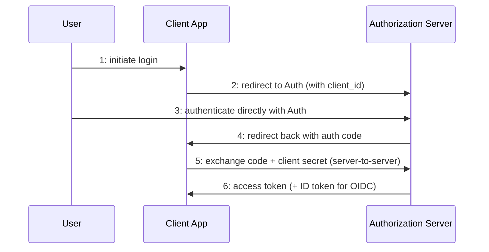
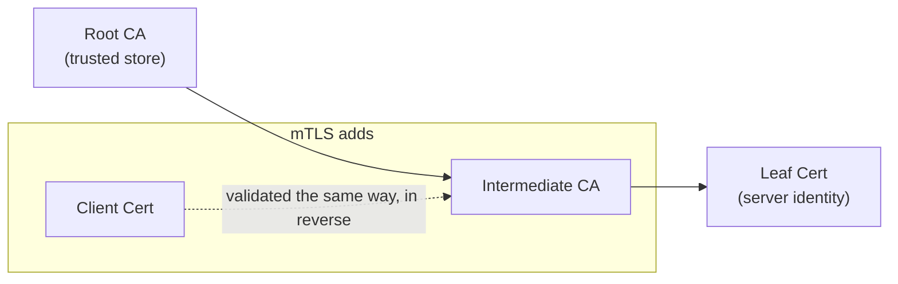
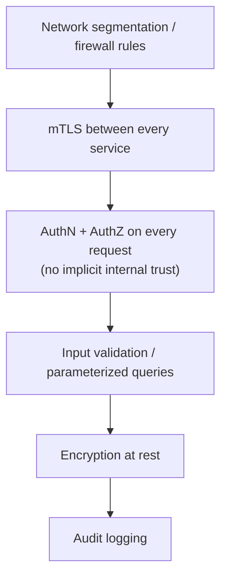
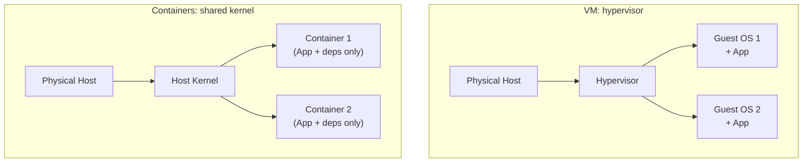
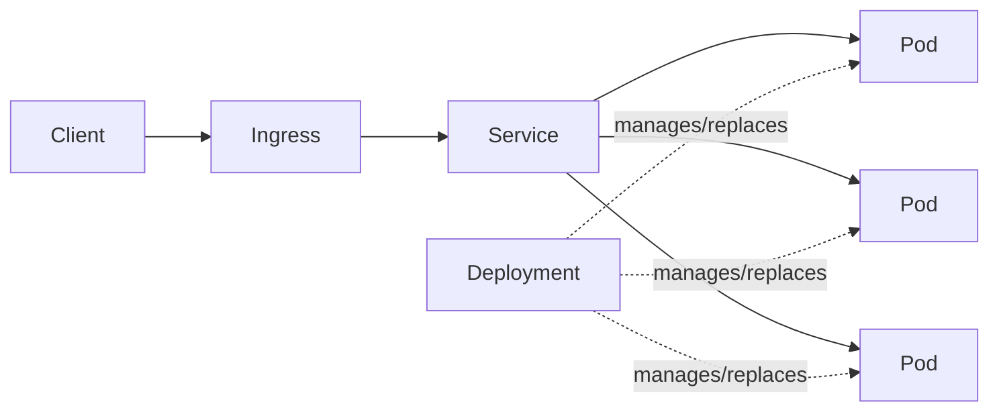
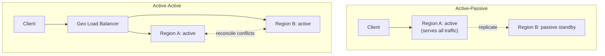
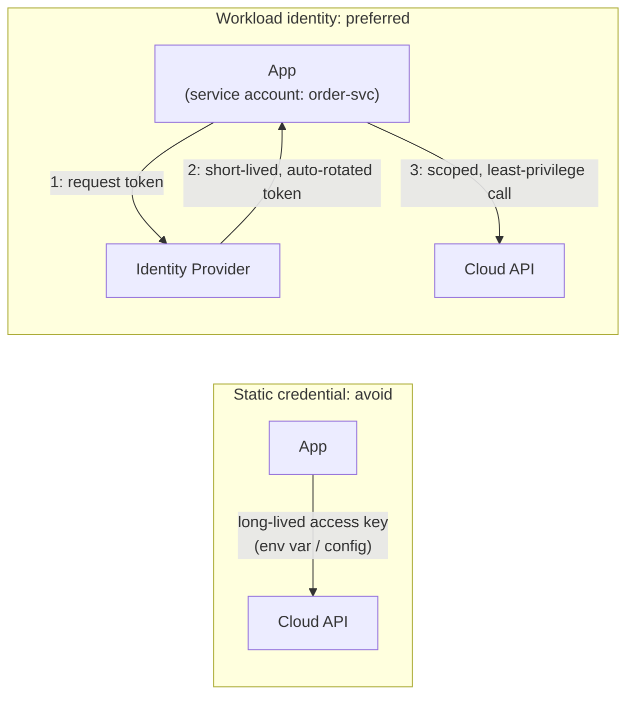
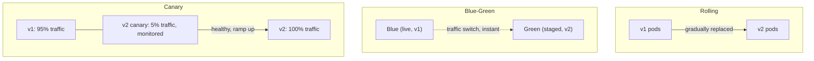

Part 6 of 7 · [Interview Prep](/interview-prep/) · ← Previous: [Part 5 — Kafka & Microservices](/interview-prep-kafka-microservices/) · Next: [Part 7 — AI Engineering](/interview-prep-ai-engineering/) →

Security is where confident people go vague. Naming a control is easy. Saying what it actually stops, and what it leaves wide open, is the part interviewers listen for. The cloud half has the opposite failure: it's easy to recite service names and never say what you'd pick or why.

**What this assumes:** you've shipped something that talked to a database and a third-party API, and you know roughly what HTTPS and a container are. Everything past that gets explained here.

**What you should be able to do after:** name the threat a control exists to stop, say what it doesn't cover, and pick between two cloud options out loud without hedging.

Every answer opens with **The gist**, one or two plain sentences. If the gist is all you have time for, that's still worth more than a half-remembered detail. The full answer underneath is what you say when they ask you to go deeper.





## Security

*Questions 1 to 7 are fundamentals you're expected to have now. 8 to 12 go deeper, and 9 and 11 are the two most likely to turn into "show me the code."*

### 1. What's the difference between authentication and authorization, and RBAC vs ABAC? {#1}

{}
**The gist:** authentication is proving who you are. Authorization is deciding what you're allowed to do next. RBAC answers that by job title, ABAC answers it by looking at the details.

Authentication (authN) verifies who you are. Authorization (authZ) decides what you're allowed to do once verified.

RBAC grants permissions based on a user's assigned role (admin, viewer), which is simple and coarse grained. ABAC evaluates policy against attributes of the user, the resource, and the context, which is more flexible and fine grained, at the cost of policy complexity.

```text
RBAC:  role == "admin"                  -> allow

ABAC:  user.department == resource.owner_department
       AND action == "read"
       AND now() < 18:00                -> allow
```
{}

### 2. How should passwords be stored, and why is rolling your own hashing scheme a bad idea? {#2}

{}
**The gist:** hash with something deliberately slow, like bcrypt or argon2. A fast hash is fast for the attacker too, which is the whole problem.

Never store plaintext or reversibly encrypted passwords. Hash with a slow, salted algorithm designed for the job: bcrypt, scrypt, or argon2 (preferred). These are deliberately slow and tunable, so you can raise the cost as hardware gets faster, and a unique salt per password defeats precomputed rainbow-table attacks.

A fast general-purpose hash like SHA-256 is the wrong tool. It's fast specifically so attackers can brute-force billions of guesses per second against a leaked hash dump.

```go
// cost is tunable: raise it as hardware gets faster
hash, err := bcrypt.GenerateFromPassword(
    []byte(password), bcrypt.DefaultCost,
)

// comparison is constant-time and re-reads the cost from the hash
err = bcrypt.CompareHashAndPassword(hash, []byte(attempt))
```

**What they're testing:** whether you know the slowness is the feature. "I'd use SHA-256 with a salt" sounds careful and is the wrong answer, and they're waiting to see if you catch it.

**Try it:** hash the same password twice with `bcrypt.GenerateFromPassword` and print both hashes. They'll be completely different strings, since the salt is random each time, and `bcrypt.CompareHashAndPassword` will still say yes to both against the original password.
{}

### 3. How should a service manage secrets (DB passwords, API keys) in production? {#3}

{}
**The gist:** secrets live in a secrets manager, not in your repo and not baked into your image. Environment variables are fine as delivery, just not as the source of truth.

Never commit them to source control or bake them into container images. Pull them at runtime from a dedicated secrets manager (Vault, AWS Secrets Manager, GCP Secret Manager) that supports access-controlled retrieval, audit logging, and rotation.

Environment variables are an acceptable delivery mechanism for the running process. The source of truth should be the secrets manager, not a `.env` file checked in or copy-pasted between engineers.

**Try it:** run `gitleaks detect --source .` against a repo you have write access to. Even a false positive teaches you what a leaked key pattern actually looks like to a scanner.
{}

### 4. Encryption at rest vs. in transit: what protects against what? {#4}

{}
**The gist:** in transit protects data moving over the wire. At rest protects data sitting on a disk. Neither one covers for the other.

In transit (TLS) protects data moving across a network from being read or tampered with by anyone sitting on the path. At rest (disk or database-level encryption, e.g. AES-256) protects data sitting on storage media from being read if the physical disk, backup, or snapshot is stolen or improperly accessed.

They're independent controls. TLS alone doesn't protect a stolen database backup, and disk encryption alone doesn't protect a request sniffed off the wire.
{}

### 5. What is SSRF, and what's a common CORS misconfiguration? {#5}

{}
**The gist:** SSRF is tricking your server into fetching a URL it can reach and the attacker can't. The classic CORS mistake is echoing back whatever `Origin` was sent while also allowing credentials.

SSRF (Server-Side Request Forgery) happens when a service fetches a URL supplied by the caller and an attacker points it at an internal-only endpoint: a cloud metadata service, an internal admin API, anything the server can reach directly but the attacker can't. Mitigate with an allowlist of permitted hosts and schemes, and by blocking requests to private IP ranges.

The common CORS mistake is reflecting `Access-Control-Allow-Origin` back as whatever `Origin` header the request sent, combined with `Access-Control-Allow-Credentials: true`. That lets any website make authenticated cross-origin requests on a logged-in user's behalf.

```go
// vulnerable: echoes any origin back and still allows credentials
origin := r.Header.Get("Origin")
w.Header().Set("Access-Control-Allow-Origin", origin)
w.Header().Set("Access-Control-Allow-Credentials", "true")

// safe: check a fixed allowlist before echoing anything
if allowedOrigins[origin] {
    w.Header().Set("Access-Control-Allow-Origin", origin)
    w.Header().Set("Access-Control-Allow-Credentials", "true")
}
```

**What they're testing:** whether you can name the attacker's goal, not just the acronym. For SSRF the goal is usually the cloud metadata endpoint and the credentials sitting behind it.

**Try it:** `curl -H "Origin: https://evil.example" -I https://your-api/some-endpoint` against an API you run and check whether the response echoes that `Origin` back in `Access-Control-Allow-Origin` while also setting `Access-Control-Allow-Credentials: true`. If it does, you've just reproduced the exact misconfiguration above.
{}

### 6. How do you protect against a compromised or malicious dependency in a Go module graph? {#6}

{}
**The gist:** `go.sum` pins the exact checksum of every dependency, and the public checksum database makes a silent swap detectable. The rest is scanning regularly and knowing what you shipped.

`go.sum` pins the exact cryptographic checksum of every dependency version. The checksum database (`GOSUMDB`, `sum.golang.org` by default) verifies a module's checksum on first download against a public, tamper-evident log, so a dependency can't be silently swapped for a malicious version later.

Beyond that: run a vulnerability scanner in CI, pin versions rather than using loose ranges, and for a regulated environment maintain an SBOM (Software Bill of Materials) so you can answer "are we affected" quickly when a CVE drops.

```bash
go install golang.org/x/vuln/cmd/govulncheck@latest
govulncheck ./...
```
{}

### 7. What is STRIDE, and when should an architect actually run a threat model? {#7}

{}
**The gist:** STRIDE is a checklist of six ways a design can be attacked. You walk your diagram asking each one, instead of hoping you happened to think of everything.

STRIDE is a mnemonic for threat categories: Spoofing, Tampering, Repudiation, Information disclosure, Denial of service, Elevation of privilege. You use it to systematically walk a design, usually a data-flow diagram, asking "how could this fail under each category" instead of relying on ad hoc worry.

Run one whenever a new trust boundary is introduced: a new external-facing API, a new service handling sensitive data, a new integration with a third party. Not for every minor internal change.

**Try it:** pick a real API you've built, sketch its data-flow diagram on paper, and walk each box and arrow against all six STRIDE letters out loud. Twenty minutes is enough to feel how much faster it goes the second time.
{}

### 8. Walk through the OAuth2 authorization code flow, and where the token actually ends up. {#8}

{}
**The gist:** the user logs in at Google, not at your app, so your app never sees the password. Your backend then swaps a short-lived code for a token, out of the browser's reach.

The user is redirected to the authorization server (e.g. Google) and logs in there, not on the client app, so the client never sees the password. The authorization server redirects back to the client with a short-lived authorization code.

The client's backend then exchanges that code, plus a client secret, directly with the authorization server for an access token. That exchange happens server to server, so the token never transits through the browser's URL bar or history.

OIDC layers an ID token (a JWT asserting identity) on top of OAuth2, which is fundamentally an authorization protocol rather than an authentication one.



**What they're testing:** the OAuth2 versus OIDC distinction. Saying "we use OAuth for login" is the trip-up, because OAuth2 on its own tells you what a token may do, not who the user is.
{}

### 9. What's inside a JWT, and what are the common pitfalls? {#9}

{}
**The gist:** three base64 chunks that anyone can read. The signature proves nobody changed it, it doesn't hide anything, so never put a secret in the payload.

A JWT is three base64url segments joined with dots: a header (algorithm), a payload (claims like user id, expiry, roles), and a signature. Anyone can decode and read the payload. The signature only proves it wasn't tampered with.

The pitfalls, in rough order of how often they bite:

- Accepting `alg: none`, or letting the client dictate the algorithm. An attacker crafts an unsigned token and a naive verifier trusts it, so always hardcode the expected algorithm server-side.
- Not checking `exp` at all.
- Using long-lived access tokens instead of a short-lived access token plus a separate, revocable refresh token.
- No revocation path, since a valid-but-compromised JWT can't be invalidated before it expires unless you maintain a denylist.

```go
token, err := jwt.Parse(tokenString, func(t *jwt.Token) (interface{}, error) {
    // pin the algorithm: never trust the header's alg claim
    if _, ok := t.Method.(*jwt.SigningMethodHMAC); !ok {
        return nil, fmt.Errorf("bad signing method: %v", t.Header["alg"])
    }
    return hmacSecret, nil
})
```

**What they're testing:** whether you understand that signed is not the same as encrypted, and that revocation is the hard part. Those two ideas carry the whole answer.

**Try it:** copy the payload segment of any JWT (the part between the two dots) and run `echo '<segment>' | tr '_-' '/+' | base64 -d`, padding with `=` if it complains. You'll read the claims in plain text, no key involved at any point.
{}

### 10. How does a TLS certificate chain get validated, and what does mTLS add on top of one-way TLS? {#10}

{}
**The gist:** your machine trusts a root CA, the root vouches for an intermediate, the intermediate vouches for the server. mTLS runs that same check in both directions.

A leaf certificate is signed by an intermediate CA, which is signed by a root CA that's pre-trusted (shipped in the OS or browser trust store). The client walks that chain up to a trusted root to validate the server's identity, then checks the hostname (or SNI) matches and the cert hasn't expired or been revoked.

Standard TLS only authenticates the server to the client. mTLS adds the reverse: the client also presents a certificate and the server validates it the same way, so both sides cryptographically prove identity. That's the standard approach for service-to-service auth inside a trusted network (see [securing service-to-service communication](#37) in Part 5).

Certificate rotation matters because a long-lived cert is a long-lived risk if its private key leaks. Short-lived certs issued automatically, for example via a service mesh's built-in CA, shrink that window.



**Try it:** run `openssl s_client -connect example.com:443 -showcerts </dev/null` against any HTTPS site and read the chain it prints, leaf certificate first, then each intermediate up to the root.
{}

### 11. What are the most common Go-specific security vulnerabilities, and how do you avoid them? {#11}

{}
**The gist:** four classics: SQL injection, command injection, path traversal, and decoding untrusted data into whatever type it claims to be. All four come from letting input carry structure.

**SQL injection.** String-concatenating user input into a query. Always use parameterized queries (`?` or `$1` placeholders) or a query builder, never `fmt.Sprintf` into SQL.

```go
// vulnerable: input can break out of the quotes and change the query
query := fmt.Sprintf("SELECT * FROM users WHERE email = '%s'", email)
db.Query(query)

// safe: the driver escapes the value, never the query shape
db.Query("SELECT * FROM users WHERE email = $1", email)
```

**Command injection.** Passing unsanitized input to `os/exec` through a shell. Pass arguments as separate values to `exec.Command` so there's no shell to inject into.

```go
// vulnerable: sh -c means input is parsed as shell syntax
exec.Command("sh", "-c", "convert "+userFile+" out.png")

// safe: no shell, so arguments stay arguments
exec.Command("convert", userFile, "out.png")
```

**Path traversal.** Joining a user-supplied filename onto a base directory without validation lets `../../etc/passwd` escape it. Use `filepath.Clean` and verify the resolved path still has the expected base prefix.

**Insecure deserialization.** `encoding/gob`, or unpinned `interface{}` decoding of untrusted input, can be abused to construct unexpected types. Prefer a schema-constrained format, like JSON into a concrete struct, for anything crossing a trust boundary.

**What they're testing:** whether you reach for the parameterized version by reflex. This one usually becomes "write it on the whiteboard," so have the safe pattern ready from memory.

**Try it:** install with `go install github.com/securego/gosec/v2/cmd/gosec@latest`, then run `gosec ./...` against a Go project you maintain and see how many of these four categories it actually flags versus what you assumed was fine.
{}

### 12. What does "defense in depth" mean architecturally, and how does zero trust extend it? {#12}

{}
**The gist:** don't let any single control be the thing that saves you. Zero trust goes one step further and stops assuming the inside of your network is friendly.

Defense in depth means no single control is trusted to fully protect the system. Network segmentation, authentication, authorization, input validation, and encryption each independently reduce risk, so one failure doesn't mean total compromise.

The traditional model paired this with a hardened perimeter and an implicitly trusted internal network. Zero trust removes that implicit trust: every request is authenticated and authorized regardless of whether it came from inside or outside the perimeter, on the assumption that the perimeter will eventually be breached. That's why mTLS between internal services (see Part 5) and per-request authorization checks matter even for traffic you'd call internal-only.


{}

---

## Cloud & Infrastructure

*Nobody expects a junior to have run a multi-region failover. 13, 14 and 22 come up regardless of level, and 19 and 20 are what you'll actually reach for the first time you're on call.*

### 13. What's the practical difference between IaaS, PaaS, SaaS, and FaaS, and where does a typical Go service sit? {#13}

{}
**The gist:** it's a question of how much of the stack someone else runs for you. IaaS hands you a machine, PaaS hands you a place to put a container, FaaS hands you a place to put one function.

IaaS (EC2, Compute Engine) gives you raw VMs, and you manage the OS and everything above it. PaaS (Heroku, Cloud Run) abstracts the OS and deployment away: you hand it a container or artifact and it runs it. SaaS is a finished product you consume (Salesforce). FaaS (Lambda, Cloud Functions) runs a single function per invocation with no persistent process at all.

A typical Go backend service usually sits on IaaS via an orchestrator (a VM fleet running Kubernetes) or on PaaS (Cloud Run, ECS Fargate). Full FaaS is a poor fit for a long-lived stateful service holding persistent connections.
{}

### 14. What are the 12-factor app principles, and why do they map cleanly onto Go services? {#14}

{}
**The gist:** a checklist for apps you can kill and restart anywhere without ceremony. Go gets most of it for free, because a static binary starts fast and reads env vars.

A set of practices for building portable, scalable cloud-native apps: config via environment variables rather than files baked into the image, backing services (DB, cache, queue) treated as attached resources reachable by URL, stateless disposable processes that start and stop fast, and logs treated as an event stream written to stdout rather than managed by the app.

Go's static binaries and fast startup already fit most of this naturally. A compiled Go binary with env-based config is close to 12-factor by default.

**Try it:** `grep -rn "os.Getenv\|viper\." .` across a service you maintain and see how much of its config is actually environment-driven versus hardcoded or baked into the image.
{}

### 15. HPA vs. VPA vs. cluster autoscaler: what does each one actually scale, and what breaks if you only configure one? {#15}

{}
**The gist:** HPA adds pods, VPA resizes pods, the cluster autoscaler adds machines. Configure only HPA and your new pods sit Pending, because nothing added room for them.

HPA (Horizontal Pod Autoscaler) adds and removes pod replicas based on a metric like CPU or a custom metric such as queue depth. VPA (Vertical Pod Autoscaler) adjusts a pod's CPU and memory requests and limits over time. The cluster autoscaler adds and removes underlying nodes when pods can't be scheduled due to insufficient node capacity.

Running HPA alone without a cluster autoscaler means new pod replicas can go Pending forever once existing nodes are full. HPA scaled the workload, but nothing scaled the cluster to fit it.

**What they're testing:** whether you've seen a Pending pod and understood why. The three-layer answer is what separates "I've read the docs" from "I've debugged this at 2am."

**Try it:** `kubectl get hpa` on a cluster with autoscaling configured, then `kubectl describe pod <pending-pod>` on anything stuck Pending and read the Events section for `FailedScheduling`.
{}

### 16. What does Infrastructure as Code actually buy you over provisioning resources by hand in a console? {#16}

{}
**The gist:** the point isn't automation. It's that your infrastructure gets reviewed, versioned, and rebuildable, instead of living in someone's memory of which buttons they clicked.

- **Reproducibility.** The exact same environment can be recreated, in a new region or as a disaster-recovery standby, from the same source instead of from tribal knowledge.
- **Review.** Infrastructure changes go through the same plan-then-apply, PR review, and version history as code, instead of an unaudited console click.
- **Drift detection.** Running a plan against live infrastructure surfaces anything that changed out of band.

The cost is a learning curve, plus a "click in the console to fix the incident right now" instinct that has to be resisted in favour of "fix it in code, then apply."

**Try it:** run `terraform plan` against infrastructure you've already applied, with nothing changed since. A clean `No changes.` is what drift detection looks like when nothing happened, which is the baseline you need before you can recognize real drift.
{}

### 17. Managed (RDS/Cloud SQL-style) vs. self-hosted database in the cloud: what's the actual trade-off? {#17}

{}
**The gist:** managed means someone else gets paged for backups and failover. Self-hosting buys you control and hands you that pager.

Managed: the provider handles patching, backups, failover, and often read replicas and point-in-time recovery. The cost is less low-level tuning control, vendor-specific quirks, and a recurring premium over raw compute.

Self-hosted on your own VMs: full control over configuration, extensions, and version, but your team now owns backup verification, patching, and failover. Failover in particular is easy to get wrong under pressure, during an actual incident, which is the worst possible time to find out.

For most teams below a certain scale, managed is the right default. Self-hosting is a deliberate trade for control that should be justified, not assumed.
{}

### 18. When is serverless (Lambda/Cloud Functions style) a poor fit for a Go service? {#18}

{}
**The gist:** cold starts, execution time limits, and no state between calls. Great for bursty event work, bad for a steady API holding database connections.

Cold starts add latency to the first request after idle, which is a problem for latency-sensitive synchronous APIs and much less so for async event processing. Execution time limits, typically minutes, rule out long-running jobs. No persistent in-memory state or connections between invocations means every invocation may re-establish DB connections unless you're careful with pooling patterns built for it.

Serverless fits well for bursty, event-driven, short-lived work: an S3-upload trigger, a scheduled cleanup job. A long-lived stateful API with steady traffic is usually cheaper and simpler as a normal deployed service.
{}

### 19. What does a typical cloud observability stack look like, and why do traces matter more as the service count grows? {#19}

{}
**The gist:** metrics tell you something's wrong. Logs tell you what happened. Traces tell you which of your ten services actually caused it.

Metrics (Prometheus or CloudWatch-style time-series aggregates like request rate and error rate) answer "is something wrong right now." Logs, structured and searchable, answer "what exactly happened."

Traces (OpenTelemetry, spanning a request across every service it touched) answer "where in this chain of ten services did the slowdown actually happen." Metrics and logs alone can't answer that once a request fans out across multiple services, because no single service's logs show the whole picture.
{}

### 20. What's the difference between RTO and RPO, and how do they drive backup strategy? {#20}

{}
**The gist:** RTO is how long you can be down. RPO is how much data you can afford to lose. Pick both numbers before you pick a backup schedule.

RTO (Recovery Time Objective) is how long you can tolerate being down, which drives how fast and how automated your failover has to be. RPO (Recovery Point Objective) is how much data you can tolerate losing, which drives how frequently you back up or replicate.

A tight RPO measured in seconds needs synchronous or near-real-time replication. A looser RPO measured in hours tolerates nightly backups. An architect defines both explicitly per system before choosing a strategy, since "back it up daily" is only correct if the business can genuinely tolerate losing up to a day of data.

**What they're testing:** whether you ask the business what the numbers are instead of inventing them. The right move is to turn the question back into a requirement.
{}

### 21. Why do containers start faster and pack denser than VMs? {#21}

{}
**The gist:** a VM boots a whole operating system. A container is just a process the kernel keeps in its own box, which is why it starts in milliseconds.

A VM virtualizes hardware and runs a full guest OS kernel per instance, so booting one means booting an entire operating system. A container shares the host's kernel and only packages the application plus its userspace dependencies, isolated via namespaces and cgroups rather than a hypervisor. Starting one is closer to starting a process than to booting a machine, and many containers can share one host's kernel instead of each paying for a redundant OS.

Image layering compounds the density win: a base image layer is cached and shared across every container built from it, so only the top application-specific layer needs pulling for a new deploy.



**Try it:** `docker history <image>` on any image you have locally and look at the layer sizes, then time `docker run --rm alpine echo hi` against how long your last VM actually took to boot.
{}

### 22. What are the core Kubernetes objects, and how does a request actually reach a pod? {#22}

{}
**The gist:** a Pod runs your container, a Deployment keeps the right number of pods alive, a Service gives that shifting set one stable address, and an Ingress lets the outside world in.

A Pod is the smallest deployable unit: one or more tightly coupled containers sharing network and storage. A Deployment manages a set of pod replicas, handling rolling updates and self-healing by replacing crashed pods.

A Service gives that shifting set of pods a stable virtual IP and DNS name, and load-balances across whichever pods are currently healthy. You need it because pod IPs change every time a pod is replaced. An Ingress sits in front of Services and routes external HTTP and HTTPS traffic based on host or path, typically terminating TLS.

So a request flows: Ingress, then Service (stable and load-balanced), then one of the Deployment's current Pods.



**Try it:** `kubectl get pods,deploy,svc,ingress -o wide` in any namespace you have access to, then `kubectl describe svc <name>` and find the Endpoints line, that's the live list of pod IPs the Service is actually load-balancing across right now.
{}

### 23. Active-active vs. active-passive multi-region: what's the trade-off, and why does data residency complicate it? {#23}

{}
**The gist:** active-passive keeps a spare region warm and switches to it on failure. Active-active runs both at once, which is faster for users and much harder to keep consistent.

Active-passive: one region serves all traffic while a standby stays warm (or cold) and takes over on failover. Simpler, with no cross-region write conflicts, but the standby capacity sits mostly idle, and failover itself takes time and is a rarely exercised code path. That makes it risky exactly when you need it most.

Active-active: multiple regions serve traffic simultaneously, giving better latency by serving from the nearest region and leaving no idle capacity. Now you need a strategy for cross-region write conflicts: last-write-wins, CRDTs, or partitioning writes by region or tenant.

Data residency requirements, like a regulated fintech workload needing EU customer data to stay in the EU, add a hard constraint on top: which region is even allowed to hold which rows, independent of which architecture handles failover. That often forces a hybrid where write ownership is partitioned by region either way.



**What they're testing:** whether you treat data residency as a separate axis from availability. People tend to collapse the two, and the follow-up question is usually designed to catch exactly that.
{}

### 24. How should a service authenticate to other cloud resources, and why is workload identity preferred over static credentials? {#24}

{}
**The gist:** a static access key is a secret that works forever once it leaks. Workload identity hands out short-lived tokens based on who the workload is, so there's nothing sitting around to steal.

A long-lived static credential, an access key baked into config or an env var, is a standing liability. If it leaks it stays valid until someone notices and manually rotates it, and that rotation is often manual and risky in itself.

Workload identity (AWS IAM roles for service accounts, GCP Workload Identity) instead lets the cloud platform issue short-lived, automatically rotated credentials to a workload based on its identity: which pod, which service account. There's no long-lived secret to leak in the first place.

Combine that with least-privilege roles, granting only the specific actions on the specific resources a service actually needs rather than a broad admin role for convenience, and you have the cloud-native version of the least-privilege principle from [Q12](#12).



**Try it:** run `aws sts get-caller-identity` (or `gcloud auth list`) from inside a workload that's supposed to be using workload identity, then `env | grep -i key` in the same place and confirm there's no static access key sitting behind that identity.
{}

### 25. Blue-green vs. canary vs. rolling deployment: how does each affect rollback speed and blast radius? {#25}

{}
**The gist:** rolling swaps pods a few at a time, blue-green flips everything at once, canary sends a slice of traffic first. You're trading rollback speed against how much infrastructure you run.

**Rolling:** old pods are replaced by new ones gradually, a few at a time. No extra infrastructure cost, but both versions run simultaneously for the whole rollout (see [API versioning during a rolling deployment](#39) in Part 5), and rolling back means rolling forward again through the same gradual replacement.

**Blue-green:** a full second environment (green) is deployed alongside the live one (blue), verified, then traffic is switched all at once. Rollback is just switching traffic back, close to instant, at the cost of running two full environments during the switch.

**Canary:** a small percentage of traffic is routed to the new version first, monitored, then gradually increased. Smallest blast radius if something's wrong, since only a fraction of users are affected before you catch it, but it needs traffic-splitting infrastructure and takes longer to fully roll out.



**What they're testing:** whether you answer in terms of rollback and blast radius rather than listing the three names. The question already names them, so reciting them back gets you nothing.

**Try it:** `kubectl rollout status deployment/<name>` mid-rollout to watch a rolling update progress live, then `kubectl rollout undo deployment/<name>` and time how long the rollback actually takes compared to what blue-green would've given you instantly.
{}

---

## What to drill first

**[Security](#security):** worth over-preparing rather than under-preparing. [9](#9) (JWT pitfalls) and [11](#11) (Go-specific vulnerabilities) are the most likely to get a "show me the code" follow-up. Have the vulnerable-versus-safe pattern in [11](#11) ready to write on a whiteboard from memory.

**[Cloud & Infrastructure](#cloud--infrastructure):** [22](#22) (Kubernetes request path) and [23](#23) (multi-region and data residency) are the highest-yield for a regulated-domain role. [25](#25) (deploy strategies) ties directly back to [API versioning during a rolling deployment](#39) in Part 5, so rehearse them together.

If you're earlier in your career and short on time, start with [2](#2), [11](#11) and [22](#22). Password hashing and parameterized queries come up in almost every security screen at any level, and the Kubernetes request path is the one cloud question you'll be asked whether or not the role is infrastructure-flavoured.

---

Part 6 of 7 · [Interview Prep](/interview-prep/) · ← Previous: [Part 5 — Kafka & Microservices](/interview-prep-kafka-microservices/) · Next: [Part 7 — AI Engineering](/interview-prep-ai-engineering/) →
