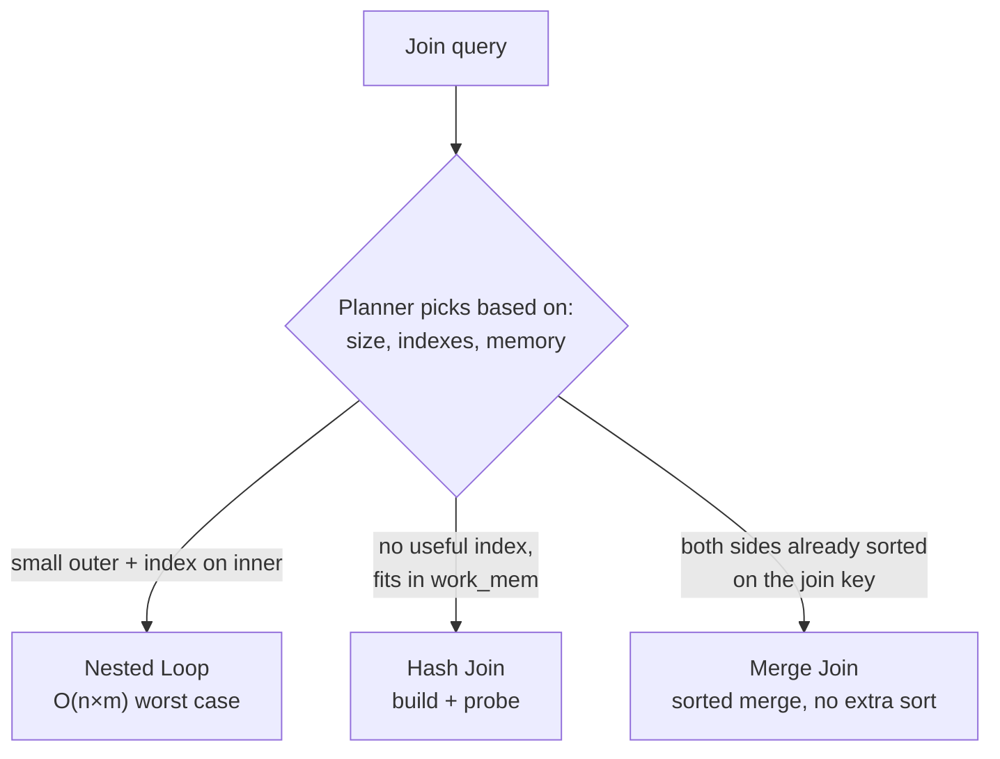
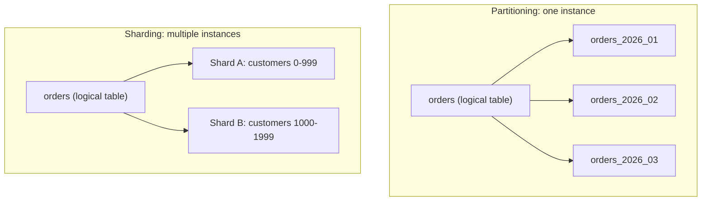
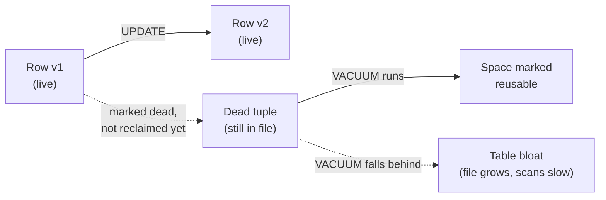

Part 4 of 7 · [Interview Prep](/interview-prep/) · ← Previous: [Part 3 — Databases & System Design](/interview-prep-databases-systems/) · Next: [Part 5 — Kafka & Microservices](/interview-prep-kafka-microservices/) →

Most SQL interviews don't stop at "write me a join." They stop at "why was that slow?" This part is the 20 questions that live past the join: the ones where you have to say what the database is actually doing, not just what you asked it for.

**What this assumes:** you can write a `SELECT` with a `JOIN`, a `GROUP BY`, and a `WHERE`, and you know roughly what an index is for. Everything past that gets explained here.

**What you should be able to do after:** look at a slow query and have a real first guess, and defend it when someone pushes back.

Every answer opens with **The gist**, one or two plain sentences. If the gist is all you have time for, that's still worth more than a half-remembered detail. The full answer underneath is what you say when they ask you to go deeper.





## Advanced Query Techniques

*Questions 1 to 7 are everyday SQL you can reasonably be expected to know now. 8 to 10 are where a senior screen starts.*

### 1. What's the difference between `UNION` and `UNION ALL`, and why does it matter for performance? {#1}

{}
**The gist:** `UNION` removes duplicates, and removing duplicates means sorting or hashing every row first. `UNION ALL` just glues the two result sets together and skips all that work.

`UNION` deduplicates the combined result set, which means sorting or hashing every row to find duplicates. `UNION ALL` just concatenates the two result sets with no dedup pass. If the query already guarantees no overlap (two mutually exclusive `WHERE` branches), `UNION ALL` is strictly cheaper and should be the default. Reach for `UNION` only when you actually need duplicates removed.

```sql
-- These branches can't overlap, so the dedup pass is pure waste.
SELECT id, 'active' AS bucket FROM orders WHERE status = 'active'
UNION ALL
SELECT id, 'closed' AS bucket FROM orders WHERE status = 'closed';
```

**Try it:** run the same query with `UNION` instead of `UNION ALL` and diff the row counts. Since the two branches can't overlap here, the counts should match, that's the dedup pass doing nothing but costing you a sort.
{}

### 2. `EXISTS`, `IN`, or a `JOIN` for an existence check: does it matter which one you pick? {#2}

{}
**The gist:** usually the planner turns all three into the same plan, so speed isn't the real difference. `NULL` is. One `NULL` inside an `IN` subquery can silently wipe out your entire result.

Modern query planners (Postgres included) usually rewrite all three into the same semi-join plan when the subquery is uncorrelated, so raw performance is often a wash. `EXISTS` short-circuits on the first match and handles `NULL`s in the subquery correctly, where `IN` against a subquery containing a `NULL` can silently produce zero rows for the whole query. That's a classic footgun. Prefer `EXISTS` for correlated existence checks and reserve `IN` for a short, known literal list.

Here's the footgun, concretely. `NOT IN` returns nothing at all the moment the subquery yields a single `NULL`:

```sql
-- customers.referrer_id is nullable, and at least one row is NULL.

SELECT count(*) FROM orders
WHERE customer_id NOT IN (SELECT referrer_id FROM customers);
-- 0. Always 0. Not because nothing matched.

SELECT count(*) FROM orders o
WHERE NOT EXISTS (
  SELECT 1 FROM customers c WHERE c.referrer_id = o.customer_id
);
-- the answer you actually wanted
```

`NOT IN` has to prove your value differs from *every* row in the list. Against `NULL` it can't prove that, so the whole comparison goes unknown, and unknown isn't true.

**What they're testing:** whether you've been bitten by this. "They're basically the same" is a fine opening, but they want you to get to `NULL` on your own.

**Try it:** create a tiny `customers` table with one row where `referrer_id` is `NULL`, then run both queries above against it. The `NOT IN` version returns 0 rows no matter what's in `orders`, the `NOT EXISTS` version doesn't.
{}

### 3. What does `INSERT ... ON CONFLICT DO UPDATE` (upsert) buy you over a separate `SELECT` then `INSERT`/`UPDATE`? {#3}

{}
**The gist:** check-then-write is a race. Two requests both see "no row here" and both try to insert. `ON CONFLICT` collapses the check and the write into one step the database won't let anything slip between.

A separate select-then-write is a race: two concurrent requests can both see "no row exists" and both attempt an insert, and one fails on the unique constraint (or worse, without one, you get a duplicate). `ON CONFLICT DO UPDATE` makes the whole check-then-act atomic at the database level. Pair it with `RETURNING` to get the final row back without a second query.

```sql
INSERT INTO user_settings (user_id, theme, updated_at)
VALUES ($1, $2, now())
ON CONFLICT (user_id) DO UPDATE
  SET theme = EXCLUDED.theme, updated_at = now()
RETURNING *;
```

`EXCLUDED` is the row you tried to insert, so it's how you reach the new values inside the update branch.

**Try it:** open two `psql` sessions and run the same `INSERT ... ON CONFLICT DO UPDATE` for the same `user_id` at the same time. One blocks briefly on the row lock, then both succeed, no duplicate and no error, which is the difference from a plain `INSERT` you'd otherwise have to catch a unique-violation from.
{}

### 4. What's a `LATERAL` join, and when do you actually need one? {#4}

{}
**The gist:** a normal join's right side can't look at the row on the left. `LATERAL` lets it, which is what turns "top 3 per customer" into one readable query.

A normal join's right-hand side can't reference columns from the left-hand table. `LATERAL` lifts that restriction, letting a subquery on the right reuse a value from the current row on the left. The classic case is "top 3 orders per customer," where the subquery needs the current customer's id to filter and limit before the join happens. Without `LATERAL` that needs a window function and an extra filtering layer instead of one readable join.

```sql
SELECT c.id, c.name, o.order_id, o.amount
FROM customers c
CROSS JOIN LATERAL (
  SELECT order_id, amount
  FROM orders
  WHERE customer_id = c.id     -- c.id is only reachable because of LATERAL
  ORDER BY amount DESC
  LIMIT 3
) o;
```
{}

### 5. Full-text search with `tsvector`/`tsquery` vs. a `LIKE '%term%'` scan: what's the actual difference? {#5}

{}
**The gist:** a leading `%` rules out the index, so the database reads every row in the table. Full-text search indexes the words themselves, so the same search becomes a lookup.

`LIKE '%term%'` with a leading wildcard can't use a standard B-tree index at all, so it's a sequential scan regardless of table size. A B-tree index is sorted by the start of the value, and a leading `%` says "I don't know the start," so the sorting buys you nothing.

`tsvector`/`tsquery` takes a different route. It breaks the text into words, normalizes them (so "running" and "ran" both reduce to "run"), drops filler words like "the", and stores the result as a document that a GIN index can index directly. A GIN index maps each word to the rows containing it, which is what turns the search into a lookup instead of a scan. It also ranks results by relevance, which `LIKE` has no concept of.

```sql
CREATE INDEX idx_articles_fts ON articles
  USING GIN (to_tsvector('english', body));

SELECT id, title
FROM articles
WHERE to_tsvector('english', body)
      @@ to_tsquery('english', 'database & index');
```

**What they're testing:** whether "the index can't be used here" is a thought you reach on your own. Naming `tsvector` functions from memory isn't the point, and they'll push a step past it.

**Try it:** `EXPLAIN` a `WHERE body LIKE '%database%'` query on a table with 100k or more rows, then `EXPLAIN` the `to_tsvector` version with the GIN index in place. The first shows `Seq Scan`, the second shows `Bitmap Index Scan`.
{}

### 6. What does `pg_trgm` add on top of full-text search? {#6}

{}
**The gist:** full-text search matches whole words, so a typo matches nothing. Trigrams match three-letter chunks, which is how you catch "Jonh" when the row says "John."

`tsvector` search is token-based, so it won't match a typo or a substring that crosses a token boundary. `pg_trgm` indexes overlapping three-character sequences of a string, which makes fuzzy and similarity matching work, and makes substring `LIKE '%term%'` queries index-able through a GIN or GiST trigram index.

Use full-text search for "find documents about this topic" and trigram for "find rows whose name is close to what the user typo'd."

**Try it:** `CREATE EXTENSION pg_trgm;`, add `CREATE INDEX idx_customers_name_trgm ON customers USING GIN (name gin_trgm_ops);`, then run `SELECT name FROM customers WHERE name % 'Jonh Smith';` and watch it match "John Smith" even though the spelling's wrong.
{}

### 7. Postgres changed how CTEs behave around version 12: what changed, and why does it matter? {#7}

{}
**The gist:** before Postgres 12 a CTE was a wall the planner couldn't see through. Now it's inlined by default, so the same query can be fast on one server and slow on another for no reason you can see in the SQL.

Before Postgres 12, every CTE was an optimization fence: the planner materialized it as a temporary result set and couldn't push filters from the outer query down into it, even when that would've been cheaper. From Postgres 12 on, a non-recursive CTE is inlined by default like a subquery, unless it's referenced more than once or explicitly marked `MATERIALIZED`.

That version difference is worth knowing because it's a real production surprise: the same CTE-heavy query, same data, different server, wildly different plan.

**Try it:** on Postgres 12 or later, run the same CTE-heavy query twice: once as-is, once with the CTE marked `MATERIALIZED`. `EXPLAIN` both and watch the second one refuse to push the outer `WHERE` down into the CTE, which is the pre-12 behavior forced back on.
{}

### 8. How do window functions differ from `GROUP BY`, and what does `ROW_NUMBER`/`RANK`/`LAG` give you that aggregation can't? {#8}

{}
**The gist:** `GROUP BY` throws the individual rows away and hands back one row per group. A window function does the same maths and keeps every row, which is how you get "this row's rank within its group."

`GROUP BY` collapses a group of rows into one output row per group, so you lose access to individual rows outside the aggregate. A window function computes across a group (defined by `PARTITION BY`) without collapsing anything, so each input row still gets exactly one output row plus an extra computed column, e.g. the rank of a row within its partition. This makes "top N per group," running totals, and row-over-row comparisons possible without a self-join or a subquery per row.

```sql
SELECT
  customer_id,
  order_id,
  amount,
  RANK() OVER (PARTITION BY customer_id ORDER BY amount DESC)
    AS rank_in_customer,
  SUM(amount) OVER (PARTITION BY customer_id ORDER BY created_at)
    AS running_total
FROM orders;
```

`ROW_NUMBER` gives a strict 1,2,3... with no ties. `RANK` leaves gaps after a tie (1,1,3), `DENSE_RANK` doesn't (1,1,2). `LAG`/`LEAD` read a value from a preceding or following row in the same partition, which is what makes period-over-period comparisons a single query instead of a self-join.

**What they're testing:** this one usually turns into "now write it." Have `PARTITION BY ... ORDER BY` ready to produce from memory, not just recognize.
{}

### 9. When does a recursive CTE actually earn its complexity, and what's the failure mode if you get the recursion wrong? {#9}

{}
**The gist:** use one when the data is a tree of unknown depth, like an org chart or a comment thread. You can't write "however many levels deep this goes" as a fixed number of joins.

Any hierarchy of unknown, variable depth (an org chart, a category tree, a bill-of-materials, a comment thread) needs a recursive CTE, because a fixed number of joins can't express "however many levels deep this happens to go." The structure is always an anchor (the base case) `UNION ALL`'d with a recursive term that joins back to the CTE's own name, terminating when the recursive term returns no rows.

```sql
WITH RECURSIVE org_chart AS (
  SELECT id, name, manager_id, 1 AS depth
  FROM employees
  WHERE manager_id IS NULL          -- anchor: the top of the org
  UNION ALL
  SELECT e.id, e.name, e.manager_id, oc.depth + 1
  FROM employees e
  JOIN org_chart oc ON e.manager_id = oc.id   -- recursive term
)
SELECT * FROM org_chart ORDER BY depth;
```

Get the recursive term wrong, most commonly a join condition that can revisit a row it already processed, and you get infinite recursion. Postgres will eventually blow past `work_mem` or hit a recursion limit and error out rather than hang forever, but it's still the first thing to check when a recursive CTE that used to be fast suddenly isn't: a cycle got introduced in the data.

**Try it:** intentionally break the recursive term's join condition so the same row can be revisited, then run the query with a `LIMIT 20` as a safety net and watch it happily keep producing rows past where a real org chart would have stopped.
{}

### 10. When should a column be `JSONB` instead of a normalized set of tables, and how do you index it? {#10}

{}
**The gist:** `JSONB` is right when the shape genuinely differs per row and you read the whole blob at once. It's wrong the moment you're filtering on the same two keys every day, because those keys are relational data in a costume.

`JSONB` fits data that's genuinely schema-variable per row (a plugin's arbitrary settings object, a webhook payload you need to store but not query deeply), or where the write pattern is "store the whole document, read the whole document" and normalizing would just mean reassembling it on every read.

It's the wrong choice once you're regularly filtering or joining on a handful of specific keys. At that point a normalized column with a real type and index is both faster and gets you constraints for free. A GIN index on a `JSONB` column supports the containment operator (`@>`) efficiently, but a single key queried constantly is often better served by extracting it into a real generated column with a plain B-tree index.

```sql
CREATE INDEX idx_metadata_gin ON accounts USING GIN (metadata);
SELECT * FROM accounts WHERE metadata @> '{"plan": "enterprise"}';
```

**Try it:** `EXPLAIN` that containment query against the GIN index, then `EXPLAIN` the same filter written as `metadata->>'plan' = 'enterprise'`. The first uses the index, the second usually doesn't unless you've also indexed that expression directly.
{}

---

## Query Planning, Storage & Concurrency Internals

*This is the internals half, and nobody expects a junior to have all of it. But 15, 16 and 20 come up constantly the first time you're on call for a database, so they're worth the time even if the rest can wait.*

### 11. Partial index vs. indexing the whole column: when does a partial index win? {#11}

{}
**The gist:** if 95% of your rows are `'completed'` and you only ever query the other 5%, indexing all of them is wasted space. A partial index covers just the rows you actually look for.

A partial index (`CREATE INDEX ... WHERE condition`) only indexes the subset of rows matching the predicate, so it's smaller, faster to scan, and cheaper to maintain than a full-column index when queries consistently filter on that same condition.

```sql
-- The job queue only ever asks for pending work.
CREATE INDEX idx_jobs_pending ON jobs (created_at) WHERE status = 'pending';
```

It's a poor fit when queries filter on a wide variety of conditions, since a partial index only helps the specific predicate it was built with. Query for `status = 'failed'` and this index does nothing for you.

**Try it:** `EXPLAIN` a query for `WHERE status = 'failed'` against the table from the snippet above. The partial index only covers `status = 'pending'`, so you'll see a sequential scan even though there's an index on the table.
{}

### 12. What's an advisory lock, and when do you reach for one instead of a row or table lock? {#12}

{}
**The gist:** a lock on an idea rather than on data. You pick a number, the database hands that number to exactly one connection at a time, and that's your "only one server runs this job" guarantee.

Row and table locks are tied to actual data and are taken and released automatically by the transaction touching that data. An advisory lock (`pg_advisory_lock`) is an arbitrary application-level lock keyed by a number you choose, with no connection to any row. You use it to coordinate application logic that isn't really a data lock, for example making sure only one instance of a scheduled job runs at a time across a fleet.

```sql
-- Returns true only for the one caller that gets it. Everyone else moves on.
SELECT pg_try_advisory_lock(42);
```

`pg_try_advisory_lock` returns immediately rather than waiting, which is usually what you want for a job runner: the losers should skip the work, not queue up behind it. It's a cheap way to get distributed mutual exclusion out of a database you already have.

**Try it:** open two `psql` sessions and run `SELECT pg_try_advisory_lock(42);` in both. The first returns `true`, the second returns `false` immediately, no waiting, which is the point.
{}

### 13. When do stored procedures or triggers earn their complexity, versus just hiding logic from the app layer? {#13}

{}
**The gist:** put it in the database when it has to be true no matter what touches the table, including a script someone runs by hand. Keep it in the app when it's business logic that'll change next quarter.

They earn it when the logic must be true regardless of which client touches the data: an invariant enforced at the data layer that no application bug can bypass, like maintaining an audit trail, or a constraint too complex for a `CHECK`.

They become a liability when they encode business logic that changes often, since that logic is now split across the app codebase and the database, invisible to code review and hard to unit test. Default to keeping logic in the application, and push it into the database only for invariants that must hold no matter what touches the table.
{}

### 14. PgBouncer's transaction pooling mode vs. session mode: what actually breaks in transaction mode? {#14}

{}
**The gist:** transaction mode hands your connection back to the pool the instant you commit. Anything you left sitting on that connection, a prepared statement, a `SET`, a `LISTEN`, is gone or on someone else's connection next time.

Session mode assigns one real database connection to a client connection for its entire session, so anything session-scoped (prepared statements, session-level `SET`, `LISTEN`/`NOTIFY`) works exactly like talking to Postgres directly.

Transaction mode returns the real connection to the pool as soon as a transaction commits, letting far fewer real connections serve far more clients. The catch is that a prepared statement or session variable set on one transaction can silently vanish, or land on a different underlying connection on the next.

Transaction mode is the right default for a stateless web app's pool. Session state needs a dedicated session-mode connection.

**What they're testing:** whether you know why your ORM started throwing "prepared statement does not exist" after someone put PgBouncer in front of the database. That's the war story this question is fishing for.
{}

### 15. `VACUUM`, `VACUUM FULL`, and autovacuum: what does each actually do? {#15}

{}
**The gist:** plain `VACUUM` marks dead space reusable without locking anything. `VACUUM FULL` rewrites the table to actually shrink the file, and locks everyone out while it does. Autovacuum is plain `VACUUM` running on its own.

Plain `VACUUM` (which autovacuum runs automatically) reclaims dead tuple space for reuse by future writes and updates statistics, without an exclusive lock and without shrinking the file on disk.

`VACUUM FULL` rewrites the entire table into a new, compact file with no dead space, which does shrink it on disk but takes an exclusive lock for the duration. That makes it a rare, deliberate maintenance operation, not something to run routinely.

Autovacuum is tuned (thresholds, worker count, cost delay), not disabled. Disabling it is what leads to the bloat it exists to prevent.

**Try it:** `UPDATE` the same handful of rows in a loop a few hundred times, check `n_dead_tup` in `pg_stat_user_tables`, run `VACUUM`, and watch it drop back down without the table's on-disk size changing.
{}

### 16. Why can a query slow down over time even though the query, schema, and data volume haven't meaningfully changed? {#16}

{}
**The gist:** the planner picks a plan from statistics, and statistics go stale. It's still working from a picture of your table taken weeks ago.

The query planner picks a plan based on row-count and distribution estimates gathered by the last `ANALYZE`. If autovacuum's analyze threshold hasn't fired recently on a table whose data distribution is shifting, the planner works from an outdated picture and can pick a sequential scan or the wrong join order.

```sql
-- Cheap first diagnostic: when did this table last get looked at?
SELECT relname, last_analyze, last_autoanalyze, n_live_tup
FROM pg_stat_user_tables WHERE relname = 'orders';

ANALYZE orders;
```

Running `ANALYZE` manually is a cheap first move before assuming a missing index is the problem. It slots into the [slow-query checklist](#5) (Part 3) as the "did anything actually change" step.

**Try it:** bulk-insert a few hundred thousand rows without running `ANALYZE`, then `EXPLAIN ANALYZE` a filtered query and compare the planner's row estimate to the actual row count. Run `ANALYZE` and re-run the same query to see the estimate snap back in line.
{}

### 17. Nested loop, hash join, and merge join: what does the planner actually choose between, and why? {#17}

{}
**The gist:** three ways to match rows. Nested loop looks each one up individually, hash join builds a lookup table from the smaller side, merge join walks both sides in order like a zipper. The planner guesses which is cheapest from your table sizes and indexes.

A nested loop scans the outer table and, for every row, probes the inner table. That's cheap when the outer side is small or the inner side has a usable index, and expensive as both sides grow, since it's O(n×m) in the worst case.

A hash join builds an in-memory hash table from the smaller side, then streams the larger side through it. Good when there's no useful index but the smaller side fits comfortably in `work_mem`.

A merge join sorts both sides by the join key (or uses an already-sorted index) and walks them in lockstep, which wins when both inputs are already sorted, since the expensive sort is avoided entirely.



[`EXPLAIN ANALYZE`](#7) (Part 3) shows which one actually ran. If a hash join spills to disk because the build side didn't fit in `work_mem`, that shows up as a much slower actual time than the estimate: a signal to raise `work_mem` for that query rather than assume the join type itself is wrong.

**What they're testing:** whether you can read a plan and say why the planner chose what it chose. You're not expected to pick joins by hand, you're expected to know what the planner was reacting to.

**Try it:** `SET enable_hashjoin = off;` before running a join that would normally hash, then `EXPLAIN` it again and watch the planner fall back to a nested loop or merge join instead.
{}

### 18. Table partitioning vs. sharding: where's the line, and why would you reach for one over the other? {#18}

{}
**The gist:** partitioning splits a table into pieces on one machine. Sharding splits it across many machines. Same idea, wildly different operational cost.

Partitioning splits one logical table into physical sub-tables (by range, list, or hash on a key) that all still live on the same database instance, transparent to most queries. A query filtering on the partition key only scans the relevant partition, and you get cheap bulk drops: drop a whole month's partition instead of running a slow `DELETE`.

[Sharding](#13) (Part 3) splits data across separate database instances entirely. That solves a write-throughput or storage-capacity ceiling a single machine can't hold, at the cost of cross-shard queries and joins becoming genuinely hard.



Reach for partitioning first: it's a single-instance, low-complexity win for a large, time-ordered or naturally-bucketed table. Reach for sharding only once a single instance genuinely can't hold the write load or data volume, since it multiplies operational complexity.

**What they're testing:** whether you conflate the two. Interviewers often ask both back to back for exactly that reason.
{}

### 19. Materialized view vs. a regular view: what do you give up, and how do you keep a materialized view from serving stale data? {#19}

{}
**The gist:** a regular view re-runs the query every time you read it. A materialized view stores the answer, so reads are free but the data is as old as your last refresh.

A regular view is just a stored query, re-executed in full against live data every time it's selected from. Always current, but paying the full query cost on every read.

A materialized view runs the query once and stores the result set physically, so reads are as cheap as reading a table. The cost is that the data is a snapshot from whenever it was last refreshed.

```sql
CREATE MATERIALIZED VIEW daily_revenue AS
  SELECT date_trunc('day', created_at) AS day, sum(amount) AS total
  FROM orders GROUP BY 1;

CREATE UNIQUE INDEX ON daily_revenue (day);   -- required by CONCURRENTLY

REFRESH MATERIALIZED VIEW CONCURRENTLY daily_revenue;
```

Plain `REFRESH MATERIALIZED VIEW` locks the view against reads for the duration. `CONCURRENTLY` avoids that lock by building the new result set alongside the old one and swapping, at the cost of needing that unique index and taking somewhat longer overall.

The right fit is an expensive aggregate read far more often than the underlying data changes: a dashboard rollup refreshed every few minutes, not something needing per-write freshness.

**Try it:** `UPDATE` a row in `orders`, `SELECT` from `daily_revenue` and see the old total, then `REFRESH MATERIALIZED VIEW CONCURRENTLY daily_revenue;` and select again to see it catch up.
{}

### 20. What is MVCC, and why does it cause table bloat if autovacuum falls behind? {#20}

{}
**The gist:** Postgres never edits a row in place. An `UPDATE` writes a new copy and marks the old one dead, which is how readers never block on writers. If nothing cleans up the dead copies, the file just keeps growing.

Postgres never overwrites a row in place on `UPDATE` or `DELETE`. Instead it writes a new row version and marks the old one dead, which is what lets concurrent readers keep seeing a consistent snapshot without blocking on writers. That's multi-version concurrency control.

Those dead row versions aren't reclaimed immediately: they sit in the table file until vacuumed. So a table with high update or delete churn, plus autovacuum falling behind, accumulates dead tuples the table file never shrinks to remove. That's table bloat. The file on disk grows well past the size of the live data, sequential scans slow down because they're scanning dead rows too, and indexes bloat right along with the table.



A long-running transaction is the classic silent cause. It holds back the oldest snapshot autovacuum has to respect, so even a healthy autovacuum schedule can't reclaim tuples newer than that snapshot until the long transaction finally commits or aborts.

**What they're testing:** whether "why is this table 40GB when it holds 4GB of data" is a question you can answer. The word they're waiting for is bloat, and then the long-running transaction behind it.

**Try it:** run `SELECT pg_size_pretty(pg_total_relation_size('orders'));` before and after a loop of a few thousand no-op `UPDATE`s on the same rows without vacuuming, and watch the number grow even though the row count and logical data size didn't change.
{}

---

## What to drill first

**[Advanced Query Techniques](#advanced-query-techniques):** [8](#8) (window functions) and [9](#9) (recursive CTEs) are the two most likely to get a "write this query" follow-up. Have the `PARTITION BY`/`OVER` syntax and the anchor-plus-recursive-term shape ready to write from memory, not just recite. [2](#2) is the one people get wrong under pressure, because the `NULL` behaviour is genuinely counterintuitive.

**[Query Planning, Storage & Concurrency Internals](#query-planning-storage--concurrency-internals):** [17](#17) (join algorithms) and [20](#20) (MVCC and bloat) are the highest-yield for a senior or architect round, since they test whether you understand what the database is doing under an `EXPLAIN ANALYZE` plan rather than just how to read one (Part 3). [18](#18) is worth rehearsing next to sharding (Part 3): interviewers often ask both back to back to see if you conflate them.

If you're earlier in your career and short on time, [15](#15) and [16](#16) pay off fastest. They're the two that turn "the database is slow" into an actual first move.

---

Part 4 of 7 · [Interview Prep](/interview-prep/) · ← Previous: [Part 3 — Databases & System Design](/interview-prep-databases-systems/) · Next: [Part 5 — Kafka & Microservices](/interview-prep-kafka-microservices/) →
