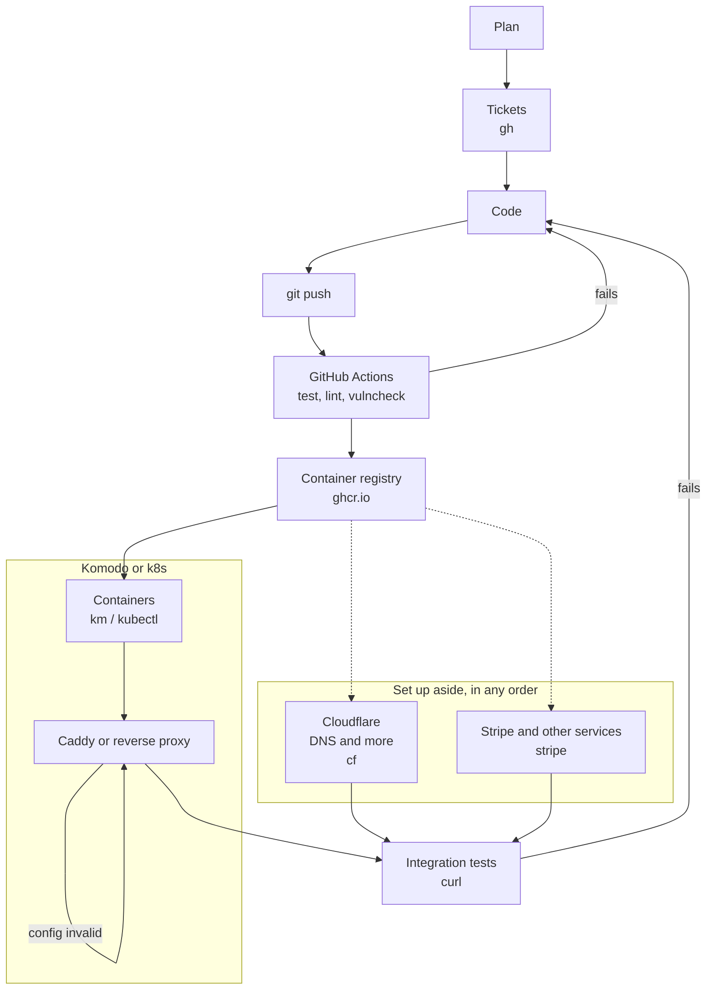

I just wanted to show you how I deploy and update my SaaS.

Nothing new here. It's the same flow I've always used. The difference is that an AI agent now does the steps I used to do by hand, and it does them faster.

## One flow, with a few loops



The arrows that point back are the point. When a step fails, the agent reads the error, fixes the cause, and goes round again. I'm not the one doing the loop.

Every arrow is something I can run from a shell. That's the rule: **CLI first, API second, MCP third, browser last.**

A CLI is the best interface for an agent. It documents itself with `--help`, it prints text, it fails with an exit code, and it chains with `&&`. An MCP server is fine when there's no other way in. Most of the time there is.

It also fits the rest of my setup. If you've read [My SaaS Tech Stack](), you know I like few moving parts. Few parts means few tools to teach the agent.

## What it looks like

I don't write the commands. I describe the goal:

> Put the app online on `app.example.com`, with the API on `api.example.com`. Add the DNS records, the Caddy site, and check that everything answers.

Then I watch the agent work through it, and approve each command. Here Caddy runs on the host, so it goes over SSH:

```bash
cf dns records create -z example.com ...        # DNS records
scp app.example.com.caddy server:/tmp/          # new Caddy site
ssh server 'caddy validate ...'                 # test it on a copy
ssh server 'sudo systemctl reload caddy'        # go live
curl -s -o /dev/null -w '%{http_code}' https://app.example.com/
```

That's the whole interaction. The rest of this post is what's behind each line.

## It starts with tickets, not code

**The plan becomes tickets.** Before any code, I brainstorm with the agent. We talk through the idea, poke holes in it, and agree on a plan.

Then the agent runs `gh issue create`, with a priority, what each ticket blocks, and what it's part of. A new feature becomes one parent issue with small children. With `gh api`, it links the children as sub-issues and sets the blocking order. When the plan changes, it edits the parent instead of leaving a stale list.

The agent forgets between sessions and I forget between weeks. The tickets are the memory. A new session starts with `gh issue list` and knows what's left. Every commit says `Refs #42`, and every deploy ends as a comment on the issue.

## Code to registry: let CI be the gate

**CI decides if the code ships.** The agent commits in small steps, then pushes to `main`. GitHub Actions takes over:

- **test**, **lint** and **vulncheck** run in parallel.
- Only when all three pass does the image build and go to the registry.
- A weekly job deletes old untagged images, so the registry doesn't grow forever.

The agent doesn't wait on a web page. It runs `gh run watch` and reads the result.

When CI fails, it reads the logs with `gh run view --log-failed` and fixes the cause. Once, `govulncheck` failed because `setup-go` installed an older Go toolchain than the one I develop with. The agent pinned the toolchain and bumped a vulnerable dependency. Then the linter broke on the new Go version, so it found a release that supported it and pinned that too.

That's the loop I wanted: push, fail, read, fix, push. I just watched.

**Setup scopes come from `gh` too.** My image cleanup job needs the `delete:packages` scope, because the default `GITHUB_TOKEN` can't delete packages. The agent tells me which scope is missing, `gh auth refresh` adds it, and `gh secret set` stores the secret on the repo. The job skips itself with a notice until the secret exists, so a missing secret never breaks a build.

## My env files are encrypted

**Secrets never touch git in plaintext.** The production env files live in the repo, encrypted. Only the encrypted file is committed, and the plaintext never lands in a chat.

The agent works with the encrypted file and the key names. It can tell me a variable is missing without printing a value. That's the kind of rule I want an agent to follow by default, not by promise.

## Komodo, or Kubernetes: same flow

**The platform changes, the flow doesn't.** I run most of my containers with [Komodo](https://komo.do). Sometimes I use Kubernetes instead. A new image lands in the registry, then the platform pulls it and rolls it out. Only the CLI changes: `km` for one, `kubectl` for the other.

The agent doesn't mind. It checks whether the CLI is installed, reads the install script before running it, and installs it in my user directory. Then it checks the version running on my server and installs the matching one. A CLI that's a version off from its server gives confusing errors, and the agent catches that before they show up.

Reading the state of production is one line:

```bash
km ps | grep my-app
km get stack my-app
```

The same CLI redeploys a stack once a new image is out. The credentials live in a config directory outside the repo. When the agent needs to check that file, it lists which keys are present, never their values.

## Caddy: a config file, not a ritual

**The config lives in the repo.** Caddy (or any reverse proxy) handles TLS in front of the app. The site configs are in `deployment/caddy/`, and whatever runs on the server is just a copy. How the copy gets there depends on where Caddy runs. There are three cases.

### Case 1: Caddy as a container in Komodo

**No SSH needed.** The config files are mounted into the container, and the stack pulls them from the repo. To ship a change, the agent commits the file and redeploys the stack with `km`.

Two details matter:

- **Mount the directory, not a single file.** Some tools replace a file instead of editing it, and a single-file mount keeps pointing at the old one.
- **Caddy doesn't watch its config.** Something has to trigger a reload. Redeploying the container does it, or the agent runs `caddy reload` inside it.

### Case 2: Caddy in Kubernetes

**Same idea, different objects.** The config goes in a ConfigMap, mounted into the pod. The agent runs `kubectl apply`, then `kubectl rollout restart` so the pod picks it up. No SSH here either.

### Case 3: Caddy on the host

**This is where SSH comes in.** When Caddy runs as a systemd service on the server, the agent has to reach the machine. It follows the same steps every time and never edits a file on the server by hand:

1. `scp` the file to a temp path.
2. Copy the live config to a temp directory, drop the new file in, and run `caddy validate` as the `caddy` user.
3. Refuse to continue if the target file already exists.
4. Install the file and run `systemctl reload caddy`.
5. Check the journal for certificate errors and `curl` the other sites on the box.

### What stays the same

**Validate before going live.** In the container cases, the agent runs `caddy validate` inside the container (or a throwaway pod) before the reload. In the host case, it's step 2 above. If validation fails, the agent fixes the file and validates again. A bad config dies in a copy, not in production.

And because the config is in git, every change has a commit, a message and a diff. The agent also curls the other sites behind the same Caddy after each change, to make sure it didn't break its neighbors.

## Cloudflare: DNS from the CLI

**DNS is a few commands.** I use the `cf` CLI, and it does more than DNS: SSL mode, redirect rules and other zone settings are one command each. A new domain is a few records: `app`, `api` and `www`. Then the agent lists the zone and checks the SSL mode, to make sure the records match what I expect.

One catch shows why the checks matter. `www` goes through Cloudflare's proxy, which means my server needs its own certificate for that name. Without one, visitors get a 525 error. The agent spotted it, added a `www` block to the Caddy file, deployed it, and checked again.

## Payments: the same idea works for Stripe

**Any service with a CLI fits the flow.** Stripe sits beside the rest of the pipeline, not after Cloudflare. I can set it up at any point. Its CLI makes the backend payment setup no different from the other steps. The agent can create the product and price, point a webhook at the new domain, and test the whole path:

```bash
stripe products create --name="Pro plan"
stripe prices create --product=prod_xxx --unit-amount=2900 --currency=usd \
  -d "recurring[interval]=month"
stripe webhook_endpoints create --url=https://api.example.com/stripe/webhook \
  -d "enabled_events[]=checkout.session.completed"
stripe trigger checkout.session.completed
```

`stripe listen` forwards live events to my local server while I develop. `stripe trigger` fires a fake event at the real endpoint, so the agent can check that my handler answers 200. If it doesn't, the agent reads the logs, fixes the handler, and triggers again. Same loop, different tool.

I keep this on test mode keys until I decide otherwise.

## No CLI? Let the agent drive the browser

**The browser is the last resort.** Some things only exist as a settings page. Updating the OAuth2 app behind GitHub sign-in is the classic one: there's a form for the name, the homepage, the description, the callback URL and the logo, and no CLI for any of it.

I'm lazy about that kind of work, so I ask the agent to do it in the browser. It uses my own Chrome, where I'm already signed in. It opens the app's settings page, reads the form, fills in the new values and the right callback URL, uploads the logo and clicks save. Then it takes a screenshot to check the page shows what it should.

The secrets stay out of it. Anything that has to reach the app goes into the encrypted env file, never into the chat, and the deploy continues as before.

It's slower than a CLI, and it breaks when a page changes. So the order stays: **CLI first, API second, MCP third, browser last.** But "last" still beats "me, clicking through five pages."

## Integration tests are just curl

**The final check is a loop.** It isn't a framework:

```bash
for u in https://app.example.com/ https://app.example.com/signin \
         https://app.example.com/robots.txt https://api.example.com/health; do
  printf "%-50s %s\n" "$u" \
    "$(curl -s -o /dev/null -m 20 -w '%{http_code} -> %{redirect_url}' "$u")"
done
```

It checks status codes and static files. If something is off, the agent fixes it and runs the loop again until it's clean.

Then it writes the results into the GitHub issue as a progress comment. The ticket, the commits and the proof all end up in the same place.

## What I get out of it

- **Speed.** The steps are the same as before. The waiting and the typing are gone.
- **One terminal.** Tickets, CI, deploy, DNS, payments and checks all happen in the same place. Even the odd browser-only task goes through the agent.
- **Everything is reviewable.** The agent shows each command before it runs. I approve it or I don't.
- **Config lives in git.** Caddy files, compose files and encrypted env files are all in the repo. The server is a copy, not the source of truth.
- **Failures fix themselves.** Validate first, apply second, and loop back when something breaks.
- **Less forgetting.** Tickets and progress comments carry context from one session to the next.

I used to dread deploy day. Now it's the part of the job that fits in a coffee break.
